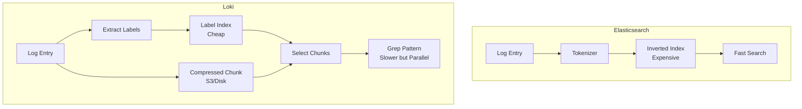

## Выбор платформы для хранения логов

В предыдущей статье мы обсудили архитектуру сбора логов. Теперь перед нами стоит инженерный выбор: куда складывать эти терабайты данных? Выбор системы агрегации логов определяет стоимость инфраструктуры и скорость расследования инцидентов.

На рынке доминируют три основных подхода: классический **ELK Stack**, современный **Grafana Loki** и аналитический **ClickHouse**. Разберем их через призму System Design и внутреннего устройства.

## 1. ELK Stack (Elasticsearch, Logstash, Kibana)

Исторически стандарт де-факто. Elasticsearch — это поисковый движок, построенный на инвертированном индексе (Inverted Index).

### Under the Hood: Inverted Index
Представьте книгу. В конце есть алфавитный указатель слов и номера страниц, где они встречаются. Это и есть инвертированный индекс.
Elasticsearch разбивает текст лога на токены (токенизация) и строит мапу: `Word -> [DocID1, DocID2]`.

*   **Плюс:** Молниеносный полнотекстовый поиск. Вы можете найти `"NullPointerException"` по всем сервисам за секунды.
*   **Минус:** Индексация тяжелая. Каждый вставленный документ требует CPU на парсинг и обновление индекса. Хранение занимает много места (индекс может быть больше самих данных).

> [!warning] Ловушка / Gotcha
> **Mapping Explosion.**
> Elasticsearch требует жесткой схемы (mapping) для полей. Если вы логируете JSON и у вас в поле `data` иногда прилетает строка, а иногда число — Elastic упадет с ошибкой конфликта типов.
> Если вы используете динамическое маппинг, и в лог случайно попадет уникальный ID как поле верхнего уровня (например, `msg_1234: "..."`), Elastic создаст новое поле в схеме. Тысячи таких полей убьют кластер (OutOfMemory).

## 2. Grafana Loki

Loki — это "Prometheus для логов". Он построен на философии дешевого хранения и не индексирует содержимое логов.

### Under the Hood: Labels & Chunks
Loki индексирует только **метаданные** (лейблы: `app=payment`, `env=prod`), а сами логи хранит в сжатых чанках (chunks) без парсинга.

Когда вы ищете текст `error` в Loki:
1.  Loki ищет все чанки по лейблам (быстро, по индексу).
2.  Загружает чанки в память.
3.  Распаковывает и делает "grep" (линейный поиск) по содержимому.

Это медленнее, чем Elastic, но **в разы дешевле** в хранении и ingestion (приеме данных).



> [!tip] Собеседование
> **Вопрос:** В чем главный риск архитектуры Loki?
> **Ответ:** Выбор неправильных лейблов. Как и в Prometheus, лейблы в Loki должны иметь низкую кардинальность. Если вы сделаете лейбл `user_id`, Loki создаст отдельный индексный стрим для каждого пользователя. Это положит базу данных Loki (High Cardinality Labels). Уникальные данные (ID, TraceID) должны быть внутри лога, а не в лейблах.

## 3. ClickHouse

Третий игрок — колоночная аналитическая СУБД. Изначально не предназначенная для логов, но сейчас набирающая популярность (проекты как Victoria Logs или самописные решения на CH).

### Under the Hood: Columnar Storage
ClickHouse хранит данные колонками, а не строками. Это дает феноменальное сжатие (логи часто повторяются) и скорость агрегации.

*   **Сценарий:** Аналитика. «Сколько ошибок 500 было за последний час с группировкой по endpoint?».
*   **Преимущество:** ClickHouse обрабатывает такие запросы в сотни раз быстрее Elastic и Loki, так как читает только нужные колонки, а не весь документ.

## Сравнительная таблица

| Характеристика | Elasticsearch | Grafana Loki | ClickHouse |
| :--- | :--- | :--- | :--- |
| **Тип поиска** | Полнотекстовый (Index) | Поиск по лейблам + Grep | Аналитический (SQL) |
| **Стоимость хранения** | Высокая (Index overhead) | Низкая (объектное хранилище) | Очень низкая (сжатие) |
| **Нагрузка при записи** | Высокая (токенизация) | Низкая (просто append) | Средняя |
| **Потребление RAM** | Высокое (Field Data Cache) | Низкое | Высокое (для агрегаций) |
| **Сложность поддержки** | Высокая (Java, GC) | Средняя (Go, single binary) | Средняя |
| **Best for** | Поиск текста, сложные запросы | Дешевое хранение, Kubernetes logs | Аналитика, тренды, отчеты |

## Интеграция с Go

Независимо от выбора системы, ваш код на Go не должен зависеть от неё напрямую. Вы пишете в stdout.
Однако, формат лога важен.

1.  **Для Elastic:** Нужен плоский JSON. Избегайте вложенных объектов, если не настроили mapping — Elastic "разгладит" их (`nested.field`), что может раздуть схему.
2.  **Для Loki:** Важно правильно настроить Promtail (agent), чтобы он выдирал лейблы из лога. Часто используют формат `logfmt` (key=value), который легче парсить, чем JSON.
    *   Go библиотека `log/slog` поддерживает `LogValuer`, что позволяет гибко управлять выводом.

### Пример: Logfmt vs JSON

**JSON** (стандарт):
```json
{"level":"info","ts":1689846256,"msg":"user logged","user_id":123}
```
*   Хорошо для машины.

**Logfmt** (популярен в Loki/Prometheus):
```text
level=info ts=1689846256 msg="user logged" user_id=123
```
*   Читаемее человеком.
*   Чуть легче по CPU для парсинга (меньше скобок и кавычек).

## Итог

1.  **ELK** выбирайте, если вам нужен мощный полнотекстовый поиск и у вас есть бюджет на железо. Берегитесь Mapping Explosion.
2.  **Loki** — выбор для Kubernetes и стартапов. Дешево, сердито, интеграция с Grafana из коробки. Не используйте High Cardinality Labels.
3.  **ClickHouse** — для аналитики и долгосрочного хранения огромных объемов.

Раздел логирования завершен. Мы переходим к третьему столпу Observability — Трейсингу. В следующей статье мы разберем, как отслеживать запросы через границы микросервисов: [[1. Distributed tracing]].