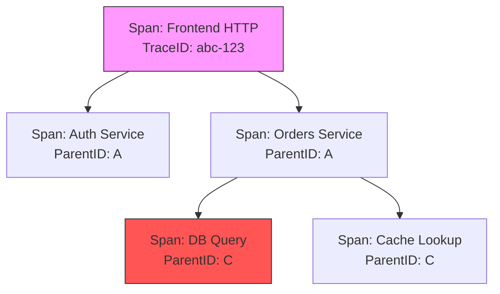

## Проблема невидимости в микросервисах

В предыдущих разделах мы разобрали метрики (которые говорят «что» случилось) и логи (которые объясняют «почему»). Однако в распределенных системах существует класс проблем, которые эти инструменты решают плохо.

Представьте сценарий: пользователь жалуется, что оформление заказа занимает 10 секунд.
*   **Метрики** показывают, что latency сервиса `frontend` высокая, а у сервиса `payments` — нормальная. Где проблема?
*   **Логи** сервиса `frontend` говорят «Error: timeout calling orders». Но почему? Сеть? База данных? Чужой API?

В монолите вы бы посмотрели Stack Trace и нашли бы тормозящую функцию. В микросервисах стек вызовов разрывается на части сетевыми переходами. Чтобы собрать его обратно, нужен **Distributed Tracing (Распределенная трассировка)**.

## Основные концепции

Трейсинг восстанавливает путь запроса через множество сервисов, баз данных и очередей.

### 1. Trace (Трейс)
Это полная история одного запроса от начала до конца. Trace объединяет все операции, произошедшие в рамках одного логического сценария (например, «Пользователь нажал кнопку Купить»).
Идентификатор трейса — **Trace ID**. Это глобальный уникальный ключ, который путешествует с запросом через все сервисы.

### 2. Span (Спан)
Это атомарная единица работы внутри трейса. Спан описывает, что происходило в конкретном месте.
*   Имя: `HTTP GET /checkout`
*   Время начала (Start Timestamp).
*   Длительность (Duration).
*   **Parent ID:** ID родительского спана (кто вызвал этот код).

Трейс — это дерево спанов.



## Under the Hood: Context Propagation

Самая сложная часть трейсинга — это не сбор данных, а их **проброс (Propagation)**. Как Trace ID попадает из сервиса A в сервис B?

В Go основным механизмом переноса контекста является `context.Context`. Когда вы используете библиотеку OpenTelemetry, она делает следующее:

1.  **Injection (Инъекция):** Перед отправкой HTTP-запроса в сервис B, клиент извлекает текущий Trace ID и Span ID из `context.Context` и вставляет их в HTTP-заголовки.
    *   Стандартный заголовок: `traceparent` (формат W3C Trace Context).

2.  **Extraction (Экстракция):** Сервис B получает HTTP-запрос. Middleware (HTTP Interceptor) проверяет наличие заголовка `traceparent`, извлекает оттуда Trace ID и сохраняет его в свой `context.Context`.

```text
HTTP Headers:
traceparent: 00-4bf92f3577b34da6a3ce929d0e0e4736-00f067aa0ba902b7-01
             ^  ^-------------------------------- ^----------------- ^
             |  Trace ID (hex)                   Parent Span ID     Flags
             Version
```

Если вы забудете передать `context.Context` в вызов функции или HTTP-клиент, цепочка прервется. Начнется новый трейс, и вы потеряете связь между сервисами.

> [!warning] Ловушка / Gotcha
> **Горутины и контекст.**
> Если вы запускаете новую горутину для фоновой задачи, она не наследует контекст автоматически, если вы не передадите его явно.
> `go func() { doWork(ctx) }()`
> Если передать `ctx`, новая горутина продолжит участвовать в текущем трейсе. Если передать `context.Background()` или `context.TODO()`, связь потеряется.

## Mechanical Sympathy: Стоимость трейсинга

Трейсинг не бесплатен. Каждый спан требует ресурсов.

1.  **CPU:** Создание спана, генерация ID, запись timestamp. В Go это относительно дешево, но при 100,000 RPS накладные расходы могут составить 1-3% CPU.
2.  **Memory:** Спан — это объект в памяти. Он живет, пока запрос обрабатывается. Долгие запросы «висят» в памяти.
3.  **Network:** Данные о спанах нужно отправить в коллектор (Jaeger/Tempo).

### Семплирование (Sampling)

Чтобы не утонуть в данных, применяют сэмплирование.
*   **Head-based Sampling:** Решение о том, сохранять ли трейс, принимается в самом начале запроса (случайным образом, например, 1% трафика). Это дешево, но можно пропустить редкие ошибки.
*   **Tail-based Sampling:** Решение принимается в конце. Сохраняются только «интересные» трейсы (с ошибками или очень медленные). Это требует буферизации всех спанов в памяти коллектора, что сложно и дорого.

> [!tip] Собеседование
> **Вопрос:** В чем разница между метрикой Latency и данными из Трейсинга?
> **Ответ:** Метрика Latency (Histogram) дает агрегированную статистику: «P99 latency = 500ms». Это хорошо для алертов.
> Трейсинг дает конкретный пример: «Вот один конкретный запрос, который занял 500ms, и вот он застрял в функции `JSON.Marshal` на 400ms».
> Метрика отвечает «Сколько?», Трейсинг отвечает «Где именно?».

## Итог

Distributed Tracing — это «МРТ» для микросервисов. Он превращает разрозненные логи и метрики в связную историю жизни запроса.
1.  **Trace ID** связывает все события одного запроса.
2.  **Span** описывает конкретную операцию и её длительность.
3.  **Context Propagation** — механизм передачи ID между сервисами (через HTTP headers или gRPC metadata).

В следующей статье мы рассмотрим стандарт, который объединил в себе всё лучшее из мира телеметрии — OpenTelemetry: [[2. OpenTelemetry]].