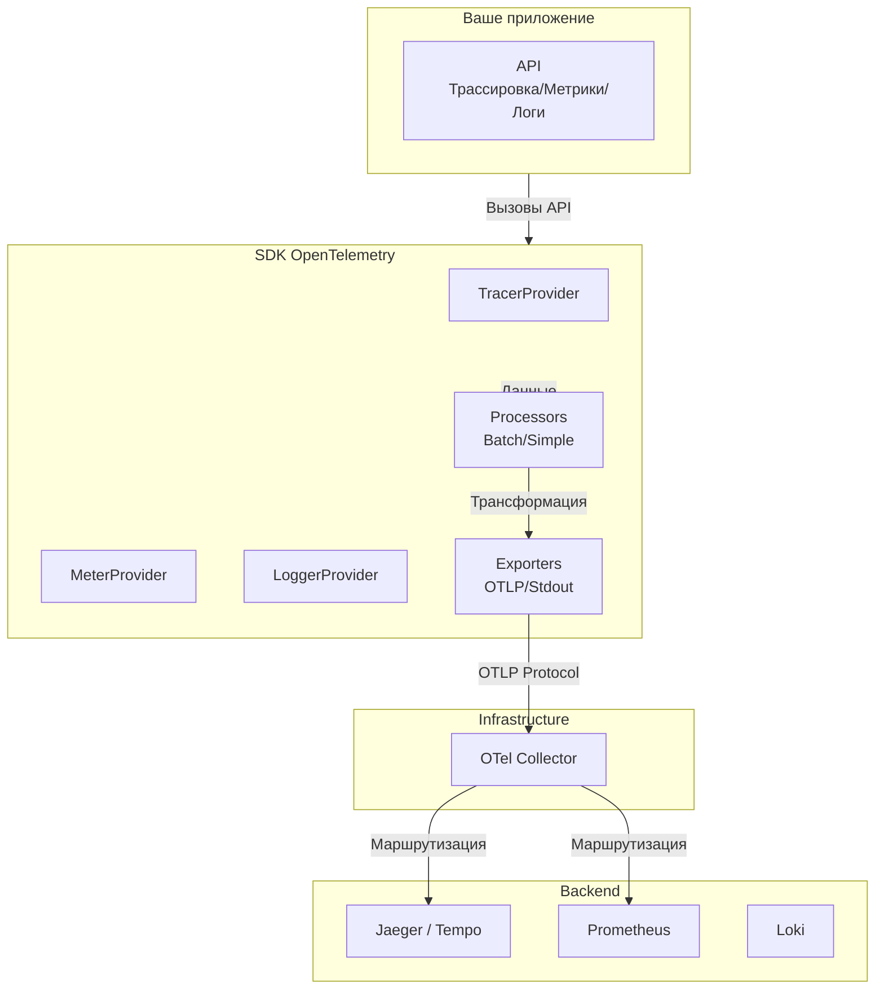

## Единый стандарт телеметрии

В предыдущей статье мы познакомились с концепцией Distributed Tracing. Однако долгое время внедрение трейсинга было головной болью: существовало несколько конкурирующих стандартов (OpenTracing, OpenCensus), разные API и форматы данных.

В 2019 году произошло знаковое событие: слияние этих проектов в **OpenTelemetry (OTel)**. Сегодня это абсолютный индустриальный стандарт, поддерживаемый всеми крупными игроками (CNCF, Google, Microsoft, AWS).

Для Go-разработчика OpenTelemetry — это не просто очередная библиотека, это фундамент для сбора *всех* видов телеметрии (Метрики, Логи, Трейсы) в унифицированном формате.

## Архитектура OpenTelemetry

OTel построен модульно. Это позволяет отделить инструментирование кода (ваше приложение) от экспорта данных (куда мы их отправляем).

### 1. API и SDK
*   **API (`go.opentelemetry.io/otel`):** Это интерфейсы, которые вы используете в коде (`Tracer`, `Meter`). Они ничего не делают сами по себе, если не зарегистрирован провайдер.
*   **SDK:** Это конкретная реализация. Она управляет采样ом (sampling), буферизацией и отправкой данных.

> [!info] Под капотом
> Разделение на API и SDK позволяет библиотекам (например, драйвер БД) иметь зависимость *только* от API. А конечное приложение подключает SDK. Это решает проблему "dependency hell", когда разные библиотеки требуют разные версии логгеров или трейсеров.

### 2. OTLP (OpenTelemetry Protocol)
OTel представил **OTLP** — бинарный протокол на основе Protocol Buffers (gRPC или HTTP/2).
*   **Производительность:** Binary формат кодируется и декодируется быстрее JSON.
*   **Универсальность:** Один формат для Метрик, Логов и Трейсов.

## Under the Hood: Как это работает в Go

Разберем путь создания спана в Go-приложении.

### 1. TracerProvider
Это корневой объект. Он хранит конфигурацию и создает Tracer'ы.
В Go его принято создавать при старте приложения и закрывать (Shutdown) при graceful shutdown. `Shutdown` критически важен: он сбрасывает (flush) буферы процессоров, чтобы не потерять последние данные.

### 2. SpanProcessor
Это механизм обработки спанов.
*   **BatchSpanProcessor (Рекомендуемый):** Собирает спаны в пачки (batch) и отправляет их раз в N секунд или при достижении лимита размера.
    *   *Почему?* Сетевые вызовы дороги. Отправлять каждый спан по сети — убить производительность. Батчинг экономит CPU и сеть.
*   **SimpleSpanProcessor:** Отправляет спан сразу после завершения. Используется только для отладки или в короткоживущих CLI-утилитах.

### 3. Exporter
Отвечает за отправку данных в конкретный бэкенд.
Чаще всего используют **OTLP Exporter**, который шлет данные в **OpenTelemetry Collector**.

## OpenTelemetry Collector

В продакшене приложение не должно знать адреса Jaeger, Prometheus или Loki. Оно должно знать только адрес `otel-collector:4317`.

**Collector** — это промежуточный прокси-сервис (написан на Go), который принимает данные в формате OTLP и маршрутизирует их.

**Возможности Collector:**
1.  **Рецепшн (Receivers):** Принимает данные (OTLP, Jaeger, Zipkin, Prometheus).
2.  **Процессоры (Processors):** Обрабатывает данные на лету.
    *   `memory_limiter`: Защищает коллектор от OOM.
    *   `batch`: Повторный батчинг.
    *   `attributes`: Добавление/удаление атрибутов (например, удалить sensitive данные).
3.  **Экспортеры (Exporters):** Отправляет в бэкенды (Jaeger, ClickHouse, S3).

> [!tip] Собеседование
> **Вопрос:** Зачем нужен OTel Collector, если можно отправлять данные сразу в Jaeger из приложения?
> **Ответ:**
> 1. **Абстракция:** Приложению не нужно знать топологию мониторинга. Вы можете сменить Jaeger на Tempo, не меняя код приложения и не перезапуская его.
> 2. **Offloading (Разгрузка):** Тяжелые операции (ретраи при недоступности бэкенда, батчинг, шифрование) переносятся с приложения на Collector. Это критично для Go-сервисов, где каждая аллокация на счету.
> 3. **Очистка данных:** Безопаснее удалить PII (личные данные, email, IP) в Collector'е, чем надеяться, что разработчик забыл их залогировать в приложении.

## Semantic Conventions (Семантические соглашения)

OpenTelemetry ввел стандарты именования атрибутов. Это делает трейсы универсальными для всех инструментов.
*   `http.method`: "GET"
*   `db.system`: "postgresql"
*   `db.statement`: "SELECT * FROM users"
*   `net.peer.name`: "database-server"

Если вы назовете атрибут `my_custom_http_method`, бэкенд (например, Grafana Tempo) не поймет, что это HTTP-метод, и не сможет построить правильные дашборды.

> [!warning] Ловушка / Gotcha
> **Чувствительные данные в атрибутах.**
> В Go очень легко добавить всё в трейс:
> `span.SetAttributes("password", password)`
> Помните, что трейсы сохраняются и доступны инженерам. Никогда не пишите пароли, токены, номера кредитных карт в атрибуты спанов. Это нарушает безопасность (PCI DSS, GDPR).

## Итог

OpenTelemetry — это "USB" для телеметрии.
1.  **Единый API:** Вы пишете код под один интерфейс, а бэкенд меняется через конфиг.
2.  **OTLP:** Эффективный бинарный протокол.
3.  **Collector:** Централизованная точка управления потоком данных и их обработки.
4.  **Semantic Conventions:** Словарь общего языка для мониторинга.

В следующей статье мы детально рассмотрим строительные блоки трейса — Спаны и Трейсы, и как правильно с ними работать в Go: [[3. Спаны и трейсы]].