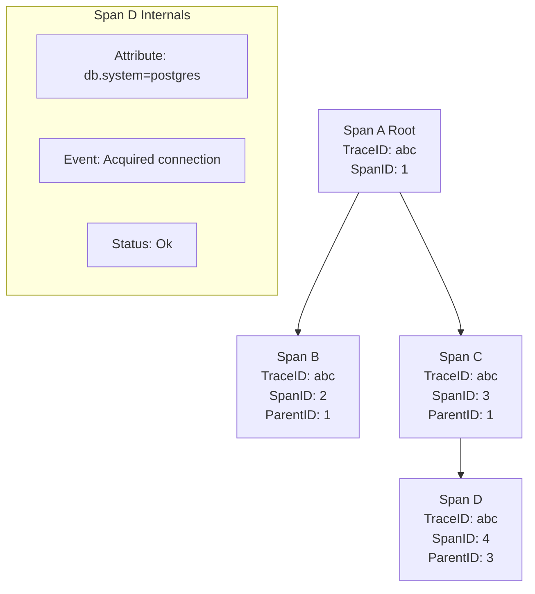

## Анатомия запроса

В предыдущей статье мы обсудили OpenTelemetry как стандарт. Теперь спустимся на уровень ниже и разберем, из чего состоит трейс в рантайме Go. Понимание структуры Спанов (Span) и их жизненного цикла критически важно для написания эффективного инструментария.

Трейс — это не монолитная сущность. Это дерево, состоящее из узлов — **Спанов**.

## Структура Спана

Спан представляет собой атомарную единицу работы. В Go (через OpenTelemetry SDK) спан создается, живет в рамках функции и завершается.

### Ключевые поля Спана:

1.  **Trace ID:** Глобальный идентификатор всего запроса. Одинаков для всех спанов в рамках одного трейса (128 бит).
2.  **Span ID:** Уникальный идентификатор конкретной операции (64 бит).
3.  **Parent Span ID:** ID родительского спана. Именно это поле строит иерархию.
4.  **Start/End Timestamp:** Время начала и окончания работы.
5.  **Attributes:** Метаданные (Key-Value), описывающие операцию (например, `http.method="GET"`).
6.  **Events:** Лог-подобные события, произошедшие *внутри* спана (например, "получено сообщение из очереди").
7.  **Status:** Результат выполнения (`Ok`, `Error`, `Unset`).



## Under the Hood: Создание Спана в Go

В Go создание спана происходит через объект `Tracer`. Важно понимать, что метод `tracer.Start` возвращает два значения: сам спан и новый контекст.

```go
func myHandler(ctx context.Context) {
    // Создаем дочерний спан от контекста, который пришел извне
    tr := otel.Tracer("my-service")
    ctx, span := tr.Start(ctx, "myHandler-operation")
    
    // Обязательно завершаем спан в конце функции
    // defer гарантирует вызов даже при панике
    defer span.End()
    
    // ... бизнес-логика ...
    
    // Если вызываем другую функцию, передаем обновленный ctx
    processPayment(ctx)
}
```

### Mechanical Sympathy: Цена создания спана

Многие боятся добавлять спаны, думая, что это «убьет» производительность. Давайте разберем, что происходит при вызове `tr.Start`:

1.  **Генерация ID:** Требует криптографически стойкого (или псевдослучайного) генератора. Это не просто инкремент счетчика, это вычислительная работа.
2.  **Time Now:** Вызов `time.Now()` — это системный вызов или чтение VDSO (в зависимости от ОС и версии Go). Это быстро, но не бесплатно.
3.  **Сэмплирование (Sampling):** Самое важное!
    *   Если Sampler решает **не записывать** этот спан (например, `ProbabilitySampler` с вероятностью 1%), SDK возвращает **NoopSpan** (заглушку).
    *   Заглушка не записывает атрибуты, не отправляет данные. Она почти бесплатна (пара аллокаций на интерфейс).
    *   *Вывод:* Вы можете instrumentировать весь код, но писать только процент запросов.

## Типы Спанов

В OpenTelemetry есть два типа спанов, и их путают чаще всего.

### 1. Internal Span (Внутренний)
Это спан, который описывает операцию *внутри* вашего сервиса.
*   *Семантика:* "Я делаю работу".
*   *Пример:* Функция валидации заказа, выполнение SQL-запроса через драйвер.

### 2. Remote Span / Client & Server Spans (Внешний)
Это спаны, описывающие взаимодействие с внешним миром (RPC).

*   **Client Span:** Создается отправителем *перед* вызовом внешнего сервиса. Время спана включает в себя сетевые задержки и ожидание ответа.
    *   Атрибуты: `rpc.system="grpc"`, `rpc.method="Checkout"`.
*   **Server Span:** Создается получателем *при входе* запроса. Он становится дочерним по отношению к Client Span'у отправителя (благодаря propagation).

> [!warning] Ловушка / Gotcha
> **Ручное создание Client Span.**
> Если вы используете инструментированные библиотеки (например, `otelsql` или `otelhttp`), они создают спаны автоматически.
> Если вы создаете спан вручную для HTTP-вызова стандартным `http.Client`, вы должны убедиться, что `ctx` передается в запрос. Иначе вы создадите спан, но связь не прервется (или, наоборот, создадите дублирующий спан, если клиент уже инструментирован).

## Атрибуты vs События (Events)

Когда что использовать?

*   **Attributes (Атрибуты):** Используйте для статических или квазистатических данных, по которым вы будете искать трейсы.
    *   *Пример:* `user_id`, `order_id`, `http.status_code`.
    *   *Осторожно:* Атрибуты с высокой кардинальностью (ID) могут раздуть индексы в бэкенде (Jaeger/Tempo).

*   **Events (События):** Используйте для точечных логов внутри спана.
    *   *Пример:* "Retry attempt 1", "Cache miss".
    *   События имеют timestamp и позволяют увидеть хронологию внутри одной операции без создания новых спанов.

## Связь с ошибками

Обработка ошибок в трейсинге специфична.
Просто вернуть ошибку в коде недостаточно, чтобы спан покраснел в интерфейсе Jaeger. Нужно явно записать статус ошибки.

```go
if err != nil {
    // 1. Записываем событие об ошибке (StackTrace добавится автоматически в events)
    span.RecordError(err)
    
    // 2. Устанавливаем статус спана как Error
    span.SetStatus(codes.Error, err.Error())
    
    // 3. Можно добавить атрибут, если нужно фильтровать по типу ошибки
    span.SetAttributes(attribute.String("error.type", "db_connection_failed"))
}
```

> [!tip] Собеседование
> **Вопрос:** Что произойдет, если забыть вызвать `span.End()`?
> **Ответ:** Спан никогда не будет экспортирован (отправлен в коллектор).
> Большинство `SpanProcessor` (например, `BatchSpanProcessor`) отправляют данные только после вызова `End()`. Кроме того, длительность спана будет неопределенной, и в UI (Jaeger) этот спан просто исчезнет или будет отображаться некорректно. `defer span.End()` — обязательная идиома.

## Итог

1.  **Trace** — это дерево, **Span** — это узел.
2.  Используйте `defer span.End()` всегда.
3.  **Attributes** — для метаданных поиска, **Events** — для логирования хода выполнения.
4.  При ошибках используйте `RecordError` и `SetStatus(codes.Error)`.

В следующей статье мы разберем механику того, как Спаны связываются между сервисами — **Контекст propagation**: [[4. Контекст propagation]].