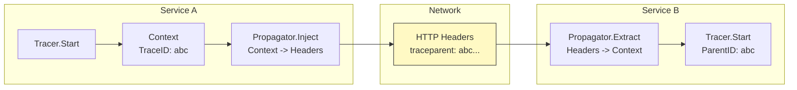

## Клей распределенной трассировки

В предыдущей статье мы рассмотрели структуру Спанов. Но само по себе создание спанов внутри одного процесса — это просто локальный лог. Магия Distributed Tracing начинается тогда, когда запрос пересекает границу процесса (IPC) — уходит в другой микросервис по HTTP, gRPC или в очередь сообщений.

Чтобы связать Спан сервиса A (Client) со Спаном сервиса B (Server), необходим механизм передачи контекста — **Context Propagation**.

## Механизм работы

Представьте эстафету. Бегун A (сервис A) добегает до точки передачи, передает эстафетную палочку (Trace Context) бегуну B (сервис B). Если палочка упала — цепочка разорвана, расследование невозможно.

В мире OpenTelemetry и Go этот процесс состоит из двух фаз: **Inject** (внедрение) и **Extract** (извлечение).



## Under the Hood: W3C Trace Context

Стандартом де-факто сейчас является **W3C Trace Context**. Это спецификация, описывающая, как кодировать Trace ID в HTTP-заголовках.

Главный заголовок: `traceparent`.
Формат: `version-traceid-parentid-flags`

**Пример заголовка:**
```text
traceparent: 00-4bf92f3577b34da6a3ce929d0e0e4736-00f067aa0ba902b7-01
```
*   `00`: Версия формата.
*   `4bf92...`: Trace ID (уникальный для всего запроса).
*   `00f0...`: Parent Span ID (ID спана, который инициировал вызов).
*   `01`: Trace Flags (например, `sampled` — записывать ли этот трейс).

> [!info] Под капотом
> OpenTelemetry SDK в Go скрывает эту сложность. Вам не нужно парсить эти строки вручную. За вас это делают **Propagators** (Пропагаторы).

## Реализация в Go

В Go контекст передается через интерфейс `context.Context`. OpenTelemetry использует `propagation` пакет для работы с транспортным слоем (HTTP, gRPC).

### 1. Конфигурация Propagator

Правильный подход — глобально установить пропагатор, поддерживающий W3C.

```go
import (
    "go.opentelemetry.io/otel"
    "go.opentelemetry.io/otel/propagation"
)

func initTracer() {
    // ... создание tracer provider ...
    
    // Устанавливаем глобальный пропагатор (W3C Trace Context + Baggage)
    otel.SetTextMapPropagator(propagation.NewCompositeTextMapPropagator(
        propagation.TraceContext{}, // Отвечает за traceparent
        propagation.Baggage{},      // Отвечает за передачу пользовательских данных (baggage)
    ))
}
```

### 2. Client Side: Inject (Отправка)

Когда вы делаете исходящий HTTP-запрос, вы должны "внедрить" контекст в заголовки.

```go
func makeRequest(ctx context.Context, url string) ([]byte, error) {
    req, err := http.NewRequestWithContext(ctx, "GET", url, nil)
    if err != nil {
        return nil, err
    }

    // ВАЖНО: Внедряем traceparent в заголовки запроса
    // carrier - это обертка над http.Header, реализующая интерфейс TextMapCarrier
    otel.GetTextMapPropagator().Inject(ctx, propagation.HeaderCarrier(req.Header))

    resp, err := http.DefaultClient.Do(req)
    // ...
}
```

Если вы используете инструментированные библиотеки (например, `oteldhttp`), они делают это автоматически. Но если вы пишете свой клиент или работаете с очередями (Kafka/RabbitMQ), вы должны вызвать `Inject` вручную.

### 3. Server Side: Extract (Прием)

На стороне сервера (middleware) вы должны извлечь контекст из входящих заголовков.

```go
func tracingMiddleware(next http.Handler) http.Handler {
    return http.HandlerFunc(func(w http.ResponseWriter, r *http.Request) {
        // Извлекаем контекст из заголовков запроса
        ctx := otel.GetTextMapPropagator().Extract(r.Context(), propagation.HeaderCarrier(r.Header))
        
        // Создаем span, который автоматически станет дочерним к приходящему traceparent
        tr := otel.Tracer("my-service")
        ctx, span := tr.Start(ctx, "handle-request")
        defer span.End()

        // Передаем обновленный ctx дальше в хендлер
        next.ServeHTTP(w, r.WithContext(ctx))
    })
}
```

## Mechanical Sympathy: Context в Go

Почему Go идеально подходит для трейсинга?
Потому что `context.Context` — это идиома языка.
*   **Immutable:** Контекст иммутабелен. Добавление значения (или Span) создает новый контекст, но не меняет старый (безопасно для конкурентности).
*   **Tree Structure:** Дерево контекстов в Go естественно отображается на дерево Спанов.
*   **Lifetime:** Отмена контекста (`ctx.Done()`) может сигнализировать о таймауте запроса, что трассировщик может записать как событие.

## Baggage: Данные, которые путешествуют

Кроме `traceparent`, существует механизм **Baggage**. Это способ передать произвольные пары ключ-значение через все сервисы в рамках одного трейса.

*Пример:* Вы хотите видеть `user_id` в логах сервиса Z, но запрос пришел через сервисы A -> B -> C.
В сервисе A:
```go
baggage.Set(ctx, "user.id", "12345")
```
В сервисе C (если настроен Baggage Propagator):
```go
member, _ := baggage.Member("user.id")
fmt.Println(member.Value()) // "12345"
```

> [!warning] Ловушка / Gotcha
> **Безопасность и размер.**
> Baggage передается в HTTP-заголовках (`baggage: user-id=12345,other=...`).
> 1.  Размер заголовков ограничен (обычно 8KB для большинства веб-серверов/прокси). Не передавайте большие объекты.
> 2.  Не передавайте секреты! Baggage виден в сети и логах. Используйте его только для ID и технических флагов.

## Итог

1.  **Propagation** — это процесс передачи Trace ID и Parent Span ID между сервисами.
2.  Стандарт — **W3C Trace Context** (заголовок `traceparent`).
3.  В Go используйте `otel.GetTextMapPropagator().Inject/Extract`.
4.  **Всегда** передавайте `ctx` как первый аргумент в функции. Это "правило большого пальца" Go, которое делает трейсинг возможным.

В следующей статье мы рассмотрим инструменты визуализации трейсов — Jaeger и его альтернативы: [[5. Jaeger и альтернативы]].