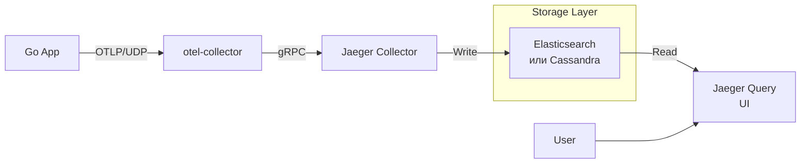

## Визуализация мира трейсов

В предыдущих статьях мы научились генерировать трейсы в Go и пробрасывать их контекст между сервисами. Теперь встает вопрос: где хранить и как смотреть на эти данные?

На протяжении многих лет стандартом индустрии был **Jaeger**. Однако ландшафт меняется, и сейчас на сцену выходят мощные альтернативы, в частности **Grafana Tempo**.

## Jaeger: Классика Open Source

Jaeger — это распределенная система трассировки, изначально разработанная в Uber, а затем переданная в CNCF. Она написана на Go, что делает её "родной" для нашей экосистемы.

### Архитектура Jaeger

Jaeger построен на микросервисной архитектуре, что позволяет ему масштабироваться горизонтально.



### Компоненты Jaeger:
1.  **Collector:** Принимает спаны от приложения (или от OTel Collector), валидирует их, индексирует и пишет в базу. Сstateless, можно масштабировать.
2.  **Query:** Сервис, обслуживающий UI и API для поиска трейсов.
3.  **Agent (Deprecated):** Раньше использовался как sidecar для буферизации данных. Сейчас команда Jaeger рекомендует использовать **OpenTelemetry Collector** вместо Agent.

> [!info] Под капотом
> Jaeger хранит данные в столбчатых базах данных (Elasticsearch, Cassandra, ClickHouse, Kafka).
> Выбор базы определяет стоимость хранения и скорость поиска.
> *   **Elasticsearch:** Позволяет делать сложный поиск по тегам (например, `Find traces where user_id=123`), но стоит дорого.
> *   **Cassandra:** Пишет очень быстро, но поиск ограничен (только по Trace ID или сервису/времени). Используется в высоконагруженных системах типа Uber.

## Альтернативы: Grafana Tempo

Появление **Grafana Tempo** изменило правила игры. Tempo не индексирует содержимое трейсов (теги, названия операций). Он индексирует только **Trace ID**.

### Философия: Trace ID Lookup
Как мы обычно ищем трейсы?
1.  Мы видим ошибку в **Logs** (Loki).
2.  В логе есть `trace_id`.
3.  Мы копируем этот ID и ищем в трейсинге.

Tempo оптимизирован именно под этот сценарий. Так как он не строит сложных индексов, стоимость хранения трейсов в Tempo в 10-100 раз ниже, чем в Jaeger с Elasticsearch.

### TraceQL
Tempo представил **TraceQL** — язык запросов для поиска трейсов, похожий на LogQL.
Пример: `{} | span.http.status_code = 500`.
Это позволяет искать трейсы, даже если вы не знаете Trace ID заранее, но поиск происходит медленнее, чем по индексу.

## Сравнение систем

| Система | Стратегия хранения | Сложность поддержки | Стоимость | Best for |
| :--- | :--- | :--- | :--- | :--- |
| **Jaeger + ES** | Индексация всех полей | Высокая (Java/ES expertise) | Высокая | Глубокий аналитический поиск, аудит. |
| **Jaeger + Cassandra** | Ограниченная индексация | Высокая | Средняя | Экстремальная нагрузка (Uber-scale). |
| **Grafana Tempo** | No-Index (Object Storage) | Низкая | Очень низкая | Kubernetes, интеграция с Loki/Grafana. |
| **Zipkin** | Классический старый стандарт | Средняя | Средняя | Legacy системы, простые проекты. |

## Интеграция с Go: Jaeger vs OTel

Исторически Jaeger имел свои клиентские библиотеки (`jaeger-client-go`). **Это путь в никуда.**

> [!warning] Ловушка / Gotcha
> **Deprecated Clients.**
> Клиентские библиотеки Jaeger (Tracing v1) находятся в режиме поддержки (maintenance mode) и не будут получать новых фич.
> **Используйте OpenTelemetry SDK.** Современные версии Jaeger (v1.35+) и Tempo поддерживают протокол OTLP "из коробки".

Вам не нужно менять код, чтобы сменить бэкенд с Jaeger на Tempo. Вы меняете только конфигурацию Exporter'а в OTel Collector.

### Пример конфигурации OTel Collector (отправка в Jaeger):

```yaml
# otel-collector-config.yaml
exporters:
  otlp:
    endpoint: jaeger-collector:4317 # Стандартный gRPC порт Jaeger
    tls:
      insecure: true

service:
  pipelines:
    traces:
      receivers: [otlp]
      exporters: [otlp]
```

## Итог

1.  **Jaeger** — зрелый, мощный инструмент. Идеален, если вам нужен сложный поиск по атрибутам трейсов. Сложен в эксплуатации (особенно с Elasticsearch).
2.  **Grafana Tempo** — современный стандарт для Kubernetes. Дешевле, проще, интегрирован в экосистему Grafana (Loki + Tempo + Mimir).
3.  **OpenTelemetry SDK** — единственно верный выбор для Go-приложения. Не завязывайтесь на проприетарные агенты.

Раздел Трейсинга завершен. Мы переходим к практике объединения всех знаний. В следующей статье мы разберем, как связать логи, метрики и трейсы через Correlation ID: [[1. Correlation ID]].