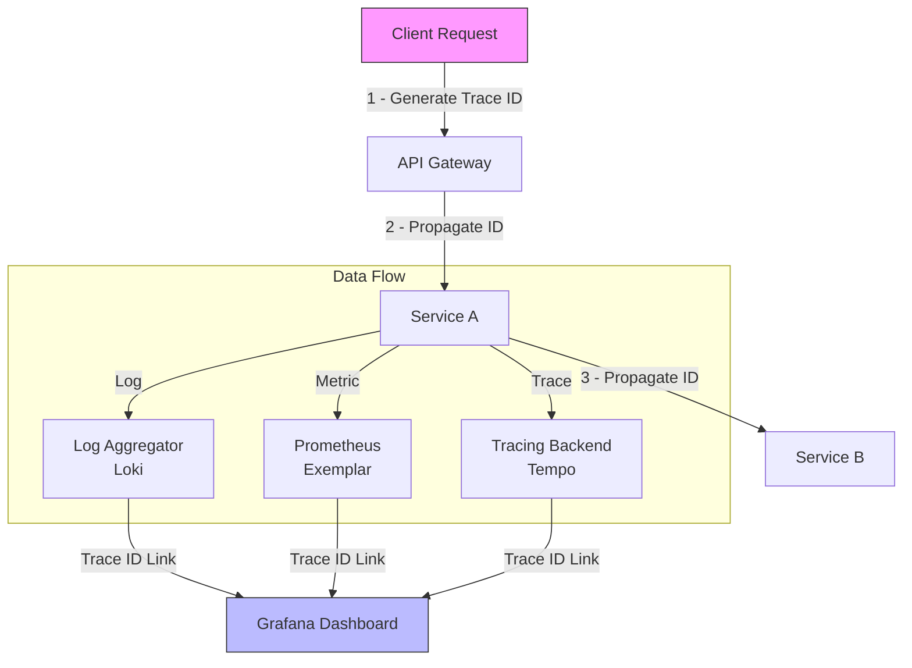

## Связующий элемент Observability

В предыдущих разделах мы изучили три столпа Observability по отдельности. Однако их настоящая сила раскрывается только при их объединении. Ключ к этому объединению — **Correlation ID**.

В распределенных системах, где один запрос порождает каскад вызовов между микросервисами, базами данных и очередями, Correlation ID (часто совпадающий с Trace ID) выступает в роли первичного ключа, позволяющего собрать пазл из разрозненных данных.

## Trace ID как новый стандарт Correlation ID

Исторически Correlation ID и Trace ID были разными понятиями.
*   **Correlation ID:** Идентификатор бизнес-операции, передаваемый через HTTP-заголовки (например, `X-Request-ID`), чтобы связать логи.
*   **Trace ID:** Идентификатор технического трейса, понятный системам APM (Jaeger, Zipkin).

С появлением стандарта **OpenTelemetry** и W3C Trace Context, эти понятия слились. Теперь **Trace ID** является основным Correlation ID. Это уникальный 128-битный идентификатор, который генерируется в самом начале пути запроса и путешествует с ним до самого конца.

## Архитектура связывания данных



### Связь компонентов:
1.  **Logs:** Каждая запись лога содержит поле `trace_id`.
2.  **Metrics:** Метрики могут содержать Exemplars (ссылки на конкретные трейсы).
3.  **Traces:** Сам Trace ID является первичным ключом.

Это позволяет в Grafana совершать "прыжки" ( drill-down):
*   Увидели всплеск ошибок на графике (Metrics)?
*   Кликнули на точку -> перешли к конкретному трейсу (Tracing).
*   В трейсе увидели span с ошибкой -> перешли к логам по этому Trace ID (Logs).

## Реализация в Go (OpenTelemetry + slog)

В современных версиях Go (1.21+) связка `context` и логгера позволяет автоматизировать этот процесс.

### Шаг 1: Middleware для извлечения/генерации ID

Мы используем промежуточное ПО, чтобы убедиться, что контекст трассировки всегда доступен.

```go
func tracingMiddleware(next http.Handler) http.Handler {
    return http.HandlerFunc(func(w http.ResponseWriter, r *http.Request) {
        // 1. Извлекаем контекст из заголовков (если пришел от другого сервиса)
        // или создаем новый, если это входной запрос.
        ctx := otel.GetTextMapPropagator().Extract(r.Context(), propagation.HeaderCarrier(r.Header))
        
        // 2. Запускаем корневой спан (это автоматически создаст Trace ID, если его нет)
        tr := otel.Tracer("my-service")
        ctx, span := tr.Start(ctx, r.Method+" "+r.URL.Path)
        defer span.End()
        
        // 3. Пробрасываем контекст дальше
        next.ServeHTTP(w, r.WithContext(ctx))
    })
}
```

### Шаг 2: Автоматическая запись Trace ID в логи

Нам нужен хендлер для `slog`, который умеет извлекать Trace ID из контекста. Это делается через кастомный обработчик или middleware для логгера.

```go
// TraceLoggerMiddleware оборачивает slog, добавляя trace_id из ctx
func TraceLoggerMiddleware(logger *slog.Logger) *slog.Logger {
    return slog.New(slog.HandlerFunc(func(ctx context.Context, r slog.Record) error {
        // Извлекаем SpanContext из контекста OpenTelemetry
        spanCtx := trace.SpanContextFromContext(ctx)
        
        // Если Trace ID валиден, добавляем его в лог
        if spanCtx.IsValid() {
            r.AddAttrs(slog.String("trace_id", spanCtx.TraceID().String()))
        }
        
        return logger.Handler().Handle(ctx, r)
    }))
}
```

Теперь любой вызов `logger.InfoContext(ctx, ...)` автоматически добавит `trace_id` в вывод, если в переданном `ctx` есть активная трассировка.

> [!info] Под капотом
> Почему мы не храним Trace ID в `context.Value` вручную?
> OpenTelemetry уже хранит SpanContext в `context.Context` под капотом (внутренняя структура `context.valueCtx`). Попытка хранить там дубликат — это лишняя аллокация. Лучше использовать API `trace.SpanContextFromContext(ctx)`, который делает quick type assertion.

## Связь с метриками: Exemplars

Exemplars — это "изюминка" Prometheus, о которой часто забывают. Это возможность прикрепить Trace ID к метрике в момент её записи.

В Go клиенте Prometheus это делается автоматически, если вы передаете контекст с трассировкой при записи метрики.

```go
// При использовании Histogram
httpDuration.WithLabelValues("/api").ObserveWithExemplar(duration, map[string]string{
    "traceID": trace.SpanContextFromContext(ctx).TraceID().String(),
})
```

В интерфейсе Prometheus/Grafana вы увидите, что рядом с точкой на графике есть ссылка на Trace ID. Это превращает график метрик в "кликабельную карту" инцидентов.

## Mechanical Sympathy: Стоимость связывания

1.  **Извлечение ID:** `trace.SpanContextFromContext(ctx)` — это очень дешевая операция (несколько наносекунд), так как это просто приведение типа интерфейса.
2.  **Логирование:** Добавление атрибута в `slog` стоит недорого (аллокация строки). Критически важно использовать **JSON Handler**, чтобы поле `trace_id` было отдельным ключом, а не частью сообщения. Это позволяет Loki проиндексировать его и искать мгновенно.

> [!warning] Ловушка / Gotcha
> **Потеря контекста в горутинах.**
> Если вы запускаете фоновую задачу через `go func() { ... }`, она не наследует контекст автоматически (только если вы его передали явно).
> Если вы передали `ctx` в горутину, вы сохраните Trace ID, но имейте в виду: спан родительской функции может закрыться (`defer span.End()`), когда горутина еще работает. Это создаст "оторванный" дочерний спан. В таких случаях нужно использовать `trace.Link` или новую логику трассировки.

## Итог

1.  **Correlation ID = Trace ID** в современном мире OpenTelemetry.
2.  Автоматизируйте инъекцию Trace ID в логи через Middleware. Не передавайте его вручную в параметрах функций.
3.  Используйте **Exemplars** в Prometheus, чтобы связать метрики и трейсы.
4.  Эта связка превращает Observability из набора разрозненных инструментов в единый механизм расследования инцидентов.

В следующей статье мы поговорим о том, как использовать все эти инструменты для реальной отладки проблем: [[2. Debugging через observability]].