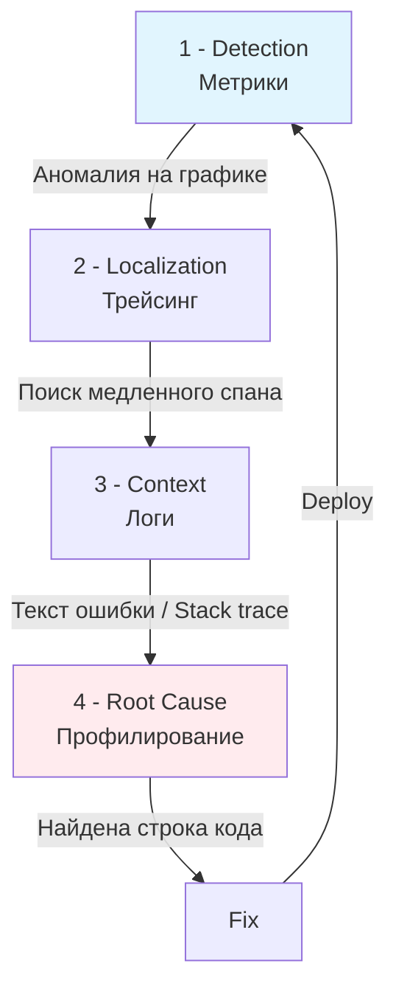

## От догадок к доказательствам

В предыдущей статье мы связали логи, метрики и трейсы воедино. Теперь применим эти знания на практике. Главная ошибка при-debuggingе в продакшене — попытка использовать инструменты вслепую. Observability превращает отладку из искусства в науку.

Для Senior-разработчика процесс отладки выглядит как движение по воронке: от общего сигнала к конкретной строке кода.

## Цикл отладки (The Debugging Loop)

Классический цикл диагностики инцидента состоит из четырех этапов.



## Сценарий 1: Аномальная Latency (Задержка)

**Ситуация:** Grafana показывает, что P99 latency эндпоинта `/checkout` выросло с 100мс до 3 секунд.

### Шаг 1: Метрики (Detection)
Смотрим на график. CPU высокое или нормальное?
*   **CPU High:** Возможно, "тяжелый" алгоритм или цикл.
*   **CPU Low:** Приложение спит. Вероятно, ожидание I/O (БД, внешний API), блокировка мьютекса или GC pause.

### Шаг 2: Трейсинг (Localization)
Открываем Jaeger/Tempo. Ищем трейсы с большой длительностью.
В дереве спанов находим "виновника":
*   Спан `http.call /payment-service` занял 2.8 секунды.
*   Это внутренний вызов. Раскрываем его.
*   Внутри видим спан `db.query INSERT INTO orders`, который висел 2.5 секунды.

> [!info] Под капотом
> Если трейс показывает "дыру" (gap) между спанами, или спан `db.query` сам по себе длинный, проблема на стороне БД. Если спан `db.query` быстрый, а общий спан сервиса долгий — проблема в самом коде сервиса (например, медленная сериализация JSON).

### Шаг 3: Профилирование (Root Cause)
Допустим, метрика показывает высокое потребление CPU, а трейс не показывает узких мест I/O. Значит, проблема в коде ("горячий цикл").

В Go мы подключаем `net/http/pprof`.
1.  Находим под, который тормозит.
2.  Выполняем `kubectl port-forward pod/checkout-xxx 6060`.
3.  Открываем в браузере `http://localhost:6060/debug/pprof/profile?seconds=30`.
4.  Скачиваем профиль CPU.

Анализ профиля (через `go tool pprof`):
```bash
go tool pprof -http=:8080 profile.pb.gz
```
Визуализация Flame Graph показывает, что 80% времени процессор тратит в функции `json.Marshal` внутри цикла.
**Вывод:** Вы лепите JSON вручную в цикле или используете рефлексию неэффективно.

## Сценарий 2: Memory Leak (Утечка памяти)

**Ситуация:** Метрика `go_memstats_heap_inuse_bytes` растет линейно, пока не упрется в лимит контейнера (OOM Kill).

### Шаг 1: График памяти
Смотрим на график. Пила (пилообразный график) — это норма (работа GC). Линейный рост без падения — утечка.

### Шаг 2: Heap Profile
Используем `pprof` снова, но теперь `heap` профиль (распределение живых объектов).
```bash
curl http://localhost:6060/debug/pprof/heap > heap.pb.gz
go tool pprof -top heap.pb.gz
```
Видим, что 1GB памяти занят слайсом байт `[]byte` в функции `processRequest`.

### Шаг 3: Анализ кода (Go Specific)
Утечки памяти в Go часто связаны с **горутинами**.
Горутина держит ссылку на данные, пока она жива. GC не может удалить данные, если на них ссылается стек горутины.

**Типичная ловушка:**
```go
// Глобальная карта, из которой мы забываем удалять ключи
var activeRequests = make(map[int]*Request)

func process(id int) {
    activeRequests[id] = &Request{...}
    // Если мы забыли delete(activeRequests, id) в конце, память утечет.
    // Поскольку map глобальная, GC не тронет значения.
}
```

Для диагностики утечки горутин используем `goroutine` профиль:
```bash
curl http://localhost:6060/debug/pprof/goroutine?debug=1
```
Если вы видите тысячи горутин, висящих в состоянии `IO Wait` или `Chan Send`, значит, где-то забыт `context.Done()` или закрытие канала.

> [!warning] Ловушка / Gotcha
> **Скрытые Goroutine Leaks.**
> В Go нет встроенного алерта на количество горутин.
> Всегда добавляйте метрику `prometheus.NewGaugeFunc` для `runtime.NumGoroutine()`. Если график горутин растет линейно вслед за памятью — у вас утечка тредов исполнения (goroutines leak).

## Сценарий 3: "Зависание" сервиса (Deadlocks)

**Ситуация:** Сервис отвечает 504 Gateway Timeout. Метрики CPU = 0%. Через какое-то время сервис отваливается по Health Check.

Это классическая картина **Deadlock** или исчерпания семафоров/лимита файлов.

### Диагностика:
1.  **Metrics:** `process_open_fds` (количество открытых файловых дескрипторов). Если оно равно лимиту (`ulimit -n`), новые соединения не принимаются.
2.  **Pprof Goroutine:** Делаем дамп `goroutine` профиля.
    В выводе ищем паттерны:
    *   `sync.(*Mutex).Lock` — все горутины висят на замке.
    *   `chan send` — горутины ждут отправки в канал, но некому прочитать (другая сторона закрыта или висит).

### Debugging через Tracing (Go Execution Tracer)
Иногда `pprof` недостаточно. Go имеет встроенный **Execution Tracer**.
Запускаем трассировку:
```bash
curl http://localhost:6060/debug/pprof/trace?seconds=5 > trace.out
go tool trace trace.out
```
Открывается браузер.
*   Видим, что планировщик не переключает горутины (одна горутина захватила P на долгое время без прерываний).
*   Или видим, что горутины создаются, но очередь runnable растет, а работающих (Running) нет — Deadlock.

## Итог

Debugging в Go — это чтение "сигналов" системы.
1.  **Метрики** говорят, *какая* часть системы страдает.
2.  **Трейсинг** показывает, *где* именно в логике запроса проблема.
3.  **Pprof** дает снимок внутреннего состояния (CPU, Memory, Goroutines).
4.  **Логи** предоставляют текст ошибки.

В следующей статье мы обсудим, как автоматизировать реакцию на эти сигналы через Алертинг: [[3. Alerting и алерты]].