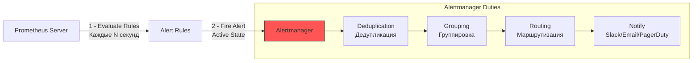

## От шума к действию

В предыдущей статье мы научились находить корневые причины проблем. Однако в идеальном мире мы должны узнавать о проблеме до того, как пользователи начнут жаловаться в поддержку. Здесь на сцену выходит **Alerting (Алертинг)**.

Главная цель алертинга — не просто уведомить кого-то, а побудить к **действию**. Если алерт прилетает, а вы думаете: «А, это опять эта ерунда, удалю потом» — это плохой алерт. Это шум, который убивает вашу продуктивность и вызывает «усталость от пейджера» (Pager Fatigue).

## Архитектура Алертинга в Prometheus

В экосистеме Prometheus алертинг разделен на две независимые части. Это классический пример разделения ответственности (Separation of Concerns).



### 1. Prometheus Server (Detection)
Сам Prometheus занимается только вычислениями. Он раз в минуту (по умолчанию) прогоняет ваши PromQL запросы.
*   Если условие истинно (например, `up == 0`), он переводит алерт в состояние **Pending** (Ожидание).
*   Если условие истинно в течение времени `for` (например, 5 минут), он переводит алерт в состояние **Firing** (Стрельба) и отправляет его в Alertmanager.

### 2. Alertmanager (Notification)
Alertmanager — это отдельный бинарный файл (тоже написан на Go). Он не умеет считать метрики. Он умеет управлять потоками уведомлений.
*   **Deduplication:** Если Prometheus отправит 100 одинаковых алертов (с одной меткой), Alertmanager отправит в Slack только одно сообщение.
*   **Grouping:** Если упало 100 сервисов одновременно (например, проблема в сети дата-центра), Alertmanager склеит их в одно сообщение, а не завалит вас спамом.
*   **Silencing:** Возможность временно выключить алерт (например, на время планового обслуживания).

## Mechanical Sympathy: Цена алертинга

Алертинг не бесплатен для Prometheus.
Каждое правило алертинга — это запрос к базе данных TSDB.
*   Если у вас сложный запрос с `rate()` и большими окнами, он нагружает CPU Prometheus.
*   Если правил тысячи, Prometheus может не успевать их вычислить.

**Best Practice:** Не используйте слишком маленькие окна `for`.
*   `for: 10s` — почти бессмысленно, так как один «провал» в скрейпинге может вызвать ложный алерт.
*   `for: 5m` — стандарт индустрии. Это фильтрует кратковременные выбросы (flapping).

## Anatomy of a Good Alert (Анатомия хорошего алерта)

Хороший алерт отвечает на три вопроса:
1.  **What?** Что сломалось? (Имя алерта и лейблы).
2.  **Where?** Где сломалось? (Instance, Job).
3.  **So What?** Насколько это критично? (Severity: Critical/Warning).

### Пример плохого алерта:
```yaml
# ПЛОХО
alert: HighCPU
expr: process_cpu_seconds_total > 0.8
```
*   Не понятно, это 80% или 0.8 секунд?
*   Нет контекста. Может, сервис просто обрабатывает нагрузку.

### Пример хорошего алерта (Go Specific):
```yaml
# ХОРОШО
alert: GoServiceHighGoroutines
expr: go_goroutines{job="my-go-service"} > 10000
for: 5m
labels:
  severity: warning
annotations:
  summary: "High Goroutine count on {{ $labels.instance }}"
  description: "Instance {{ $labels.instance }} has {{ $value }} goroutines. Potential leak."
```

> [!warning] Ловушка / Gotcha
> **Alerting on Symptoms, not Causes.**
> Не алертуйте на "Causes" (причины). Алертуйте на "Symptoms" (симптомы).
> *   **Cause:** Медленный диск.
> *   **Symptom:** Высокая Latency запросов.
> *   **Почему?** Медленный диск может быть одной из причин, но их может быть сотня. Пользователь чувствует Latency. Стройте алерты вокруг того, что чувствует пользователь (Latency, Error Rate), а не вокруг того, что видит сервер (CPU, Disk I/O).

## Специфика Go: Что нужно мониторить обязательно?

Для Go-бэкендов есть набор специфичных метрик, которые должны быть в алертах.

1.  **Goroutine Leak:**
    `go_goroutines > 10000` (или линейный рост).
    Это самый частый баг в Go. Если горутин растет и не падает — приложение скоро упадет с OOM или перестанет отвечать.

2.  **GC Pressure:**
    `rate(go_gc_duration_seconds_sum[5m]) > 10`.
    Если GC запускается слишком часто, это значит, что приложение генерирует слишком много мусора. Это «тормозит» реальную работу (Stop-The-World pauses).

3.  **SLO Violations:**
    Мы обсуждали SLO. Алерт должен срабатывать, когда Error Budget выгорает быстрее, чем мы готовы принять.
    Используйте **Multi-window, Multi-burn-rate Alerts** (стандарт Google SRE).
    *   Пример: Если за последний час потрачено 5% месячного бюджета — PagerDuty (Critical).
    *   Если за последние 3 дня потрачено 10% бюджета — Ticket (Warning).

## Итог

1.  **Prometheus** вычисляет правила, **Alertmanager** отправляет уведомления.
2.  Алерты должны быть **Actionable** (требовать действия). Если действие не нужно — это график, а не алерт.
3.  Используйте `for` clause, чтобы избежать шума (flapping).
4.  В Go обязательно следите за `go_goroutines` и `go_gc_duration_seconds`.

В следующей статье мы поговорим о главной проблеме алертинга — как отделить сигнал от шума: [[4. Noise vs signal]].