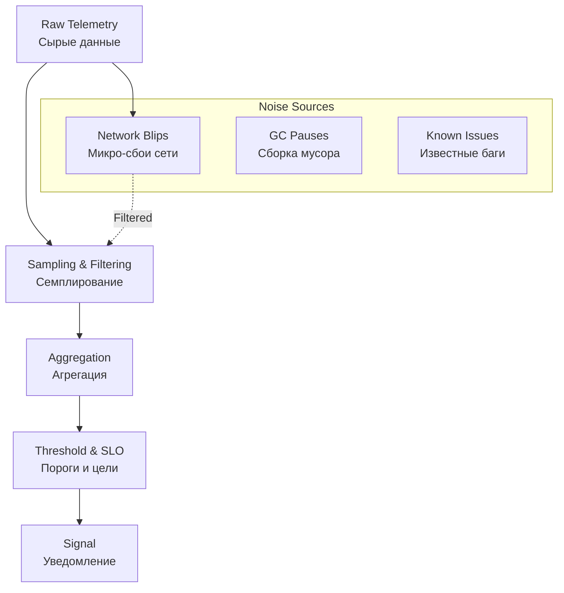

## Проблема информационного шума

В предыдущей статье мы настроили алертинг. Но существует тонкая грань, отделяющая полезную систему мониторинга от назойливого спам-бота. Если вы получаете 50 алертов за ночь, а утром игнорируете их все — ваша система Observability сломана. Вы страдаете от **Alert Fatigue (Усталости от уведомлений)**.

Главная инженерная задача Observability — не просто собрать данные, а превратить их в **Сигнал**, отсеяв **Шум**.

## Сигнал vs Шум: Определения

*   **Сигнал (Signal):** Информация, требующая *действия*. Это аномалия, которая влияет на бизнес или пользователей, и требует вмешательства инженера.
*   **Шум (Noise):** Информация, не требующая действий. Это нормальная вариативность работы системы, известные проблемы или просто лишние данные.

> [!warning] Ловушка / Gotcha
> **Эффект «Пастуха, который кричал "Волки!"»**.
> Если ваша система мониторинга регулярно кричит о проблемах, которые либо сами проходят, либо не критичны, команда перестает реагировать на алерты. В момент реальной катастрофы (когда действительно придут "волки") вы можете пропустить критический сигнал среди кучи спама.

## Источники шума

### 1. Нормальная вариативность (Flapping)
Метрики в реальном мире "скачут". CPU может кратковременно подпрыгнуть до 100% при сборке мусора или старте приложения. Если вы поставите алерт `cpu > 80%`, вы получите бесконечный шум.
**Решение:** Использование функций сглаживания (`rate()`, `avg_over_time()`) и задержки (`for: 5m`).

### 2. Мониторинг "Причин" вместо "Симптомов"
Алерт "CPU High" сам по себе — это шум. Это техническая метрика. Пользователь не видит CPU.
Алерт "High Latency" (высокая задержка) — это сигнал. Это симптом.
**Правило:** Алерты должны строиться вокруг того, что *чувствует* пользователь (SLO), а не вокруг того, что "чувствует" сервер.

### 3. High Cardinality в неправильном месте
Мы обсуждали кардинальность. Миллионы уникальных метрик — это шум для вашей базы данных мониторинга. Вы не можете построить осмысленный график по миллиону линий. Вы теряете возможность видеть общие тренды.

## Инженерные методы фильтрации

Как превратить сырой поток данных в чистый сигнал?



### 1. Семплирование (Sampling) в Трейсинге
Вам не нужно сохранять 100% трейсов, чтобы понять, что система работает медленно.
*   **Head-based Sampling:** Решение о записи трейса принимается в начале запроса (например, записываем 1% запросов).
*   **Tail-based Sampling:** (Продвинутый уровень) Записываем 100% запросов в память, но сохраняем в базу только те, которые:
    *   Длились дольше N секунд.
    *   Закончились ошибкой (Status Code 500).
    *   Содержат конкретный `error` тег.

Это позволяет видеть "сигнал" (ошибки и тормоза) и игнорировать "шум" (успешные быстрые запросы), экономя деньги на хранении.

### 2. Окна агрегации (Time Windows)
Никогда не алертуйте на мгновенное значение (`cpu_now`). Всегда используйте окно.
```promql
# Шумно: Среагирует на любую секундную вспышку
rate(http_requests_total[10s])

# Чисто: Сглаживает пики и показывает реальный тренд
rate(http_requests_total[5m])
```

### 3. Дедупликация и Группировка
Когда падает кластер из 50 подов, вам не нужно получать 50 алертов в Slack.
Alertmanager (который мы обсуждали в прошлой статье) должен сгруппировать их в один:
`Alert: ServiceDown. Instances: 50`. Это сигнал. 50 отдельных сообщений — это шум.

## Mechanical Sympathy: CPU и "Счастливые ушки"

Существует когнитивная ошибка, называемая **"Happy Ears" (Счастливые ушки)**. Мы склонны настраивать мониторинг так, чтобы графики были зелеными и красивыми, игнорируя реальные проблемы.

Например, вы можете настроить `for: 30m`, чтобы алерт срабатывал очень редко. Шума нет, "уши счастливы". Но в это время пользователи могут страдать от периодических 5-секундных задержек, которые "прыгают" и не держатся 30 минут.

**Баланс:** Настройка порогов — это итеративный процесс.
1.  Начните с чувствительных настроек.
2.  Если приходит шум — анализируйте.
3.  Если шум не важен — поднимите порог или добавьте `ignore` правило.
4.  Повторяйте, пока поток алертов не станет равен количеству реальных инцидентов.

## Итог

1.  **Цель Observability** — доставить *сигнал*, а не данные.
2.  Шум убивает доверие к мониторингу. Лучше один пропущенный алерт, чем 100 ложных срабатываний.
3.  Используйте **SLO-based alerting** (алерты по целям), чтобы фокусироваться на проблемах пользователей, а не серверов.
4.  **Tail-based sampling** — мощный инструмент для сбора полезного сигнала (ошибок) в трейсинге без захламления базы.

В следующей статье мы рассмотрим специфику запуска всех этих систем в среде Kubernetes: [[5. Observability в Kubernetes]].