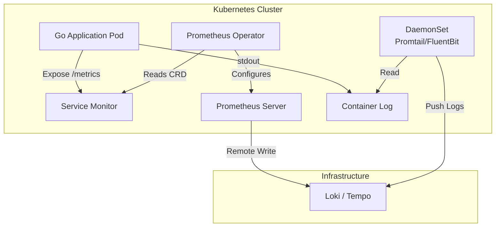

## Динамический мир Kubernetes

В предыдущих статьях мы рассматривали Observability абстрактно. Но в реальности большинство современных Go-бэкендов развертываются в Kubernetes (K8s). Это меняет правила игры: статические конфигурации IP-адресов больше не работают, а масштабирование происходит мгновенно.

Kubernetes создает новые вызовы: эфемерность подов (они часто создаются и удаляются), динамическая сервисная сетка и сложная маршрутизация.

## Архитектура Observability в K8s

Классический подход «Push» (агент внутри приложения отправляет метрики) в K8s менее популярен, чем подход **Pull** с использованием **Prometheus Operator**.

### Prometheus Operator
Это стандарт де-факто для мониторинга в K8s. Вместо того чтобы вручную править конфиг `prometheus.yml` и перезагружать контейнер при каждом добавлении нового сервиса, Operator делает это автоматически.

*   **CRD (Custom Resource Definition):** Вы создаете ресурс `ServiceMonitor`, который говорит: «Следи за всеми сервисами, у которых есть лейбл `app=backend`».
*   **Service Discovery:** Prometheus сам находит все поды, попадающие под критерий, и начинает их скрейпить.

## Логирование: Sidecar vs DaemonSet

В статье [[4. Централизованные логи]] мы определили, что приложения должны писать в `stdout`. В K8s вопрос в том, *кто* эти логи забирает.

### 1. DaemonSet (Agent on Node)
На каждой ноде кластера запускается один под-агент (например, Promtail).
*   **Принцип:** Агент монтирует директорию `/var/log` с хоста, читает файлы контейнеров и отправляет в Loki.
*   **Плюсы:** Эффективно. Не потребляет ресурсы приложения. Один процесс на ноду.
*   **Минусы:** Нельзя парсить логи приложений по-разному на уровне приложения (конфиг общий).

### 2. Sidecar (Agent in Pod)
В каждый под вашего приложения добавляется второй контейнер — логгер.
*   **Принцип:** Оба контейнера монтируют общий `emptyDir` volume. Приложение пишет в файл, sidecar читает и отправляет.
*   **Плюсы:** Максимальная гибкость (каждый микросервис может иметь свой формат/токен).
*   **Минусы:** Расточительно. Если у вас 100 подов, у вас 100 лишних процессов. Это увеличивает потребление памяти и CPU.

> [!tip] Собеседование
> **Вопрос:** Какой паттерн выбрать?
> **Ответ:** В 95% случаев — **DaemonSet**. Это идиоматичный подход для Kubernetes. Sidecar оправдан только если ваше приложение пишет логи в сложный бинарный формат, который нодовый агент не умеет парсить, или если нужна строгая изоляция мультитенантных логов.

## Under the Hood: Container Metrics (cAdvisor)

Kubernetes сам по себе предоставляет метрики через Metrics Server, но для детального Observability мы используем `cAdvisor` (встроен в Kubelet).

Go-разработчику важно понимать, что метрики, которые вы видите в Grafana (CPU, Memory Usage), — это не то, что показывает `top` внутри контейнера.

*   **CPU:** В Linux контейнерах CPU измеряется в **Cores** (millicores). `100m` = 0.1 ядра. Метрика `container_cpu_usage_seconds_total` — это кумулятивное время, использованное контейнером.
*   **Memory:** Есть `working_set_bytes` (RSS + Page Cache) и `usage_bytes`. OOM Killer в K8s смотрит на `working_set_bytes`. Если ваше Go-приложение аллоцирует много памяти, которая не используется активно, но не освобождена (RSS), вы получите OOM Kill, даже если метрика `usage` казалась нормальной.

> [!warning] Ловушка / Gotcha
> **Go Runtime и Limits.**
> Go GC не знает о лимитах контейнера (cgroups) до версий Go 1.19 (автоматическое определение `GOMEMLIMIT`). В старых версиях Go видел память всей ноды (например, 64GB) и мог установить цель GC слишком высоко, пока контейнер не убили по лимиту 512MB.
> **Решение:** В Go 1.21+ runtime автоматически определяет cgroup limits и настраивает GC. Убедитесь, что вы используете свежую версию Go.

## Cost and Scale: Cardinality в K8s

В Kubernetes проблема кардинальности (обсуждавшаяся в статье [[4. Cardinality и стоимость метрик]]) обостряется.
Если вы добавите лейбл `pod_name` в метрику, а потом сделаете `RollingUpdate` деплоя, K8s создаст новые поды с новыми именами.
Prometheus будет создавать новые временные ряды для каждого нового пода. Старые ряды будут «гнить» (stale), но занимать место.

**Best Practice:**
Никогда не используйте лейблы, которые меняются при редеплое (`pod_name`, `container_id`, `instance_ip`) в метриках высокого кардинальности. Используйте статические лейблы (`deployment`, `service`, `namespace`).

## Итог

1.  **Prometheus Operator** — стандарт управления мониторингом в K8s через CRD (`ServiceMonitor`).
2.  **DaemonSet** — эффективный способ сбора логов с нод.
3.  **cAdvisor** — источник метрик контейнеров (CPU/Mem).
4.  В Go 1.19+ runtime «подружился» с cgroups, автоматически учитывая лимиты памяти контейнера.

В следующей, заключительной статье раздела, мы подведем итоги и сформулируем, что значит быть Observable System: [[6. Итоги раздела. Observable system]].