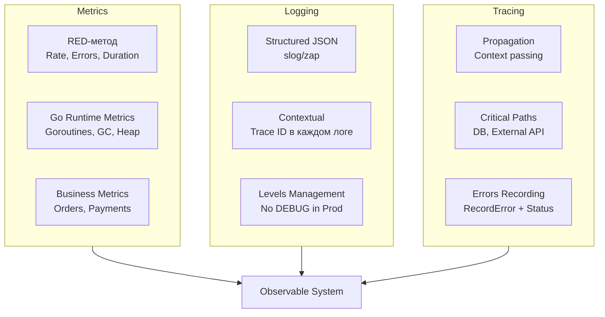

## Система, которая рассказывает о себе

Мы завершаем обширный раздел, посвященный Observability. Мы прошли путь от теории (три столпа) до глубокой практики (Go-рантайм, Kubernetes, алертинг).

Главный вывод, который должен остаться в вашей базе знаний: **Observability — это не инструмент, это свойство системы**. Вы не можете «купить» наблюдаемость, установив Prometheus и Grafana. Вы должны спроектировать её так, чтобы она «выдавала» информацию о своем состоянии.

## Чек-лист Observable Go-сервиса

Как понять, что ваш бэкенд на Go готов к продакшену с точки зрения Observability? Вот контрольный список (Runbook) для Senior-разработчика:

### 1. Метрики (Metrics)
*   [ ] **RED-метод:** Для каждого HTTP/gRPC эндпоинта настроены: Rate (RPS), Errors (5xx), Duration (Histogram).
*   [ ] **USE-метод:** Для инфраструктуры (если применимо): Utilization, Saturation, Errors.
*   [ ] **Go Runtime:** Экспортируются метрики `go_goroutines`, `go_gc_duration_seconds`, `go_memstats_heap_inuse_bytes`.
*   [ ] **Кардинальность:** Нет лейблов с ID пользователей или IP-адресами.

### 2. Логирование (Logging)
*   [ ] **Формат:** Структурированный JSON (slog/Zap).
*   [ ] **Корреляция:** Каждая запись лога содержит `trace_id`, если запрос в контексте трассировки.
*   [ ] **Безопасность:** Пароли, токены и PII данные не попадают в логи.
*   [ ] **Уровни:** Нет `DEBUG` уровня в продакшене по умолчанию.

### 3. Трейсинг (Tracing)
*   [ ] **Propagation:** `context.Context` пробрасывается во все функции и клиенты.
*   [ ] **Инструментирование:** Критические секции (DB calls, HTTP clients) обернуты в спаны.
*   [ ] **Семплирование:** Настроено для высоконагруженных систем (Head/Tail sampling).

### 4. Культура (Culture)
*   [ ] **SLO:** Определены цели уровня сервиса (например, 99.9% доступности).
*   [ ] **Alerting:** Алерты срабатывают на основе SLO и симптомов, а не только на "CPU High".
*   [ ] **Runbooks:** К каждому алерту привязана инструкция по исправлению.

## Mechanical Sympathy: Цена прозрачности

Всегда помните, что Observability стоит ресурсов.
*   **CPU:** Тратится на сериализацию логов, вычисление гистограмм, создание спанов.
*   **Memory:** Буферы для метрик, каналы для логгеров.
*   **Network:** Трафик от агентов к хранилищам (TSDB, Loki, Tempo).

В мире Go, где мы боремся за каждый такт и каждый мегабайт кучи, важно соблюдать баланс. Не логируйте `DEBUG` в Hot Path (цикл обработки 100k RPS). Используйте `slog` с умом. Не создавайте спаны внутри узких циклов (например, внутри `for` на 100 итераций, если это не критично), лучше создайте один родительский спан.

## Переход к Инфраструктуре

Мы научили наше приложение «разговаривать». Теперь нам нужно понять, в какой среде оно живет.
Ваши навыки настройки Observability бесполезны, если вы не понимаете, как устроена платформа, на которой запущен ваш сервис.

*   Почему контейнер убили (OOMKill)?
*   Как настроить Ingress, чтобы трейсы проходили корректно?
*   Почему сеть внутри кластера работает медленно?

В следующем большом разделе мы спустимся на уровень ниже — к **Инфраструктуре**. Мы разберем Linux, Docker, Kubernetes и Nginx с точки зрения бэкенд-разработчика. Потому что Senior Go Engineer должен понимать не только код, но и среду его исполнения.

Переходим к разделу: **19. Инфраструктура: Linux, nginx, Docker, Kubernetes**.