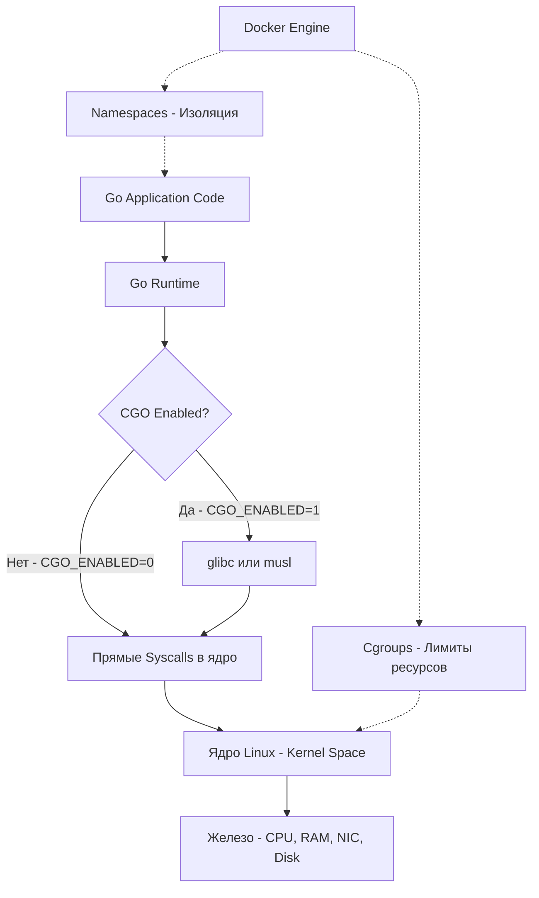

Раздел инфраструктуры — это тот самый мост между вашим кодом на Go и реальным железом, на котором он будет работать в продакшене. Можно писать идеальный идиоматичный код, оптимизировать аллокации и настраивать GC, но если вы не понимаете, как ваша программа исполняется на сервере, вы неизбежно столкнетесь с необъяснимыми проблемами: от странных задержек до падений по OOM (Out of Memory).

Linux — это де-факто стандартная среда выполнения для бэкенда. Независимо от того, деплоите ли вы бинарник на виртуалку, паковываете ли в Docker-контейнер или поднимаете Pod в Kubernetes, под капотом всегда будет ядро Linux. 

В этом разделе мы спустимся на уровень ОС и разберем, как именно Go-рантайм взаимодействует с Linux, почему контейнеры — это не виртуальные машины, и как инфраструктурные решения (nginx, K8s) влияют на архитектуру вашего бэкенда.

## Go и Linux: Идеальный брак

Если вы переходите в Go из мира Java, C# или Python, вы привыкли к тяжелым рантаймам и виртуальным машинам, которые пытаются абстрагировать вас от операционной системы. Go пошел другим путем. Он не пытается построить виртуальный компьютер поверх ОС. Вместо этого Go использует возможности ядра Linux напрямую и максимально эффективно.

Главный козырь Go — это **статическая компиляция**. Ваш Go-код компилируется вnative ELF-исполняемый файл (Executable and Linkable Format), который не требует внешних зависимостей (библиотек `glibc`, `libc++` и т.д.) для своего запуска, если вы собираете его с `CGO_ENABLED=0`.

> [!info] Под капотом
> В отличие от C/C++, где вызов, например, `printf` или `malloc` неявно тянет за собой динамическую линковку с `glibc` (и функцией `syscall` внутри неё), Go-рантайм при `CGO_ENABLED=0` реализует взаимодействие с ядром напрямую. Он генерирует ассемблерные инструкции (например, `SYSCALL` на x86_64), минуя libc. Это не только делает бинарники переносимыми (отсутствие dependency hell), но и убирает оверхед на прослойку стандартной библиотеки C при системных вызовах.

### CGO и ловушка динамической линковки

Как только вы импортируете пакет, использующий CGO (например, драйверы БД вроде `go-sqlite3`, или обертки над C-библиотеками), всё меняется.

> [!warning] Ловушка / Gotcha
> Если `CGO_ENABLED=1`, ваш бинарник становится динамически слинкованным. Он начнет требовать `glibc` версии не ниже той, на которой был собран. Классическая боль: сборка на Ubuntu (новая `glibc`) и деплой на Alpine Linux (использует `musl libc` вместо `glibc`). Бинарник просто упадет с ошибкой `not found` или `version 'GLIBC_2.xx' not found`. 
> Решения два: либо собирать бинарник внутри Alpine-контейнера, либо использовать `CGO_ENABLED=0` и статическую сборку, что является идиоматичным подходом для Go-бэкенда.

## Среда выполнения: Слои абстракции

Чтобы понимать, где возникает проблема, нужно четко осознавать слои, в которых работает ваш код. Когда происходит падение или деградация, вы должны знать, куда смотреть: на свой код, на рантайм Go, на ядро ОС или на инфраструктуру контейнера.

Как видно из диаграммы, Docker (и Kubernetes) не добавляют новые слои между вашим кодом и ядром. Они лишь используют механизмы изоляции Linux — **Namespaces** (чтобы процесс думал, что он один в системе) и **Cgroups** (чтобы ядро ограничивало потребление CPU и памяти для этого процесса). 

Это кардинально отличается от виртуальных машин (VM), где поверх железа поднимается гипервизор, а внутри него — полноценная гостевая ОС со своим ядром. Контейнеры — это просто изолированные процессы на хостовой ОС. Для Go-разработчика это значит, что системный вызов из контейнера напрямую попадает в ядро хоста, без виртуализации железа.

## Mechanical Sympathy: Ядро и ваши горутины

Go-планировщик (G-M-P) работает в User Space, управляя горутинами. Но сами потоки ОС (M), на которых исполняются горутины, планирует ядро Linux. 

Вам важно понимать, как ядро видит ваш Go-процесс:
1. **Потоки (OS Threads)**: Рантайм Go создает потоки ОС по мере необходимости (до значения `GOMAXPROCS` для executing threads, и больше для блокирующихся в syscalls). Для ядра Linux каждый такой поток — это обычный `task_struct`, который ставится в очередь на выполнение на логических ядрах CPU.
2. **Системные вызовы**: Когда горутина делает сетевой запрос, Go-рантайм использует асинхронный интерфейс Linux — `epoll` (через Net Poller). Это позволяет одному потоку ОС ожидать завершения тысяч сетевых операций, не блокируясь.
3. **Файловый IO**: А вот чтение с диска (file IO) в Go по умолчанию блокирующее (syscall `read`/`pread`). Рантайму приходится отдавать блокирующемуся потоку M горутину G и создавать/переиспользовать другой поток M, чтобы не остановить работу планировщика (механизм Hand-off).

> [!tip] Собеседование
> **Вопрос:** Как ядро Linux ограничивает ресурсы (CPU, Memory) вашего Go-приложения в Docker, и почему это может быть опасно?
> **Ответ:** Docker использует **Cgroups** (Control Groups). Для памяти Cgroup задает жесткий лимит. Если Go-приложение попытается аллоцировать память сверх лимита Cgroup, ядро Linux убьет процесс с помощью механизма OOM Killer (Out-Of-Memory). Сигнал `SIGKILL` (9) нельзя перехватить, приложение умрет мгновенно. 
> Проблема со старыми версиями Go (до 1.19) заключалась в том, что GC настраивал свой целевой процент (`GOGC`) исходя из *всей* памяти хоста, а не лимита Cgroup контейнера. Это приводило к тому, что GC думал, что памяти еще много, не убирал мусор, упирался в лимит Cgroup и получал OOM Kill. В Go 1.19 появился флаг `GOMEMLIMIT` и автоматическое определение лимитов Cgroup, что решило эту проблему. На собеседовании всегда стоит упомянуть `GOMEMLIMIT` и связку с Cgroups.

## Что мы будем разбирать в этом разделе

Чтобы писать надежный бэкенд на Go, нужно понимать правила игры, которые задает Linux и инфраструктура. Мы последовательно разберем:

1. **Процессы и сигналы**: Как Graceful Shutdown работает на уровне ОС, почему `SIGTERM` и `SIGINT` — ваши лучшие друзья, а `SIGKILL` — враг.
2. **Файловая система**: Что такое Inodes, жесткие и символические ссылки, и почему запись в файл в Go требует понимания буферизации на уровне ОС.
3. **Права доступа**: Модель безопасности Linux (UID/GID) и почему контейнеры не стоит запускать от `root`.
4. **Systemd**: Как управлять Go-сервисами на "голом" железе и настраивать автозапуск.
5. **Networking**: Как работают сокеты, порты, `epoll` и маршрутизация внутри ядра Linux.

Инфраструктура — это не просто конфиги DevOps-инженеров. Это продолжение вашего кода в продакшене. Понимание её устройства отличает разработчика, пишущего код "который работает на моей машине", от инженера, создающего системы, которые стабильно держат нагрузку в проде.

В следующей статье мы начнем с самого фундамента — с того, как ядро Linux видит вашу программу, и как вы можете управлять её жизненным циклом с помощью сигналов: [[2. Процессы и сигналы]].