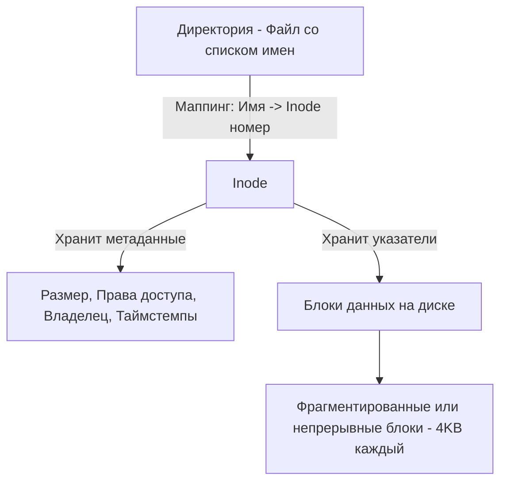

В классическом понимании бэкенд-разработчика файловая система — это место, где лежат исходники, конфиги и логи. Но в Linux философия радикально иная: **«Всё есть файл» (Everything is a file)**. 

Сетевой сокет — это файл. Канал (pipe) — это файл. Устройство `/dev/null` — это файл. Директория — это тоже файл. Для ядра Linux все эти сущности взаимодействуют через единый интерфейс Виртуальной файловой системы (VFS). Понимание того, как VFS и дисковая подсистема работают под капотом, напрямую влияет на то, как вы будете писать код работы с IO в Go, логировать данные и настраивать базы данных.

## VFS и Inodes: Как ядро видит файлы

Когда вы открываете файл в Go (`os.Open`), вы не получаете прямой указатель на сектор на диске. Вы взаимодействуете с абстракцией — **VFS (Virtual File System)**. VFS позволяет Linux поддерживать десятки разных файловых систем (ext4, XFS, Btrfs, NFS) под одним унифицированным API.

Ключевая концепция VFS — **Inode (Index Node)**. Когда вы создаете файл, ядро выделяет для него Inode — структуру данных на диске, которая хранит *всё* о файле, кроме его имени:



> [!info] Под капотом
> Имя файла хранится не в Inode, а в директории (которая сама по себе является просто файлом со списком маппингов `имя -> номер Inode`). Именно поэтому в Linux можно создавать Hard Links — несколько имен, указывающих на один и тот же Inode. Удаление файла (через `unlink`) — это просто удаление записи из директории. Физические данные на диске удалятся только тогда, когда счетчик ссылок (link count) в Inode станет равен нулю и ни один процесс не держит этот файл открытым.

## Файловые дескрипторы (File Descriptors)

Когда Go вызывает системный вызов `openat` (современная версия `open`), ядро создает запись в таблице файловых дескрипторов процесса и возвращает целое число — **FD (File Descriptor)**. 

Для процесса в Linux выделяются первые три дескриптора по умолчанию:
*   `0` — Standard Input (`stdin`)
*   `1` — Standard Output (`stdout`)
*   `2` — Standard Error (`stderr`)

Каждый открытый файл, сокет или канал получает следующий доступный FD. В Go структуре `os.File` соответствует поле `file.pfd.Sysfd`, которое и хранит этот номер дескриптора.

### Ловушка лимитов (ulimit)

Процесс не может открывать файлы бесконечно. Ядро Linux ограничивает количество открытых FD на процесс.

> [!warning] Ловушка / Gotcha
> По умолчанию во многих Linux-системах лимит открытых файловых дескрипторов для процесса (soft limit) равен **1024**. 
> Для высоконагруженного Go-бэкенда, где каждый входящий HTTP-запрос и каждое соединение с БД — это FD, 1024 — это катастрофически мало. Вы получите ошибку `socket: too many open files` или `open /path/to/file: too many open files`.
> 
> **Решение:** Всегда настраивайте лимиты через `ulimit -n` перед запуском приложения (или в Docker-файле/Unit-файле Systemd), либо программно через `syscall.Setrlimit` в Go. В продакшене значения `65535` или `1048576` — норма.

## Mechanical Sympathy: Page Cache и цена дискового IO

Обращение к диску (даже NVMe SSD) — это миллионы тактов CPU. Обращение к RAM — это сотни тактов. ОС Linux пытается минимизировать прямое чтение с диска, используя **Page Cache** (страничный кэш).

Когда вы читаете файл, ядро ищет его блоки в Page Cache (в оперативной памяти). Если их там нет (cache miss), оно читает с диска и сохраняет копию в Page Cache. При последующих чтениях данные берутся из памяти.

Когда вы пишете в файл через `write()`, ядро **не пишет сразу на диск**. Оно копирует данные из пространства пользователя в Page Cache (в пространство ядра), помечает страницу как "грязную" (dirty) и немедленно возвращает управление в программу. Физическая запись на диск произойдет позже асинхронно фоновым потоком ядра (`pdflush`/`flush`). Это называется **Write-back cache**.

```go
// Не делайте так в базах данных!
data := []byte("critical financial transaction")
file.Write(data) 
// Write вернул success, но данные могут быть только в Page Cache!
// Если сервер моргнет светом, вы потеряете данные.
```

Чтобы гарантировать, что данные физически на диске (durability), нужно вызвать `fsync(fd)`. Это заставляет ядро сбросить все dirty pages для этого FD на диск. Это невероятно дорогая операция, которая блокирует вызывающий поток.

### O_DIRECT: Обход кэша

СУБД (PostgreSQL, RocksDB) часто открывают файлы с флагом `O_DIRECT`. Этот флаг говорит ядру: "Не используй Page Cache, читай и пиши напрямую в пользовательский буфер в обход кэша ядра". СУБД предпочитают управлять кэшированием сами (shared buffers в Postgres), чтобы избежать двойного потребления RAM.

## Go и работа с IO

В Go есть важная архитектурная особенность, о которой часто забывают: **сетевой IO и файловый IO обрабатываются рантаймом по-разному.**

1. **Сетевой IO (Net Poller)**: Go использует системный вызов `epoll` в Linux. Когда горутина читает из сокета, а данных нет, рантайм переводит горутину в состояние ожидания (паркует), **не потребляя поток ОС (M)**. Один системный поток может обслуживать тысячи спящих сетевых горутин.
2. **Файловый IO**: К сожалению, `epoll` не работает с обычными файлами в Linux (они всегда готовы для чтения/записи). Поэтому, когда горутина делает системный вызов `read` или `write` для файла, рантайм Go **блокирует поток ОС (M)** до завершения операции.

> [!tip] Собеседование
> **Вопрос:** Что произойдет с планировщиком Go, если вы запустите 10 000 горутин, и каждая из них попытается прочитать большой файл с диска синхронно через `os.ReadFile`?
> **Ответ:** Произойдет Thread Starvation (голодание потоков). Так как файловый IO блокирует поток ОС (M), рантайм Go будет вынужден создавать новые потоки ОС для обслуживания остальных горутин. Количество потоков ОС взлетит до лимита `runtime.GOMAXPROCS` или ограничения ОС, и планировщик начнет деградировать. Решение — использование пула воркеров (ограничение конкурентности) или асинхронного файлового IO (пакеты вроде `aio` или использование `io_uring` через CGO, что сложнее).

### Буферизация: почему bufio спасает производительность

Учитывая стоимость системных вызовов (переключение Ring 3 -> Ring 0 и копирование данных), вызов `file.Write` для записи 10 байт — это преступление против Mechanical Sympathy. Вы потратите 90% времени на оверхед ядра, а не на само IO.

Пакет `bufio` в Go реализует буферизацию в User Space.

```go
package main

import (
	"bufio"
	"os"
)

func main() {
	// Открываем файл с флагами O_WRONLY, O_CREATE, O_APPEND
	f, err := os.OpenFile("app.log", os.O_WRONLY|os.O_CREATE|os.O_APPEND, 0644)
	if err != nil {
		panic(err)
	}
	defer f.Close()

	// Оборачиваем в bufio.Writer. По умолчанию буфер 4KB.
	writer := bufio.NewWriter(f)
	
	// Эти записи просто кладут данные в слайс в памяти (User Space).
	// Никаких системных вызовов нет!
	_, err = writer.WriteString("log entry 1\n")
	if err != nil {
		panic(err)
	}
	_, err = writer.WriteString("log entry 2\n")
	if err != nil {
		panic(err)
	}

	// Только сейчас данные из буфера (4KB) копируются в ядро 
	// через один системный вызов write().
	if err := writer.Flush(); err != nil {
		panic(err)
	}
}
```

Используя `bufio`, вы группируете мелкие записи в один большой буфер, и сбрасываете его одним системным вызовом. Это снижает нагрузку на CPU и улучшает утилизацию Page Cache.

## Итог

1. **Inodes** — фундамент файловой системы Linux. Имя файла — это лишь ссылка в директории, а метаданные и указатели на данные хранятся в Inode.
2. **File Descriptors (FD)** — это интерфейс взаимодействия с любым IO в Linux. Следите за лимитами `ulimit -n` в продакшене.
3. **Page Cache** — ваш лучший друг. Ядро кэширует чтение и откладывает запись (write-back). Но если вам нужна гарантия записи (durability) — вы обязаны вызывать `fsync`.
4. **Go Runtime**: Сетевой IO асинхронен (через epoll), а дисковый IO блокирует потоки ОС. Для тяжелой работы с диском используйте пулы горутин.
5. **Буферизация** (`bufio`) — обязательна для интенсивного файлового IO. Она минимизирует количество системных вызовов.

Файлы в Linux имеют не только содержимое, но и владельца, а также набор прав, определяющих, кто может этот файл читать, менять или исполнять. В следующей статье мы погрузимся в модель безопасности Linux и узнаем, почему контейнеры категорически не рекомендуется запускать от пользователя root: [[4. Права доступа и безопасность]].