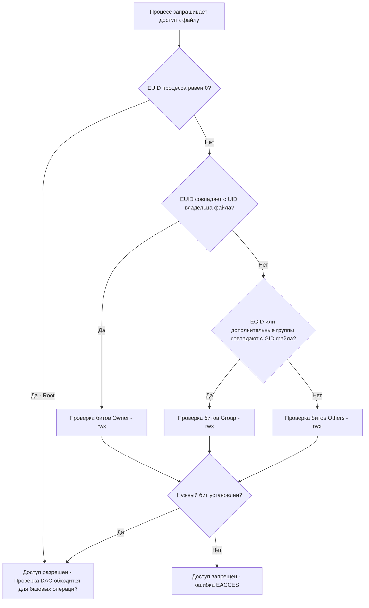

Когда мы пишем бэкенд на Go, мы часто концентрируемся на безопасности прикладного уровня: хешировании паролей, защите от SQL-инъекций и валидации JWT. Но все эти усилия бессмысленны, если ваш процесс в Linux работает с неправильно настроенными правами. Уязвимость на уровне ОС (например, чтение `/etc/shadow` или запись в системные директории) мгновенно компрометирует всю систему.

В Linux безопасность строится на двух столпах: **Discretionary Access Control (DAC)** — классическая модель прав владельца/группы, и **Capabilities** — гранулярное разделение привилегий суперпользователя.

## Фундамент: UID, GID и ядро

Для ядра Linux пользователь — это просто число. Когда процесс запускается, ядро связывает с ним учетные данные (credentials), хранящиеся в структуре `cred` внутри `task_struct` процесса:
*   **Real UID/GID (RUID/RGID)**: Идентификатор пользователя, запустившего процесс.
*   **Effective UID/GID (EUID/EGID)**: Идентификатор, с учетом которого ядро проверяет права доступа к файлам и ресурсам. Обычно совпадает с Real, но может меняться (например, при запуске бинарника с битом `setuid`).
*   **Saved UID/GID**: Сохраненный EUID, чтобы процесс мог временно сбросить привилегии и вернуть их обратно.

Пользователь с UID `0` (root) — это не маг. Это просто процесс, чей EUID равен нулю. Ядро Linux содержит множество проверок вида `if (capable(CAP_SYS_ADMIN) || uid_eq(cred->euid, GLOBAL_ROOT_UID))`. Если вы root — проверки пропускются.

## Классические права (DAC: rwx)

Модель DAC означает, что владелец объекта (файла) сам решает, кто к нему имеет доступ. Каждый файл и директория в Linux имеют атрибуты для трех категорий:
1.  **User (Owner)**: Права владельца файла.
2.  **Group**: Права группы, которой принадлежит файл.
3.  **Others**: Права всех остальных.

В памяти Inode это хранится как 9-битная маска (например, `rwxr-xr--` = `111 101 100` = `754`).

Как ядро принимает решение о доступе? Алгоритм строго линеен:



> [!warning] Ловушка / Gotcha
> Порядок проверок строго: Owner -> Group -> Others. Если вы владелец файла с правами `000`, и файл имеет права группы `rwx` (к которой вы принадлежите), вы **всё равно не получите доступ**. Ядро видит совпадение Owner, применяет маску `000` и отказывает, даже не проверяя группу.

## Проблема Root и появление Capabilities

Исторически в Unix было два состояния: ты обычный пользователь (ограничен) или ты root (бог). Если вашему веб-серверу нужно было прибиндиться к 80 порту (порты < 1024 привилегированные), вам приходилось запускать весь процесс от root. Это означало, что бага в обработке HTTP-запроса давала хакеру права root на всей машине.

В Linux 2.2 появилась система **Capabilities** — дробление всемогущества root на маленькие, специфичные привилегии.

Вместо проверки `if (uid == 0)`, ядро начало проверять конкретные флаги в структуре `cred` процесса. Некоторые из них критически важны для бэкендеров:
*   `CAP_NET_BIND_SERVICE`: Право биндиться на порты < 1024.
*   `CAP_NET_RAW`: Право создавать сырые сокеты (ping, сканеры).
*   `CAP_SYS_PTRACE`: Право инспектировать другие процессы (используется дебаггерами вроде Delve и профилировщиками вроде `perf`).
*   `CAP_CHOWN`: Право менять владельца файлов.
*   `CAP_SETUID`/`CAP_SETGID`: Право менять UID/GID процесса (для дропа привилегий).

> [!tip] Собеседование
> **Вопрос:** Как запустить Go-бэкенд на 80 порту максимально безопасно, не запуская процесс от root?
> **Ответ:** Запустить контейнер или процесс от непривилегированного пользователя (nobody/appuser), но выдать исполняемому файлу или контейнеру capability `CAP_NET_BIND_SERVICE`. В Docker это делается флагом `--cap-add=NET_BIND_SERVICE`. В Linux на бинарнике — командой `sudo setcap 'cap_net_bind_service=+ep' ./myapp`. Процесс получит право занимать 80 порт, но при этом не сможет смонтировать диск или прочитать `/etc/shadow`.

## Go и дроп привилегий (Privilege Dropping)

В классическом C-бэкенде (например, Nginx) популярный паттерн: запуститься от root, прибиндиться к 80/443 портам, а затем вызвать `setuid`/`setgid` для смены EUID на `www-data`. 

В Go сделать это **крайне сложно и неидиоматично**.

> [!info] Под капотом
> Проблема кроется в планировщике Go (G-M-P). Вызов `syscall.Setuid()` меняет учетные данные только для *текущего потока ОС (M)*. Но горутины постоянно мигрируют между потоками M. Если вы вызовете `Setuid` в одной горутине, она может переключиться на другой поток M, у которого старые (root) привилегии. Это ведет к состоянию гонки за привилегиями (Privilege Separation failure).
> В Go есть `syscall.Setreuid`, но он тоже работает на уровне потока ОС. Правильная реализация дропа привилегий в Go требует жесткой привязки горутины к потоку (`runtime.LockOSThread()`), выполнения системного вызова и порождения всех новых горутин уже из этого заблокированного потока. Это сложный и хрупкий код.

**Современный идиоматичный путь в Go:** Не используйте дроп привилегий внутри приложения. Настройте изоляцию снаружи.
1.  В Docker/K8s запускайте контейнер от обычного пользователя.
2.  Используйте `CAP_NET_BIND_SERVICE` или настройте `iptables` для проброса портов.
3.  Или (самый частый вариант) используйте Reverse Proxy (Nginx) на 80/443 портах, а Go-бэкенд слушайте на непривилегированном 8080 порту.

## Безопасность контейнеров: Почему root — это зло

По умолчанию, если вы не указываете директиву `USER` в Dockerfile, контейнер запускается от root (UID 0).

```dockerfile
# ПЛОХОЙ DOCKERFILE
FROM golang:1.22-alpine
WORKDIR /app
COPY myapp .
CMD ["./myapp"] # Запустится от root!
```

Если злоумышленник найдет RCE (Remote Code Execution) в вашем Go-приложении (например, через небезопасный `os.Exec` или уязвимость парсера), он получит shell внутри контейнера от имени root. А поскольку контейнеры делят ядро с хост-системой, уязвимости ядра (Container Escapes) позволят хакеру "выбраться" из контейнера и получить root-доступ к вашему физическому серверу.

**Правильный Production-ready Dockerfile:**

```dockerfile
FROM golang:1.22-alpine AS builder
# Статическая сборка без CGO
ENV CGO_ENABLED=0
WORKDIR /app
COPY . .
RUN go build -ldflags="-s -w" -o /myapp .

FROM alpine:latest
# Устанавливаем ca-certificates для HTTPS запросов из Go
RUN apk --no-cache add ca-certificates
WORKDIR /app

# 1. Создаем непривилегированного пользователя и группу
RUN adduser -D -u 10001 appuser

# 2. Копируем бинарник
COPY --from=builder /myapp /app/myapp

# 3. Меняем владельца файлов
RUN chown -R appuser:appuser /app

# 4. ЯВНО указываем, что контейнер будет работать от этого пользователя
USER appuser

ENTRYPOINT ["./myapp"]
```

> [!warning] Ловушка / Gotcha
> Даже если вы указали `USER appuser` в Docker, важно понимать UID/GID. Если на хост-системе пользователь с UID `10001` имеет доступ к монтированным в контейнер томам (Volumes), то `appuser` внутри контейнера тоже получит к ним доступ. Управление сквозными правами (когда UID внутри контейнера совпадает с нужным UID на хосте) — постоянная головная боль при работе с Stateful приложениями в K8s.

## Umask: Молчаливый модификатор прав

Когда ваше Go-приложение создает файл (например, лог или загружает документ), оно передает системе вызов `open` с желаемыми правами (например, `0666` для файлов или `0777` для директорий). Но ядро применяет к этим правам побитовую маску **Umask** процесса.

Umask вычитает определенные биты из запрашиваемых прав. По умолчанию в Linux umask обычно `0022`. 
Если Go пытается создать файл с правами `0666` (rw-rw-rw-), ядро применит umask:
`0666 & ~0022 = 0644` (rw-r--r--).

Это защищает систему от случайного создания "открытых для записи всем" файлов. В Go можно изменить umask для текущего процесса через `syscall.Umask(0)`, но делать это в конкурентной среде небезопасно, так как umask — это свойство всего процесса (разделяемое между всеми потоками ОС), а не отдельной горутины. Лучше явно указывать права через `os.OpenFile` и `os.Chmod`, если вам нужны специфические доступы.

## Итог

1.  **DAC (rwx)** — базовая модель, которая проверяется ядром по строгому алгоритму: Owner -> Group -> Others. Совпадение владельца перекрывает все остальные биты.
2.  **Capabilities** — замена монолитному root. Позволяют дать процессу ровно столько привилегий, сколько нужно (например, только `CAP_NET_BIND_SERVICE`).
3.  **Дроп привилегий в Go** — сложен из-за архитектуры G-M-P. Правильный путь — запускать процесс сразу от непривилегированного пользователя, используя инфраструктуру или прокси для портов < 1024.
4.  **Контейнеры от root** — смертный грех инфраструктуры. Всегда создавайте `USER` в Dockerfile.
5.  **Umask** — фильтр, который ядро применяет при создании файлов, отрезая "лишние" права на запись для группы и остальных.

Безопасность файловой системы — это не только права доступа, но и понимание того, как процессы стартуют, перезапускаются при падении и управляются в продакшене. В следующей статье мы разберем стандартный инструмент для управления сервисами в Linux — [[5. Systemd и управление сервисами]].