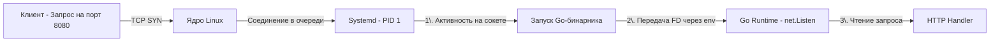

Когда вы разрабатываете бэкенд на PHP, Python или Node.js, вы почти всегда используете промежуточный менеджер процессов (php-fpm, Gunicorn, PM2), который следит за воркерами, перезапускает их при падении и управляет логами. В экосистеме Go всё иначе. Ваш скомпилированный бинарник — это уже самодостаточный процесс, который сам себе воркер и сам себе веб-сервер.

Но кто будет следить за самим бинарником? Кто запустит его при старте сервера? Кто перезапустит его при панике (panic) или Segfault? Кто аккуратно отправит ему `SIGTERM` при обновлении? В современном Linux ответ один — **Systemd**.

## От демонизации к Systemd

В старые добрые времена Unix процесс должен был "демонизировать" себя (double-fork magic): отсоединиться от терминала, стать лидером сессии, закрыть стандартные дескрипторы и записать PID в `/var/run/app.pid`. 

В Go попытка реализовать классическую демонизацию — это антипаттерн. Во-первых, это сложно из-за работы с потоками ОС (M) и горутинами. Во-вторых, это противоречит философии современных систем: **процесс не должен управлять собственным жизненным циклом**.

Systemd (работающий как PID 1) берет всю рутину на себя. Ваш Go-бинарник должен работать как простая программа на переднем плане (foreground), а Systemd обеспечит:
1. Запуск в нужном порядке (после поднятия сети и БД).
2. Перенаправление stdout/stderr в логическую систему (journald).
3. Изоляцию через Cgroups и Namespaces.
4. Управление жизненным циклом через сигналы.

## Анатомия Unit-файла

Конфигурация Systemd для сервиса описывается в `.service` файлах. Для Go-бэкенда идеальный production-ready unit-файл выглядит так:

```ini
[Unit]
Description=My Awesome Go Backend
After=network-online.target postgresql.service
Wants=network-online.target

[Service]
# Тип notify означает, что приложение само скажет Systemd, когда будет готово
Type=notify
NotificationSocket=/run/myapp-notify.sock

# Исполняемый файл
ExecStart=/usr/local/bin/myapp --config /etc/myapp/config.yaml

# Перезапуск только если процесс упал с ошибкой (не 0) или по сигналу (кроме SIGTERM/SIGINT)
Restart=on-failure
RestartSec=5s

# Graceful Shutdown: отправляем SIGTERM, ждем 30 секунд, затем убиваем SIGKILL
KillMode=mixed
KillSignal=SIGTERM
TimeoutStopSec=30

# Лимиты (Mechanical Sympathy)
LimitNOFILE=65536
# Интеграция с Cgroups (важно для Go 1.19+)
MemoryMax=512M

# Безопасность (Hardening)
User=myapp-user
Group=myapp-group
NoNewPrivileges=true
ProtectSystem=strict
PrivateTmp=true

[Install]
WantedBy=multi-user.target
```

> [!warning] Ловушка / Gotcha
> Директива `Restart=always` может быть опасна. Если ваше приложение падает по `SIGTERM` (например, вы сами делаете `systemctl stop`), Systemd не перезапустит его. Но если приложение завершается с `os.Exit(0)` из-за фатальной ошибки в логике (которую вы считаете "нормальным" выходом), Systemd радостно поднимет его снова. Используйте `Restart=on-failure`, чтобы перезапуск шел только при ненулевом коде возврата или сигналах вроде `SIGSEGV`.

## Type=notify: Идеальный Graceful Startup

Самый частый тип сервиса — `Type=simple`. Systemd считает процесс запущенным сразу после вызова `fork()` и `exec()`. Но что, если вашему Go-бэкенду нужно 5 секунд на прогрев кэшей и установку соединений с БД, прежде чем он сможет принимать трафик? При `Type=simple` балансировщик начнет слать запросы еще не готовому приложению.

Решение — `Type=notify`. В этом режиме Systemd ждет, что процесс сам отправит ему уведомление "Я готов".

В Go для этого существует официальная библиотека от создателей Systemd (RedHat):

```go
package main

import (
	"log"
	"net/http"
	"time"

	"github.com/coreos/go-systemd/v22/daemon"
)

func main() {
	mux := http.NewServeMux()
	mux.HandleFunc("/", func(w http.ResponseWriter, r *http.Request) {
		w.Write([]byte("Hello, Systemd!"))
	})

	srv := &http.Server{Addr: ":8080", Handler: mux}

	// Имитация долгой инициализации (прогрев кэша, миграции)
	log.Println("Warming up cache...")
	time.Sleep(3 * time.Second)

	go func() {
		if err := srv.ListenAndServe(); err != nil && err != http.ErrServerClosed {
			log.Fatalf("Server failed: %v", err)
		}
	}()

	// Отправляем уведомление Systemd! Теперь порт считается доступным.
	sent, err := daemon.SdNotify(false, daemon.SdNotifyReady)
	if err != nil {
		log.Printf("Failed to notify systemd: %v", err)
	}
	if sent {
		log.Println("Systemd notified: service is ready")
	}

	// ... код ожидания SIGTERM для Graceful Shutdown ...
}
```

## Systemd Socket Activation: Нулевое время простоя (Zero-downtime)

Самая мощная, но редко используемая фича Systemd — **Socket Activation**. Идея позаимствована у `inetd` из старого Unix: Systemd (PID 1) открывает сокет (например, порт 8080) *до* запуска вашего приложения.

Когда приходит первый HTTP-запрос, ядро ставит его в очередь SYN/ACCEPT на сокете, открытом Systemd. Systemd видит активность, запускает ваш Go-бинарник и передает ему файловый дескриптор этого сокета через переменную окружения (`LISTEN_PID` и `LISTEN_FDS`). Go подхватывает соединение и начинает обработку.



**Зачем это нужно бэкендеру?**
1. **Мгновенный старт**: Сокет открыт всегда. Пока ваше приложение стартует, запросы копятся в буфере ядра (TCP backlog). Клиенты получают задержку, но не ошибку `Connection Refused`.
2. **Dynamic Scaling**: Можно настроить Systemd так, чтобы он запускал несколько инстансов вашего Go-приложения при росте нагрузки на сокет (хотя в эпоху K8s это делается реже).

В Go пакет `net` умеет "из коробки" подхватывать FD от Systemd через `net.Listen()` с использованием `systemd.ListenFDs`.

## Systemd, Cgroups и GOMEMLIMIT

В предыдущей статье мы упоминали, что Docker использует Cgroups для ограничения памяти. Systemd делает то же самое. Директива `MemoryMax=512M` в unit-файле создаст Cgroup, и ядро Linux убьет ваш Go-процесс (OOM Kill), если он превысит 512 МБ.

Но есть нюанс. До версии Go 1.19 сборщик мусора (GC) не знал о лимитах Cgroups. Он видел всю память хоста и думал: "Памяти еще вагон, можно не торопиться с очисткой". В итоге процесс аллоцировал память до упора и получал SIGKILL.

> [!info] Под капотом
> Начиная с Go 1.19, рантайм научился читать лимиты Cgroups (файл `memory.max` в cgroupv2). Это значение автоматически используется для настройки `GOMEMLIMIT`. Если вы вручную прописываете `MemoryMax` в Systemd, GC Go будет стараться удержать heap в пределах этого лимита, чаще запуская циклы очистки. Это спасает от OOM Kill, но может увеличить нагрузку на CPU (о чем мы говорили в разделе профилирования). Если вы не используете Systemd/Cgroups, вы можете задать лимит вручную через переменную окружения `GOMEMLIMIT=512MiB`.

## Журналирование (Journald) и Структурированные логи

Когда вы пишете в `stdout` или `stderr` из Go-приложения под Systemd, данные перехватываются демоном `systemd-journald`. Это значит, что вам не нужно настраивать ротацию логов (logrotate) вручную — Journald сделает это сам.

Однако, текстовые логи неудобно парсить системам мониторинга (Loki, ELK). Systemd поддерживает запись структурированных логов в формате JSON, что идеально ложится на пакет `log/slog` в Go (начиная с версии 1.21).

Для записи JSON прямо в Journald с правильными полями можно использовать библиотеку `github.com/coreos/go-systemd/v22/journal`. 

> [!tip] Собеседование
> **Вопрос:** Как Graceful Shutdown в Go связан с директивами `KillMode` и `TimeoutStopSec` в Systemd?
> **Ответ:** Когда вы выполняете `systemctl restart myapp`, Systemd отправляет сигнал, указанный в `KillSignal` (по умолчанию `SIGTERM`). 
> При `KillMode=mixed` (рекомендуется): SIGTERM отправляется только главному процессу (Control Group). Если процесс не завершится за `TimeoutStopSec` (обычно 90с по умолчанию), Systemd отправит `SIGKILL` всей Cgroup. Ваш код на Go должен успеть завершить HTTP-обработчики и закрыть БД за это время. В Go `http.Server.Shutdown` как раз и нужен для того, чтобы процесс завершился до жесткого `SIGKILL` от Systemd. Если время остановки велико, вы можете увеличить `TimeoutStopSec=30s` в unit-файле.

## Итог

1. **Go не должен демонизироваться сам**. Запуск в foreground и делегирование управления Systemd — единственно верный путь на "голом" железе.
2. **Type=notify** позволяет балансировщикам узнавать, когда приложение действительно готово принимать трафик, а не просто запустило процесс.
3. **Socket Activation** обеспечивает бесшовный запуск и отсутствие ошибок `Connection Refused` при рестартах.
4. **Интеграция Cgroups и GC**: Настройка `MemoryMax` в Systemd напрямую влияет на работу Garbage Collector в Go (начиная с 1.19).
5. **Жизненный цикл**: Systemd управляет сигналами, и правильная настройка `KillMode` и `TimeoutStopSec` критична для работы Graceful Shutdown.

До сих пор мы рассматривали изолированные процессы, работающие с файлами и памятью. Но бэкенд не существует в вакууме — ему нужна сеть. В следующей статье мы спустимся на уровень ядра Linux и разберем, как устроены сокеты, интерфейсы и системные вызовы сетевого стека: [[6. Networking в Linux]].