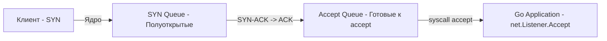
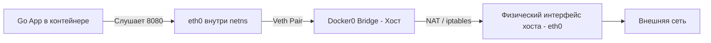

Сеть — это кровеносная система любого бэкенда. В PHP или Python разработчики часто абстрагируются от сети до уровня "я отправил HTTP-запрос", полагаясь на тяжелые рантаймы или веб-серверы (php-fpm, gunicorn). В Go сеть — это ваша прямая ответственность. Вы пишете серверы, вы управляете соединениями, и вы же будете тушить пожары, когда что-то пойдет не так.

В Linux сетевой стек — это невероятно сложная и высокопроизводительная машина внутри ядра. Понимание того, как пакет с сетевой карты попадает в вашу горутину, отличает Senior-инженера от разработчика, слепо доверяющего магии `net/http`.

## Всё есть файл: Сокеты в Linux

Вспомним философию Unix: всё есть файл. Сетевое соединение в Linux — это тоже файл, а точнее — **Сокет (Socket)**. Когда вы вызываете в Go `net.Listen("tcp", ":8080")`, рантайм выполняет системный вызов `socket()`, который возвращает обычный файловый дескриптор (FD).

Но перед тем как ваш сервер начнет принимать запросы, ядро должно проделать путь из трех системных вызовов:

1. **`socket()`**: Создает структуру данных в ядре и возвращает FD.
2. **`bind()`**: Привязывает сокет к конкретному IP-адресу и порту (например, `0.0.0.0:8080`).
3. **`listen()`**: Переводит сокет в пассивный режим (готовность принимать соединения). Именно здесь ядро выделяет две критически важные очереди:
   - **SYN Queue (полуоткрытые соединения)**: Клиент отправил SYN, сервер ответил SYN-ACK, ждет ACK от клиента.
   - **Accept Queue (полностью установленные соединения)**: Трехстороннее рукопожатие TCP завершено, соединение ждет, пока ваше приложение вызовет `accept()`.



> [!warning] Ловушка / Gotcha
> Если ваше Go-приложение не успевает вызывать `Accept()` (например, из-за долгой обработки запросов в синхронном коде), Accept Queue переполняется. Когда это происходит, ядро Linux начинает молча отбрасывать входящие SYN-пакеты (или отправлять RST, в зависимости от настройки `net.ipv4.tcp_abort_on_overflow`). Клиенты видят таймауты или ошибки соединения, хотя на сервере CPU может простаивать. Размер этой очереди задается параметром ядра `net.core.somaxconn` и аргументом `Backlog` в функции `Listen`.

## Проблема C10K и рождение Epoll

В начале 2000-х возникла проблема C10K (10 000 одновременных соединений). Классический подход "один поток ОС на одно соединение" (thread-per-connection, как в старых версиях Apache или Tomcat) рухнул. 10 000 потоков ОС — это гигабайты памяти на одни только стеки (по 1-8 МБ каждый) и катастрофическое время на Context Switching.

Решением стал переход от блокирующего IO к неблокирующему с использованием системных вызовов мультиплексирования: `select`, `poll`, а затем **`epoll`** (в Linux) и `kqueue` (во FreeBSD/macOS).

### Как работает Epoll

Вместо того чтобы опрашивать каждый сокет (готов ли он к чтению?), приложение регистрирует все сокеты в специальной структуре ядра через `epoll`. Когда на сетевой карте появляется данные, ядро само знает, какому сокету они принадлежат, и кладет готовый сокет в очередь событий. Приложение вызывает `epoll_wait()`, чтобы разом получить список готовых к обработке сокетов.

## Go Netpoller: Элегантная абстракция

Go пошел дальше, скрыв сложность `epoll` внутри рантайма. В Go используется **Netpoller** — подсистема рантайма, которая интегрирует неблокирующий сетевой IO с планировщиком горутин (G-M-P).

Когда вы пишете:

```go
conn, err := listener.Accept() // Выглядит как блокирующий вызов
buf := make([]byte, 1024)
n, err := conn.Read(buf)       // Тоже выглядит блокирующим
```

Под капотом не происходит блокировки потока ОС (M). Рантайм Go переводит FD сокета в неблокирующий режим (флаг `O_NONBLOCK`). 

Что происходит при вызове `Read`:
1. Горутина (G) вызывает системный вызов `read`.
2. Так как сокет неблокирующий, если данных нет, ядро возвращает ошибку `EAGAIN` ("пока нечего читать").
3. Рантайм Go перехватывает эту ошибку, регистрирует FD в `epoll` (если еще не зарегистрирован) и **паркует горутину** (`gopark`), переводя её в состояние `waiting`.
4. Поток ОС (M) освобождается и берет из очереди другую горутину для выполнения.
5. Когда приходят данные от сети, срабатывает `epoll`, рантайм находит припаркованную горутину и пробуждает её (`goready`), помещая в очередь выполнения.

> [!info] Под капотом
> Netpoller в Go работает в фоновом режиме. Рантайм выделяет специальные системные потоки (M), которые периодически вызывают `epoll_wait`. В исходниках Go (runtime/netpoll_epoll.go) вы найдете вызов `syscall.EpollWait`. Важно, что Netpoller не только обрабатывает чтение/запись, но и используется для таймеров ( `time.Sleep` ) и операций с каналами (channels), которые под капотом используют те же механизмы уведомлений.

## Сетевые пространства имен (Network Namespaces)

Раздел "Инфраструктура" невозможен без понимания того, как изолируется сеть в Docker. Ключевой примитив — **Network Namespace (netns)**.

Когда запускается контейнер, ядро создает новый netns. В этом пространстве:
- Свой набор сетевых интерфейсов (включая `lo` - loopback).
- Своя таблица маршрутизации.
- Своя таблица NAT и правил iptables.
- Свой набор портов (вы можете запустить 10 контейнеров, и в каждом будет слушать порт 8080, потому что для хоста они изолированы).

Чтобы контейнер мог выйти в интернет, создается **Virtual Ethernet Pair (veth pair)** — это как виртуальный патч-корд. Один конец (veth0) опускается в netns контейнера, другой (veth1) подключается к виртуальному мосту (docker0 bridge) на хосте.



> [!tip] Собеседование
> **Вопрос:** Вы запускаете Go-сервер в Docker. В Dockerfile указано `EXPOSE 8080`. При запуске контейнера снаружи (с хоста) подключиться на `localhost:8080` не получается. Почему?
> **Ответ:** Директива `EXPOSE` в Dockerfile — это исключительно документация. Она не пробрасывает порты и не настраивает iptables. Чтобы пробросить порт из netns контейнера в пространство хоста, нужно запустить контейнер с флагом `-p 8080:8080`. Только тогда Docker создаст правило DNAT в iptables хоста, перенаправляющее трафик с порта 8080 хоста на внутренний IP контейнера.

## Проблема TIME_WAIT и SO_REUSEADDR

При интенсивной нагрузке (особенно если ваше Go-приложение выступает в роли клиента, делающего много исходящих HTTP-запросов, или постоянно перезапускается) вы столкнетесь с состоянием TCP `TIME_WAIT`.

Когда соединение закрывается, сторона, инициировавшая закрытие (отправившая первый FIN), должна перейти в `TIME_WAIT` и находиться в нем 2 * MSL (Maximum Segment Lifetime, обычно около 60 секунд). Это нужно, чтобы запоздавшие пакеты старого соединения не попали в новое.

Проблема: в `TIME_WAIT` локальный IP и порт остаются занятыми. Если вы попытаетесь перезапустить сервер и забиндиться на тот же порт, получите ошибку `bind: address already in use`.

> [!warning] Ловушка / Gotcha
> В Linux по умолчанию порты в `TIME_WAIT` нельзя переиспользовать. Наивное решение — уменьшить `net.ipv4.tcp_fin_timeout`, но это нарушает TCP-спецификацию. Правильное решение — опция сокета `SO_REUSEADDR`.
> В Go стандартная библиотека `net` автоматически устанавливает флаг `SO_REUSEADDR` при создании серверных сокетов (начиная с определенных версий и ОС), что позволяет биндиться на порт, даже если есть соединения в `TIME_WAIT`. Для клиентских соединений (исходящих) в Linux также полезно включать `net.ipv4.tcp_tw_reuse = 1`, что позволяет использовать порты из `TIME_WAIT` для новых исходящих соединений (если это безопасно в вашей сети).

## Итог

1. **Сокеты — это файлы**. Жизненный цикл сетевого сервиса начинается с `socket`, `bind`, `listen`, а размер `Accept Queue` (backlog) критически важен при высоких нагрузках.
2. **Epoll** — это механизм, решивший проблему C10K, позволив одному потоку следить за тысячами сокетов.
3. **Go Netpoller** интегрирует `epoll` в планировщик. Блокирующие вызовы `Read`/`Write` в горутинах не блокируют потоки ОС, а парковят горутины до появления данных.
4. **Network Namespaces** и **Veth pairs** — фундамент изоляции сети в Docker, позволяющий контейнерам иметь свои IP и порты.
5. **TIME_WAIT** — защитный механизм TCP. При частых рестартах или海量 исходящих соединениях настраивайте `SO_REUSEADDR` и `tcp_tw_reuse`.

Linux предоставляет инфраструктуру для запуска приложений, но в мире микросервисов голого Linux недостаточно. Вам нужен инструмент, который примет трафик из интернета, распределит его между подами и снимет с ваших Go-сервисов нагрузку по TLS. В следующем разделе мы переходим к главному шлюзу бэкенда и разберем его архитектуру: [[1. nginx. Архитектура]].