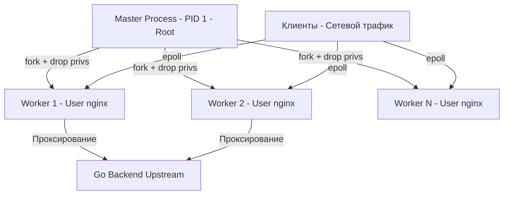

Когда мы говорим о высоконагруженном бэкенде, Nginx — это первая линия обороны. Это шлюз, который принимает на себя удар десятков тысяч TCP-соединений, термит TLS, раздает статику и только потом аккуратно прокидывает запросы к вашим Go-сервисам. 

Многие разработчики воспринимают Nginx как "чёрный ящик", который просто работает. Но для Senior/Lead инженера понимание архитектуры Nginx критически важно. Только так можно объяснить латентность, правильно настроить балансировку и избежать странных багов с обрывами соединений при пиковых нагрузках.

## От Apache к Nginx: Проблема C10K

В 90-х и начале 2000-х доминировал веб-сервер Apache. Его архитектура строилась на модели **Process/Thread-per-Connection** (один процесс или тред ОС на каждое клиентское соединение). Пока клиент медленно читал ответ по медленному 3G-каналу, целый тред ОС висел в заблокированном состоянии, ожидая завершения записи в сокет.

Когда количество одновременных соединений перевалило за 10 000 (проблема C10K), Apache начал задыхаться. 10 000 потоков ОС — это десятки гигабайт памяти только на стеки и катастрофическое время на Context Switching. 

Nginx (созданный Игорем Сысоевым) предложил революционный для того времени подход: **Event-Driven Architecture (Событийная архитектура)**.

## Процессная модель: Master и Workers

Nginx не запускает тысячи потоков. Он использует строго детерминированную мультипроцессную модель.

1. **Master Process**: Запускается от `root` (чтобы иметь возможность забиндиться на порты 80 и 443). Его главная задача — чтение конфига, управление воркерами, bind сокетов и graceful reload.
2. **Worker Processes**: Форкаются от Master. Master передает им слушающие сокеты (через `fork()` или `exec`), а затем дропает привилегии до непривилегированного пользователя (например, `nginx` или `www-data`). Воркеры делают всю тяжелую работу.



> [!info] Под капотом
> Количество воркеров обычно задается равным количеству логических ядер CPU (`worker_processes auto;`). Поскольку каждый воркер — это однопоточный процесс (Single-threaded), привязка воркера к ядру CPU (CPU Affinity) минимизирует промахи кэша L1/L2 и исключает конкуренцию за мьютексы между потоками. В Nginx почти нет блокировок (mutexes) между воркерами, так как они не шарят память в стиле(thread-local storage), за исключением подсчета общей статистики и кэша (который шарится через shared memory zones, требуя атомарных операций).

## Событийный цикл (Event Loop) и Epoll

Каждый Worker работает в бесконечном событийном цикле (Event Loop). Вспомним предыдущую статью про [[6. Networking в Linux]]: Nginx использует системный вызов `epoll` (на Linux) или `kqueue` (на FreeBSD/macOS).

Вместо того чтобы блокироваться на чтении конкретного сокета, воркер регистрирует тысячи сокетов в `epoll`. Когда ядро сигнализирует, что в каком-то сокете появились данные (клиент прислал HTTP-запрос), `epoll_wait` возвращает управление Nginx.

### Конечный автомат (State Machine)

Как Nginx обрабатывает запрос без блокировок? Он разбивает обработку на мелкие неблокирующие шаги и реализует **конечный автомат (State Machine)**:

1. **Чтение заголовков**: `epoll` сказал, что есть данные. Nginx читает заголовки. Если заголовки пришли не полностью (клиент медленный), Nginx сохраняет текущее состояние соединения и переходит к другим сокетам.
2. **Маршрутизация**: Заголовки прочитаны. Nginx определяет location, проверяет лимиты (rate limit).
3. **Чтение тела (если есть)**: Опять через неблокирующее чтение по частям.
4. **Обращение к Upstream (проксирование в Go)**: Nginx устанавливает соединение с вашим Go-бэкендом. Если бэкенд не отвечает мгновенно, Nginx *не ждет*. Он регистрирует сокет бэкенда в `epoll` и переключается на обслуживание других клиентов.
5. **Запись ответа клиенту**: Когда Go-бэкенд ответил, Nginx начинает писать ответ в сокет клиента. Если буфер сокета переполнен (клиент не читает), Nginx приостанавливает запись и снова идет в `epoll`.

> [!tip] Собеседование
> **Вопрос:** Что произойдет, если медленный клиент (на Dial-up) скачивает большой файл с сервера через Nginx, а Go-бэкенд сгенерировал этот файл мгновенно?
> **Ответ:** Если Nginx попытается записать весь ответ в сокет клиента, буфер записи сокета переполнится. Чтобы не блокировать Event Loop (что остановило бы обслуживание всех остальных клиентов этого воркера), Nginx включит механизм **Disk I/O** или запишет данные во временный файл на диске, либо заблокирует чтение из сокета бэкенда (Backpressure), уведомив Go-приложение через механизм TCP Window (уменьшив окно приема), чтобы Go перестал слать данные. Это защищает память Nginx от исчерпания.

## Mechanical Sympathy: Sendfile и Zero-Copy

Одна из причин феноменальной скорости Nginx при раздаче статики — использование системного вызова `sendfile()`.

При классическом чтении файла и отправке в сокет данные копируются 4 раза и происходит 2 переключения контекста:
1. Диск -> Буфер ядра (Page Cache)
2. Буфер ядра -> Буфер User Space (приложение читает `read()`)
3. User Space -> Буфер сокета ядра (приложение пишет `write()`)
4. Буфер сокета -> Сетевая карта NIC

`sendfile()` позволяет передать данные напрямую из Page Cache в буфер сокета, **минуя User Space**. Данные не копируются в память приложения Nginx вообще.

```go
// В nginx.conf
location /static/ {
    sendfile on;       // Включает zero-copy
    tcp_nopush on;     // Отправляет заголовки и начало файла в одном пакете
    tcp_nodelay on;    // Отключает алгоритм Нагла для минимальной задержки динамического контента
}
```

> [!warning] Ловушка / Gotcha
> `sendfile` работает только для передачи статических файлов (с диска в сокет). Если вы проксируете запрос на Go-бэкенд (upstream), `sendfile` бесполезен, так как данные генерируются динамически и всё равно должны пройти через User Space Nginx. Более того, `sendfile` несовместим с некоторыми фильтрами Nginx (например, `gzip` на лету в старых версиях), так как фильтрам нужны данные в User Space.

## Nginx vs. Go: Зачем Nginx перед Go?

Частый вопрос на архитектурных собеседованиях: "Зачем нам Nginx, если в Go отличный встроенный веб-сервер `net/http`?" 

Go действительно может слушать порты и обслуживать HTTP/2. Но Nginx впереди по нескольким системным причинам:

1. **Изоляция сбоев (Blast Radius)**: Nginx работает в отдельном процессе. Если в вашем Go-коде произойдет утечка памяти (OOM) или паника, Nginx продолжит работать. Он сможет вернуть клиенту заглушку 502 Bad Gateway, вместо того чтобы клиент получил "Connection Refused" на уровне TCP.
2. **TLS Termination**: Расшифровка TLS (RSA/ECDHE) — тяжелая математика. Nginx умеет оффлаодить это на аппаратные инструкции CPU и кэшировать сессии, снимая эту нагрузку с Go-рантайма.
3. **Снижение давления на Go GC**: Если клиенты медленные, Nginx со своими буферами и временными файлами возьмет на себя удар, сбросив данные на диск. Если бы Go общался с медленными клиентами напрямую, буферы в куче (heap) разрослись бы, заставив Garbage Collector работать на износ.
4. **Безопасность и ограничители**: Nginx на уровне C работает быстрее для rate-limiting, отбрасывания плохих пакетов и защиты от DDoS, чем промежуточный слой в Go.

## Итог

1. **Event-Driven**: Nginx решает проблему C10K с помощью событийной модели на основе `epoll`, обрабатывая тысячи соединений в одном потоке (Worker).
2. **Конечный автомат**: Обработка запроса разбита на неблокирующие шаги; медленные клиенты не останавливают работу воркера.
3. **Zero-Copy (`sendfile`)**: Статика отдается напрямую из кэша ядра в сетевой стек, минуя память процесса.
4. **Защита бэкенда**: Nginx работает как щит, изолируя Go-приложения от медленных клиентов, DDoS-атак и тяжелых криптографических операций (TLS).

Архитектура Nginx делает его идеальным кандидатом на роль Reverse Proxy. В следующей статье мы разберем, как именно Nginx проксирует трафик к вашим Go-сервисам, что такое `proxy_pass` и как избежать классических проблем с заголовками: [[2. Reverse proxy]].
Когда мы говорим о высоконагруженном бэкенде, Nginx — это первая линия обороны. Это шлюз, который принимает на себя удар десятков тысяч TCP-соединений, термит TLS, раздает статику и только потом аккуратно прокидывает запросы к вашим Go-сервисам. 

Многие разработчики воспринимают Nginx как "чёрный ящик", который просто работает. Но для Senior/Lead инженера понимание архитектуры Nginx критически важно. Только так можно объяснить латентность, правильно настроить балансировку и избежать странных багов с обрывами соединений при пиковых нагрузках.

## От Apache к Nginx: Проблема C10K

В 90-х и начале 2000-х доминировал веб-сервер Apache. Его архитектура строилась на модели **Process/Thread-per-Connection** (один процесс или тред ОС на каждое клиентское соединение). Пока клиент медленно читал ответ по медленному 3G-каналу, целый тред ОС висел в заблокированном состоянии, ожидая завершения записи в сокет.

Когда количество одновременных соединений перевалило за 10 000 (проблема C10K), Apache начал задыхаться. 10 000 потоков ОС — это десятки гигабайт памяти только на стеки и катастрофическое время на Context Switching. 

Nginx (созданный Игорем Сысоевым) предложил революционный для того времени подход: **Event-Driven Architecture (Событийная архитектура)**.

## Процессная модель: Master и Workers

Nginx не запускает тысячи потоков. Он использует строго детерминированную мультипроцессную модель.

1. **Master Process**: Запускается от `root` (чтобы иметь возможность забиндиться на порты 80 и 443). Его главная задача — чтение конфига, управление воркерами, bind сокетов и graceful reload.
2. **Worker Processes**: Форкаются от Master. Master передает им слушающие сокеты (через `fork()` или `exec`), а затем дропает привилегии до непривилегированного пользователя (например, `nginx` или `www-data`). Воркеры делают всю тяжелую работу.


> [!info] Под капотом
> Количество воркеров обычно задается равным количеству логических ядер CPU (`worker_processes auto;`). Поскольку каждый воркер — это однопоточный процесс (Single-threaded), привязка воркера к ядру CPU (CPU Affinity) минимизирует промахи кэша L1/L2 и исключает конкуренцию за мьютексы между потоками. В Nginx почти нет блокировок (mutexes) между воркерами, так как они не шарят память в стиле(thread-local storage), за исключением подсчета общей статистики и кэша (который шарится через shared memory zones, требуя атомарных операций).

## Событийный цикл (Event Loop) и Epoll

Каждый Worker работает в бесконечном событийном цикле (Event Loop). Вспомним предыдущую статью про [[6. Networking в Linux]]: Nginx использует системный вызов `epoll` (на Linux) или `kqueue` (на FreeBSD/macOS).

Вместо того чтобы блокироваться на чтении конкретного сокета, воркер регистрирует тысячи сокетов в `epoll`. Когда ядро сигнализирует, что в каком-то сокете появились данные (клиент прислал HTTP-запрос), `epoll_wait` возвращает управление Nginx.

### Конечный автомат (State Machine)

Как Nginx обрабатывает запрос без блокировок? Он разбивает обработку на мелкие неблокирующие шаги и реализует **конечный автомат (State Machine)**:

1. **Чтение заголовков**: `epoll` сказал, что есть данные. Nginx читает заголовки. Если заголовки пришли не полностью (клиент медленный), Nginx сохраняет текущее состояние соединения и переходит к другим сокетам.
2. **Маршрутизация**: Заголовки прочитаны. Nginx определяет location, проверяет лимиты (rate limit).
3. **Чтение тела (если есть)**: Опять через неблокирующее чтение по частям.
4. **Обращение к Upstream (проксирование в Go)**: Nginx устанавливает соединение с вашим Go-бэкендом. Если бэкенд не отвечает мгновенно, Nginx *не ждет*. Он регистрирует сокет бэкенда в `epoll` и переключается на обслуживание других клиентов.
5. **Запись ответа клиенту**: Когда Go-бэкенд ответил, Nginx начинает писать ответ в сокет клиента. Если буфер сокета переполнен (клиент не читает), Nginx приостанавливает запись и снова идет в `epoll`.

> [!tip] Собеседование
> **Вопрос:** Что произойдет, если медленный клиент (на Dial-up) скачивает большой файл с сервера через Nginx, а Go-бэкенд сгенерировал этот файл мгновенно?
> **Ответ:** Если Nginx попытается записать весь ответ в сокет клиента, буфер записи сокета переполнится. Чтобы не блокировать Event Loop (что остановило бы обслуживание всех остальных клиентов этого воркера), Nginx включит механизм **Disk I/O** или запишет данные во временный файл на диске, либо заблокирует чтение из сокета бэкенда (Backpressure), уведомив Go-приложение через механизм TCP Window (уменьшив окно приема), чтобы Go перестал слать данные. Это защищает память Nginx от исчерпания.

## Mechanical Sympathy: Sendfile и Zero-Copy

Одна из причин феноменальной скорости Nginx при раздаче статики — использование системного вызова `sendfile()`.

При классическом чтении файла и отправке в сокет данные копируются 4 раза и происходит 2 переключения контекста:
1. Диск -> Буфер ядра (Page Cache)
2. Буфер ядра -> Буфер User Space (приложение читает `read()`)
3. User Space -> Буфер сокета ядра (приложение пишет `write()`)
4. Буфер сокета -> Сетевая карта NIC

`sendfile()` позволяет передать данные напрямую из Page Cache в буфер сокета, **минуя User Space**. Данные не копируются в память приложения Nginx вообще.

```go
// В nginx.conf
location /static/ {
    sendfile on;       // Включает zero-copy
    tcp_nopush on;     // Отправляет заголовки и начало файла в одном пакете
    tcp_nodelay on;    // Отключает алгоритм Нагла для минимальной задержки динамического контента
}
```

> [!warning] Ловушка / Gotcha
> `sendfile` работает только для передачи статических файлов (с диска в сокет). Если вы проксируете запрос на Go-бэкенд (upstream), `sendfile` бесполезен, так как данные генерируются динамически и всё равно должны пройти через User Space Nginx. Более того, `sendfile` несовместим с некоторыми фильтрами Nginx (например, `gzip` на лету в старых версиях), так как фильтрам нужны данные в User Space.

## Nginx vs. Go: Зачем Nginx перед Go?

Частый вопрос на архитектурных собеседованиях: "Зачем нам Nginx, если в Go отличный встроенный веб-сервер `net/http`?" 

Go действительно может слушать порты и обслуживать HTTP/2. Но Nginx впереди по нескольким системным причинам:

1. **Изоляция сбоев (Blast Radius)**: Nginx работает в отдельном процессе. Если в вашем Go-коде произойдет утечка памяти (OOM) или паника, Nginx продолжит работать. Он сможет вернуть клиенту заглушку 502 Bad Gateway, вместо того чтобы клиент получил "Connection Refused" на уровне TCP.
2. **TLS Termination**: Расшифровка TLS (RSA/ECDHE) — тяжелая математика. Nginx умеет оффлаодить это на аппаратные инструкции CPU и кэшировать сессии, снимая эту нагрузку с Go-рантайма.
3. **Снижение давления на Go GC**: Если клиенты медленные, Nginx со своими буферами и временными файлами возьмет на себя удар, сбросив данные на диск. Если бы Go общался с медленными клиентами напрямую, буферы в куче (heap) разрослись бы, заставив Garbage Collector работать на износ.
4. **Безопасность и ограничители**: Nginx на уровне C работает быстрее для rate-limiting, отбрасывания плохих пакетов и защиты от DDoS, чем промежуточный слой в Go.

## Итог

1. **Event-Driven**: Nginx решает проблему C10K с помощью событийной модели на основе `epoll`, обрабатывая тысячи соединений в одном потоке (Worker).
2. **Конечный автомат**: Обработка запроса разбита на неблокирующие шаги; медленные клиенты не останавливают работу воркера.
3. **Zero-Copy (`sendfile`)**: Статика отдается напрямую из кэша ядра в сетевой стек, минуя память процесса.
4. **Защита бэкенда**: Nginx работает как щит, изолируя Go-приложения от медленных клиентов, DDoS-атак и тяжелых криптографических операций (TLS).

Архитектура Nginx делает его идеальным кандидатом на роль Reverse Proxy. В следующей статье мы разберем, как именно Nginx проксирует трафик к вашим Go-сервисам, что такое `proxy_pass` и как избежать классических проблем с заголовками: [[2. Reverse proxy]].