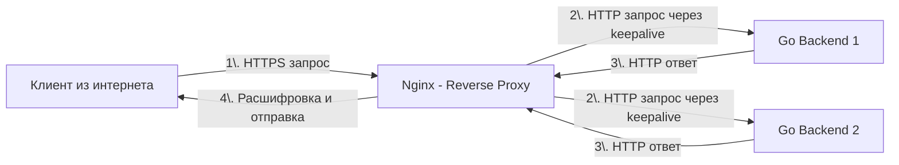

Архитектура современного бэкенда немыслима без Reverse Proxy (обратного прокси). Если вы развернете ваш Go-сервис напрямую в интернет, он неизбежно столкнется с проблемами безопасности, медленными клиентами и сложностью маршрутизации. Nginx в роли Reverse Proxy — это не просто транслятор запросов, это мощный щит и координатор.

В отличие от Forward Proxy (прямого прокси, который выталкивает запросы пользователей в интернет, скрывая их IP), Reverse Proxy стоит *перед* серверами приложений, принимая входящий трафик из интернета и пробрасывая его внутрь инфраструктуры.

## Как работает `proxy_pass` под капотом

Когда вы указываете в конфиге Nginx директиву `proxy_pass http://go_backend:8080`, происходит следующее:

1. **Прием соединения**: Nginx принимает TCP-соединение от клиента, читает HTTP-заголовки и тело запроса (если позволяет буфер).
2. **Пул соединений (Upstream Keepalive)**: Вместо того чтобы при каждом запросе делать системный вызов `connect()` к Go-бэкенду, Nginx поддерживает пул уже установленных TCP-соединений (keepalive). Он берет соединение из пула, или создает новое, если пул пуст.
3. **Запись в сокет**: Nginx записывает HTTP-запрос в сокет, связанный с Go-приложением.
4. **Чтение ответа**: Nginx читает ответ от Go. Если ответ большой, Nginx может временно сохранить его на диск (в папку `proxy_temp_path`), чтобы не забить оперативную память.
5. **Отдача клиенту**: Nginx отправляет ответ медленному клиенту в том темпе, который клиент способен переварить.



## Проблема заголовков: Кто звонит?

Главная ловушка Reverse Proxy для Go-разработчика — это потеря информации об оригинальном клиенте.

Когда Nginx проксирует запрос на Go, он устанавливает *свое* TCP-соединение с вашим сервером. В результате, если вы вызовете `r.RemoteAddr` в Go, вы получите IP-адрес Nginx (например, `172.16.0.1`), а не реальный IP пользователя.

Чтобы решить эту проблему, Nginx должен добавить специальные заголовки, а Go-приложение должно уметь их читать.

**Минимальный конфиг Nginx для проксирования:**

```nginx
location /api/ {
    proxy_pass http://go_backend:8080;
    
    # Передаем оригинальный Host
    proxy_set_header Host $host;
    
    # Передаем реальный IP клиента
    proxy_set_header X-Real-IP $remote_addr;
    
    # Передаем цепочку прокси-серверов
    proxy_set_header X-Forwarded-For $proxy_add_x_forwarded_for;
    
    # Указываем, что оригинальный запрос был по HTTPS
    proxy_set_header X-Forwarded-Proto $scheme;
}
```

### X-Forwarded-For и спуфинг

Заголовок `X-Forwarded-For` (XFF) имеет формат: `client_ip, proxy1_ip, proxy2_ip`. 
Проблема в том, что злоумышленник может подделать этот заголовок, отправив `X-Forwarded-For: 1.1.1.1` со своим запросом. Nginx с директивой `proxy_add_x_forwarded_for` просто добавит реальный IP в конец: `1.1.1.1, attacker_real_ip`. Если ваше Go-приложение доверяет *первому* IP из этого списка, вы подвергаетесь атаке IP Spoofing.

> [!warning] Ловушка / Gotcha
> Никогда не парсьте `X-Forwarded-For` вручную в Go, чтобы получить IP клиента, если вы не уверены в инфраструктуре перед Nginx. Если балансировщик нагрузки (например, AWS ALB) стоит перед Nginx, цепочка будет расти. 
> Безопасный подход в Nginx — использовать модуль `realip`. Он заставляет Nginx переписывать `$remote_addr` на основе доверенных прокси, а в Go вы просто читаете `X-Real-IP` или используете надежные библиотеки-экстракторы IP.

### Извлечение реального IP в Go (Idiomatic way)

В стандартной библиотеке Go нет встроенного парсера XFF с учетом доверенных подсетей. Использование популярных пакетов вроде `github.com/oapi-codegen/runtime` или написание собственного мидлваря с валидацией — стандартная практика. Базовый вариант выглядит так:

```go
func RealIPMiddleware(next http.Handler) http.Handler {
	return http.HandlerFunc(func(w http.ResponseWriter, r *http.Request) {
		// Сначала проверяем X-Real-IP, который ставит наш Nginx
		if ip := r.Header.Get("X-Real-IP"); ip != "" {
			r.RemoteAddr = ip
		} else if ip := r.Header.Get("X-Forwarded-For"); ip != "" {
			// В реальном проде нужно брать последний доверенный IP, 
			// а не первый! Это упрощенный пример.
			ips := strings.Split(ip, ",")
			r.RemoteAddr = strings.TrimSpace(ips[0])
		}
		next.ServeHTTP(w, r)
	})
}
```

## Буферизация: Защита Go от медленных клиентов

Одна из важнейших функций Nginx как Reverse Proxy — **буферизация ответов (Response Buffering)**. По умолчанию она включена (`proxy_buffering on`).

Представьте, что ваш Go-сервис генерирует JSON-ответ на 2 МБ за 5 миллисекунд. А клиент, запрашивающий данные, сидит в метро на плохом 3G-соединении и способен принять эти данные только за 10 секунд.

Если клиент подключен к Go напрямую:
1. Go пишет ответ в сокет.
2. Буфер отправки сокета быстро переполняется.
3. Системный вызов `write` в Go блокирует горутину, либо данные копятся в памяти рантайма.
4. Go-рантайм держит горутину и выделенную под ответ память "живыми" в течение 10 секунд. Это резко раздувает Heap и заставляет GC работать интенсивнее.

С Nginx:
1. Go мгновенно отдает 2 МБ Nginx (в локальной сети между ними гигабитный канал).
2. Go закрывает соединение (или возвращает его в пул) и освобождает память.
3. Nginx сохраняет ответ в свои внутренние буферы (в оперативной памяти, а если ответ большой — на диск).
4. Nginx медленно "вываливает" данные клиенту со скоростью его соединения.

> [!info] Под капотом
> Для стримминга больших файлов или Server-Sent Events (SSE) буферизация Nginx — это смерть. Если Nginx забуферизует ответ, клиент получит данные только когда файл скачается целиком, а SSE перестанет работать в реальном времени. Для таких маршрутов нужно явно выключать буферизацию: `proxy_buffering off;` или использовать `proxy_no_cache 1;`.

## WebSockets и HTTP Upgrade

Веб-сокеты работают поверх HTTP с помощью механизма `Upgrade`. Клиент отправляет HTTP-запрос с заголовками `Connection: Upgrade` и `Upgrade: websocket`.

По умолчанию Nginx игнорирует или удаляет заголовок `Connection`, так как HTTP/1.1 требует закрыть соединение после ответа. Чтобы проксировать WebSockets, нужно научить Nginx понимать апгрейд:

```nginx
location /ws/ {
    proxy_pass http://go_backend:8080;
    proxy_http_version 1.1; # WebSockets требуют HTTP 1.1
    
    # Переписываем заголовки для Upgrade
    proxy_set_header Upgrade $http_upgrade;
    proxy_set_header Connection "upgrade";
    
    # Важно! Таймауты для долгих WS-соединений
    proxy_read_timeout 86400s; # 24 часа, иначе Nginx закроет WS через 60 секунд
}
```

> [!tip] Собеседование
> **Вопрос:** Ваше Go-приложение работает за Nginx. Вы используете `r.URL.IsAbs()` или формируете URL для редиректа, но получаете `http://` вместо `https://`. Почему?
> **Ответ:** Nginx терминирует TLS. Связь между Nginx и Go происходит по обычному HTTP. Go видит схему `http`. Чтобы Go понимал, что оригинальный запрос был по HTTPS, Nginx должен отправлять заголовок `X-Forwarded-Proto: https`. В Go вы должны использовать мидлварь (например, из пакетов типа `gorilla/handlers` или вручную), который проверяет этот заголовок и подменяет `r.URL.Scheme` на `https` до выполнения редиректа или генерации ссылок.

## Итог

1. **Reverse Proxy** — это фасад, скрывающий внутреннюю архитектуру бэкенда от клиентов.
2. **Заголовки `X-Forwarded-*`**: Жизненно важный мост для передачи информации (IP клиента, схема, хост) от Nginx к Go. Ошибки в их обработке ведут к багам с авторизацией и редиректами.
3. **Буферизация**: Nginx берет на себя удар медленных клиентов, позволяя Go-горутинам отрабатывать быстро и освобождать память.
4. **WebSockets**: Требуют явной конфигурации `Upgrade` и увеличенных `proxy_read_timeout`.

Nginx не только проксирует запросы, но и умеет распределять их между несколькими инстансами вашего Go-приложения для отказоустойчивости и масштабирования. В следующей статье мы разберем алгоритмы и механику балансировки нагрузки: [[3. Load balancing]].