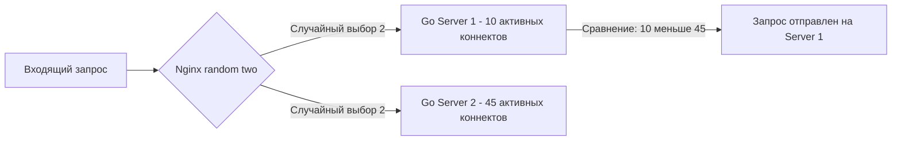

Когда ваш Go-бэкенд перестает справляться с потоком запросов на одном сервере, вы масштабируете его горизонтально — запускаете несколько инстансов (реплик). Но кто будет решать, какому именно инстансу отдать конкретный HTTP-запрос? Это задача **Load Balancer'а** (балансировщика нагрузки).

В связке Nginx + Go, Nginx выступает L7 (уровень приложений) балансировщиком. Он понимает протокол HTTP, может читать заголовки, куки и URI, принимая интеллектуальные решения о маршрутизации, чего не могут сделать балансировщики L4 (уровень TCP, например, чистый HAProxy или AWS NLB).

## Блок `upstream`: Пул бэкендов

В Nginx список серверов, между которыми распределяется трафик, описывается в директиве `upstream`. 

```nginx
upstream go_backends {
    server 10.0.1.10:8080 max_fails=3 fail_timeout=30s;
    server 10.0.1.11:8080 max_fails=3 fail_timeout=30s;
    server 10.0.1.12:8080 backup; # Вступит в работу только если упадут основные
}

server {
    listen 80;
    location / {
        proxy_pass http://go_backends;
    }
}
```

## Алгоритмы балансировки

Выбор алгоритма — это не просто "круговая очередь". От него напрямую зависит задержка (латентность) и утилизация ресурсов вашего Go-кластера.

### 1. Round Robin (По умолчанию)
Запросы раздаются инстансам по очереди: 1-й → Сервер А, 2-й → Сервер B, 3-й → Сервер C, 4-й → Сервер А.
Подходит только для идеального мира: когда все серверы одинаково мощные, а все запросы требуют одинакового количества CPU/RAM. В реальности такого не бывает.

### 2. Least Connections (`least_conn`)
Директива `least_conn` отправляет запрос на сервер, у которого сейчас меньше всего активных соединений. 

> [!tip] Собеседование
> **Вопрос:** Почему `least_conn` почти всегда лучше Round Robin для Go-бэкенда?
> **Ответ:** Время обработки HTTP-запросов варьируется в сотни раз. Запрос `GET /users` может отработать за 2мс, а `GET /reports/generate` — за 2000мс. При Round Robin оба сервера получат поровну запросов, но первый быстро освободится, а второй будет держать горутины в активном состоянии. В итоге один сервер будет простаивать, а другой — перегружен (Hot Spot). `least_conn` учитывает реальную нагрузку, отправляя новые запросы на тот инстанс Go, который быстрее справляется с работой.

### 3. IP Hash (`ip_hash`)
Алгоритм хеширует IP-адрес клиента и привязывает его к конкретному серверу (Sticky Sessions). 

> [!warning] Ловушка / Gotcha
> В эпоху монолитных PHP-приложений, где сессии хранились в файлах на диске сервера, `ip_hash` был спасением. В Go это **антипаттерн**. 
> Во-первых, если вы сидите в корпоративной сети через NAT, тысяча пользователей будет иметь один IP, что создаст колоссальный дисбаланс (Hot Spot).
> Во-вторых, Go-бэкенды должны быть **Stateless** (без состояния). Сессии должны храниться во внешнем хранилище (Redis, Memcached, БД). Если инстанс Go упадет, Nginx перехеширует IP на другой сервер, и пользователи ничего не заметят, если сессия в Redis. Используйте `ip_hash` только для кэширования статики или в крайних случаях.

### 4. Random (Power of Two Choices)
Директива `random two least_conn;` — это современный алгоритм, который использует математический феномен "Сила двух выборов" (Power of Two Choices).

> [!info] Под капотом
> Чтобы выбрать *абсолютно* наименее загруженный сервер, Nginx пришлось бы опросить все инстансы в `upstream` (O(N) операций). В высоконагруженных системах с десятками бэкендов это само по себе создает задержку.
> Алгоритм Random Two делает иначе: он выбирает **два случайных сервера**, сравнивает их загрузку и отправляет запрос на тот, который менее загружен. Математически доказано, что этот подход (O(1) операций) снижает задержку (tail latency) почти так же эффективно, как полный опрос всех серверов, но требует в разы меньше вычислительных ресурсов балансировщика.



## Health Checks: Пассивный и Активный

Если один из ваших Go-инстансов упал (например, OOM Kill), Nginx должен перестать отправлять ему трафик. В open-source версии Nginx доступны только **Пассивные проверки (Passive Health Checks)**.

Они настраиваются параметрами в `upstream`:
*   `max_fails=3`: Количество неудачных попыток соединения/чтения с бэкендом, прежде чем он считается недоступным.
*   `fail_timeout=30s`: Время, в течение которого сервер считается недоступным, прежде чем Nginx снова попробует отправить ему запрос.

**Как это работает:** Nginx не опрашивает бэкенды фоном. Он узнает о падении бэкенда только тогда, когда реальный клиент попытается зайти на сайт. Если Nginx получает ошибку от Go-сервера или таймаут, он считает это `fail`. После 3 фейлов Nginx на 30 секунд перестает пускать туда трафик. 

> [!warning] Ловушка / Gotcha
> При пассивных проверках первый пользователь, чей запрос попадет на упавший инстанс, получит ошибку 502 Bad Gateway. Чтобы этого избежать, используют директиву `proxy_next_upstream`. Она заставляет Nginx при ошибке (например, таймаут или 500 от бэкенда) автоматически повторить запрос на следующем сервере из пула. Клиент получит нормальный ответ, albeit с небольшой задержкой.

## Специфика балансировки gRPC

Если ваш Go-бэкенд общается с другими сервисами по gRPC (HTTP/2), балансировка через обычный HTTP-прокси превращается в ад. 

HTTP/2 мультиплексирует сотни RPC-вызовов внутри *одного* TCP-соединения. При обычном `proxy_pass` Nginx установит с каждым бэкендом по одному TCP-соединению, и все RPC-вызовы от миллионов клиентов полетят через эти несколько соединений. Round Robin будет балансировать *соединения*, а не *запросы*, и балансировка полностью сломается.

Для gRPC в Nginx обязательно использовать:
1. Директиву `grpc_pass` вместо `proxy_pass`.
2. Алгоритм `least_conn` или `random two`, так как они балансируют по количеству активных запросов внутри соединения.
3. `keepalive` в upstream, чтобы не пересоздавать HTTP/2 сессии.

```nginx
upstream grpc_backends {
    least_conn;
    server 10.0.1.10:4443;
    server 10.0.1.11:4443;
    keepalive 16; # Важно для HTTP/2 мультиплексирования
}

server {
    listen 443 http2;
    location / {
        grpc_pass grpc://grpc_backends;
    }
}
```

## Итог

1. **Least Connections** — алгоритм по умолчанию для Go-бэкендов, так как время обработки запросов варьируется, и он предотвращает Hot Spots.
2. **Stateless архитектура** в Go делает `ip_hash` ненужным и опасным; храните сессии в Redis.
3. **Random Two Choices** — математический трюк, который позволяет балансировать эффективно, не сканируя все серверы.
4. **Пассивные Health Checks** и `proxy_next_upstream` спасают клиентов от 502 ошибок при падении инстанса, но добавляют задержку "первого" запроса к упавшему узлу.
5. **gRPC балансировка** требует `least_conn` и понимания мультиплексирования HTTP/2, иначе трафик распределится катастрофически неравномерно.

Балансировщик работает с открытым текстом, но выпускать его в таком виде в интернет — преступление. В следующей статье мы разберем, как Nginx снимает с Go-приложений тяжелую криптографическую нагрузку: [[4. TLS termination]].
Когда ваш Go-бэкенд перестает справляться с потоком запросов на одном сервере, вы масштабируете его горизонтально — запускаете несколько инстансов (реплик). Но кто будет решать, какому именно инстансу отдать конкретный HTTP-запрос? Это задача **Load Balancer'а** (балансировщика нагрузки).

В связке Nginx + Go, Nginx выступает L7 (уровень приложений) балансировщиком. Он понимает протокол HTTP, может читать заголовки, куки и URI, принимая интеллектуальные решения о маршрутизации, чего не могут сделать балансировщики L4 (уровень TCP, например, чистый HAProxy или AWS NLB).

## Блок `upstream`: Пул бэкендов

В Nginx список серверов, между которыми распределяется трафик, описывается в директиве `upstream`. 

```nginx
upstream go_backends {
    server 10.0.1.10:8080 max_fails=3 fail_timeout=30s;
    server 10.0.1.11:8080 max_fails=3 fail_timeout=30s;
    server 10.0.1.12:8080 backup; # Вступит в работу только если упадут основные
}

server {
    listen 80;
    location / {
        proxy_pass http://go_backends;
    }
}
```

## Алгоритмы балансировки

Выбор алгоритма — это не просто "круговая очередь". От него напрямую зависит задержка (латентность) и утилизация ресурсов вашего Go-кластера.

### 1. Round Robin (По умолчанию)
Запросы раздаются инстансам по очереди: 1-й → Сервер А, 2-й → Сервер B, 3-й → Сервер C, 4-й → Сервер А.
Подходит только для идеального мира: когда все серверы одинаково мощные, а все запросы требуют одинакового количества CPU/RAM. В реальности такого не бывает.

### 2. Least Connections (`least_conn`)
Директива `least_conn` отправляет запрос на сервер, у которого сейчас меньше всего активных соединений. 

> [!tip] Собеседование
> **Вопрос:** Почему `least_conn` почти всегда лучше Round Robin для Go-бэкенда?
> **Ответ:** Время обработки HTTP-запросов варьируется в сотни раз. Запрос `GET /users` может отработать за 2мс, а `GET /reports/generate` — за 2000мс. При Round Robin оба сервера получат поровну запросов, но первый быстро освободится, а второй будет держать горутины в активном состоянии. В итоге один сервер будет простаивать, а другой — перегружен (Hot Spot). `least_conn` учитывает реальную нагрузку, отправляя новые запросы на тот инстанс Go, который быстрее справляется с работой.

### 3. IP Hash (`ip_hash`)
Алгоритм хеширует IP-адрес клиента и привязывает его к конкретному серверу (Sticky Sessions). 

> [!warning] Ловушка / Gotcha
> В эпоху монолитных PHP-приложений, где сессии хранились в файлах на диске сервера, `ip_hash` был спасением. В Go это **антипаттерн**. 
> Во-первых, если вы сидите в корпоративной сети через NAT, тысяча пользователей будет иметь один IP, что создаст колоссальный дисбаланс (Hot Spot).
> Во-вторых, Go-бэкенды должны быть **Stateless** (без состояния). Сессии должны храниться во внешнем хранилище (Redis, Memcached, БД). Если инстанс Go упадет, Nginx перехеширует IP на другой сервер, и пользователи ничего не заметят, если сессия в Redis. Используйте `ip_hash` только для кэширования статики или в крайних случаях.

### 4. Random (Power of Two Choices)
Директива `random two least_conn;` — это современный алгоритм, который использует математический феномен "Сила двух выборов" (Power of Two Choices).

> [!info] Под капотом
> Чтобы выбрать *абсолютно* наименее загруженный сервер, Nginx пришлось бы опросить все инстансы в `upstream` (O(N) операций). В высоконагруженных системах с десятками бэкендов это само по себе создает задержку.
> Алгоритм Random Two делает иначе: он выбирает **два случайных сервера**, сравнивает их загрузку и отправляет запрос на тот, который менее загружен. Математически доказано, что этот подход (O(1) операций) снижает задержку (tail latency) почти так же эффективно, как полный опрос всех серверов, но требует в разы меньше вычислительных ресурсов балансировщика.


## Health Checks: Пассивный и Активный

Если один из ваших Go-инстансов упал (например, OOM Kill), Nginx должен перестать отправлять ему трафик. В open-source версии Nginx доступны только **Пассивные проверки (Passive Health Checks)**.

Они настраиваются параметрами в `upstream`:
*   `max_fails=3`: Количество неудачных попыток соединения/чтения с бэкендом, прежде чем он считается недоступным.
*   `fail_timeout=30s`: Время, в течение которого сервер считается недоступным, прежде чем Nginx снова попробует отправить ему запрос.

**Как это работает:** Nginx не опрашивает бэкенды фоном. Он узнает о падении бэкенда только тогда, когда реальный клиент попытается зайти на сайт. Если Nginx получает ошибку от Go-сервера или таймаут, он считает это `fail`. После 3 фейлов Nginx на 30 секунд перестает пускать туда трафик. 

> [!warning] Ловушка / Gotcha
> При пассивных проверках первый пользователь, чей запрос попадет на упавший инстанс, получит ошибку 502 Bad Gateway. Чтобы этого избежать, используют директиву `proxy_next_upstream`. Она заставляет Nginx при ошибке (например, таймаут или 500 от бэкенда) автоматически повторить запрос на следующем сервере из пула. Клиент получит нормальный ответ, albeit с небольшой задержкой.

## Специфика балансировки gRPC

Если ваш Go-бэкенд общается с другими сервисами по gRPC (HTTP/2), балансировка через обычный HTTP-прокси превращается в ад. 

HTTP/2 мультиплексирует сотни RPC-вызовов внутри *одного* TCP-соединения. При обычном `proxy_pass` Nginx установит с каждым бэкендом по одному TCP-соединению, и все RPC-вызовы от миллионов клиентов полетят через эти несколько соединений. Round Robin будет балансировать *соединения*, а не *запросы*, и балансировка полностью сломается.

Для gRPC в Nginx обязательно использовать:
1. Директиву `grpc_pass` вместо `proxy_pass`.
2. Алгоритм `least_conn` или `random two`, так как они балансируют по количеству активных запросов внутри соединения.
3. `keepalive` в upstream, чтобы не пересоздавать HTTP/2 сессии.

```nginx
upstream grpc_backends {
    least_conn;
    server 10.0.1.10:4443;
    server 10.0.1.11:4443;
    keepalive 16; # Важно для HTTP/2 мультиплексирования
}

server {
    listen 443 http2;
    location / {
        grpc_pass grpc://grpc_backends;
    }
}
```

## Итог

1. **Least Connections** — алгоритм по умолчанию для Go-бэкендов, так как время обработки запросов варьируется, и он предотвращает Hot Spots.
2. **Stateless архитектура** в Go делает `ip_hash` ненужным и опасным; храните сессии в Redis.
3. **Random Two Choices** — математический трюк, который позволяет балансировать эффективно, не сканируя все серверы.
4. **Пассивные Health Checks** и `proxy_next_upstream` спасают клиентов от 502 ошибок при падении инстанса, но добавляют задержку "первого" запроса к упавшему узлу.
5. **gRPC балансировка** требует `least_conn` и понимания мультиплексирования HTTP/2, иначе трафик распределится катастрофически неравномерно.

Балансировщик работает с открытым текстом, но выпускать его в таком виде в интернет — преступление. В следующей статье мы разберем, как Nginx снимает с Go-приложений тяжелую криптографическую нагрузку: [[4. TLS termination]].