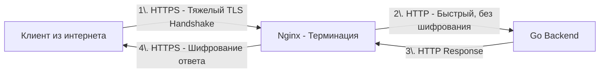

В современном вебе передача данных в открытом виде (HTTP) — это преступление. Протокол HTTPS (HTTP поверх TLS) шифрует трафик, гарантируя его конфиденциальность и целостность. Но криптография — это тяжелая математика. 

**TLS Termination (Терминирование TLS)** — это процесс расшифровки входящего HTTPS-трафика на граничном сервере (Nginx) и передача дальнейшего трафика к бэкенду уже в открытом виде (по протоколу HTTP). Nginx берет на себя всю криптографическую нагрузку, "терминируя" (завершая) защищенную сессию.

## Mechanical Sympathy: Цена рукопожатия

Чтобы понять, почему Nginx необходим перед Go-бэкендом для работы с TLS, нужно взглянуть на то, что происходит на уровне CPU при установке HTTPS-соединения.

Процесс TLS Handshake (рукопожатие), особенно при использовании алгоритмов с асимметричным шифрованием (например, RSA или ECDHE), требует выполнения операций с гигантскими простыми числами. Это занимает тысячи тактов CPU. 

Если Go-приложение будет принимать HTTPS напрямую, каждый новый клиент будет заставлять рантайм Go выполнять тяжелые математические вычисления. Но хуже всего — **медленные клиенты**. Клиент с плохим интернетом будет медленно слать пакеты рукопожатия. Если это происходит в Go, горутина, отвечающая за соединение, будет долго висеть в памяти, удерживая выделенные буферы и заставляя Garbage Collector работать с растущим Heap. 

Nginx спасает Go от этого ада:
1. **Асинхронность на C**: Nginx работает на уровне событий ОС (epoll). Он легко пережидает медленные рукопожатия, не плодя тяжелые сущности в памяти.
2. **Оптимизации ядра и OpenSSL**: Nginx (скомпилированный с OpenSSL или BoringSSL) использует аппаратные инструкции процессора (например, AES-NI для симметричного шифрования), что недоступно "из коробки" для высокоуровневого Go-кода без ручного написания ассемблера.



## Сессии TLS: Избавляемся от Handshake

Самый быстрый TLS Handshake — тот, который не произошел. Чтобы не делать тяжелые асимметричные вычисления при каждом новом соединении, в TLS существуют механизмы возобновления сессий. Nginx поддерживает их "из коробки".

### 1. Session IDs
Клиент и сервер договариваются о коротком идентификаторе сессии. При повторном соединении клиент передает этот ID, и если Nginx помнит его (в кэше shared memory), рукопожатие сокращается: сервер пропускает этап асимметричной криптографии и сразу переходит к симметричному шифрованию.

```nginx
# Выделяем 10 МБ в разделяемой памяти между воркерами для кэша сессий
ssl_session_cache shared:SSL:10m; 
ssl_session_timeout 1d;
```

### 2. Session Tickets (Stateless)
Вместо того чтобы хранить состояние сессии на сервере (что проблемно при балансировке между множеством серверов Nginx), сервер шифрует данные сессии ключом, известным только ему, и отправляет клиенту в виде "билета". При следующем соединении клиент возвращает билет, Nginx расшифровывает его своим ключом и возобновляет сессию.

> [!info] Под капотом
> Проблема Session Tickets в инфраструктуре с множеством инстансов Nginx: если ключи для шифрования билетов (ticket keys) на серверах разные, клиент, попавший после балансировки на другой Nginx-узел, не сможет возобновить сессию и пройдет полный Handshake. В Production необходимо синхронизировать `ssl_session_ticket_key` между всеми узлами Nginx (например, раздавая их через распределенный конфиг типа Consul или ротируя скриптом).

## TLS 1.3 и 0-RTT

С приходом TLS 1.3 жизнь бэкендеров стала проще. Протокол стал быстрее за счет уменьшения количества round-trip (путешествий пакета туда-обратно) при рукопожатии.

Особенно интересна фича **0-RTT (Zero Round Trip Time)**. Если клиент уже подключался к серверу ранее, он может отправить свои HTTP-данные (например, GET-запрос) *вместе* с первым пакетом рукопожатия, не дожидаясь его завершения. Nginx поддерживает 0-RTT через директиву `ssl_early_data on;`.

> [!warning] Ловушка / Gotcha
> 0-RTT уязвим для **Replay Attack (атака повтором)**. Злоумышленник может перехватить пакет 0-RTT (содержащий, например, запрос на перевод денег) и отправить его повторно на сервер. Nginx не может отличить оригинал от повтора на уровне TLS. 
> **Правило:** Никогда не разрешайте 0-RTT для мутабельных запросов (POST, PUT). Если вы включили `ssl_early_data`, ваше Go-приложение должно проверять заголовок `Early-Data: 1`, и если он присутствует, принудительно отклонять любые запросы, меняющие состояние (или обеспечивать идемпотентность на уровне БД).

## Передача контекста в Go

Когда Nginx терминирует TLS, ваш Go-бэкенд перестает понимать, что оригинальный запрос был по защищенному каналу. Если вы попытаетесь сгенерировать URL для редиректа в Go, вы получите `http://` вместо `https://`.

Nginx должен передать информацию о схеме:

```nginx
location / {
    proxy_pass http://go_backend:8080;
    proxy_set_header X-Forwarded-Proto $scheme; # Будет 'https'
    proxy_set_header X-Forwarded-Port $server_port;
    proxy_set_header Host $host;
}
```

В Go вы обязаны использовать мидлварь, которая читает эти заголовки и подменяет `r.URL.Scheme` и `r.URL.Host` до того, как запрос попадет в бизнес-логику. В популярных фреймворках (или в стандартном `net/http` через обертки) это делается автоматически, если настроить `TrustForwardHeader`.

## Mutual TLS (mTLS) и Nginx

В микросервисной архитектуре (Service Mesh) часто используется mTLS — взаимная аутентификация, где не только клиент проверяет сертификат сервера, но и сервер требует сертификат у клиента.

Если Nginx — это граничный прокси, он может проверять клиентские сертификаты:

```nginx
ssl_client_certificate /etc/ssl/ca.pem;
ssl_verify_client on; # Обязать клиента присылать сертификат
```

> [!tip] Собеседование
> **Вопрос:** Ваша архитектура требует mTLS. Если Nginx терминирует TLS и проверяет клиентский сертификат, как внутренний Go-сервис узнает, кто именно (какой клиент) к нему обратился, ведь шифрование снято?
> **Ответ:** Nginx должен передать данные из сертификата в HTTP-заголовках. Существуют стандартные заголовки (определенные RFC), такие как `X-Client-Cert-Dn` (Distinguished Name), или Nginx может передавать сертификат в формате PEM через заголовок:
> `proxy_set_header X-Client-Cert $ssl_client_escaped_cert;`
> Важно использовать `$ssl_client_escaped_cert`, а не просто `$ssl_client_cert`, чтобы не сломать HTTP-заголовки переносами строк. Go-бэкенд читает этот заголовок, парсит PEM и извлекает Subject для авторизации.

## Итог

1. **TLS Termination** снимает с Go-бэкенда тяжелую криптографическую нагрузку и проблемы с медленными клиентами, перекладывая их на C-ядро Nginx.
2. **Кэширование сессий** (Session Cache и Session Tickets) радикально снижает нагрузку на CPU Nginx, устраняя необходимость полных рукопожатий.
3. **TLS 1.3 0-RTT** — мощный ускоритель для API, но требует строгой защиты от Replay-атак на уровне Go-кода.
4. **Контекст протокола**: Всегда передавайте `X-Forwarded-Proto`, чтобы Go понимал, что он работает за HTTPS.
5. **mTLS**: Nginx может верифицировать клиентские сертификаты и передавать их данные в Go через HTTP-заголовки.

Расшифровав трафик и сбалансировав его, Nginx может сделать еще одну невероятно полезную вещь — кэшировать ответы бэкенда, снижая нагрузку на Go до нуля. В следующей статье мы разберем механику кэширования в Nginx: [[5. Кэширование в nginx]].