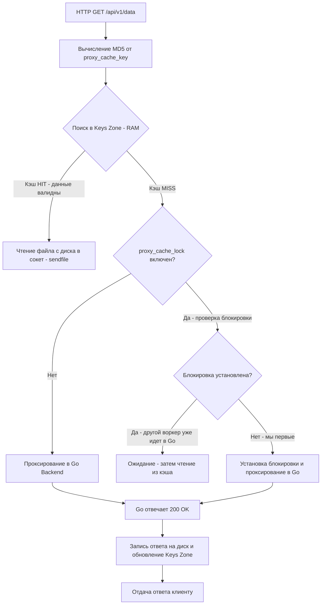

После того как Nginx расшифровал TLS и отбалансировал трафик, на его плечах остается еще одна критически важная задача — защита ваших Go-инстансов от ненужной работы. Кэширование ответов на уровне прокси-сервера — это мощнейший инструмент масштабирования.

Когда мы говорим о кэшировании в бэкенде, часто вспоминают Redis или in-memory кэши внутри Go (например, BigCache, FreeCache). Но кэширование в Nginx имеет принципиальное отличие: оно происходит **до того, как запрос вообще коснется вашего приложения**.

## Mechanical Sympathy: Почему Nginx-кэш лучше Go-кэша для статики и тяжелых GET

Представьте, что у вас есть тяжелый аналитический GET-эндпоинт в Go, который делает 3 запроса в PostgreSQL и собирает JSON-ответ на 500 КБ за 300 мс. 
Если вы кэшируете это в Redis, запрос всё равно дойдет до Go-приложения, рантайм выделит память под HTTP-структуры, горутина сделает сетевой запрос в Redis, получит данные, распарсит их, запишет в сокет и только потом Garbage Collector уберет этот мусор.

Если этот ответ закэширован в Nginx, происходит следующее:
1. Запрос попадает в Worker Nginx.
2. Nginx находит ключ в кэше.
3. Nginx использует системный вызов `sendfile()` (о котором мы говорили в статье [[1. nginx. Архитектура]]), чтобы перекинуть данные прямо из Page Cache операционной системы в сокет клиента.
4. **Go-приложение вообще не знает, что этот запрос был.** Ноль аллокаций в куче, ноль работы GC, ноль нагрузки на CPU.

## Архитектура кэша Nginx: Диск и Память

Nginx использует двухуровневую архитектуру для кэширования:

1. **Диск (Disk)**: Само тело HTTP-ответа и заголовки пишутся в файлы на диске. Nginx не боится дискового IO, так как операционная система кэширует эти файлы в Page Cache (RAM).
2. **Разделяемая память (Shared Memory - Keys Zone)**: Чтобы не искать файлы на диске по имени (что медленно), Nginx хранит в оперативной памяти красно-черное дерево (Red-Black Tree) с ключами кэша (MD5-хеш URL) и метаданными (флаги актуальности, время истечения).

```nginx
# Определяем зону кэша
proxy_cache_path /var/cache/nginx/api 
                 levels=1:2 
                 keys_zone=api_cache:10m 
                 max_size=1g 
                 inactive=60m 
                 use_temp_path=off;
```

> [!info] Под капотом
> Параметр `levels=1:2` критически важен для производительности файловой системы Linux. Если его не указать, Nginx создаст одну директорию и положит туда миллионы файлов (например, по одному на каждый ID товара). Файловые системы (ext4, xfs) начинают катастрофически тормозить при поиске в директориях с >10 000 файлов (линейный поиск). Параметр `levels` создает двухуровневую иерархию директорий на основе хеша, распределяя файлы равномерно, как в шардировании БД.
> `use_temp_path=off` заставляет Nginx писать временные файлы прямо в конечную папку кэша, избегая дорогостоящего перемещения файлов (rename) между разными дисковыми разделами.

## Жизненный цикл запроса в кэше

Как Nginx принимает решение — отдать из кэша или пойти в Go?



## Thundering Herd (Стадный эффект) и Cache Lock

Самая опасная ситуация для кэширующего прокси — **Cache Stampede** (или Thundering Herd). Представьте, что кэш тяжелого ответа протух ровно в 12:00:00. В 12:00:01 на ваш сервер приходит 1000 запросов на этот URL.

Если Nginx просто проверит кэш, увидит, что он просрочен, и отправит все 1000 запросей в Go-бэкенд, ваш сервис ляжет от CPU-спайка или исчерпания пула коннектов к БД.

Для решения этой проблемы существует директива `proxy_cache_lock`. Когда она включена, Nginx разрешает только *одному* запросу идти в бэкенд за свежими данными. Остальные 999 запросов ждут (обслуживаясь из просроченного кэша, если включен `proxy_cache_use_stale updating`), пока первый запрос не обновит кэш.

```nginx
location /api/ {
    proxy_cache api_cache;
    proxy_cache_valid 200 10m;  // Кэшируем успешные ответы на 10 минут
    proxy_cache_key $uri$is_args$args;
    
    # Включаем защиту от Thundering Herd
    proxy_cache_lock on;
    proxy_cache_lock_timeout 5s;
    
    # Отдаем просроченный кэш, пока обновляем его в фоне
    proxy_cache_use_stale updating error timeout;
}
```

## Взаимодействие Go и Nginx: Контракт заголовков

Важно понимать, кто управляет временем жизни кэша. Nginx может жестко задать его в конфиге (`proxy_cache_valid 200 10m`), но в микросервисной архитектуре это негибко. Разные эндпоинты могут требовать разное время жизни (TTL).

Идиоматичный подход — делегировать управление кэшем Go-приложению с помощью стандартных HTTP-заголовков `Cache-Control` и `Expires`.

Чтобы Nginx уважал заголовки от бэкенда, нужно включить:
```nginx
proxy_cache_valid 200 302 10m; # Дефолтный TTL
proxy_cache_valid 404 1m;      # Кэшируем 404 на 1 минуту

# Заставляем Nginx слушать заголовки Go-приложения
proxy_ignore_headers Set-Cookie; # Куки не должны мешать кэшированию
proxy_hide_header Set-Cookie;    # Убираем куки из ответа клиенту, чтобы они не кэшировались в браузере
```

В Go-коде вы управляете кэшем так:

```go
func heavyHandler(w http.ResponseWriter, r *http.Request) {
    // ... тяжелая логика ...
    
    // Говорим Nginx кэшировать на 5 минут
    w.Header().Set("Cache-Control", "public, max-age=300")
    // Или явно запрещаем кэшировать этот конкретный ответ
    // w.Header().Set("Cache-Control", "no-cache, no-store, must-revalidate")
    
    w.Write(jsonData)
}
```

> [!warning] Ловушка / Gotcha
> Если ваше Go-приложение возвращает заголовок `Set-Cookie` (например, устанавливает сессию), Nginx **по умолчанию отказывается кэшировать такой ответ**. Это логично: иначе один пользователь получил бы куки другого. Но если вы кэшируете публичный API, и где-то в мидлваре globally ставится `Set-Cookie` (даже пустой), ваш кэш перестанет работать. Решение — `proxy_ignore_headers Set-Cookie;` с последующим сокрытием его от клиента `proxy_hide_header Set-Cookie;`.

## Инвалидация кэша: Purge

Рано или поздно данные в БД обновятся, и вам нужно сбросить кэш до истечения TTL. Самый топорный способ — перезапустить Nginx или удалить файлы с диска. Правильный путь — использовать коммерческий модуль Nginx Plus или модуль `ngx_cache_purge` (собранный из исходников).

Он позволяет сбросить кэш по ключу HTTP-запросом:
`PURGE /api/v1/data/123 HTTP/1.1`

Если у вас нет возможности использовать эти модули, в Go-бэкенде применяют паттерн **Cache Busting через URL**. Вместо `/api/data` запрашивают `/api/data?v=2`. Nginx посчитает новый MD5-хеш и пойдет в Go за свежими данными.

> [!tip] Собеседование
> **Вопрос:** Как очистить кэш Nginx без модуля `ngx_cache_purge` и перезапуска сервера?
> **Ответ:** Использовать "трюк" с заголовком из бэкенда. Go-приложение при обновлении данных может вернуть ответ с заголовком `Cache-Control: no-cache` или специальным `X-Accel-Expires: 0` (собственный заголовок Nginx). Nginx увидит его, удалит закэшированный файл, и следующий запрос заставит его сделать новый запрос в бэкенд. Альтернатива — менять версию в `proxy_cache_key` (например, добавлять `$http_x_app_version`), что делает старый кэш автоматически невалидным.

## Итог

1. **Двухуровневый кэш Nginx** (Keys Zone в RAM + Файлы на диске) позволяет обрабатывать тысячи запросов в секунду вообще не тревожа Go-бэкенд.
2. **`levels` и `use_temp_path`** — обязательные настройки для избежания узких мест файловой системы и блокировок IO.
3. **`proxy_cache_lock`** — ваш щит от Thundering Herd. Никогда не включайте кэширование тяжелых эндпоинтов без него.
4. **Go управляет TTL** через стандартные заголовки `Cache-Control`. Nginx должен быть настроен на чтение этих заголовков.
5. **Куки убивают кэш**. Строго изолируйте аутентификацию от публичного кэшируемого контента.

Мы завершили блок, посвященный Nginx — пограничному стражу вашей инфраструктуры. Теперь мы переходим к технологиям, которые изменили правила деплоя навсегда. В следующем разделе мы разберем, как изолировать ваше Go-приложение на уровне ядра ОС: [[1. Контейнеризация. Основы]].