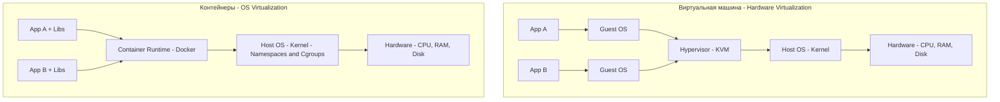
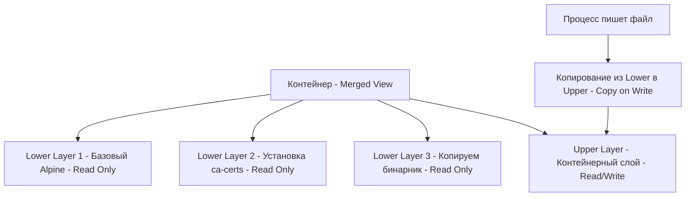

Переход от монолитных приложений к микросервисам потребовал нового подхода к развертыванию. Традиционный метод — установка зависимостей напрямую на сервер (или создание виртуальной машины под каждый сервис) — привел к "аду зависимостей" и колоссальному перерасходу ресурсов. Контейнеризация стала ответом на эти проблемы, а Docker — де-факто стандартом.

Но для инженера, целящегося в Senior/Lead, Docker — это не просто команда `docker build`. Это механизм изоляции процессов на уровне ядра Linux. Понимание того, как контейнер работает под капотом, отличает специалиста, способного диагностировать любые проблемы в продакшене.

## Контейнеры против Виртуальных Машин (VM)

Главное заблуждение: "Контейнер — это легковесная виртуальная машина". Это фундаментально неверно.

Виртуальная машина (VM) эмулирует железо. Гипервизор (KVM, VMware) создает иллюзию физического сервера, внутри которого запускается полноценная гостевая операционная система со своим ядром Linux, своим планировщиком задач и своей подсистемой памяти. Запуск VM — это минутные задержки и гигабайты оверхеда.

**Контейнер — это просто изолированный процесс на хостовой ОС.** Он разделяет ядро Linux с хост-системой и другими контейнерами. Контейнер не виртуализирует железо, он использует механизмы ядра Linux, чтобы "нарисовать" процессу его собственный мир.

> [!tip] Собеседование
> **Вопрос:** Можно ли запустить Linux-контейнер с Go-бинарником на Windows-хосте нативно?
> **Ответ:** Нет. Контейнер использует системные вызовы ядра хоста. Если внутри контейнера Go-код делает `syscall.EpollWait`, он обращается к ядру хоста. В Windows ядро другое (NT kernel), оно не понимает эти вызовы. Поэтому Docker Desktop для Windows запускает скрытую легковесную Linux-VM (через WSL2 или Hyper-V), и контейнеры крутятся уже внутри неё. Контейнеры — это не кроссплатформенная магия, это изоляция процессов Linux.

## Под капотом: Namespaces (Изоляция)

Первый столп контейнеризации — **Namespaces**. Они ограничивают то, что процесс может *видеть*. Когда Docker запускает контейнер, он использует системный вызов `clone()` с набором флагов, создавая новые пространства имен для процесса.

1. **PID Namespace**: Изолирует дерево процессов. Ваш Go-приложение внутри контейнера получает PID 1. Оно не видит процессы хоста или других контейнеров.
2. **NET Namespace**: Изолирует сетевой стек. Контейнер получает свой loopback (`127.0.0.1`), свои маршруты и свой интерфейс (например, `eth0` внутри контейнера). Мы разбирали это в статье [[6. Networking в Linux]].
3. **MNT Namespace**: Изолирует файловую систему. Процесс видит только смонтированные директории внутри контейнера, а не корневую ФС хоста.
4. **UTS Namespace**: Изолирует hostname. Процесс может думать, что его зовут `my-go-app-7f4b8`, а не `prod-server-01`.
5. **IPC Namespace**: Изолирует межпроцессное взаимодействие (System V IPC, POSIX message queues), чтобы процессы не конфликтовали через общую память.
6. **USER Namespace**: Маппинг UID. Позволяет процессу думать, что он root (UID 0) внутри контейнера, хотя на хосте он обычный непривилегированный пользователь (UID 100000). Это основа Rootless Docker и безопасности контейнеров.

> [!warning] Ловушка / Gotcha
> Namespaces не защищают от всех уязвимостей. Поскольку контейнер использует *общее ядро* с хостом, бага в ядре (например, Dirty COW или уязвимости в `io_uring`) может позволить процессу "сбежать" из NET/MNT namespace и получить доступ к хосту. Поэтому важно обновлять ядро Linux на нодах и следовать принципу Least Privilege (не запускать от root).

## Под капотом: Cgroups (Лимитирование)

Второй столп — **Control Groups (Cgroups)**. Если Namespaces решают, что процесс *видит*, то Cgroups решают, что процесс может *использовать*. Они ограничивают аппаратные ресурсы.

Для Go-разработчика особенно важны две подсистемы Cgroups:

1. **Memory (Память)**: Ограничивает потребление RAM. Когда процесс превышает лимит, ядро вызывает OOM Killer и уничтожает процесс (отправляет `SIGKILL`). В Cgroups v2 существует механизм memory.max (жесткий лимит) и memory.high (мягкий лимит, при котором ядро начинает агрессивнее отбирать память и троттлить процесс).
2. **CPU**: Ограничивает время процессора. В Docker это настраивается через `--cpus` (доли CPU CFS scheduler).

> [!info] Под капотом
> В ранних версиях Docker (и Go до 1.19) была серьезная проблема. Go Garbage Collector настраивал свой целевой процент (`GOGC`) на основе объема памяти *всей хост-машины*, а не лимита Cgroup. В результате GC внутри контейнера ленился чистить кучу, память росла до упора, и ядро убивало контейнер (OOM Kill). 
> В Go 1.19 появился `GOMEMLIMIT` и автоматическое чтение лимитов из Cgroups (`autoGOMEMLIMIT`). Теперь GC понимает: "Я в клетке на 512 МБ, надо работать интенсивнее". Это фундаментальный пример Mechanical Sympathy в действии.

## Union File System (OverlayFS): Слои образов

Как Docker добивается того, что образ весит мегабайты, а контейнер стартует за миллисекунды? Ответ — **Copy-on-Write (CoW)** файловые системы, в частности OverlayFS.

Docker-образ — это не один монолитный файл. Это набор слоев (layers). Каждая команда в Dockerfile (`COPY`, `RUN`) создает новый слой, содержащий только отличия (diff) от предыдущего.

Когда вы запускаете контейнер, Docker использует OverlayFS, чтобы "склеить" эти слои воедино:

Если ваше Go-приложение пытается прочитать файл (например, `/etc/ssl/certs/ca-certificates.crt`), OverlayFS ищет его сверху вниз. Найдя в Lower Layer 2, она отдаст данные.

Если приложение пытается *изменить* файл (например, записать лог в `/var/log/app.log`), OverlayFS не меняет Read-Only слой. Она копирует файл из нижнего слоя в верхний (Upper Layer, который доступен для записи) и изменяет уже копию. Это и есть **Copy-on-Write**.

> [!warning] Ловушка / Gotcha
** Из-за CoW запись больших файлов в контейнере убивает производительность дискового IO. Если ваше Go-приложение активно пишет в файл (например, SQLite или логи в файл), и этот файл лежит в Upper Layer OverlayFS, каждый первый вызов `write` вызывает копирование метаданных и потенциально фрагментирует запись. Для интенсивного IO всегда используйте Docker Volumes или tmpfs (о которых мы поговорим в [[5. Volumes и хранение данных]]), которые монтируются напрямую, минуя OverlayFS.

## Архитектура Docker: Daemon и Containerd

Docker — это не монолит. Когда вы пишете `docker run`, оркестрация происходит между несколькими компонентами:

1. **Docker CLI**: Клиент, который отправляет REST API запросы.
2. **Docker Daemon (dockerd)**: Серверная часть, которая управляет образами (build, pull), сетями и томами.
3. **containerd**: Высокоуровневый runtime, вырезанный из Docker для стандартизации. Он управляет жизненным циклом контейнеров (создание, старт, остановка). Именно с ним общается Kubernetes.
4. **runc**: Низкоуровневый OCI-runtime. Это CLI-утилита, которая формирует JSON-конфиг (spec) и делает финальный системный вызов `clone()` с флагами Namespaces и настраивает Cgroups. После запуска контейнера runc завершается.

## Go-бинарники и Scratch-образы

Главная суперспособность Go в мире Docker — статическая компиляция. Поскольку Go-рантайм линкуется напрямую с ядром Linux через собственные ассемблерные заглушки (минуя `glibc`), вам не нужна операционная система внутри контейнера.

Вы можете использовать `FROM scratch` — пустой образ, в котором вообще нет файлов, нет оболочки (shell), нет пакетного менеджера. В него вы копируете только один бинарник. Это непробиваемая крепость с точки зрения безопасности: хакеру нечем воспользоваться внутри, так как там нет даже `ls` или `sh`.

## Итог

1. **Контейнеры — это не VM**. Это изолированные процессы, использующие общее ядро хоста.
2. **Namespaces** отвечают за изоляцию (что процесс видит: PID, сеть, файлы).
3. **Cgroups** отвечают за лимиты (что процесс потребляет: CPU, RAM). Интеграция Go GC с Cgroups спасает от OOM Kill.
4. **OverlayFS и CoW** делают образы легкими и быстрыми, но требуют осторожности при интенсивном IO.
5. **Scratch-образы** — идиоматичный способ деплоя Go-приложений, использующий преимущества статической компиляции.

Теперь, когда мы понимаем фундамент контейнеризации, пора спуститься на уровень инструкций: как писать правильные Dockerfile для Go, чтобы образы были маленькими, безопасными и быстро собирались. В следующей статье мы разберем лучшие практики: [[2. Dockerfile best practices]].