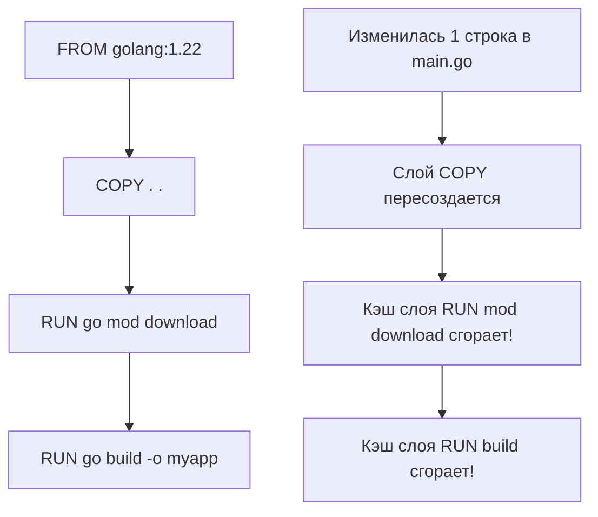

Написание Dockerfile для Go-приложения — это не просто последовательность команд `RUN` и `COPY`. Это архитектурный процесс, который определяет, насколько быстро будет разворачиваться ваш сервис, сколько места он займет в registry и, что самое важное, насколько безопасным и предсказуемым он будет в продакшене.

Для Go-разработчика Dockerfile — это мост между компилятором и инфраструктурой. И здесь действуют свои законы Mechanical Sympathy.

## Инвалидация кэша: Как Docker видит слои

Docker собирает образы пошагово. Каждая инструкция в Dockerfile (например, `RUN`, `COPY`) создает новый слой (layer). Если слой не изменился, Docker берет его из локального кэша при следующей сборке.

Ключевой принцип: **Инструкция выполняется заново, если изменился любой из предыдущих слоев или файлы, которые в нее копируются.**



Если вы копируете весь исходный код (`COPY . .`) перед скачиванием зависимостей (`go mod download`), то при изменении *любого* файла (даже комментария в коде) будет инвалидирован кэш слоя с зависимостями. Docker начнет заново скачивать сотни мегабайт пакетов из интернета, что в CI/CD увеличивает время сборки с секунд до минут.

## Идиоматичный паттерн: Кэширование зависимостей

В Go зависимости описываются в двух файлах: `go.mod` и `go.sum`. Они меняются редко. Идиоматичный подход — скопировать их первыми, скачать зависимости, и только потом копировать исходный код.

```dockerfile
FROM golang:1.22-alpine

WORKDIR /app

# 1. Копируем только файлы зависимостей
COPY go.mod go.sum ./

# 2. Скачиваем зависимости (этот слой будет закэширован, 
# пока мы не поменяем go.mod/go.sum)
RUN go mod download

# 3. Копируем остальной исходный код
COPY . .

# 4. Сборка бинарника
RUN go build -o /myapp .
```

## Флаги компилятора: Оптимизация под контейнеры

Когда вы собираете бинарник внутри Docker, вы должны учитывать специфику окружения. Сборка "как на локальной машине" — это антипаттерн.

### `CGO_ENABLED=0`: Статическая компиляция

Мы уже обсуждали это в статье [[1. Контейнеризация. Основы]]. По умолчанию, если вы не используете CGO (вызовы C-кода), Go все равно может попытаться слинковаться с динамическими библиотеками `glibc` (например, для DNS-резолвинга). 

Флаг `CGO_ENABLED=0` заставляет компилятор использовать чистый Go-рантайм и собственные реализации системных вызовов. Бинарник становится полностью статическим и независимым от `glibc` или `musl` базового образа. Это позволяет запускать его в пустом образе `scratch`.

### `-ldflags="-s -w"`: Стриппинг отладочной информации

Флаги линковщика `-s` и `-w` удаляют из бинарника таблицу символов (symbol table) и отладочную информацию (DWARF). В Go это может уменьшить размер бинарника на 20-30%.

> [!warning] Ловушка / Gotcha
> Использование `-s -w` — это компромисс. Да, вы экономите десятки мегабайт в образе и немного ускоряете запуск (меньше данных для загрузки в память). Но если ваше приложение упадет с паникой (panic) в продакшене, вы не увидите имен функций и номеров строк в стектрейсе — только адреса памяти. Также вы лишаетесь возможности использовать `runtime.Caller` и некоторые профилировщики.
> Если размер образа не критичен (а в 2024 году пара десятков мегабайт редко решает), лучше оставить отладочную информацию для удобства дебага.

### `-trimpath`: Воспроизводимость сборки

По умолчанию Go "зашивает" абсолютные пути вашего компьютера в бинарник. Если вы собираете код из `/home/developer/project`, этот путь попадет в стектрейсы и профильную информацию. Это проблема безопасности (утечка структуры директорий CI-сервера) и нарушение принципа Reproducible Builds.

Флаг `-trimpath` удаляет все локальные пути из бинарника, заменяя их на относительные пути модулей.

> [!tip] Собеседование
> **Вопрос:** Как собрать Go-бинарник так, чтобы он показывал версию сборки (git commit hash) во время выполнения, не меняя при этом исходный код каждый раз?
> **Ответ:** Использовать `-ldflags` с флагом `-X`. Вы передаете значение переменной из окружения CI/CD (например, Git SHA) в глобальную переменную внутри Go-пакета прямо на этапе линковки.
> ```bash
> go build -ldflags="-X main.buildVersion=$(git rev-parse HEAD)" -o myapp
> ```
> В коде вы объявляете `var buildVersion string`, и после сборки она будет содержать хеш коммита.

## .dockerignore: Гигиена контекста сборки

Когда Docker выполняет `COPY . .`, он отправляет весь контекст директории (запускаемой команды `docker build`) демону Docker. Если в вашей папке лежат `vendor/`, `.git/`, локальные бинарники или тяжелые логи, всё это полетит в демон, раздувая время передачи и размер кэша.

Обязательный файл `.dockerignore` в корне проекта:

```text
# Исключаем всё, что не нужно для сборки
.git/
bin/
tmp/
*.md
*.test
# В Docker мы сами качаем зависимости, локальный кэш не нужен
vendor/
```

## Безопасность: Least Privilege

Как мы узнали из статьи [[4. Права доступа и безопасность]], запуск процесса от `root` — смертный грех. Даже в изолированном контейнере.

В базовых образах (Alpine, Debian) часто нет готового непривилегированного пользователя. Вы должны создать его сами. В Alpine для этого используется утилита `adduser`.

```dockerfile
# ... этап сборки бинарника ...

# Создаем группу и пользователя с конкретным UID/GID
RUN addgroup -S appgroup && adduser -S appuser -G appgroup

# Меняем владельца директорий, куда приложение может писать (логи, кэш)
# Если этого не сделать, при запуске от appuser приложение упадет с Permission Denied
RUN mkdir -p /app/data && chown -R appuser:appgroup /app/data

# Явно переключаемся на непривилегированного пользователя
USER appuser

# Копируем бинарник (убедитесь, что он доступен для выполнения)
COPY --from=builder /myapp /app/myapp

ENTRYPOINT ["/app/myapp"]
```

> [!info] Под капотом
> Директива `USER appuser` в Dockerfile работает через механизмы Cgroups и Namespaces Linux. Когда контейнер стартует, Docker делает системный вызов `setuid()` и `setgid()` для процесса-инициатора. Все последующие процессы внутри контейнера наследуют эти UID/GID. Если вы попытаетесь выполнить привилегированный системный вызов (например, открыть сырой сокет или примонтировать диск), ядро Linux откажет, так как EUID процесса не равен 0.

## Итог

1. **Кэширование слоев**: Копируйте `go.mod`/`go.sum` первыми, чтобы `go mod download` не выполнялся при каждом изменении кода.
2. **`CGO_ENABLED=0`**: Гарантирует статическую компиляцию и совместимость с `scratch`/`distroless` образами.
3. **`-trimpath`**: Критически важен для безопасности и воспроизводимости сборки, удаляя локальные пути из бинарника.
4. **`.dockerignore`**: Обязателен для исключения мусора (`.git`, `vendor`) из контекста сборки.
5. **`USER appuser`**: Запуск от непривилегированного пользователя — стандарт безопасности, который нужно настраивать вручную.

Все эти практики замечательны, но они оставляют нас с дилеммой: для сборки нам нужен тяжелый образ с компилятором (`golang:1.22-alpine` весит ~300 МБ), а для запуска — только бинарник и ядро Linux. Как не тащить компилятор в продакшен? Ответ кроется в паттерне, который разделил Docker-сборки на "до" и "после". В следующей статье мы разберем его: [[3. Multi stage build]].