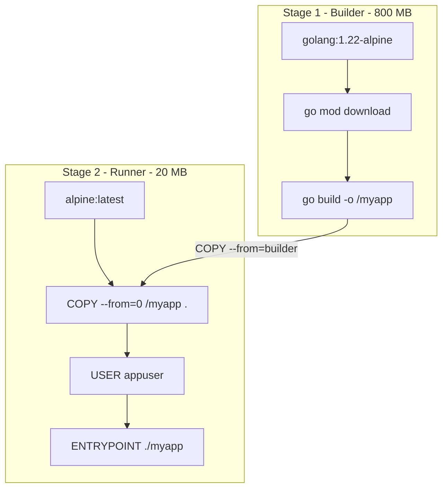

В предыдущей статье мы обсуждали кэширование слоев и флаги компилятора. Но какую бы оптимизацию мы ни применяли в одноэтапной сборке, финальный Docker-образ всегда будет содержать компилятор Go, исходный код, тестовые файлы и инструменты сборки. В продакшене всё это — мертвый груз, который увеличивает время скачивания образа (pull time) и расширяет поверхность для атаки.

В мире компилируемых языков (C++, Rust, Go) среда сборки и среда выполнения кардинально отличаются. Go требует сотен мегабайт для сборки, но для запуска статического бинарника нужна только голая ОС (или даже просто ядро Linux).

## Концепция Multi-Stage Build

Docker поддерживает директиву `FROM` несколько раз в одном Dockerfile. Каждый новый `FROM` начинает **новый этап сборки (stage)** с чистого листа, ничего не зная о предыдущих этапах, за исключением того, что вы явно скопируете сами.

Это позволяет использовать тяжелые образы с компиляторами на этапе сборки (Builder), а затем перенести только артефакты (бинарник) в легковесный образ для запуска (Runner).



> [!info] Под капотом
> Когда Docker видит несколько `FROM`, он не объединяет их в одно дерево слоев OverlayFS. Он создает изолированные временные контейнеры для каждого этапа. Инструкция `COPY --from=...` работает на уровне демона Docker: он монтирует файловую систему указанного этапа, извлекает нужный файл и пакует его в новый слой финального образа. Промежуточные образы-сборщики (Builder) удаляются из кэша сборки (build cache), если вы не сохраняете их намеренно.

## Идеальный Multi-Stage Dockerfile для Go

Соберем воедино всё, что мы знаем о Go, безопасности и кэшировании:

```dockerfile
# Названия этапов (builder, runner) улучшают читаемость
# вместо использования номеров (0, 1)
FROM golang:1.22-alpine AS builder

WORKDIR /app

# Кэширование зависимостей
COPY go.mod go.sum ./
RUN go mod download

# Копируем исходный код
COPY . .

# Статическая сборка с оптимизациями
RUN CGO_ENABLED=0 GOOS=linux GOARCH=amd64 \
    go build -ldflags="-s -w -X main.buildVersion=$(cat version.txt)" \
    -trimpath -o /myapp .

# --- Финальный этап ---
FROM alpine:latest AS runner

# Устанавливаем CA-сертификаты и timezone данные (важно для HTTPS и времени)
# Делаем это до добавления непривилегированного пользователя
RUN apk --no-cache add ca-certificates tzdata

WORKDIR /app

# Создаем непривилегированного пользователя и группу
RUN addgroup -S appgroup && adduser -S appuser -G appgroup

# Копируем бинарник из этапа builder
# Важно: --chown меняет владельца, так как COPY от root
COPY --from=builder --chown=appuser:appgroup /myapp /app/myapp

# Переключаемся на безопасного пользователя
USER appuser

ENTRYPOINT ["/app/myapp"]
```

## Выбор базового образа для Runner'а

Выбор второго `FROM` — это архитектурное решение. В Go есть три основных пути:

### 1. `scratch` (Абсолютный нуль)
В образе `scratch` нет вообще ничего. Ни оболочки (shell), ни пакетного менеджера, ни `/etc/passwd`.
*   **Плюсы:** Размер образа равен размеру бинарника (часто < 10 МБ). Максимальная безопасность — нечего взламывать.
*   **Минусы:** Нельзя зайти в контейнер через `docker exec -it ... sh` для дебага. Отсутствуют CA-сертификаты (ваши исходящие HTTPS-запросы упадут с ошибкой `x509: certificate signed by unknown authority`). Отсутствуют файлы временных зон (`time.LoadLocation` вернет ошибку).

### 2. `distroless` (Рекомендуемый стандарт от Google)
Образы `gcr.io/distroless/static-debian12` содержат минимум для работы: базовые CA-сертификаты, файлы timezone, базовые утилиты (но без оболочки shell). 
*   **Плюсы:** Решает проблемы `scratch` с сертификатами и временем. Всё ещё невероятно маленький. Нет shell, что защищает от злоумышленников, пытающихся выполнить команды при взломе.
*   **Минусы:** Отладка через `exec` по-прежнему невозможна (нет `sh`).

### 3. `alpine` (Компромисс для дебага)
Alpine Linux весит около 5 МБ и содержит BusyBox (минималистичную оболочку `sh`).
*   **Плюсы:** Можно зайти в запущенный контейнер (`docker exec -it <id> sh`), установить `curl`, `wget` для диагностики сети прямо на лету.
*   **Минусы:** Использует `musl libc` вместо `glibc`. Как мы обсуждали в [[1. Контейнеризация. Основы]], это может привести к падениям (segfault) или ошибкам линковки, если ваш Go-код использует CGO и был собран на этапе Builder на базе `glibc` (в образе `golang:1.22`).

> [!warning] Ловушка / Gotcha
> Никогда не собирайте бинарник в `golang:1.22` (которая основана на Debian/glibc) с включенным CGO (`CGO_ENABLED=1`), а затем не запускайте его в `alpine` (которая использует musl). При запуске вы получите `standard init_linux.go:228: exec user process caused: no such file or directory`. Это ошибка ELF-линковщика — бинарник ищет `/lib64/ld-linux-x86-64.so.2` (glibc), которого нет в Alpine.
> Если вам *жизненно необходим* Alpine на этапе runner, используйте `FROM golang:1.22-alpine AS builder`.

## `COPY --chown`: Изящное владение файлами

В классических (одноэтапных) Dockerfile файлы, скопированные через `COPY`, принадлежат root. Чтобы сменить владельца для `USER appuser`, приходилось делать дополнительный шаг `RUN chown -R appuser:appgroup /app`, который создавал новый слой, дублирующий все скопированные файлы (нарушение принципа CoW и раздувание образа).

В Multi-Stage сборках флаг `--chown` внутри `COPY --from=builder --chown=appuser:appgroup` меняет владельца "на лету" при копировании из этапа сборки. Это сохраняет финальный образ минимальным.

## Инъекция отладочных инструментов (Delve)

На стадии разработки и профилирования вам может понадобиться отладчик Delve или утилита pprof. Добавлять их в production-образ нельзя. Multi-stage позволяет создавать отладочные цели:

```dockerfile
# Отладочный этап
FROM runner AS debug
# Меняем пользователя обратно на root для установки пакетов
USER root
RUN go install github.com/go-delve/delve/cmd/dlv@latest
# Возвращаем непривилегированного пользователя
USER appuser
```
Затем в Docker Compose или K8s вы можете собирать образ с `target: debug`, получая всё необходимое для инспекции, не меняя основной Dockerfile.

> [!tip] Собеседование
> **Вопрос:** Ваш Go-сервис работает в продакшене в `distroless` контейнере. Как вы будете отлаживать панику или зависание, если у вас нет shell (`sh`) и вы не можете сделать `docker exec`?
> **Ответ:** 
> 1. Правильный Go-подход: Использовать встроенный HTTP-сервер `net/http/pprof`. При зависании вы делаете `curl` к эндпоинту `/debug/pprof/goroutine?debug=2` снаружи (если порт открыт), получая дамп стеков.
> 2. Подход инфраструктуры: Использовать `kubectl debug` (в K8s 1.18+), который позволяет добавить контейнер с инструментами (Ephemeral Container) в тот же Pod, разделяя его Network и PID namespaces с зависшим контейнером.
> 3. eBPF: Инструменты вроде BCC/bpftrace на хост-машине могут трассировать системные вызовы и функции внутри контейнера без изменения самого контейнера.

## Итог

1. **Multi-Stage Build** разделяет среду компиляции и среду исполнения, уменьшая размер production-образа с сотен мегабайт до десятков.
2. **Выбор базового образа (Runner)** — это баланс между безопасностью (`scratch`, `distroless`) и удобством отладки (`alpine`). Для продакшена `distroless` — золотой стандарт.
3. **Флаг `--chown`** в `COPY` решает проблему раздувания образов из-за `RUN chown`.
4. **Совместимость libc**: Сборка на Debian (`golang`) и запуск на Alpine (`musl`) с CGO — гарантированный краш при запуске.

Ваш Go-контейнер теперь изолирован, минимален и безопасен. Но контейнеры редко работают в вакууме — им нужно общаться с базами данных, другими сервисами и внешним миром. В следующей статье мы разберем, как Docker управляет сетевой изоляцией и маршрутизацией: [[4. Docker networking]].