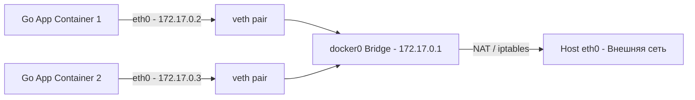

Контейнеры изолируют процессы с помощью Network Namespaces (как мы разбирали в статье [[6. Networking в Linux]]), но полезный бэкенд не существует в вакууме. Вашему Go-сервису нужно принимать входящие HTTP-запросы, обращаться к PostgreSQL, отправлять данные в Redis и общаться с другими микросервисами.

Docker Networking — это виртуальная инфраструктура, которая связывает изолированные сетевые пространства имен (netns) друг с другом и с внешним миром.

## Мост (Bridge): Сеть по умолчанию

Когда Docker устанавливается, он создает виртуальный сетевой мост `docker0` на хост-системе. Если вы запускаете контейнер без указания сети, он попадает в эту дефолтную сеть.

Как это работает под капотом:
1. Docker создает пару виртуальных интерфейсов (veth pair) — это как виртуальный патч-корд.
2. Один конец (например, `veth1234`) подключается к мосту `docker0` на хосте.
3. Второй конец помещается внутри Network Namespace контейнера и переименовывается в `eth0`.
4. Контейнеру выделяется приватный IP-адрес (например, `172.17.0.2`), а маршрут по умолчанию направляет весь трафик через мост `docker0`.



> [!warning] Ловушка / Gotcha
> Дефолтная сеть `bridge` **не поддерживает автоматический DNS-резолвинг** между контейнерами по их именам. Если ваш Go-контейнер попытается подключиться к БД по адресу `postgres:5432`, он получит ошибку, так как внутри контейнера нет записи в `/etc/hosts` или DNS, указывающей, какой IP у `postgres`. Пинговать по IP (например, `172.17.0.3`) можно, но это хрупко — при перезапуске контейнера IP изменится. Никогда не используйте дефолтный bridge в микросервисной архитектуре.

## Пользовательские Bridge (Custom Bridge)

Чтобы контейнеры могли общаться по именам, нужно создавать пользовательские сети:

```bash
docker network create my-app-network
```

Когда вы запускаете контейнеры в этой сети (`--network my-app-network`), происходит магия: Docker запускает встроенный DNS-сервер (на базе `127.0.0.11`). Теперь, если ваш Go-код обращается к хосту `redis`, встроенный DNS Docker возвращаст внутренний IP контейнера с именем `redis`.

> [!info] Под капотом
> Внутри контейнера файл `/etc/resolv.conf` содержит `nameserver 127.0.0.11`. Когда Go-рантайм делает системный вызов `getaddrinfo` для резолвинга имени, запрос перехватывается этим локальным DNS-прокси. Прокси проверяет внутреннюю базу Docker, находит IP контейнера и возвращает его. Это работает быстрее и безопаснее, чем внешний DNS.

## Проброс портов (Port Mapping) и NAT

Как внешние клиенты обращаются к вашему Go-сервису, если он сидит в приватной сети `172.17.0.0/16`? Здесь вступает в игру подсистема Netfilter и `iptables` ядра Linux.

Когда вы указываете флаг `-p 8080:80`, Docker создает правила DNAT (Destination NAT) в таблице `nat`:

1. Пакет приходит на порт 8080 интерфейса хоста (`eth0`).
2. `iptables` изменяет Destination IP с внешнего адреса хоста на внутренний IP контейнера (`172.17.0.2:80`).
3. Ядро маршрутизирует пакет в нужный `netns` через мост `docker0`.
4. Ответ от Go-приложения проходит обратный путь, `iptables` (SNAT/Masquerade) подменяет обратный адрес, чтобы клиент думал, что он общался с хостом.

> [!tip] Собеседование
> **Вопрос:** Почему использование флага `-p` (Port Mapping) добавляет задержку (латентность) по сравнению с запуском приложения напрямую на хосте?
> **Ответ:** DNAT требует от ядра Linux проверки каждого пакета по правилам `iptables` и сохранения состояния соединения в таблице `conntrack` (Connection Tracking). При экстремальных нагрузках (десятки тысяч RPS) процессор может упереться в лимиты модуля `nf_conntrack`, а оверхед на модификацию заголовков пакетов добавляет микросекунды к латентности. Для высоконагруженных систем лучше использовать сеть `host`.

## Сеть Host: Обход изоляции

Если вы запускаете контейнер с флагом `--network host`, Docker **не создает** отдельный Network Namespace. Ваш Go-процесс работает в сетевом стеке хоста напрямую.

*   **Плюсы:** Нулевой оверхед на NAT и виртуальные мосты. Максимальная производительность сети. Go-приложение слушает порт 8080 прямо на интерфейсе хоста.
*   **Минусы:** Полная потеря сетевой изоляции. Если ваше приложение слушает порт 8080, никто другой на хосте его занять не может. Вы не можете запустить два контейнера с одинаковым портом на одном хосте.

В продакшене сеть `host` часто используется для инфраструктурных агентов (Prometheus Node Exporter, Istio sidecar), которым нужен доступ к интерфейсам хоста, и иногда для экстремально нагруженных балансировщиков.

## Специфика резолвинга в Go и `ndots`

Это классическая боль для Go-разработчиков в Kubernetes и Docker. Когда вы обращаетесь к сервису по короткому имени (например, `db`), DNS-резолвер Go может вести себя неожиданно.

В файле `/etc/resolv.conf` внутри контейнера часто присутствует настройка `options ndots:5`. Это означает: если в запрашиваемом имени меньше 5 точек (а в `db` их 0), сначала попытайся резолвить его как FQDN, добавив домены поиска (например, `db.default.svc.cluster.local`), и только если это не удалось — резолвь как абсолютное имя.

> [!warning] Ловушка / Gotcha
> Если ваше Go-приложение использует чистый Go-резолвер (по умолчанию начиная с Go 1.11, если `CGO_ENABLED=0`), каждый такой DNS-запрос может генерировать до 4-5 последовательных UDP-пакетов (по числу доменов поиска), прежде чем найдет правильный IP. Это может добавлять **сотни миллисекунд** к задержке при первом подключении к БД или кэшу.
> **Решения:**
> 1. Явно указывать FQDN в конфиге Go: `db.default.svc.cluster.local` вместо `db`.
> 2. Завершать короткие имена точкой: `db.` (это говорит резолверу "не подставляй домены поиска").
> 3. Использовать `CGO_ENABLED=1`, чтобы Go делегировал резолвинг системной библиотеке `glibc` (которая кэширует отрицательные ответы), но это лишает вас `scratch`-образов.

## Сеть None

Флаг `--network none` отключает сеть вообще. В контейнере будет только loopback-интерфейс (`127.0.0.1`). Это используется для изолированных вычислений (например, скрипты обработки данных, которым запрещено ходить в интернет) или в связке с прокси-серверами, которые пробрасывают трафик через Unix-сокеты, а не TCP.

## Итог

1. **Default Bridge** — зло для микросервисов из-за отсутствия DNS. Всегда создавайте **Custom Bridge** сети.
2. **Port Mapping (`-p`)** работает через `iptables` DNAT, что добавляет микросекундную задержку и нагрузку на `conntrack`.
3. **Сеть Host** дает максимальную производительность, но полностью лишает изоляции и приводит к конфликтам портов.
4. **DNS и `ndots`** — скрытая ловушка для Go-резолвера, из-за которой короткие имена сервисов могут резолвиться медленно. Используйте FQDN или завершающую точку.

Сеть обеспечивает транспорт для данных, но сами данные (состояние, логи, файлы) должны переживать перезапуск контейнеров. В следующей статье мы разберем, как Docker работает с хранилищами: [[5. Volumes и хранение данных]].