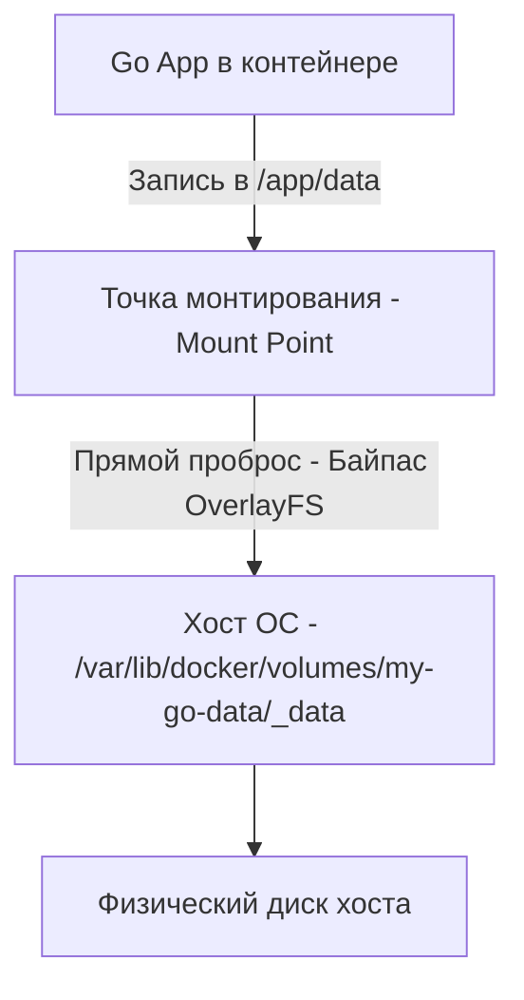

Главный принцип контейнеризации: **Контейнеры эфемерны (ephemeral)**. Они создаются, уничтожаются, масштабируются и обновляются в любой момент. Если ваше Go-приложение пишет данные внутри контейнера (в его файловую систему), эти данные исчезнут навсегда, как только контейнер будет удален или пересоздан при обновлении (Rolling Update).

Для хранения состояния (State) за пределами жизненного цикла контейнера Docker предоставляет механизмы монтирования хранилищ с хост-машине. От того, как вы их используете, зависит не только сохранность данных, но и производительность IO.

## Проблема Writable Layer (OverlayFS)

Как мы разбирали в статье [[1. Контейнеризация. Основы]], контейнерная файловая система построена на OverlayFS. Верхний слой (Upper Layer) доступен для записи. 

Когда ваш Go-код выполняет `os.Create("app.log")` и пишет туда данные, OverlayFS делает следующее:
1. Ищет файл в нижних слоях (Read-Only).
2. Если файл не найден, создает его в Upper Layer.
3. Если файл найден и вы пытаетесь его изменить, срабатывает механизм **Copy-on-Write (CoW)**: файл копируется из Read-Only слоя в Upper Layer, и изменения вносятся туда.

> [!warning] Ловушка / Gotcha
> OverlayFS и CoW убивают производительность дискового IO. Если ваше Go-приложение активно пишет логи, обновляет локальную базу данных (например, SQLite) или делает аппенд в файл, каждый новый блок данных может триггерить аллокацию и копирование на уровне файловой системы хоста. Скорость записи упадет в разы по сравнению с записью на обычный диск. Никогда не храните важные данные или базы данных в Writable Layer контейнера.

## Типы хранилищ в Docker

Чтобы решить проблему производительности и персистентности, Docker позволяет "пробросить" директорию с хоста прямо в контейнер, минуя OverlayFS.

### 1. Volumes (Именованные тома)

**Volume** — это полностью управляемый Dockerом механизм хранения. Docker сам создает директорию на хосте (обычно `/var/lib/docker/volumes/<volume_name>/_data`) и монтирует её напрямую в контейнер.

```bash
docker volume create my-go-data
docker run -d -v my-go-data:/app/data my-go-image
```



> [!info] Под капотом
> Когда вы используете Volume, ядро Linux создает привязку (bind mount) между директорией на хосте и директорией внутри Network/Mount Namespace контейнера. Данные идут в обход Copy-on-Write механики OverlayFS напрямую на файловую систему хоста (ext4, xfs). Это обеспечивает **нативную скорость IO хоста**.

Volumes — единственный механизм, который работает в кластерах Docker Swarm или Kubernetes, где ноды могут переключаться. В K8s аналогом являются PersistentVolumeClaims (PVC).

### 2. Bind Mounts (Привязка к директории хоста)

**Bind Mount** позволяет вам явно указать любую директорию или файл на хост-системе и примонтировать их в контейнер.

```bash
docker run -d -v /home/user/myapp/config.yaml:/app/config.yaml my-go-image
```

*   **Плюсы:** Удобно для разработки (например, пробросить исходный код с хоста в контейнер, чтобы использовать hot-reload утилиты вроде `air`).
*   **Минусы:** Жесткая привязка к структуре файловой системы конкретного хоста. Если вы перенесете контейнер на другой сервер, где нет `/home/user/myapp/config.yaml`, контейнер не запустится.

### 3. tmpfs Mounts (В оперативной памяти)

**tmpfs** монтирует временную файловую систему прямо в RAM хоста. Данные не пишутся на диск вообще.

```bash
docker run -d --tmpfs /app/cache:rw,size=100m my-go-image
```

Используется для хранения чувствительных данных (ключи, которые не должны попадать на диск) или как сверхбыстрый кэш, который не жалко потерять при перезапуске. Лимитируется размером (в примере 100 МБ); если превысить лимит, процесс получит ошибку `ENOSPC` (No space left on device).

## Специфика Go: SQLite и Файловые блокировки

Для Go-разработчиков очень популярно использование встроенных баз данных (Embedded DB), таких как SQLite (через CGO или чистый Go-порт), BadgerDB или BoltDB. Они не требуют отдельного сервера и идеально подходят для микрофронтендов или edge-вычислений.

Но при запуске в Docker они часто ломаются с ошибкой `database is locked` или `SIGBUS: bus error`.

> [!warning] Ловушка / Gotcha
> SQLite использует механизм `flock()` (file locking) на уровне ОС для контроля конкурентного доступа к файлу БД. 
> 1. Если вы запускаете SQLite поверх OverlayFS (без Volume), файловые блокировки могут не работать корректно, так как OverlayFS имеет ограниченную поддержку POSIX ACL и locking.
> 2. Если вы используете сетевую файловую систему (NFS/EFS) для Volume, `flock()` также может не работать между разными нодами, приводя к повреждению БД.
> **Решение:** SQLite и другие embedded-базы *всегда* должны работать на локальных Volumes (блочные устройства хоста). Если контейнер размазан по нескольким нодам K8s, вы обязаны использовать ReadWriteOnce (RWO) режим для PVC, чтобы диск был примонтирован только к одной ноде.

## Проблема прав доступа (UID/GID маппинг)

Классическая боль при работе с Volumes в Docker — ошибка `Permission Denied`.

Когда Docker создает Volume, директория на хосте (`/var/lib/docker/volumes/.../_data`) создается с правами `root:root`. Если внутри контейнера ваше Go-приложение работает от `appuser` (UID 10001), оно не сможет писать в эту директорию.

С другой стороны, при использовании Bind Mount (`-v /host/dir:/app/dir`), файлы внутри контейнера будут принадлежать тому же UID, что и на хосте. Если на хосте файл принадлежит UID 1000, а в контейнере `appuser` имеет UID 2000, приложение не сможет прочитать конфиг.

> [!tip] Собеседование
> **Вопрос:** Как заставить Go-приложение в контейнере корректно читать и писать в Docker Volume, учитывая различие UID между хостом и контейнером?
> **Ответ:** Существует несколько паттернов:
> 1. **Фиксированный UID**: В Dockerfile создаем пользователя с конкретным UID (например, `adduser -u 10001 appuser`), а системным администраторам гарантируем, что директория Volume на хосте/в K8s принадлежит этому же UID.
> 2. **Entrypoint скрипт от root**: Контейнер запускается от root, entrypoint-скрипт (на bash/sh) делает `chown -R appuser:appgroup /app/data`, а затем выполняет `su-exec` или `gosu` для дропа привилегий и запуска Go-бинарника. (Используется в официальных образах Postgres/Nginx).
> 3. **User Namespaces**: Настройка Docker демона на использование `userns-remap`, которая маппит root внутри контейнера на непривилегированного пользователя на хосте. Сложно в настройке в K8s.

## Итог

1. **Writable Layer (OverlayFS)** — только для эфемерных данных. Запись туда медленная из-за Copy-on-Write.
2. **Volumes** — единственный правильный способ персистентного хранения данных в Docker/K8s. Обеспечивают прямую запись на диск хоста.
3. **Bind Mounts** — отличный инструмент для локальной разработки (hot-reload), но антипаттерн для production из-за привязки к ФС хоста.
4. **tmpfs** — для сверхбыстрого кэширования в RAM и чувствительных данных, которые не должны оставаться на диске.
5. **Файловые блокировки (flock)**: Embedded БД (SQLite) требуют реальных блочных устройств (Volumes), а не сетевых или эфемерных ФС.

Хранение данных — лишь один аспект инфраструктуры. Если злоумышленник получит доступ к вашему контейнеру, он не должен иметь возможности выбраться на хост или соседние контейнеры. В следующей статье мы углубимся в безопасность контейнеризации: [[6. Безопасность контейнеров]].