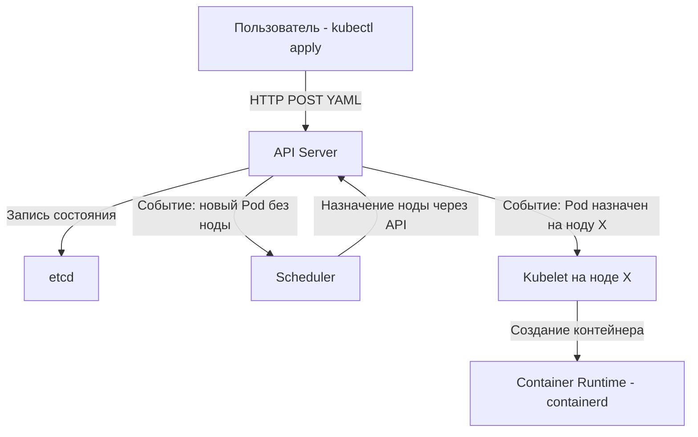

Когда вы переходите от одиночных Docker-контейнеров к полноценному продакшену, возникает вопрос: что делать, если сервер (нода) умирает? Как обновить 50 инстансов вашего Go-сервиса без даунтайма? Как автоматически масштабировать их при росте нагрузки?

Ответ — оркестратор. И в облачном мире де-факто стандартом стал **Kubernetes (K8s)**. 

Для разработчика Kubernetes часто кажется черным ящиком — непонятной магией, которая почему-то деплоит код. Но K8s написан на Go, и его архитектура глубоко отражает Go-философию: декларативность, конкурентность и коммуникацию через очереди/события. Понимание его архитектуры — это пропуск в мир System Design уровня Senior/Lead.

## Философия: Декларативное состояние (Desired State)

Главный сдвиг парадигмы при работе с K8s: вы не говорите ему, *что делать* (императивно), вы говорите, *каким должен быть результат* (декларативно). 

Вы отправляете в K8s манифест: "Я хочу 3 реплики моего Go-сервиса". Если одна нода сгорит, K8s увидит, что текущее состояние (Current State) — 1 реплика, а желаемое (Desired State) — 3, и сам запустит недостающие две на других серверах. 

Вся архитектура K8s построена вокруг приведения Current State к Desired State через **Циклы согласования (Reconciliation Loops)**.

## Control Plane: Мозг кластера

Управляющий слой (Control Plane, бывший Master) принимает решения о состоянии кластера. В продакшене его компоненты резервируются на нескольких нодах.

### 1. API Server (Единая точка входа)
Единственный компонент Control Plane, с которым общаются все остальные (и вы через `kubectl`). Это мощный REST API-сервер на Go. Он принимает манифесты YAML/JSON, валидирует их, сохраняет в `etcd` и рассылает уведомления подписчикам. Никто другой напрямую в `etcd` не пишет.

### 2. Etcd (Память кластера)
Распределенное key-value хранилище (написано на Go), использующее алгоритм консенсуса Raft. В нем лежит *всё* состояние кластера: какие есть поды, сервисы, секреты, конфиги.

> [!info] Под капотом
> Etcd использует библиотеку Bbolt (ранее BoltDB) под капотом для хранения данных на диске (B+ деревья). Это означает, что производительность `etcd` критически зависит от дискового IO. Каждая транзакция в `etcd` требует вызова `fsync()`. Если вы запустите Control Plane на медленных сетевых дисках (HDD или перегруженные EBS), `fsync` будет тормозить, API Server будет зависать, и весь кластер ляжет. Для `etcd` нужны быстрые NVMe SSD.

### 3. Scheduler (Планировщик)
Следит за появлением новых Подов (Pod), которым не назначена нода (состояние `Pending`). Scheduler оценивает ресурсы (CPU/RAM requests), ограничения (nodeSelector, taints/tolerations) и решает, на какую Worker-ноду поместить Под. Он *не* запускает под — он просто пишет имя ноды в объект Pod в API Server.

### 4. Controller Manager (Менеджер контроллеров)
Набор циклов согласования (Reconciliation Loops). Например, ReplicaSet Controller следит, чтобы количество запущенных Подов совпадало с числом `replicas` в YAML. Если под убили, контроллер создает новый. Deployment Controller управляет стратегией обновлений (Rolling Update).

## Worker Nodes: Мышцы кластера

Воркер-ноды — это серверы, где реально крутится ваш Go-код.

### 1. Kubelet
Агент K8s на каждой ноде. Его задача — следить, чтобы Поды, назначенные на его ноду, были живы. Kubelet читает спецификацию Пода из API Server, обращается к Container Runtime (через CRI — Container Runtime Interface) для скачивания образов и старта контейнеров.
Также Kubelet выполняет пробы (Liveness, Readiness), о которых мы поговорим в следующей статье.

### 2. Kube-proxy
Сетевой демон. Отвечает за маршрутизацию трафика к Сервисам (Services). Когда вы создаете Service, Kube-proxy создает правила на ноде, чтобы трафик с VIP-адреса Service попадал в IP-адреса Подов.

> [!warning] Ловушка / Gotcha
> Kube-proxy работает в двух режимах: `iptables` и `IPVS`.
> По умолчанию используется `iptables`. Правафа отбора (rules) в iptables читаются **последовательно** — O(N). Если у вас 10 000 Сервисов, каждый сетевой пакет должен пройти через огромную цепочку правил, что убивает сетевую производительность на высоких нагрузках.
> Режим **IPVS** (IP Virtual Server) работает на уровне ядра Linux и использует хеш-таблицы для маршрутизации — O(1). Для высоконагруженных Go-бэкендов с тысячами микросервисов *всегда* включайте IPVS в K8s.

### 3. Container Runtime
Программа, запускающая контейнеры. Исторически это был Docker, но из-за своего монолитного дизайна он объявлен deprecated в K8s. Современный стандарт — **containerd** (или CRI-O). Он легче, быстрее и работает напрямую с образами OCI.

## Механика K8s: List-Watch и Informers

Как компоненты K8s узнают об изменениях, не опрашивая API Server каждую секунду (что убило бы и API Server, и etcd)?

K8s использует паттерн **List-Watch**:
1. При старте компонент делает `LIST` запрос к API Server, получая текущее состояние всех объектов (снапшот).
2. Затем он открывает долгоживущее TCP-соединение `WATCH` (используя HTTP Chunked Transfer Encoding). API Server шлет события (Added, Modified, Deleted) в реальном времени.

В Go-коде самого Kubernetes и ваших кастомных операторах это реализовано через библиотеку `client-go` и механизм **Informers**. Informer локально кэширует состояние объектов в памяти (Thread-safe Store) и вызывает ваши коллбэки (Event Handlers) при изменениях.

> [!tip] Собеседование
> **Вопрос:** Почему при падении API Server уже запущенные приложения (Go-поды) продолжают работать?
> **Ответ:** Потому что K8s децентрализован в плане исполнения. Kubelet на каждой ноде содержит локальный кэш манифестов Подов. Если API Server падает, Kubelet продолжает управлять контейнерами, проверять пробы и перезапускать их при падении. То же самое с Kube-proxy — правила iptables/IPVS уже загружены в ядро Linux. Падение Control Plane блокирует *изменения* (деплои, скейлинг), но не *текущую работу* (data plane).

## Итог

1. **Декларативность**: K8s стремится привести Current State к Desired State через Reconciliation Loops.
2. **API Server** — единственная точка входа; **etcd** — единственное хранилище состояния (требует быстрых SSD).
3. **Kube-proxy**: Режим `iptables` убивает масштабируемость сети; используйте `IPVS` для O(1) маршрутизации.
4. **List-Watch**: Компоненты не опрашивают API, а подписываются на поток событий через HTTP/2, используя Informers в Go.
5. **Отказоустойчивость**: Падение Control Plane не убивает запущенные сервисы, так как Kubelet и Kube-proxy автономны на уровне ноды.

Архитектура K8s задает платформу, но основные сущности, с которыми вы будете работать daily — это Поды, Деплойменты и Сервисы. В следующей статье мы разберем их устройство и связь с Go-рантаймом: [[2. Pod, Deployment, Service]].