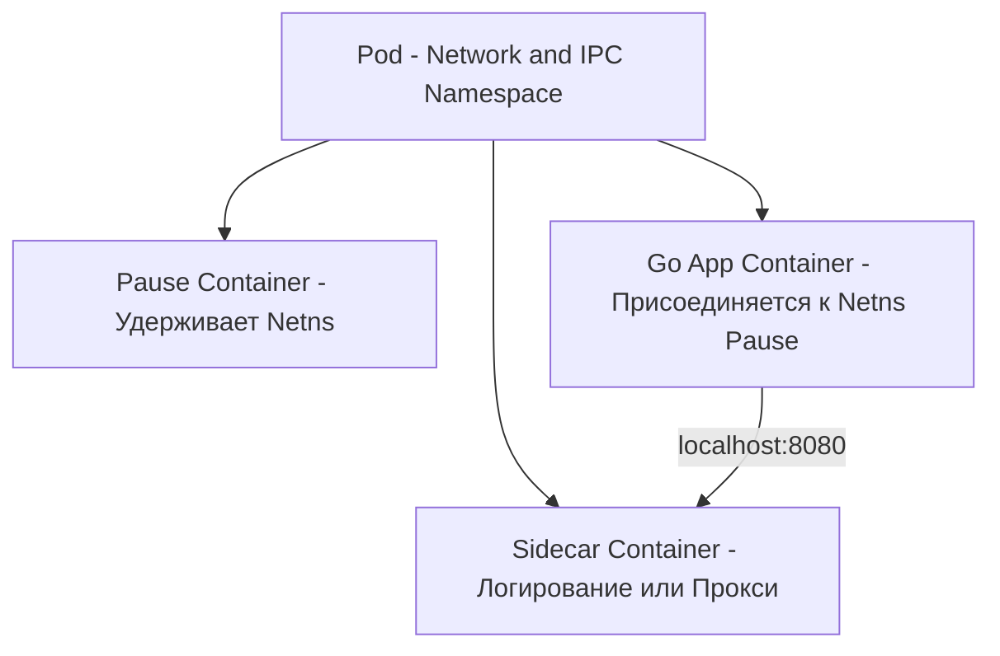

Разобрав общую архитектуру Kubernetes в [[1. Kubernetes. Архитектура]], пора спуститься на уровень объектов, с которыми вы будете работать каждый день. Тройка `Pod`, `Deployment` и `Service` — это святая троица K8s. Понимание того, как они взаимодействуют, критически важно для деплоя Go-приложений без простоев.

## Pod: Атом K8s

В Docker минимальной единицей является контейнер. В Kubernetes минимальная единица развертывания — **Pod (Под)**. 

Под — это не просто контейнер. Это изолированная среда (sandbox), в которой работает один или несколько контейнеров. Все контейнеры внутри одного Пода:
1. Разделяют один Network Namespace (один IP-адрес, один диапазон портов).
2. Разделяют один IPC Namespace (могут общаться через общую память).
3. Могут разделять Volume (хранение данных).

### Под капотом: Контейнер Pause

Как K8s гарантирует, что несколько контейнеров в Поде умрут и воскреснут вместе, сохранив тот же IP-адрес?

Когда K8s создает Под, он первым запускает специальный контейнер — **`pause`** (также известен как sandbox container). Этот контейнер делает ровно одну вещь: вызывает `pause()` системный вызов, бесконечно спя и удерживая Network Namespace.

Когда ваш Go-контейнер (и sidecar-контейнеры, вроде Envoy/Istio proxy) запускается, он присоединяется к уже существующему Network Namespace контейнера `pause`. Если ваш Go-контейнер упадет и Kubelet перезапустит его, сетевой стек (IP, порты, открытые соединения) не разрушится — он привязан к `pause`.



> [!warning] Ловушка / Gotcha
> Так как контейнеры в Поде делят один Network Namespace, они **не могут слушать один и тот же порт**. Если ваш Go-сервис слушает `:8080`, а sidecar (например, Prometheus exporter) тоже попытается забиндиться на `8080`, вы получите ошибку `bind: address already in use`. Координируйте порты внутри Пода.

## Deployment: Управление жизненным циклом

Вы никогда не создаете Поды напрямую в продакшене (за исключением редких случаев с Jobs). Если нода умрет, "голый" Под умрет вместе с ней навсегда. Для управления репликами используется **Deployment**.

Deployment не управляет Подами напрямую. Он создает **ReplicaSet**, который уже следит за тем, чтобы количество запущенных Подов равнялось желаемому (Desired State). При обновлении версии образа Deployment создает *новый* ReplicaSet, плавно масштабирует его вверх, а старый — вниз (Rolling Update).

### Пробы (Probes): Интеграция K8s и Go

Ключевая особенность, отличающая "контейнер" от "здорового приложения" — это Пробы. K8s не знает, жив ли ваш Go-код внутри. Он проверяет это через пробы:

1. **Startup Probe**: Проверяет, запустилось ли приложение. Полезно для тяжелых Go-сервисов, которые при старте грузят в память словари или делают миграции БД. Пока эта проба не станет успешной, остальные пробы не проверяются.
2. **Liveness Probe**: Проверяет, не завис ли процесс (deadlock). Если проба падает, K8с убивает Под (отправляет SIGTERM) и перезапускает его. **Никогда не используйте Liveness для проверки внешних зависимостей** (БД, Redis). Иначе каскадный сбой сети убьет все ваши инстансы.
3. **Readiness Probe**: Проверяет, готов ли Под принимать трафик. Если она падает, K8s **исключает IP Пода из Service** (из балансировки), но не убивает Под. Это идеальное место для проверки БД.

> [!info] Под капотом
> Пробы реализованы в Kubelet. Он периодически делает HTTP GET запрос (или executes command) внутри контейнера. Важно понимать тайминги: K8s не удаляет Под из балансировщика Service мгновенно при падении Readiness. Kubelet сообщает API Serverу об изменении статуса, API Server обновляет etcd, а Kube-proxy на *всех* нодах должен обновить свои правила iptables/IPVS. Этот конвейер может занимать секунды, что критично для понимания даунтаймов при деплое.

## Service: Стабильная сеть в хаосе

Поды эфемерны — они умирают, resurrectаются с новыми IP-адресами при каждом деплое. Вашим Go-сервисам нужен стабильный адрес для общения. Эту задачу решает **Service**.

Service — это абстракция, которая определяет логическую группу Подов (обычно с помощью селектора `app=my-go-app`) и политику доступа к ним.

Когда вы создаете Service типа ClusterIP, происходит следующее:
1. K8s выделяет стабильный виртуальный IP-адрес (ClusterIP) из специального диапазона.
2. Внутренний DNS-сервер CoreDNS создает запись `my-go-app.default.svc.cluster.local`, указывающую на этот IP.
3. Kube-proxy на каждой ноде создает правила в iptables или IPVS, перехватывающие трафик, идущий на ClusterIP, и перенаправляющие его на реальные IP-адреса Подов (DNAT).

```go
// В вашем Go-коде вы обращаетесь к другому микросервису 
// не по его IP, а по DNS имени Service
resp, err := http.Get("http://billing-service:8080/api/charge")
```

### Headless Service: Для Stateful-приложений

Если вы создадите Service с полем `clusterIP: None`, K8с не выделит виртуальный IP и не настроит прокси. Такой сервис называется **Headless**.

Когда Go-приложение делает DNS-запрос к Headless Service, CoreDNS возвращает *не один виртуальный IP*, а список A-записей с реальными IP-адресами всех Подов. 

Это критически важно для баз данных (PostgreSQL, Cassandra) и распределенных систем на Go (Raft-кластеры, Kafka), где клиенту нужно знать адреса конкретных узлов, а не случайным образом балансироваться кластером.

## Самая страшная гонка (Race Condition): Graceful Shutdown

Это классическая проблема, на которой обжигаются все Go-разработчики при переезде в K8s.

Когда вы обновляете Deployment, K8s плавно убивает старый Под и поднимает новый. Шаги:
1. K8s создает новый Под.
2. K8s отправляет SIGTERM старому Поду.
3. K8с **асинхронно** удаляет IP старого Пода из правил iptables (через API Server -> Kube-proxy).
4. Старый Под завершает Graceful Shutdown и умирает.

> [!warning] Ловушка / Gotcha
> Проблема в шагах 2 и 3. Удаление IP из iptables на всех нодах может занимать до 10 секунд (из-за задержек API Server и синхронизации Kube-proxy). Если ваш Go-код при получении SIGTERM немедленно закрывает HTTP-сервер, трафик от других Подов, у которых в iptables *ещё* остался IP старого Пода, упадет с ошибкой `Connection Refused`.
> 
> **Решение (Обязательный паттерн для Go в K8s):**
> 1. При получении SIGTERM ваш Go-сервер должен **перестать принимать новые соединения** (отказываться от Readiness пробы), но **продолжать обрабатывать текущие**.
> 2. **Обязательно подождать 5-15 секунд** перед началом Shutdown, чтобы дать Kube-proxy время вычистить ваш IP из балансировщиков на всех нодах кластера.

Пример правильного Graceful Shutdown для K8s:

```go
func main() {
    // ... настройка сервера ...
    
    ctx, stop := signal.NotifyContext(context.Background(), syscall.SIGTERM, syscall.SIGINT)
    defer stop()

    go func() {
        if err := srv.ListenAndServe(); err != nil && err != http.ErrServerClosed {
            log.Fatalf("Server failed: %v", err)
        }
    }()

    <-ctx.Done()
    log.Println("SIGTERM received, waiting for K8s to update iptables...")
    
    // КРИТИЧЕСКИ ВАЖНО: Спим, пока Kube-proxy вычищает наш IP
    time.Sleep(10 * time.Second) 

    log.Println("Shutting down gracefully...")
    shutdownCtx, cancel := context.WithTimeout(context.Background(), 15*time.Second)
    defer cancel()

    // Останавливаем сервер, дожидаясь обработки активных запросов
    if err := srv.Shutdown(shutdownCtx); err != nil {
        log.Printf("Server shutdown error: %v", err)
    }
}
```

> [!tip] Собеседование
> **Вопрос:** Зачем в манифесте Пода нужно задавать `terminationGracePeriodSeconds` и как он связан с Graceful Shutdown в Go?
> **Ответ:** `terminationGracePeriodSeconds` (по умолчанию 30) — это время, которое K8s даст вашему Поду после отправки SIGTERM, прежде чем отправить SIGKILL. Важно, чтобы сумма вашего искусственного слипа (на обновление iptables) и времени `http.Server.Shutdown` не превышала этот таймаут. Иначе K8с прибьет процесс (SIGKILL), оборвав активные соединения пользователей. Оптимально: terminationGracePeriodSeconds = 30, слип = 10с, Shutdown timeout = 15с.

## Итог

1. **Pod** — это набор контейнеров, разделяющих сеть (через контейнер `pause`). Контейнеры в Поде общаются через `localhost`.
2. **Deployment** управляет ReplicaSet и обеспечивает бесперебойное обновление (Rolling Update). Пробы (Readiness) — ваш инструмент управления балансировкой.
3. **Service** предоставляет стабильный IP и DNS-имя для эфемерных Подов, используя DNAT на уровне ядра Linux.
4. **Race Condition при Shutdown**: K8s удаляет IP из балансировщика асинхронно. Всегда добавляйте задержку перед `srv.Shutdown()` в Go при получении SIGTERM, иначе вы получите 502/504 ошибки в моменты деплоя.

Ваши Go-приложения теперь могут принимать трафик, но жестко хардкодить конфигурацию (адреса БД, порты) в бинарник — плохая практика. В следующей статье мы разберем, как K8s инжектит конфигурацию и секреты: [[3. ConfigMap и Secret]].