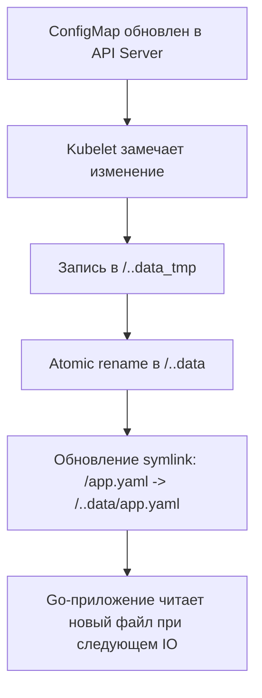

В статье [[2. Pod, Deployment, Service]] мы разобрали, как заставить ваше Go-приложение работать и масштабироваться. Но hardcoded конфигурация внутри Docker-образа — это прямой путь к катастрофе. Согласно методологии Twelve-Factor App, конфигурация должна быть отделена от кода. 

В Kubernetes для передачи настроек в контейнеры используются два объекта: **ConfigMap** (для обычных данных) и **Secret** (для чувствительных данных). Но то, как именно K8s доставляет эти данные в ваш Go-процесс, имеет критическое значение для безопасности и архитектуры приложения.

## ConfigMap vs Secret: В чем разница?

На первый взгляд, они похожи — оба хранят пары ключ-значение. Но их внутреннее устройство и поведение в кластере кардинально отличаются.

1. **ConfigMap**: Хранит данные в открытом виде в `etcd`. Предназначен для URL-адресов баз данных, портов, флагов фич.
2. **Secret**: Хранит данные в кодировке Base64 в `etcd*. Предназначен для паролей, API-ключей, TLS-сертификатов.

> [!warning] Ловушка / Gotcha
> Base64 — это **кодировка**, а не шифрование. Любой, кто имеет доступ на чтение Secret через `kubectl get secret -o yaml`, легко декодирует ваш пароль командой `base64 -d`. По умолчанию Secret в etcd лежит в открытом виде. Чтобы сделать его по-настоящему секретным, вы *обязаны* включить шифрование данных в etcd (EncryptionConfiguration) на уровне API Server и использовать внешние системы (KMS, Vault).

## Способы доставки: Переменные окружения vs Файлы

Kubernetes может внедрить ConfigMap или Secret в ваш контейнер двумя путями. Выбор пути влияет на то, как вы пишете код на Go.

### 1. Переменные окружения (Environment Variables)

Самый простой способ. Kubelet добавляет ключи в конфигурацию Docker-контейнера, и они становятся доступны через `os.Getenv()`.

```yaml
env:
  - name: DB_HOST
    valueFrom:
      configMapKeyRef:
        name: app-config
        key: database_url
```

> [!info] Под капотом
> Переменные окружения (env vars) внедряются на этапе создания контейнера. Они записываются в структуру процесса внутри ядра Linux и доступны через файловую систему `/proc/<pid>/environ`. 
> **Минус:** Если вы измените значение в ConfigMap, переменная окружения внутри *уже запущенного* контейнера **не обновится**. Чтобы подхватить новое значение, Pod необходимо перезапустить.

### 2. Том (Volume Mount)

В этом случае K8s создает временные файлы на ноде и монтирует их в контейнер (как мы разбирали в [[5. Volumes и хранение данных]]). Ключи становятся именами файлов, а значения — их содержимым.

```yaml
volumes:
  - name: config-volume
    configMap:
      name: app-config
```

## Атомарное обновление и Горячая перезагрузка (Hot Reload)

Если вы монтируете ConfigMap как Volume, K8s умеет обновлять файлы внутри контейнера "на лету", без его перезапуска. Это открывает возможность для Hot Reload конфигурации в Go.

Но как K8s делает это безопасно? Он использует механизм **Symlinks (символические ссылки)**.

1. Kubelet записывает новые данные во временную директорию `..data_tmp`.
2. Атомарно переименовывает её в `..data` (операция `rename` в Linux атомарна).
3. Обновляет символическую ссылку `..data`, указывая на новую директорию.
4. Обновляет символические ссылки конкретных файлов (например, `app.yaml` -> `..data/app.yaml`).



### Go и fsnotify: Читаем обновления на лету

Ваше Go-приложение может отслеживать изменения в смонтированных файлах и перезагружать конфигурацию без даунтайма. Для этого используется библиотека `fsnotify`.

Но есть нюанс: вы не можете подписаться на слежение (watch) за символической ссылкой напрямую в Go — `fsnotify` отслеживает inode. Вам нужно следить за *директорией*, в которой лежат файлы, и отлавливать событие `Create` или `Write` целевого файла.

```go
watcher, _ := fsnotify.NewWatcher()
// Следим за директорией, а не за самим файлом!
watcher.Add("/app/config/") 

for {
    select {
    case event, ok := <-watcher.Events:
        if !ok {
            return
        }
        // K8s создает новый файл при обновлении symlink
        if event.Op&fsnotify.Create == fsnotify.Create || event.Op&fsnotify.Write == fsnotify.Write {
            if filepath.Base(event.Name) == "app.yaml" {
                log.Println("Config updated, reloading...")
                reloadConfig("/app/config/app.yaml")
            }
        }
    }
}
```

## Безопасность (Security): Защита Секретов

Если вы монтируете Secret как Volume, K8s использует файловую систему `tmpfs` (RAM-диск) для хранения этих файлов на ноде. Это значит, что секреты *никогда не пишутся на физический диск* ноды, что снижает риск их утечки при утилизации дисков.

Но главная угроза кроется в самом Go-рантайме.

> [!warning] Ловушка / Gotcha
> Если вы передаете секреты через переменные окружения, они сохраняются в памяти процесса. 
> 1. **Логирование**: При панике (panic) Go по умолчанию дампит все горутины и их стеки. Если вы передали секрет в функцию, он может засветиться в стектрейсе логов.
> 2. **Отладка**: Любой, кто имеет доступ к `kubectl exec`, может сделать `printenv` и увидеть ваши ключи.
> 3. **Дочерние процессы**: Если ваше Go-приложение порождает дочерние процессы через `os/exec`, все env vars наследуются, включая секреты.
> 
> **Best Practice:** В продакшене секреты (API ключи, пароли БД) лучше монтировать как **Files (Volumes)**, а не Environment Variables. При старте приложения считывайте файл в память, затирайте оригинальный файл (если возможно) и используйте значение.

## Immutable ConfigMaps и Secrets

В Kubernetes 1.21+ появилась возможность помечать конфиги как `immutable: true`.

```yaml
apiVersion: v1
kind: ConfigMap
metadata:
  name: app-config
data:
  log_level: "info"
immutable: true
```

> [!tip] Собеседование
> **Вопрос:** Зачем делать ConfigMap или Secret неизменяемым (immutable)?
> **Ответ:** Это мощная оптимизация производительности. Если ConfigMap изменяемый, Kubelet на ноде должен периодически опрашивать API Server (через механизм List-Watch), чтобы проверить, не обновился ли конфиг, и при необходимости пересоздать смонтированные файлы. Если у вас тысячи подов и сотни конфигов, это создает ощутимую нагрузку на API Server. Установка `immutable: true` отключает эту проверку — Kubelet кэширует конфиг локально и забывает про него. Для обновления нужно создать новый ConfigMap с другим именем и перезапустить Деплоймент.

## Интеграция с External Secrets (Vault)

В реальном продакшене никто не хранит секреты в нативных Kubernetes Secret (etcd). Стандарт индустрии — использовать внешние хранилища, такие как **HashiCorp Vault** или AWS Secrets Manager.

Интеграция происходит через паттерн **CSI Secrets Store Provider**. Это драйвер, который монтирует внешние секреты как обычные файлы в ваш Pod. Ваш Go-код не знает, что файл пришел из Vault — он просто читает его с диска. Это идеальный пример инверсии зависимостей на инфраструктурном уровне.

## Итог

1. **ConfigMap vs Secret**: Secret — это не шифрование, а лишь абстракция для разделения доступа (RBAC). Всегда включайте Encryption at Rest в кластере.
2. **Env vs Volume**: Переменные окружения не обновляются без рестарта Пода. Файлы (Volumes) обновляются на лету через атомарные symlink-и.
3. **fsnotify**: Позволяет Go-приложениям перезагружать конфиги без даунтайма, отслеживая изменения в директории монтирования.
4. **Безопасность**: Избегайте передачи критичных секретов через env vars (риск утечек в логи/дочерние процессы). Монтируйте их как файлы.
5. **Immutable**: Используйте `immutable: true` для снижения нагрузки на API Server, если ваши конфиги не требуют Hot Reload.

Наши Go-сервисы теперь сконфигурированы, изолированы и готовы принимать внутренний трафик. Но как впустить пользователей из интернета в кластер? В следующей статье мы разберем шлюз из внешнего мира в Kubernetes: [[4. Ingress]].