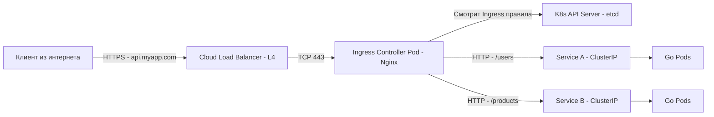

В статьях [[2. Pod, Deployment, Service]] мы разобрали, как Service (типа ClusterIP) обеспечивает стабильный IP-адрес для общения *внутри* кластера. Но как впустить внешних пользователей из интернета в ваши Go-сервисы, работающие в K8s?

Если вы используете Service типа `LoadBalancer`, облачный провайдер создаст отдельный облачный балансировщик (AWS ELB, Yandex NLB) для *каждого* сервиса. Если у вас 30 микросервисов, вы получите 30 балансировщиков и астрономический счет от облака. Кроме того, L4-балансировщики не умеют маршрутизировать трафик по HTTP-путям (например, `/api/v1` -> Go-сервис, `/admin` -> другой сервис).

Для решения этой проблемы в Kubernetes существует **Ingress**.

## Ingress: Правила vs Контроллер

Главная концепция, которую нужно усвоить: **Ingress — это не работающий сервис**. Это просто набор правил (YAML-манифест) в etcd, декларативно описывающий, как маршрутизировать внешний HTTP/HTTPS трафик.

Чтобы эти правила заработали, в кластере должен работать **Ingress Controller** (например, Nginx Ingress Controller, Traefik, Istio Ingress Gateway). Контроллер — это обычный Pod, который читает эти правила через API Server и настраивает свой внутренний прокси-сервер.



## Как работает Nginx Ingress Controller под капотом

Самый популярный контроллер в мире K8s базируется на Nginx. Как именно он переводит ваши YAML в конфигурацию Nginx?

1. В Pod'е Ingress Controller работает процесс Nginx и дополнительный Go-процесс (контроллер).
2. Go-процесс использует `client-go` (Informer), чтобы следить (Watch) за изменениями объектов Ingress, Service и Secrets в API Server.
3. Как только вы применяете `kubectl apply -f ingress.yaml`, Go-процесс замечает изменение.
4. Он генерирует новый `nginx.conf` на основе Go-шаблонов (templates).
5. Он выполняет `nginx -s reload` для применения новой конфигурации.

> [!warning] Ловушка / Gotcha
> Команда `nginx -s reload` — это дорогостоящая операция. Она форкает новый воркер и плавно завершает старый. Если вы активно обновляете Ingress-правила (например, при динамическом создании маршрутов для клиентов), частые `reload` вызовут всплеск потребления CPU и кратковременные обрывы долгих соединений (WebSockets, gRPC). Для таких сценариев используют контроллеры на базе OpenResty (с Lua-скриптами) или Envoy, которые обновляют конфигурацию в памяти без рестарта воркеров.

## Dynamic Configuration и Lua

Стандартный Nginx Ingress Controller (от community) частично решает проблему рестартов с помощью модуля **Lua**. 
Когда вы изменяете количество реплик вашего Go-деплоймента, Endpoints (IP-адреса Подов) меняются. Если бы Nginx обновлял апстримы через `reload`, это было бы катастрофой при автоскейлинге. 

Вместо этого, Go-процесс контроллера обновляет общую память (shared memory dict) Nginx через Lua API. Воркеры Nginx читают список IP-адресов прямо из памяти в режиме реального времени (balancer_by_lua_block), не требуя перезагрузки конфига.

## Специфика Go: Проблема двойного роутинга

Классическая ошибка при переходе на K8s — дублирование логики маршрутизации в Nginx и в Go-коде.

Допустим, у вас есть Ingress:
```yaml
# Ingress маршрутизирует /api/ на Go-сервис
spec:
  rules:
    http:
      paths:
      - path: /api
        pathType: Prefix
        backend:
          service:
            name: go-api
```

А в вашем Go-приложении (например, на Chi или Gin) роутер ожидает:
```go
r.Get("/api/users", getUsers) // Ожидает полный путь
```

Когда приходит запрос `GET /api/users`, Ingress передает его в Go-сервис как есть. Если вы решите использовать аннотацию `nginx.ingress.kubernetes.io/rewrite-target: /`, Nginx срежет префикс `/api` и отправит в Go запрос `GET /users`. Внезапно все ваши роуты в Go упадут с 404.

> [!tip] Собеседование
> **Вопрос:** Как правильно организовать роутинг между Ingress и Go-приложением?
> **Ответ:** Следуйте принципу Single Responsibility. Nginx Ingress должен маршрутизировать трафик по доменам (Host) и базовым путям (Path) к разным *сервисам*. А внутренний роутинг (например, `/api/users` vs `/api/products`) должен полностью принадлежать Go-приложению. Не используйте `rewrite-target` без крайней необходимости. Ваш Go-сервис должен быть самодостаточным и независимым от инфраструктурных трансформаций URL.

## WebSockets и gRPC: Нюансы конфигурации

Так как Ingress работает на L7 уровне, протоколы, отличные от стандартного HTTP/1.1, требуют явной поддержки.

### WebSockets
Для WebSockets Nginx должен выполнить HTTP Upgrade. В Nginx Ingress Controller это работает из коробки, но есть проблема **таймаутов**. По умолчанию Nginx закроет простаивающее WebSocket-соединение через 60 секунд (`proxy_read_timeout`).

Если у вас чат на Go с долгими простоями, вы обязаны увеличить таймаут через аннотации:
```yaml
annotations:
  nginx.ingress.kubernetes.io/proxy-read-timeout: "3600"
  nginx.ingress.kubernetes.io/proxy-send-timeout: "3600"
```

### gRPC
gRPC работает поверх HTTP/2. Если Ingress не настроен на HTTP/2, ваши Go-микросервисы не смогут общаться.
В Nginx Ingress Controller нужно включить бэкенд по gRPC:
```yaml
annotations:
  nginx.ingress.kubernetes.io/backend-protocol: "GRPC"
```
Это заставит Nginx проксировать трафик как HTTP/2, не преобразуя его в HTTP/1.1, что критически важно для сохранения мультиплексирования gRPC.

## TLS Termination в Ingress

Обычно именно Ingress занимается расшифровкой HTTPS (TLS Termination, как мы разбирали в [[4. TLS termination]]). K8s хранит сертификаты в объектах Secret, а Ingress на них ссылается.

Но как Ingress понимает, какой сертификат отдать клиенту, если на одном IP-адресе хостятся десятки доменов? Используется механизм **SNI (Server Name Indication)**. 

Когда клиент делает TLS Handshake, он отправляет имя домена в открытом виде (в расширении SNI). Ingress Controller читает это поле, находит в памяти подходящий сертификат из нужного Secret и использует его для установления соединения.

## Будущее: Gateway API

Ingress имеет фундаментальные ограничения: он плохо справляется с маршрутизацией TCP/UDP трафика, не поддерживает взвешенную балансировку (Canary deployments без хаков с аннотациями) и расширяется только через нестандартные аннотации.

В K8s появился преемник — **Gateway API**. Это новая CRD-модель (Custom Resource Definitions), которая разделяет роли:
*   **GatewayClass** (для администратора кластера — выбор типа контроллера).
*   **Gateway** (для сетевой команды — выдача IP и портов).
*   **HTTPRoute** (для разработчика Go-сервиса — правила роутинга).

Gateway API позволяет Go-разработчикам декларировать сложную маршрутизацию (хедеры, query-параметры, канареечные релизы) нативными объектами K8s, не требуя от админов писать кастомные Nginx-конфиги.

## Итог

1. **Ingress — это декларация**, а не сервис. Ingress Controller (Nginx/Traefik) читает правила и настраивает прокси.
2. **Механика обновления**: Изменение правил вызывает `nginx -s reload`, а изменение IP-адресов Подов обновляется через Lua в памяти (без даунтайма).
3. **Избегайте двойного роутинга**: Ingress маршрутизирует к Сервисам, а Go-роутер — внутри приложения. Не ломайте URL через `rewrite-target`.
4. **WebSockets и gRPC**: Требуют явных аннотаций (увеличение таймаутов, включение backend-protocol).
5. **Gateway API** — современная замена Ingress, решающая его архитектурные ограничения через ролевую модель и расширенную маршрутизацию.

Наши сервисы теперь доступны из интернета, но что делать, если нагрузка резко возрастет во время Черной Пятницы? В следующей статье мы разберем механизмы масштабирования: [[5. Scaling и autoscaling]].