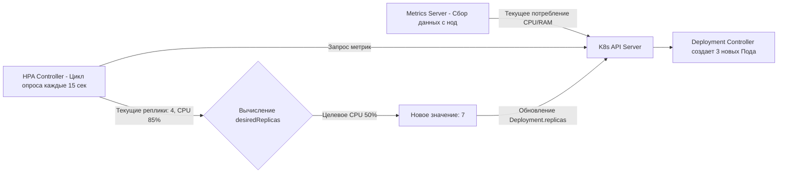

В предыдущих статьях мы настраивали Deploys, Сервисы и Ingress, предполагая, что нагрузка статична. Но в реальном мире трафик волнообразен. Ночью сервисы простаивают, а во время маркетинговых акций нагрузка может вырасти в 100 раз за минуты. 

Масштабирование (Scaling) в Kubernetes бывает ручным (`kubectl scale --replicas=10`) и автоматическим. Для Go-бэкенда автоматическое масштабирование — это не просто удобство, это способ уложить бизнес-требования в бюджет облака, не потеряв при этом в доступности.

## Horizontal Pod Autoscaler (HPA): Базовый механизм

**HPA** — это контроллер K8s, который периодически запрашивает метрики (CPU, RAM или кастомные) у API Server и увеличивает/уменьшает количество реплик (Pods) в Deployment, чтобы привести текущие метрики к целевым.

### Математика HPA

HPA использует простую, но важную формулу:
`desiredReplicas = ceil[ currentReplicas * ( currentMetricValue / desiredMetricValue ) ]`

Пример: У вас 4 реплики Go-сервиса. Target CPU = 50%. Текущий CPU = 85%.
`desiredReplicas = ceil[ 4 * (85 / 50) ] = ceil[ 6.8 ] = 7`.



> [!warning] Ловушка / Gotcha
> **Проблема Throttling (Удушения) в K8s.** 
> По умолчанию K8s использует CFS (Completely Fair Scheduler) для ограничения CPU. Лимит CPU задается в "милликорах" (millicores), например, `limits: cpu: "500m"` — это 0.5 ядра. CFS выделяет процессу квоты времени (period = 100ms). Если ваш Go-процесс сожмет свою квоту за 50мс (используя все 100% CPU), на оставшиеся 50мс ядро Linux **заморозит** процесс (throttle). 
> Метрика, которую видит HPA, — это *использование от запроса (requests)*, а не от лимита. Из-за этого приложение может тормозить (throttle), но HPA не будет скейлиться, так как метрика `requests` ниже целевой. В высоконагруженных Go-сервисах часто полностью **убирают CPU limits**, оставляя только `requests`, чтобы избежать CFS throttling.

## Mechanical Sympathy: Почему CPU и RAM — плохие метрики для Go

Стандартный HPA опирается на ресурсы. Для Java или Python это работает неплохо, но для Go — это антипаттерн.

### 1. Проблема с CPU
Go-рантайм очень эффективно использует CPU. Горутины легковесны, и даже при 10 000 активных горутинах CPU может простаивать, ожидая сети. С другой стороны, Garbage Collector или тяжелые математические вычисления могут кратковременно загрузить CPU до 100%, заставляя HPA панически скейлиться, хотя приложение отрабатывает в пределах таймаутов.

### 2. Проблема с Memory (RAM)
Go управляет памятью через GC. По умолчанию (`GOGC=100`), GC запускается, когда размер кучи удваивается. Это означает, что потребление памяти Go-приложением **всегда осциллирует** (то растет, когда аллоцируются объекты, то резко падает при сборке мусора).

Если вы настроите HPA на RAM (например, target 70%), HPA будет сходить с ума от "пилы" графика памяти:
1. Приложение аллоцирует память до 72% -> HPA скейлит вверх.
2. Срабатывает GC, память падает до 40% -> HPA скейлит вниз (через 5 минут).
3. Цикл повторяется. Это называется **Flapping (Хлопанье)**.

> [!info] Под капотом
> Чтобы стабилизировать потребление памяти в Go под HPA, всегда используйте `GOMEMLIMIT` (появился в Go 1.19). Установите его на уровне 80-90% от K8s `limits` памяти. Это заставит GC работать более проактивно, сглаживая "пилу" потребления RAM и защищая от OOM Kill.

## Кастомные метрики: Истинный Scaling для Go

Идеальный сигнал для масштабирования бэкенда — это не CPU, а **длина очереди или время обработки (Latency)**.

K8s поддерживает кастомные метрики через **Prometheus Adapter**. Он берет метрики из Prometheus и транслирует их в API Server, чтобы HPA мог их читать.

Какие метрики использовать для Go?
1. **RPS (Requests Per Second)**: Скейлимся, если количество входящих запросов на под превышает комфортный порог (например, > 1000 RPS).
2. **Goroutine Count**: Количество активных горутин в рантайме (экспортируется из `runtime.NumGoroutine()`).
3. **Latency (p99)**: Если 99-й перцентиль времени ответа превышает 200мс — добавляем поды.

Пример HPA на основе RPS (через кастомную метрику `http_requests_per_second`):
```yaml
apiVersion: autoscaling/v2
kind: HorizontalPodAutoscaler
metadata:
  name: go-api-hpa
spec:
  scaleTargetRef:
    apiVersion: apps/v1
    kind: Deployment
    name: go-api
  minReplicas: 3
  maxReplicas: 50
  metrics:
  - type: Pods
    pods:
      metric:
        name: http_requests_per_second
      target:
        type: AverageValue
        averageValue: "1000" # Скейлимся, если на 1 под больше 1000 RPS
```

## Cold Start и Readiness Пробы

Когда HPA решает добавить поды, они не появляются мгновенно. Вашему Go-приложению нужно время на:
1. Скачивание образа (если нода новая).
2. Инициализацию соединений с БД (пул коннектов).
3. Прогрев кэшей.

Если HPA скейлится из-за пиковой нагрузки, новые поды будут находиться в состоянии `ContainerCreating`, а затем `NotReady`. K8s не пустит на них трафик, пока не пройдет Readiness Probe. В этот момент старые поды могут начать падать от перегруза (Timeout/502).

> [!tip] Собеседование
> **Вопрос:** Как защититься от каскадного сбоя во время резкого скейлинга (Cold Start), когда трафик убивает старые поды, пока новые еще не готовы?
> **Ответ:** Использовать **PodDisruptionBudget (PDB)** для контроля деградации и правильно настроить `initialDelaySeconds` / Startup Probe, чтобы K8с не убивал поды слишком рано. Также на уровне Ingress/Service можно реализовать **Circuit Breaker** или **Rate Limiting**, чтобы начать отбрасывать лишний трафик (быстро возвращать 429 Too Many Requests), спасая старые поды от перегруза, пока кластер масштабируется.

## Vertical Pod Autoscaler (VPA)

В отличие от HPA, который меняет количество подов, **VPA** меняет их размер (requests и limits для CPU/RAM). Он анализирует историческое потребление и рекомендует (или автоматически перезапускает поды с новыми лимитами).

Для Go-бэкендов VPA обычно используется в режиме `Off` (только для сбора рекомендаций). Автоматический режим VPA требует рестарта Пода при изменении лимитов, что означает даунтайм. Кроме того, одновременное использование HPA и VPA на основе одинаковых метрик (например, CPU) приводит к бесконечному циклу: VPA увеличивает CPU limit -> утилизация CPU падает -> HPA скейлится вниз -> утилизация растет -> VPA снова меняет лимит.

## Cluster Autoscaler (CA)

HPA увеличивает количество Подов, но что, если на текущих нодах (серверах) нет места (недостаточно CPU/RAM для назначения)? Поды зависнут в статусе `Pending`.

Здесь вступает в игру **Cluster Autoscaler**. Он следит за Pending Pod'ами и дает команду облачному провайдеру (AWS ASG, GCP MIG) добавить новые сервера в кластер. Когда нагрузка спадает и поды удаляются, CA аккуратно дренирует (Drain) пустые сервера и удаляет их, экономя деньги.

## Итог

1. **HPA на CPU/RAM** часто некорректно работает с Go из-за модели работы GC (осцилляция памяти) и Go-планировщика (CPU не отражает реальную утилизацию).
2. **CFS Throttling** — скрытый убийца производительности в K8s. Избегайте жестких `cpu limits` для Go.
3. **GOMEMLIMIT** — обязательный флаг для сглаживания потребления памяти и защиты от OOM/HPA flapping.
4. **Кастомные метрики (RPS, Latency, Goroutines)** — единственно верный путь для умного автоскейлинга Go-бэкендов через Prometheus Adapter.
5. **VPA и CA**: VPA подбирает размер подов, CA добавляет железо в кластер. Не используйте HPA и VPA на одних и тех же метриках.

Масштабирование Stateless-приложений (REST API, gRPC) решается добавлением реплик. Но что делать с базами данных, очередями и кэшами, которым нужна строгая идентичность и постоянство данных? В следующей статье мы разберем вызовы Stateful-нагрузок: [[6. Stateful приложения]].