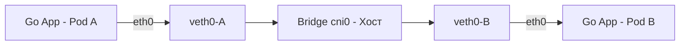

В статьях про Docker и Linux мы уже разбирали изоляцию сети через Network Namespaces и виртуальные интерфейсы (veth). Но когда вы объединяете сотни серверов в кластер Kubernetes, сетевая инфраструктура становится на порядок сложнее. 

Сеть в K8s — это не просто возможность отправить HTTP-запрос. Это фундамент для Service Discovery, балансировки и безопасности. Для Go-разработчика понимание того, как пакет путешествует от Ingress до горутины, критически важно для диагностики задержек (latency) и загадочных обрывов соединений.

## Три правила сети Kubernetes

Модель networking в K8s строится на трех жестких требованиях, без которых кластер не будет работать:
1. **IP-per-Pod**: Каждый Pod получает свой уникальный IP-адрес. Контейнеры внутри Пода делят этот IP (через `pause` контейнер).
2. **Свободная связь внутри ноды**: Любой Pod на ноде может общаться с любым другим Pod'ом на этой же ноде без NAT.
3. **Свободная связь между нодами**: Любой Pod на ноде A может общаться с любым Pod'ом на ноде B без NAT.

## Путь пакета: Pod-to-Pod на одной ноде

Как пакет попадает из вашего Go-приложения в соседний Pod? 

1. Go-приложение делает системный вызов `write()` в сокет.
2. Пакет попадает в сетевой стек ядра Linux (Network Namespace Пода).
3. Через интерфейс `eth0` (парный с `veth0` на хосте) пакет выходит из изоляции Пода.
4. Попадает на мост `cni0` (Bridge) на хост-системе.
5. Мост видит MAC-адрес назначения в своей таблице и направляет пакет в нужный `veth0`, ведущий в целевой Pod.

## Путь пакета: Межузловой трафик и CNI

Если целевой Pod находится на другой ноде, Bridge `cni0` не найдет MAC-адрес в локальной таблице. Пакет будет отправлен в маршрут по умолчанию (default route) хоста. И здесь вступает в игру **CNI (Container Network Interface)**.

CNI — это плагин, который настраивает маршрутизацию между нодами. Выбор CNI радикально влияет на производительность вашего Go-бэкенда.

### 1. Overlay-сети (VXLAN) — Flannel
Пакет оригинального Pod'а упаковывается внутрь другого UDP-пакета (инкапсуляция), который путешествует по физической сети хоста. На целевой ноде внешний пакет снимается, а внутренний отправляется в целевой Pod.
*   **Плюсы:** Работает поверх любой физической сети без её настройки.
*   **Минусы:** Огромный оверхед. Добавляется ~50 байт на заголовки, что часто приводит к фрагментации MTU. Плюс оверхед CPU на инкапсуляцию/деинкапсуляцию. Для высоконагруженных Go-бэкендов это замедляет работу.

### 2. Маршрутизация (BGP) — Calico
Calico использует протокол BGP (Border Gateway Protocol), чтобы программировать таблицы маршрутизации ядра Linux на каждой ноде. Ядро точно знает: "Если IP принадлежит Pod X на ноде Y, отправляй пакет напрямую по MAC-адресу ноды Y". Никакой инкапсуляции.
*   **Плюсы:** Нативная скорость сети (Native Routing). Отсутствие оверхеда CPU.
*   **Минусы:** Требует поддержки физической сети (сетевые коммутаторы должны пропускать BGP-маршруты).

### 3. eBPF — Cilium
Современный стандарт. Cilium обходит стандартный сетевой стек Linux (iptables, маршрутизация) и обрабатывает пакеты на самом раннем этапе в ядре с помощью eBPF программ.

> [!info] Под капотом
> В традиционном стеке пакет проходит долгий путь через Netfilter (iptables), Connection Tracking (conntrack), маршрутизацию. Это тысячи строк кода ядра на каждый пакет.
> eBPF программа, прикрепленная к сетевому интерфейсу (tc/xdp), принимает решение о маршрутизации пакета за микросекунды, минуя большинство хуков. Для Go-сервисов с миллионами RPS это снижение latency на десятки процентов. Cilium также может полностью заменить Kube-proxy.

## Сервисы и Kube-proxy: Проблема Conntrack

Как мы разбирали в [[2. Pod, Deployment, Service]], трафик на VIP (ClusterIP) сервиса перехватывается Kube-proxy и перенаправляется (DNAT) на реальный IP Пода. 

При использовании режима `iptables` Kube-proxy создает правила DNAT, а для отслеживания обратных ответов используется модуль ядра **Conntrack** (Connection Tracking Table).

> [!warning] Ловушка / Gotcha
> Таблица Conntrack имеет ограниченный размер в RAM. При экстремальных нагрузках (десятки тысяч RPS, много короткоживущих HTTP-соединений или интенсивное использование gRPC) таблица переполняется. Ядро начинает отбрасывать пакеты, и ваши Go-сервисы начинают получать случайные таймауты или ошибки `connection refused`.
> Это одна из главных причин, почему в высоконагруженных кластерах переходят на **IPVS** (использует хеш-таблицы вместо линейного списка правил) или **Cilium eBPF** (полностью обходит iptables и conntrack для Service-трафика).

## Специфика Go: DNS и HTTP/2 Connection Pooling

Две самые частые сетевые проблемы Go-микросервисов в K8s связаны не с ядром Linux, а с рантаймом Go.

### 1. Проклятие `ndots:5` в DNS
В файле `/etc/resolv.conf` внутри Пода K8s по умолчанию пишет `search default.svc.cluster.local svc.cluster.local cluster.local` и `options ndots:5`.
Если ваш Go-код обращается к сервису `billing`, в имени 0 точек (меньше 5). Чистый Go-резолвер (при `CGO_ENABLED=0`) начнет последовательно резолвить:
1. `billing.default.svc.cluster.local` (Fail)
2. `billing.svc.cluster.local` (Fail)
3. `billing.cluster.local` (Fail)
4. `billing` (Success)

Это добавляет **сотни миллисекунд** к первому запросу. 
**Решение:** Обращаться по FQDN (`billing.default.svc.cluster.local`), добавлять точку в конец (`billing.`), или настраивать `ndots:1` в Pod Spec (подCapabilites `dnsConfig`).

### 2. HTTP/2 и Connection Pooling при Restarts
Go-клиент `net/http` по умолчанию держит пул коннектов (Keep-Alive). При обновлении Deployment старые Поды исчезают, но клиент в другом Поде всё ещё может держать открытое HTTP/2 соединение с умершим IP.
Из-за мультиплексирования HTTP/2, все новые запросы могут полететь по этому "мертвому" соединению, прежде чем TCP выявит обрыв (TCP RST).

**Решение:** В Go-клиентах, ходящих в K8s сервисы, всегда настраивайте разумные таймауты и используйте механизмы Health Checks на уровне gRPC/HTTP2 (PING фреймы), либо принудительно закрывайте idle-соединения через `Transport.CloseIdleConnections()` или `Transport.IdleConnTimeout`.

## Network Policies: Изоляция в плоской сети

По умолчанию сеть в K8s "плоская": любой Pod может достучаться до любого другого Pod'а по IP. Это удобно для разработки и катастрофично для безопасности (Lateral Movement при взломе).

**NetworkPolicy** — это K8s-объект, ограничивающий трафик на уровне L3/L4 (IP и порты). Вы можете сказать: "Подам с лейблом `app=api` разрешено ходить на порт 5432 только к подам с лейблом `app=postgres`".

Важно: **NetworkPolicy реализует CNI-плагин**. Если вы используете базовый Flannel без кастомных плагинов, применение NetworkPolicy не даст никакого эффекта — они просто проигнорируются. Calico и Cilium отлично поддерживают NetworkPolicy (Cilium добавляет поддержку L7 политик, ограничивая, например, HTTP-пути).

## Итог

1. **IP-per-Pod**: Модель K8s эмулирует традиционную сеть, где каждый хост имеет свой IP, используя Network Namespaces.
2. **CNI-плагины**: Overlay (VXLAN) проще, но медленнее. BGP (Calico) быстрее. eBPF (Cilium) — абсолютный стандарт производительности, обходящий стек Linux.
3. **Conntrack**: Режим Kube-proxy `iptables` при высоких нагрузках упирается в таблицу_conntrack, вызывая потерю пакетов. Используйте IPVS или eBPF.
4. **Go DNS `ndots`**: Чистый Go-резолвер делает лишние DNS-запросы. Всегда настраивайте FQDN или `dnsConfig` в спецификации Пода.
5. **Network Policies**: Обязательны для Production, но работают только если ваш CNI-плагин их поддерживает.

Мы завершили раздел, посвященный фундаментальным кирпичикам инфраструктуры — Linux, Nginx, Docker и Kubernetes. Понимание этих слоев делает вас не просто кодером, а инженером, способным проектировать и спасать системы на любом уровне. В следующем разделе мы перейдем к тому, как объединить всё это в единый процесс — доставке кода в продакшен. В следующей статье: [[1. CI_CD и деплой]].