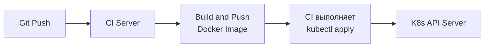
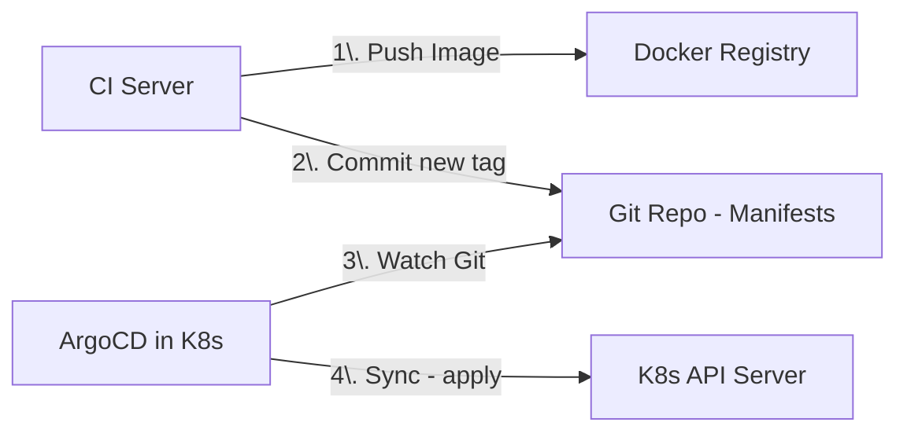

Разделы про Linux, Nginx, Docker и Kubernetes — это фундамент. Но инфраструктура мертва без процесса, который доставляет ваш Go-код на сервера. Разрыв между коммитом в репозиторий и работающим кодом в продакшене — это место, где рождаются инциденты.

CI/CD (Continuous Integration / Continuous Delivery) — это не просто написание скриптов для GitLab CI или GitHub Actions. Это инженерная дисциплина, которая обеспечивает воспроизводимость, безопасность и скорость доставки изменений. Для Go-бэкенда процесс CI/CD имеет ярко выраженную специфику, вытекающую из архитектуры языка.

## Преимущество Go: Скорость компиляции

Если вы переходите в Go из мира C++ или Java, вы привыкли к тому, что сборка проекта — это время выпить кофе (а то и сходить на обед). В Go компиляция невероятно быстрая.

Это достигается за счет архитектуры компилятора: он читает исходный код, строит AST, оптимизирует и сразу генерирует машинный код, минуя стадию промежуточного ассемблера или байт-кода (как в JVM). Быстрая сборка меняет саму культуру CI: разработчики делают коммиты чаще, пайплайны отрабатывают за минуты, а фидбек-лук сокращается.

## Этапы CI: Проверка качества

Типичный Go-пайплайн начинается с линтинга и тестирования.

### 1. Линтеры (`golangci-lint`)
В экосистеме Go нет единого официального линтера, но есть стандарт де-факто — `golangci-lint`. Это металинтер, который агрегирует десятки статических анализаторов.
Критически важные линтеры для продакшена:
*   `staticcheck`: Находит баги, которые не видит компилятор (например, использование `return` после `os.Exit` в `main`).
*   `errcheck`: Гарантирует, что вы не игнорируете ошибки (подавление через `_ = err` должно быть осознанным).
*   `govet`: Ищет подозрительные конструкции (например, некорректные форматы в `fmt.Printf`).

### 2. Тестирование с Race Detector
В Go конкурентность — норма. Но с ней приходят Data Races (состояния гонки), которые невозможно отловить обычными тестами, так как они проявляются только при специфическом порядке выполнения горутин.

Флаг `-race` подключает встроенный детектор гонок, который инструментирует код на этапе компиляции, отслеживая доступ к памяти.

```bash
go test -race -coverprofile=coverage.out ./...
```

> [!warning] Ловушка / Gotcha
> Race Detector добавляет огромный оверхед (до 5-10x по памяти и CPU). Никогда не запускайте бинарники, собранные с флагом `-race`, в продакшене! Они нужны только на этапе CI. Также помните, что Race Detector ловит гонки только в тех путях кода, которые были покрыты тестами. Он не дает 100% гарантии.

### 3. Проверка уязвимостей (`govulncheck`)
С версии Go 1.19 в тулчейн встроен инструмент `govulncheck`. Он анализирует исходный код (или бинарник) и проверяет, вызываете ли вы функции из стандартной библиотеки или зависимостей, в которых есть известные CVE (уязвимости). Он проверяет именно *call graph* (граф вызовов), игнорируя уязвимости в модулях, которые вы не используете.

## Этап CD: Сборка артефакта

Артефакт в Go — это обычно Docker-образ. Как мы разбирали в [[3. Multi stage build]], сборка должна быть двухэтапной. Но в контексте CI/CD главная проблема — это время сборки.

### Кэширование в Docker BuildKit

Скачивание модулей (`go mod download`) и компиляция стандартной библиотеки — самые долгие этапы. Docker BuildKit позволяет монтировать кэш из CI-раннера прямо внутрь контейнера-сборщика, минуя слои образа.

```dockerfile
# === Этап сборки ===
FROM golang:1.22-alpine AS builder
WORKDIR /app
COPY go.mod go.sum ./

# Монтируем кэш Go из CI-системы! Это ускоряет сборку в разы
RUN --mount=type=cache,target=/go/pkg/mod \
    go mod download

COPY . .

RUN --mount=type=cache,target=/root/.cache/go-build \
    CGO_ENABLED=0 go build -ldflags="-s -w" -trimpath -o /myapp .
```

При такой конфигурации артефакт (образ) остается чистым (без кэша), но сам процесс сборки в пайплайне будет занимать секунды, а не минуты.

## Стратегии Деплоя: Push vs. Pull (GitOps)

Когда образ протегирован и лежит в Registry (Docker Hub, ECR, Harbor), его нужно развернуть в K8s. Существует два фундаментальных подхода к тому, *кто* инициирует это действие.

### Push-модель (Классическая)
CI-система (GitLab CI, GitHub Actions) после сборки образа сама обновляет манифесты в K8s (например, выполняет `kubectl set image` или обновляет Helm chart).



*   **Плюсы:** Простота настройки.
*   **Минусы:** CI-системе нужны права (kubeconfig) на изменение кластера. Это дыра в безопасности. Если кластеров много, управлять ключами становится невозможно.

### Pull-модель (GitOps)
Современный стандарт, реализуемый инструментами вроде **ArgoCD** или **Flux**. CI-система *не имеет доступа* к кластеру. Она только пушит Docker-образ и обновляет исходники (манифесты K8s) в Git-репозитории. Внутри кластера работает агент (ArgoCD), который постоянно сверяет состояние Git с состоянием кластера.



> [!tip] Собеседование
> **Вопрос:** В чем главное преимущество GitOps (Pull-модели) перед Push-модели?
> **Ответ:** Единственный источник истины (Single Source of Truth) — это Git. Если кто-то случайно изменит конфигурацию в кластере через `kubectl edit` (Configuration Drift), ArgoCD это заметит и автоматически откатит изменения к состоянию из Git. Кроме того, CI-раннеры не имеют доступа в продакшен-кластер (Zero Trust), что резко снижает поверхность атаки.

## Mechanical Sympathy: Акт деплоя и Graceful Shutdown

Развертывание нового кода — это стресс для системы. В Kubernetes обновление Deployment убивает старый Pod и запускает новый. Как мы подробно разбирали в [[2. Pod, Deployment, Service]], самое уязвимое место — это расхождение между удалением Пода из балансировщика (iptables/IPVS) и завершением Go-процесса.

Если ваш CI/CD просто обновляет образ, вы получите обрывы соединений (502 ошибки). Правильный деплой требует:
1.  **PreStop Hook**: Выполнение `sleep 10` перед отправкой SIGTERM, чтобы дать Kube-proxy время вычистить IP Пода из таблиц маршрутизации.
2.  **Правильный Graceful Shutdown в Go**: Перехват SIGTERM, запрет новых соединений, ожидание завершения активных (с таймаутом).

## Итог

1. **Скорость Go**: Быстрая компиляция позволяет делать CI-пайплайны короткими, что улучшает фидбек для разработчиков.
2. **Инструменты**: `golangci-lint`, `govulncheck` и `-race` — обязательный минимум для CI.
3. **Кэширование BuildKit**: Используйте `--mount=type=cache` для `go mod` и build cache, чтобы ускорить сборку Docker-образов в разы.
4. **GitOps (Pull-модель)**: Отказ от выдачи прав CI-системе на кластер. Git становится единственным источником истины, а ArgoCD/Flux синхронизируют кластер с репозиторием.
5. **Graceful Shutdown**: Деплой — это не просто заливка образа, это плавная замена процессов, требующая задержек и корректной обработки сигналов.

Простая замена старых Подов на новые (Recreate) ведет к даунтайму. Как обновлять сервисы, не отключая пользователей? В следующей статье мы разберем стратегии плавного обновления: [[2. Rolling updates]].