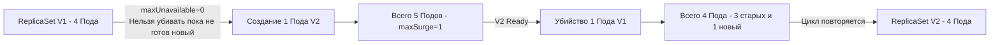

В статье [[1. CI_CD и деплой]] мы настроили пайплайн, который собирает Docker-образ и обновляет манифесты. Но что происходит в кластере Kubernetes в момент применения этого манифеста? 

Если K8s просто удалит старые Pod'ы и запустит новые (стратегия `Recreate`), пользователи, чьи запросы обрабатывались в этот момент, получат ошибки 502/503. Даунтайм неприемлем. Стандартом де-факто для обновления Stateless-бэкендов является **Rolling Update (Плавное обновление)**.

## Как работает Rolling Update под капотом

В Kubernetes Pod'ы **иммутабельны (неизменяемы)**. Вы не можете "обновить" бинарник внутри запущенного Pod'а. При обновлении образа в Deployment, K8s создает **новый ReplicaSet**, который начинает запускать новые Pod'ы, параллельно масштабируя вниз старый ReplicaSet.

Управляет этим процессом Deployment Controller, который использует два критических параметра: `maxSurge` и `maxUnavailable`.

```yaml
spec:
  strategy:
    type: RollingUpdate
    rollingUpdate:
      maxSurge: 25%       # Сколько новых Подов можно создать сверх желаемого количества
      maxUnavailable: 0   # Сколько старых Подов можно убить одновременно
```

### Математика Rolling Update

Допустим, у вас `replicas: 4`, `maxSurge: 1` (25%), `maxUnavailable: 0`.
K8s гарантирует, что в любой момент времени у вас будет работать *не меньше* 4 Pod'ов (так как unavailable = 0), и *не больше* 5 Pod'ов одновременно (4 + 1 surge).

1. K8с создает 1 новый Pod (с новой версией Go-бинарника). Всего в кластере 5 Pod'ов.
2. Новый Pod проходит Readiness Probe. K8с добавляет его в Endpoints Service'а.
3. K8с убивает 1 старый Pod. В кластере снова 4 Pod'а (3 старых, 1 новый).
4. Цикл повторяется, пока все 4 Pod'а не станут новыми.



> [!info] Под капотом
> Почему `maxUnavailable: 0` — это must-have для фронтендов и внешних API? Потому что при `maxUnavailable: 1` K8с может сначала убить старый Pod, а потом начать создавать новый. В этот момент у вас на 1 реплику меньше, и оставшиеся Pod'ы должны принять на себя весь трафик. Если они были близки к лимиту CPU, начнется Throttling и каскадный отказ.

## Самая страшная гонка (Race Condition): Потеря трафика

Даже при `maxUnavailable: 0`, во время Rolling Update вы можете получить пачку 502 ошибок. Причина кроется в асинхронности K8s и архитектуре сети.

Когда K8с решает убить старый Pod, происходит следующее:
1. Kubelet отправляет процессу сигнал `SIGTERM`.
2. K8с асинхронно удаляет IP этого Пода из объекта Endpoints.
3. Kube-proxy на *каждой ноде* кластера должен заметить изменение Endpoints и обновить правила `iptables` / `IPVS`.
4. Ваше Go-приложение получает SIGTERM, завершает Graceful Shutdown и умирает.

> [!warning] Ловушка / Gotcha
> Шаг 3 (обновление iptables на всех нодах) может занимать от 2 до 10 секунд! 
> Если ваше Go-приложение при получении SIGTERM сразу закрывает HTTP-сервер, оно перестает принимать соединения. Но на других нодах кластера Kube-proxy *ещё не обновил правила*, и Ingress/другие сервисы продолжают слать трафик на IP мертвого Пода. Результат: `Connection Refused` (502).
> 
> **Решение (обязательный паттерн):** Использовать `preStop` хук и правильный Graceful Shutdown в Go.

### Правильный Shutdown для Rolling Update

Вы должны дать K8s время вычистить ваш IP из балансировщиков, прежде чем закрывать сервер.

**1. Манифест K8s (Pod Spec):**
```yaml
lifecycle:
  preStop:
    exec:
      command: ["/bin/sh", "-c", "sleep 10"] # Спим 10 секунд, ожидая обновления iptables
terminationGracePeriodSeconds: 30 # Даем время на сон + shutdown
```

**2. Go-код:**
```go
// При получении SIGTERM (который придет ПОСЛЕ выполнения preStop хука)
ctx, stop := signal.NotifyContext(context.Background(), syscall.SIGTERM, syscall.SIGINT)
defer stop()

<-ctx.Done() // Блокируемся до SIGTERM

log.Println("Shutting down gracefully...")
shutdownCtx, cancel := context.WithTimeout(context.Background(), 15*time.Second)
defer cancel()

// Останавливаем сервер, дожидаясь активных запросов
if err := srv.Shutdown(shutdownCtx); err != nil {
    log.Printf("Server shutdown error: %v", err)
}
```

## Mechanical Sympathy: Потребление ресурсов при обновлении

Rolling Update требует **свободных ресурсов** в кластере. Параметр `maxSurge` означает, что на время деплоя у вас будет работать *больше* Pod'ов, чем обычно.

Если ваши ноды забиты под завязку (CPU/RAM requests = 100% capacity), новый Pod перейдет в статус `Pending`, потому что Scheduler не найдет для него места. Rolling Update встанет намертво. Старые Pod'ы не будут удаляться (так как `maxUnavailable: 0`), а новые не смогут стартовать.

> [!tip] Собеседование
> **Вопрос:** Как безопасно обновить Go-сервис, если в кластере нет свободных ресурсов для `maxSurge`?
> **Ответ:** Можно использовать стратегию `Recreate` (сначала убить старые, потом создать новые), но это даунтайм. Правильный инфраструктурный путь — использовать **Cluster Autoscaler (CA)**. Когда Pod переходит в `Pending`, CA автоматически заказывает у облака новые сервера (ноды), деплой продолжается на них, а после завершения обновления CA удалит пустые ноды. Но это удлиняет время деплоя на минуты (время поднятия новой EC2-инстанса).

## Rollback: Откат назад

Если новая версия Go-бинарника имеет баг (например, паничит при старте), новые Pod'ы никогда не пройдут Readiness Probe. 
В этом случае Deployment Controller остановит Rolling Update (ReplicaSet V2 не вырастет), а старые Pod'ы (ReplicaSet V1) продолжат работать и принимать трафик. Это защита K8s по умолчанию.

Если баг коварный (утечка памяти, которая проявляется через час), и вы хотите откатиться вручную, K8s хранит историю ReplicaSets:
```bash
kubectl rollout undo deployment/go-api
```
K8с просто поменяет шаблон Pod'а на предыдущую версию и запустит обратный Rolling Update. Это происходит мгновенно, так как старый ReplicaSet всё ещё существует, а старые образы лежат на нодах (не нужно скачивать из Registry).

## Итог

1. **Rolling Update** — стандарт беспроблемного обновления, использующий создание новых Pod'ов и плавное удаление старых.
2. **`maxSurge` и `maxUnavailable`** настраивают скорость и безопасность деплоя. Для публичных API используйте `maxUnavailable: 0`.
3. **Race Condition с iptables**: Всегда используйте `preStop` хук с `sleep`, чтобы дать Kube-proxy обновить маршрутизацию, иначе получите 502 ошибки.
4. **Ресурсы**: Для `maxSurge` нужны свободные ресурсы в кластере, иначе деплой зависнет в `Pending`.
5. **Откат**: K8s автоматически блокирует обновление, если новые Pod'ы не проходят Readiness, и позволяет мгновенно откатиться командой `undo`.

Rolling Update отлично работает, когда вы уверены, что новая версия на 100% совместима со старой. Но что, если вы меняете схему БД или радикально меняете API? В таких случаях требуются более сложные стратегии. В следующей статье мы разберем: [[3. Canary и blue green deploy]].