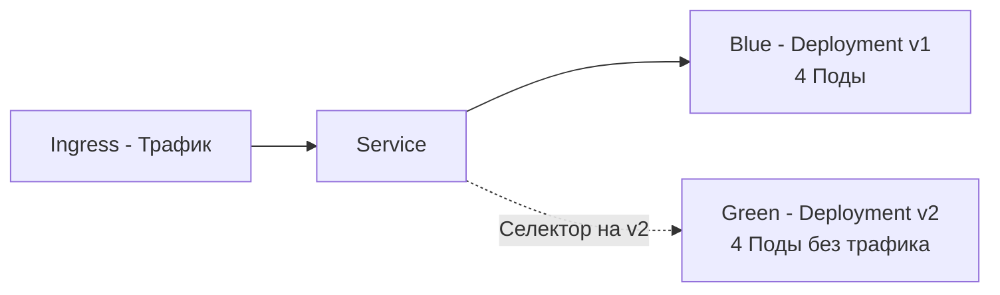
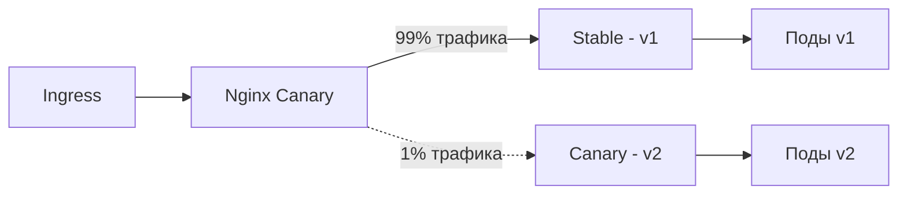

В статье [[2. Rolling updates]] мы разобрали стандартный механизм обновления K8s. Rolling Update работает великолепно, но у него есть фундаментальное ограничение: он предполагает, что новая версия приложения на 100% совместима со старой (backward compatible). 

Но что делать, если вы меняете схему базы данных? Или переписываете критически важный эндпоинт, и не уверены, что новый код не ляжет под продакшен-нагрузкой? В таких случаях Rolling Update — это прыжок с парашютом, который вы не проверили. Для минимизации рисков применяют стратегии **Blue-Green Deployment** и **Canary Release**.

## Blue-Green Deployment: Мгновенное переключение

Суть Blue-Green заключается в том, что у вас работают **два идентичных окружения** (синее и зеленое), каждое из которых включает полную версию вашего приложения.

В контексте Kubernetes это означает, что у вас есть два Deployment'а (например, `app-v1` и `app-v2`), но Service направляет трафик только на один из них.

1. **Blue (Текущий прод)**: Весь трафик идет на `app-v1`.
2. **Деплой Green**: Вы разворачиваете `app-v2` без отключения `app-v1`. Приложение стартует, прогревает кэши, проходит Readiness Probe, но не принимает пользовательский трафик.
3. **Переключение (Cutover)**: Вы меняете селектор у Service (или вес в Ingress), и трафик мгновенно перенаправляется на `app-v2`.
4. **Откат**: Если что-то пошло не так, вы переключаете Service обратно на `app-v1`. Это занимает миллисекунды.



> [!info] Под капотом
> В K8s переключение Service между Blue и Green — это просто обновление поля `selector` в YAML-манифесте. API Server обновляет Endpoints, Kube-proxy на нодах обновляет правила iptables/IPVS. Это происходит быстрее, чем создание новых Pod'ов при Rolling Update. 
> Важно: чтобы Service мог переключаться между Deployment'ами, Поды в обоих Deployment'ах должны иметь общий лейбл (например, `app: my-api`) и уникальный лейбл версии (`version: v1` / `version: v2`).

### Ахиллесова пята Blue-Green: Миграции БД

Главная проблема Blue-Green развертывания — работа с состоянием (State). Если ваш Go-код при старте выполняет `ALTER TABLE ADD COLUMN`, база данных изменится. Но старая версия (`v1`) ничего не знает про новую колонку и может упасть при `SELECT *`. Вы больше не можете откатиться на `v1`.

**Решение (Паттерн Expand/Contract):**
1. **Expand**: Сначала деплоите версию, которая *добавляет* новую колонку, но не использует её. Старый код работает стабильно.
2. **Переключение**: Переключаетесь на версию, которая *читает и пишет* в новую колонку.
3. **Contract**: Убедившись, что отката не будет, деплоите версию, которая *удаляет* старую колонку.

## Canary Deployment: Тестирование на реальных людях

Canary (Канареечный релиз) — это более плавная стратегия. Название отсылает к канарейкам, которых шахтеры брали с собой в шахту для обнаружения газа. Если канарейка выживала, шахтеры шли дальше.

В K8s Canary означает, что вы направляете лишь небольшую часть трафика (например, 1%, 5% или 10%) на новую версию, оставляя 90-99% на старой. Вы внимательно следите за метриками (ошибки, латентность). Если "канарейка" падает, вы автоматически откатываете этот 1%. Если всё хорошо — постепенно увеличиваете долю новой версии до 100%.


### Реализация Canary в Nginx Ingress

Самый популярный способ реализации Canary в K8s без Service Mesh — использование аннотаций Nginx Ingress Controller.

Вы создаете *отдельный* Ingress-ресурс для новой версии с аннотацией `canary: "true"`.

```yaml
# Stable Ingress (99% трафика)
apiVersion: networking.k8s.io/v1
kind: Ingress
metadata:
  name: my-api-stable
spec:
  rules:
  - http:
      paths:
      - path: /api
        backend:
          service:
            name: my-api-v1

---
# Canary Ingress (1% трафика)
apiVersion: networking.k8s.io/v1
kind: Ingress
metadata:
  name: my-api-canary
  annotations:
    nginx.ingress.kubernetes.io/canary: "true"
    nginx.ingress.kubernetes.io/canary-weight: "1"
spec:
  rules:
  - http:
      paths:
      - path: /api
        backend:
          service:
            name: my-api-v2
```

> [!warning] Ловушка / Gotcha
> Canary-маршрутизация в Nginx Ingress работает на уровне **L7**. Это значит, что Nginx использует `split_clients` модуль (на основе IP-адреса или случайного числа) для распределения запросов. Важно понимать, что если вы используете WebSockets или gRPC с мультиплексированием, один TCP-коннект может содержать сотни стримов. Nginx балансирует *соединения*, а не отдельные стримы внутри gRPC. Для корректного Canary-деплоя gRPC-микросервисов на Go нужен Service Mesh (Istio/Linkerd), который умеет балансировать на уровне L7 фреймов.

### Точный таргетинг (A/B Testing)

Вместо случайного процента, Canary Ingress может направлять трафик по заголовкам или куки. Это идеально для тестирования фич на внутренних пользователях (dogfooding):

```yaml
annotations:
  nginx.ingress.kubernetes.io/canary: "true"
  nginx.ingress.kubernetes.io/canary-by-header: "X-Canary"
  nginx.ingress.kubernetes.io/canary-by-header-value: "true"
```
Если ваш Go-код (или фронтенд) отправляет заголовок `X-Canary: true`, пользователь попадет на версию v2. Остальные — на v1.

## Mechanical Sympathy: Специфика Go при Canary

### 1. Проблема кэшей (Cache Incoherence)
Если ваш Go-сервис использует распределенный кэш (Redis), Canary-деплой может вызвать "мерцание" данных. 
Представьте, что v1 кладет в кэш структуру `User{Name: "Ivan"}`, а v2 добавила поле `IsAdmin: false`. 
1. Запрос идет в v2, она кладет в кэш новую структуру.
2. Следующий запрос того же пользователя балансером уходит в v1.
3. v1 десериализует кэш и паникует (или ломает бизнес-логику), так как не ожидает нового поля.

**Решение:** В Go при использовании `encoding/json` неизвестные поля по умолчанию игнорируются (это спасает от паник). Но логика может сломаться. Используйте версионирование ключей кэша (например, `user:123:v2`) или строгую обратную совместимость (никогда не удалять поля в JSON, только добавлять).

### 2. Observability: Вы не можете улучшить то, что не видите
Запуск 1% Canary бессмысленен, если вы не отличаете метрики старой версии от новой. В Prometheus метрики вашего Go-приложения (например, `http_request_duration_seconds`) обязаны иметь лейбл `version` или `image_tag`.

```go
// В Go обязательно добавляйте версию в метрики
var httpRequestDur = prometheus.NewHistogramVec(
    prometheus.HistogramOpts{
        Name: "http_request_duration_seconds",
    },
    []string{"method", "path", "version"}, // Лейбл version критически важен!
)
```
Только имея дашборд Grafana, где наложены графики p99 latency версии `v1` и `v2`, вы можете принять решение о масштабировании Canary.

> [!tip] Собеседование
> **Вопрос:** В чем разница между Canary Release и Feature Flags (Флаги функций)?
> **Ответ:** Feature Flags — это изменение логики *внутри* одного бинарника. Вы деплоите один и тот же Go-код всем, но для части пользователей (по куки/БД) включаете новый `if`. Canary — это запуск *отдельного бинарника* (изолированного процесса) для части трафика.
> Feature Flags проще в инфраструктурном плане, но имеют риск "загрязнения" кода (if-else) и не защищают от утечек памяти (OOM) в новом коде — он работает на тех же процессах, что и старый. Canary изолирует риски на уровне процессов/нод, но требует сложной инфраструктуры (Ingress/Mesh).

## Итог

1. **Blue-Green** дает мгновенное переключение и откат, но требует двойных ресурсов (2x Pods) и сложной стратегии миграции БД (Expand/Contract).
2. **Canary** — золотой стандарт безопасного деплоя. Трафик переводится на новую версию постепенно (1% -> 100%).
3. **Nginx Ingress Canary** — простой способ реализовать Canary без Service Mesh через аннотации и веса.
4. **Кэши и сериализация**: В Go используйте совместимую сериализацию JSON и версионирование ключей в Redis при сосуществовании старой и новой версий.
5. **Observability**: Canary слеп без метрик. Выделение трафика на `v2` требует лейбла `version` в Prometheus.

Развертывание новых версий — это только половина дела. Чтобы понимать, не "умерла ли канарейка", вам нужна глубокая наблюдаемость за инфраструктурой. В следующей статье мы разберем мониторинг железа и подов: [[4. Мониторинг инфраструктуры]].