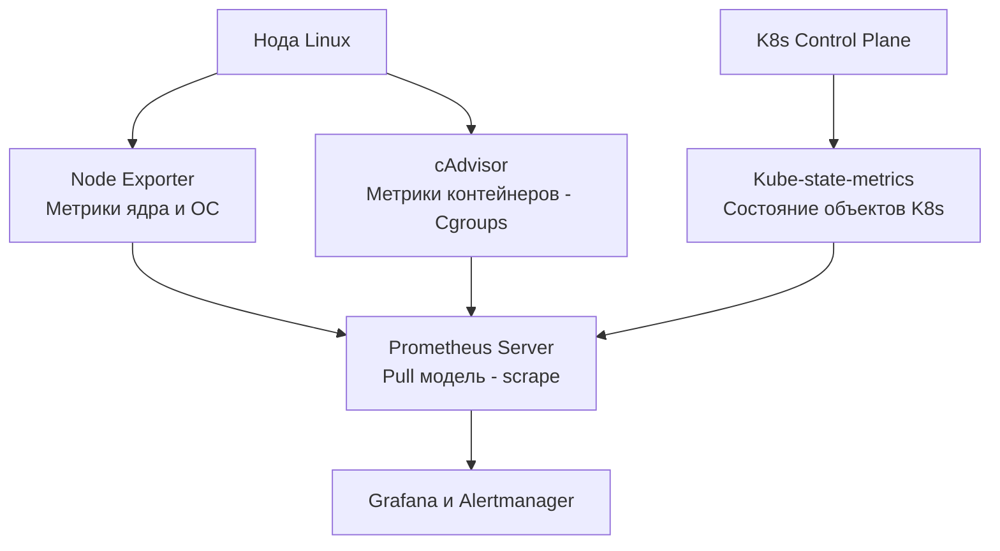

В предыдущих статьях мы настраивали деплой и масштабирование, предполагая, что приложение работает корректно. Но в мире распределенных систем слепая вера в здоровье инфраструктуры — это путь к долгим ночным дежурствам. 

Мониторинг инфраструктуры — это не просто красивые графики в Grafana. Это механический sympathy (сочувствие железу) в чистом виде: понимание того, как Linux-ядро, Cgroups, K8s и ваше Go-приложение делят физические ресурсы ноды.

## Концепция: The Four Golden Signals

Прежде чем строить дашборды, нужно понять, *что* измерять. Книга Google SRE вводит концепцию четырех золотых сигналов:
1. **Latency (Задержка)**: Время обслуживания запроса (отличайте ошибки от успешных запросов — медленные ошибки хуже быстрых).
2. **Traffic (Трафик)**: Объем запросов (RPS для HTTP, MPS для gRPC).
3. **Errors (Ошибки)**: Частота неудачных запросов (явные 500-е или неявные 200 OK с мусором внутри).
4. **Saturation (Насыщение)**: Насколько близко вы к пределу системы (CPU, RAM, дисковые очереди, пул коннектов в Go). Этот сигнал предсказывает проблемы *до* того, как они ударят по Latency.

## Архитектура наблюдаемости в K8s

Мониторинг K8s — это слоеный пирог. Вы не можете поставить один агент и получить всё.



## Слой 1: Нода (Node Exporter)

**Node Exporter** — это демон на Go, который раскрывает метрики самой машины (CPU, RAM, Disk, Network). Он не знает про K8s, он читает виртуальные файловые системы ядра Linux.

> [!info] Под капотом
> Node Exporter получает данные, парся псевдо-файловые системы:
> *   `/proc/stat` — CPU time, context switches, interrupts.
> *   `/proc/meminfo` — RAM, Swap, Page Cache.
> *   `/sys/class/block/` — статистика дискового IO.
> *   `/proc/net/dev` — байты и пакеты на сетевых интерфейсах.
> 
> Для Go-разработчика здесь важно наблюдать за **Context Switches** (переключения контекста). Если их количество аномально высоко, это значит, что планировщик Linux не справляется с количеством потоков (M в модели G-M-P), и ваши горутины проводят время в очереди на выполнение, а не работая.

### Mechanical Sympathy: iowait и_steal
При анализе CPU через Node Exporter обращайте внимание не только на `user` и `system` время, но и на:
*   **iowait**: Процент времени, когда CPU простаивал, ожидая завершения дискового IO. Высокий iowait означает, что ваши Go-процессы заблокированы на syscall `read/write` (как мы разбирали в статье [[3. Файловая система Linux]]).
*   **steal**: Время, украденное гипервизором у вашей виртуальной машины в облаке. Если steal > 5%, облако перегрузило физический хост (Noisy Neighbors), и вам пора требовать миграцию VM.

## Слой 2: Контейнер (cAdvisor)

Как K8s понимает, сколько CPU/RAM потребляет контейнер? Он читает метрики из **Cgroups**. Для этого в K8s встроен **cAdvisor** (Container Advisor), который также написан на Go.

> [!warning] Ловушка / Gotcha
> Самая частая боль Go-разработчиков в K8s — метрика `container_cpu_cfs_throttled_periods_total`.
> Как мы обсуждали в [[5. Scaling и autoscaling]], если вы задали `resources.limits.cpu: "500m"` (0.5 ядра), CFS (Completely Fair Scheduler) выделяет контейнеру квоту — 50мс процессорного времени каждые 100мс. 
> Если ваш Go-сервис отработает свои 50мс за 60мс (из-за всплеска трафика или тяжелого GC), оставшиеся 40мс **ядро заморозит процесс** (Throttle). На графике это выглядит так: трафик есть, а CPU падает до нуля, и Latency взлетает до небес. Если вы видите throttle-графики — либо увеличивайте лимиты, либо используйте `GOMEMLIMIT`, чтобы снизить оверхед GC.

## Слой 3: Объекты K8s (Kube-state-metrics)

**Kube-state-metrics** не смотрит на железо. Он смотрит в API Server и генерирует метрики о *состоянии объектов K8s*.
*   Сколько реплик Deployment запрошено и сколько реально работает?
*   Сколько Подов в статусе `CrashLoopBackOff`?
*   Сколько PVC (дисков) в статусе `Pending`?

> [!tip] Собеседование
> **Вопрос:** В чем разница между метриками от cAdvisor и Kube-state-metrics?
> **Ответ:** cAdvisor отвечает на вопрос "Как?" (Какая загрузка CPU у этого Пода?). Kube-state-metrics отвечает на вопрос "Что?" (Находится ли этот Под в статусе Ready?). Вы алертитесь на данные Kube-state-metrics, если Pod падает, и на данные cAdvisor, если Pod работает, но ему не хватает ресурсов.

## Prometheus: Архитектура Pull-модели

Prometheus — стандарт де-факто для мониторинга в K8s. В отличие от систем Push-модели (Graphite, Datadog), Prometheus сам ходит (scrape) по HTTP-эндпоинтам ваших приложений и забирает метрики.

**Почему Pull лучше для инфраструктуры?**
1. **Обнаружение отказов**: Если приложение полностью зависло (deadlock) или нода упала, оно не сможет *отправить* метрику (Push). В Push-системах это выглядит как "стабильность" (нет данных — нет проблем). Prometheus же явно видит, что scrape упал, и поднимает алерт `TargetDown`.
2. **Service Discovery**: Prometheus интегрирован с K8s API. Он сам находит все Поды с нужным лейблом (например, `prometheus.io/scrape: "true"`) и начинает их опрашивать, не требуя ручного добавления IP-адресов.

## Интеграция Go: Runtime-метрики

Библиотека `prometheus/client_golang` делает магию: при инициализации она автоматически регистрирует коллектор `collectors.NewGoCollector()`, который вытаскивает метрики самого Go-рантайма.

Для инфраструктурного мониторинга Go-сервиса критически важны:
1. `go_goroutines`: Количество горутин. Резкий рост без увеличения RPS — признак утечки горутин (goroutine leak).
2. `go_gc_duration_seconds`: Время работы Garbage Collector. Всплески означают, что GC работает тяжело (возможно, из-за фрагментации кучи).
3. `go_memstats_heap_inuse_bytes`: Размер кучи в использовании. Должен иметь паттерн "пилы" (рост аллокаций -> сброс GC). Если график только растет — memory leak.

```go
package main

import (
	"net/http"
	"github.com/prometheus/client_golang/prometheus/promhttp"
)

func main() {
	// Стандартный обработчик, отдающий и кастомные метрики, и go_ метрики
	http.Handle("/metrics", promhttp.Handler())
	http.ListenAndServe(":2112", nil)
}
```

> [!warning] Ловушка / Gotcha
> Разделяйте метрики **контейнера** (cAdvisor) и метрики **приложения** (Prometheus client).
> Если ваш Go-сервис потребляет 1 ГБ памяти, а метрика `container_memory_working_set_bytes` показывает 1.5 ГБ, разницу составляют Page Cache и overhead Cgroups. Ориентироваться только на метрики ОС при поиске утечек памяти в Go бессмысленно. Смотрите на `go_memstats_heap_inuse_bytes` и `container_memory_working_set_bytes` совместно.

## Итог

1. **Four Golden Signals**: Стройте дашборды вокруг Latency, Traffic, Errors и Saturation.
2. **Node Exporter**: Читает `/proc` и `/sys`. Следите за `iowait` и `context switches`.
3. **cAdvisor**: Читает Cgroups. Если видите `cfs_throttled`, ваше Go-приложение душится лимитами CPU.
4. **Kube-state-metrics**: Мониторит желаемое vs текущее состояние K8s (CrashLooping, Replicas).
5. **Pull модель Prometheus**: Идеально для обнаружения "мертвых" сервисов, так как отсутствие ответа на scrape — это само по себе событие.
6. **Go Runtime**: Обязательно мониторьте `go_goroutines` и `go_gc_duration_seconds` для раннего обнаружения утечек ресурсов.

Метрики показывают нам *что* сломалось и *когда*, но редко говорят *почему*. Чтобы понять коренную причину падения или зависания, нужны контекстные данные о событиях. В следующей статье мы разберем логирование инфраструктуры: [[5. Логи инфраструктуры]].
В предыдущих статьях мы настраивали деплой и масштабирование, предполагая, что приложение работает корректно. Но в мире распределенных систем слепая вера в здоровье инфраструктуры — это путь к долгим ночным дежурствам. 

Мониторинг инфраструктуры — это не просто красивые графики в Grafana. Это механический sympathy (сочувствие железу) в чистом виде: понимание того, как Linux-ядро, Cgroups, K8s и ваше Go-приложение делят физические ресурсы ноды.

## Концепция: The Four Golden Signals

Прежде чем строить дашборды, нужно понять, *что* измерять. Книга Google SRE вводит концепцию четырех золотых сигналов:
1. **Latency (Задержка)**: Время обслуживания запроса (отличайте ошибки от успешных запросов — медленные ошибки хуже быстрых).
2. **Traffic (Трафик)**: Объем запросов (RPS для HTTP, MPS для gRPC).
3. **Errors (Ошибки)**: Частота неудачных запросов (явные 500-е или неявные 200 OK с мусором внутри).
4. **Saturation (Насыщение)**: Насколько близко вы к пределу системы (CPU, RAM, дисковые очереди, пул коннектов в Go). Этот сигнал предсказывает проблемы *до* того, как они ударят по Latency.

## Архитектура наблюдаемости в K8s

Мониторинг K8s — это слоеный пирог. Вы не можете поставить один агент и получить всё.


## Слой 1: Нода (Node Exporter)

**Node Exporter** — это демон на Go, который раскрывает метрики самой машины (CPU, RAM, Disk, Network). Он не знает про K8s, он читает виртуальные файловые системы ядра Linux.

> [!info] Под капотом
> Node Exporter получает данные, парся псевдо-файловые системы:
> *   `/proc/stat` — CPU time, context switches, interrupts.
> *   `/proc/meminfo` — RAM, Swap, Page Cache.
> *   `/sys/class/block/` — статистика дискового IO.
> *   `/proc/net/dev` — байты и пакеты на сетевых интерфейсах.
> 
> Для Go-разработчика здесь важно наблюдать за **Context Switches** (переключения контекста). Если их количество аномально высоко, это значит, что планировщик Linux не справляется с количеством потоков (M в модели G-M-P), и ваши горутины проводят время в очереди на выполнение, а не работая.

### Mechanical Sympathy: iowait и_steal
При анализе CPU через Node Exporter обращайте внимание не только на `user` и `system` время, но и на:
*   **iowait**: Процент времени, когда CPU простаивал, ожидая завершения дискового IO. Высокий iowait означает, что ваши Go-процессы заблокированы на syscall `read/write` (как мы разбирали в статье [[3. Файловая система Linux]]).
*   **steal**: Время, украденное гипервизором у вашей виртуальной машины в облаке. Если steal > 5%, облако перегрузило физический хост (Noisy Neighbors), и вам пора требовать миграцию VM.

## Слой 2: Контейнер (cAdvisor)

Как K8s понимает, сколько CPU/RAM потребляет контейнер? Он читает метрики из **Cgroups**. Для этого в K8s встроен **cAdvisor** (Container Advisor), который также написан на Go.

> [!warning] Ловушка / Gotcha
> Самая частая боль Go-разработчиков в K8s — метрика `container_cpu_cfs_throttled_periods_total`.
> Как мы обсуждали в [[5. Scaling и autoscaling]], если вы задали `resources.limits.cpu: "500m"` (0.5 ядра), CFS (Completely Fair Scheduler) выделяет контейнеру квоту — 50мс процессорного времени каждые 100мс. 
> Если ваш Go-сервис отработает свои 50мс за 60мс (из-за всплеска трафика или тяжелого GC), оставшиеся 40мс **ядро заморозит процесс** (Throttle). На графике это выглядит так: трафик есть, а CPU падает до нуля, и Latency взлетает до небес. Если вы видите throttle-графики — либо увеличивайте лимиты, либо используйте `GOMEMLIMIT`, чтобы снизить оверхед GC.

## Слой 3: Объекты K8s (Kube-state-metrics)

**Kube-state-metrics** не смотрит на железо. Он смотрит в API Server и генерирует метрики о *состоянии объектов K8s*.
*   Сколько реплик Deployment запрошено и сколько реально работает?
*   Сколько Подов в статусе `CrashLoopBackOff`?
*   Сколько PVC (дисков) в статусе `Pending`?

> [!tip] Собеседование
> **Вопрос:** В чем разница между метриками от cAdvisor и Kube-state-metrics?
> **Ответ:** cAdvisor отвечает на вопрос "Как?" (Какая загрузка CPU у этого Пода?). Kube-state-metrics отвечает на вопрос "Что?" (Находится ли этот Под в статусе Ready?). Вы алертитесь на данные Kube-state-metrics, если Pod падает, и на данные cAdvisor, если Pod работает, но ему не хватает ресурсов.

## Prometheus: Архитектура Pull-модели

Prometheus — стандарт де-факто для мониторинга в K8s. В отличие от систем Push-модели (Graphite, Datadog), Prometheus сам ходит (scrape) по HTTP-эндпоинтам ваших приложений и забирает метрики.

**Почему Pull лучше для инфраструктуры?**
1. **Обнаружение отказов**: Если приложение полностью зависло (deadlock) или нода упала, оно не сможет *отправить* метрику (Push). В Push-системах это выглядит как "стабильность" (нет данных — нет проблем). Prometheus же явно видит, что scrape упал, и поднимает алерт `TargetDown`.
2. **Service Discovery**: Prometheus интегрирован с K8s API. Он сам находит все Поды с нужным лейблом (например, `prometheus.io/scrape: "true"`) и начинает их опрашивать, не требуя ручного добавления IP-адресов.

## Интеграция Go: Runtime-метрики

Библиотека `prometheus/client_golang` делает магию: при инициализации она автоматически регистрирует коллектор `collectors.NewGoCollector()`, который вытаскивает метрики самого Go-рантайма.

Для инфраструктурного мониторинга Go-сервиса критически важны:
1. `go_goroutines`: Количество горутин. Резкий рост без увеличения RPS — признак утечки горутин (goroutine leak).
2. `go_gc_duration_seconds`: Время работы Garbage Collector. Всплески означают, что GC работает тяжело (возможно, из-за фрагментации кучи).
3. `go_memstats_heap_inuse_bytes`: Размер кучи в использовании. Должен иметь паттерн "пилы" (рост аллокаций -> сброс GC). Если график только растет — memory leak.

```go
package main

import (
	"net/http"
	"github.com/prometheus/client_golang/prometheus/promhttp"
)

func main() {
	// Стандартный обработчик, отдающий и кастомные метрики, и go_ метрики
	http.Handle("/metrics", promhttp.Handler())
	http.ListenAndServe(":2112", nil)
}
```

> [!warning] Ловушка / Gotcha
> Разделяйте метрики **контейнера** (cAdvisor) и метрики **приложения** (Prometheus client).
> Если ваш Go-сервис потребляет 1 ГБ памяти, а метрика `container_memory_working_set_bytes` показывает 1.5 ГБ, разницу составляют Page Cache и overhead Cgroups. Ориентироваться только на метрики ОС при поиске утечек памяти в Go бессмысленно. Смотрите на `go_memstats_heap_inuse_bytes` и `container_memory_working_set_bytes` совместно.

## Итог

1. **Four Golden Signals**: Стройте дашборды вокруг Latency, Traffic, Errors и Saturation.
2. **Node Exporter**: Читает `/proc` и `/sys`. Следите за `iowait` и `context switches`.
3. **cAdvisor**: Читает Cgroups. Если видите `cfs_throttled`, ваше Go-приложение душится лимитами CPU.
4. **Kube-state-metrics**: Мониторит желаемое vs текущее состояние K8s (CrashLooping, Replicas).
5. **Pull модель Prometheus**: Идеально для обнаружения "мертвых" сервисов, так как отсутствие ответа на scrape — это само по себе событие.
6. **Go Runtime**: Обязательно мониторьте `go_goroutines` и `go_gc_duration_seconds` для раннего обнаружения утечек ресурсов.

Метрики показывают нам *что* сломалось и *когда*, но редко говорят *почему*. Чтобы понять коренную причину падения или зависания, нужны контекстные данные о событиях. В следующей статье мы разберем логирование инфраструктуры: [[5. Логи инфраструктуры]].