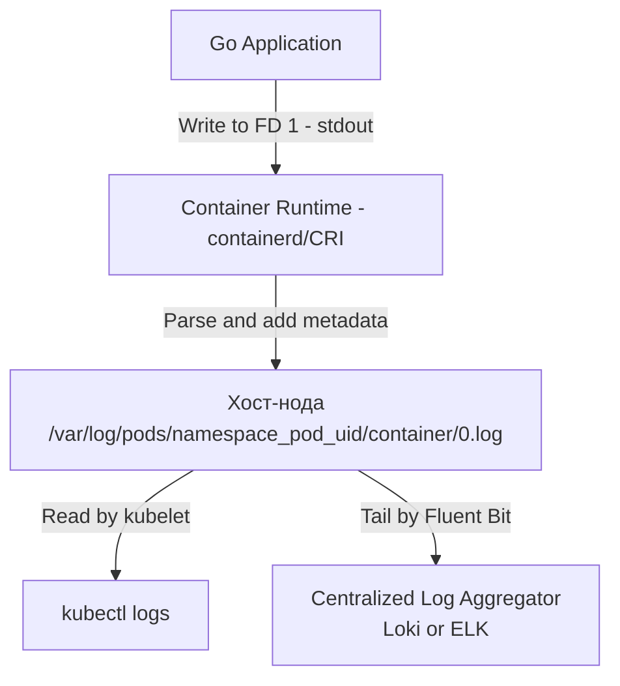

В статье [[4. Мониторинг инфраструктуры]] мы настраивали метрики. Метрики отвечают на вопрос *«Что сломалось и когда?»*. Но чтобы понять *«Почему это сломалось?»*, нужны логи. 

В традиционном подходе (на голом железе) приложение пишет логи в файл, а администратор настраивает `logrotate`. В мире контейнеров и Kubernetes эта модель рушится. Поды эфемерны: если контейнер упал и перезапустился, все логи, написанные внутри его файловой системы (OverlayFS), исчезнут навсегда.

Инфраструктурное логирование в K8s требует полного пересмотра парадигмы: от записи в файлы к потоковой передаче (streaming) и агрегации.

## Философия: Всё есть поток (Stream)

В Linux приложение общается с внешним миром через файловые дескрипторы. Стандартный вывод (stdout, FD 1) и стандартный поток ошибок (stderr, FD 2) — это потоки байт. 

Docker и Kubernetes перехватывают эти потоки. Когда ваше Go-приложение делает `fmt.Println` или `slog.Info`, рантайм пишет данные в FD 1. Container Runtime (containerd) перехватывает этот поток, добавляет метаданные (имя контейнера, timestamp) и сохраняет на диск хост-ноды в формате JSON.



> [!info] Под капотом
> В Kubernetes путь к логам на ноде строится по строгой конвенции: `/var/log/pods/<namespace>_<pod-name>_<pod-uid>/<container-name>/<restart-count>.log`. Когда вы выполняете `kubectl logs`, Kubelet просто читает этот файл и отдает вам по HTTP. Поэтому `kubectl logs` работает быстро и не требует общения с API Server'ом для стриминга самого потока.

## Опасность неограниченных логов (Disk Pressure)

По умолчанию Docker использует лог-драйвер `json-file` без ротации. Если ваше Go-приложение уйдет в бесконечный цикл с `log.Printf`, оно забьет логами весь диск хост-ноды. 

Когда на ноде заканчивается место, происходят страшные вещи:
1. Containerd не может создать новый контейнер.
2. Kubelet перестает отправлять heartbeat в API Server, и нода выпадает из кластера (Status `NotReady`).
3. Etcd (если он на этой ноде) падает, так как не может сделать `fsync`.

**Решение:** В K8s обязательно настраивать лимиты логов в конфигурации Kubelet (`/var/lib/kubelet/config.yaml`):
```yaml
containerLogMaxSize: "50Mi"    # Максимальный размер одного лог-файла до ротации
containerLogMaxFiles: 5        # Сколько старых лог-файлов хранить
```
Когда файл достигает 50 МБ, CRI делает `rotate` (переименовывает его в `.1` и создает новый). 

## Mechanical Sympathy: Блокировка на записи (Blocking Writes)

Это одна из самых неочевидных проблем логирования в Go-бэкендах под нагрузкой. 

Запись в `stdout` в Go по умолчанию синхронна. Когда вы делаете `slog.Info`, Go-рантайм делает системный вызов `write(1, data)`. В обычных условиях он отрабатывает мгновенно. Но что, если процесс, читающий из пайпа (containerd), не успевает забирать данные?

Если буфер пайпа (pipe buffer в Linux, обычно 64 КБ) переполняется, ядро Linux **блокирует** системный вызов `write`. Ваша Go-горутина, которая должна была обработать HTTP-запрос за 5мс, зависает на 200мс, ожидая, пока containerd освободит место в буфере. Это приводит к лавинообразному росту Latency (tail latency), который невозможно объяснить профилировщиком CPU.

> [!warning] Ловушка / Gotcha
> Классический сценарий: на ноде начался Disk Pressure, containerd притормозил запись на диск. В этот момент ваши Go-сервисы начинают деградировать по Latency, хотя CPU и RAM свободны. Никогда не синхронизируйте бизнес-логику с IO-операциями логирования. Используйте асинхронные буферы или отдельные горутины для записи логов.

## Архитектура агрегации логов: DaemonSet vs Sidecar

Чтобы логи попали в Grafana Loki или Elasticsearch, их нужно собрать с нод. В K8s есть два паттерна:

### 1. DaemonSet (Стандарт индустрии)
На каждой ноде запускается один Pod с агентом сбора (Fluent Bit, Promtail, Filebeat). Он монтирует `/var/log/pods` хоста и читает логи всех контейнеров напрямую.
*   **Плюсы:** Минимальный оверхед (1 агент на ноду), не требует изменений в ваших Deployment'ах.
*   **Минусы:** Агент не знает метаданных K8s (имя Deployment, неймспейс). Ему приходится обращаться к API Server, чтобы обогатить логи лейблами.

### 2. Sidecar (Для изоляции)
В каждый Pod вашего приложения добавляется контейнер с логгером (например, `fluentd`). Ваше Go-приложение пишет логи в локальный файл (shared Volume между контейнерами Пода), а Sidecar их читает и отправляет.
*   **Плюсы:** Идеальная изоляция (можно парсить логи специфичным для сервиса образом), логи не теряются при падении сети на ноде.
*   **Минусы:** Колоссальный расход ресурсов (CPU/RAM). Если у вас 100 Подов, у вас работает 100 агентов. Это антипаттерн для микросервисов.

## Специфика Go: Структурированные логи (`log/slog`)

До Go 1.21 стандартная библиотека `log` писала неструктурированный текст. В мире ELK/Loki парсить текст регулярками — это боль и потеря производительности.

С появлением `log/slog` писать JSON-логи стало идиоматичным стандартом:

```go
package main

import (
	"log/slog"
	"net/http"
	"os"
)

func main() {
	// Обязательно JSON для K8s инфраструктуры
	logger := slog.New(slog.NewJSONHandler(os.Stdout, &slog.HandlerOptions{
		Level: slog.LevelInfo,
	}))
	slog.SetDefault(logger)

	http.HandleFunc("/", func(w http.ResponseWriter, r *http.Request) {
		// Логи автоматически обогатятся ключами user_id и path
		slog.Info("request processed",
			slog.String("path", r.URL.Path),
			slog.Int("user_id", 42),
		)
	})
	http.ListenAndServe(":8080", nil)
}
```

> [!tip] Собеседование
> **Вопрос:** Как Fluent Bit/Loki корректно склеивает многострочный стектрейс (multiline logs) при панике в Go?
> **Ответ:** Это классическая боль. Если Go-приложение паникует, оно выплевывает 20-30 строк стектрейса. По умолчанию агент логирования каждую строку (с новым `\n`) интерпретирует как отдельный лог-энтри.
> При использовании `log/slog` в формате JSON проблема решается магией: вся паника (включая переносы строк) экранируется в одно строковое поле JSON-объекта (`"msg":"runtime error...\\n goroutine 1...\\n"`). Парсер JSON во Fluent Bit понимает, что это один объект, и сохраняет стектрейс целиком. Это еще один аргумент за JSON-логирование в Go.

## Безопасность: Секреты в логах

В K8s управление секретами реализовано через [[3. ConfigMap и Secret]]. Но если ваше Go-приложение логирует структуру запроса целиком (например, `slog.Info("login", slog.Any("body", req))`), вы можете случайно записать пароль пользователя в stdout.

Этот пароль попадет в `/var/log/pods`, затем в Fluent Bit, а оттуда — в Elasticsearch, где его прочитает любой разработчик. 

**Правила безопасности логов в Go:**
1. Никогда не логируйте тела HTTP-запросов (Request Body) целиком.
2. Используйте типы-обертки для конфиденциальных данных, скрывающие значение при форматировании (например, переопределение метода `String()`).
3. На уровне Fluent Bit используйте фильтры `grep` или `parser` для маскирования полей, выглядящих как кредитные карты (PCI DSS) или токены.

## Итог

1. **Эфемерность**: Логи внутри контейнеров исчезают при пересоздании Пода. Приложение должно писать только в `stdout/stderr`.
2. **Disk Pressure**: Неограниченные логи убивают ноды. Всегда настраивайте `containerLogMaxSize` в Kubelet.
3. **Блокировка записи (Blocking Write)**: При проблемах с IO на ноде синхронная запись в stdout заблокирует Go-горутину. Используйте асинхронные обертки или будьте готовы к скачкам Latency.
4. **DaemonSet vs Sidecar**: Используйте DaemonSet (Fluent Bit/Promtail) для сбора логов с нод — это стандарт, не тратящий ресурсы кластера.
5. **`log/slog` и JSON**: Структурированные логи в JSON формате решают проблему парсинга, склейки многострочных стектрейсов и отлично интегрируются с современными системами агрегации.

Метрики показывают масштаб трагедии, логи — её причину. Но иногда для поиска бага нужны данные о конкретном запросе, прошедшем через всю распределенную систему. В следующей статье мы объединим всё это в единый процесс поиска неисправностей: [[6. Troubleshooting продакшена]].