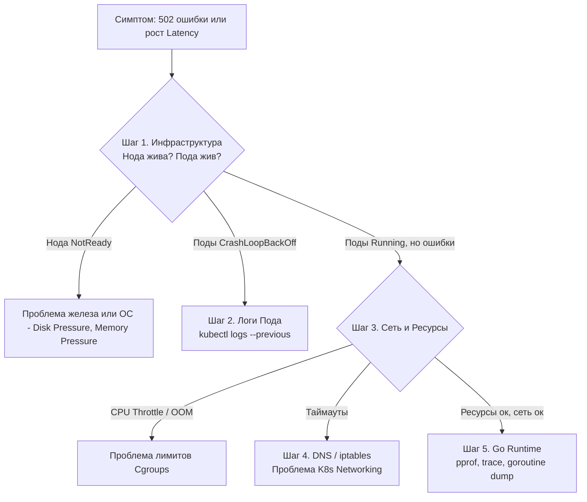

Как бы тщательно мы ни проектировали систему, масштабировали её и не настраивали мониторинг, в продакшене рано или поздно что-то сломается. Трафик превысит лимиты, сеть моргнет, а в Go-коде затаится гонка, которую не поймал `-race` в CI.

Troubleshooting (поиск и устранение неисправностей) в распределенных системах — это не искусство, а строгая методология, основанная на понимании того, как слои инфраструктуры взаимодействуют друг с другом. Вы должны уметь быстро локализовать проблему: это баг в вашем Go-коде, ошибка конфигурации K8s или проблема на уровне ядра Linux?

## Метод воронки: От симптома к корню

Главная ошибка при дебаге — сразу лезть в код. Система огромна, и без сужения круга поиска вы потратите часы. Используйте подход "Воронка": начинайте с широких инфраструктурных метрик и спускайтесь до уровня системных вызовов.



## Кейс 1: Убийца OOM (Out of Memory)

Ситуация: Поды вашего Go-сервиса постоянно перезапускаются. В метриках K8s виден рост памяти, а затем смерть.

### Диагностика
1. Выполняем `kubectl describe pod <name>`. В событиях (Events) внизу ищем `OOMKilled`. В K8s это означает, что процесс превысил лимит памяти, заданный в `resources.limits.memory`.
2. Смотрим логи `kubectl logs --previous`. При OOM Kill процесс умирает от `SIGKILL` (сигнал 9), который нельзя перехватить. Логов от самого приложения не будет — оно убито ядром.

> [!info] Под капотом
> Когда вы задаете `limits.memory: 512Mi`, K8s настраивает Cgroup для этого Пода. Если процесс пытается аллоцировать память сверх лимита Cgroup, ядро Linux вызывает OOM Killer. OOM Killer оценивает "вину" процессов (oom_score) и отправляет `SIGKILL` самому пожирающему память процессу. Ваш Go-рантайм даже не успеет запустить `defer` функции.

### Решение (Go-специфика)
Если приложение действительно требует больше памяти, не спешите просто увеличивать лимит! Возможно, проблема в Garbage Collector.
Убедитесь, что вы используете `GOMEMLIMIT` (с Go 1.19). Без него GC видит память всей ноды (или Cgroup, но работает не оптимально) и ленится собирать мусор, пока не упрется в потолок. Установите `GOMEMLIMIT=450MiB` (чуть меньше лимита K8s), чтобы GC начал работать проактивнее.

## Кейс 2: Призрачная задержка (CPU Throttling)

Ситуация: P99 Latency периодически взлетает до небес, хотя средний CPU (Average) выглядит нормально.

### Диагностика
Смотрим метрики Prometheus: `container_cpu_cfs_throttled_periods_total / container_cpu_cfs_periods_total`. Если этот процент больше 0, ваш Go-код "душится" (throttled) планировщиком Completely Fair Scheduler (CFS).

> [!warning] Ловушка / Gotcha
> Вы установили `limits.cpu: "1"` (1000 millicores). В K8s это реализовано через квоты CFS: период 100мс, квота 100мс. Ваш Go-сервис может отработать свою квоту за 60мс, а оставшиеся 40мс ядро Linux **полностью заморозит** процесс (Throttle), даже если физические ядра CPU простаивают. В этот момент все горутины Go, ожидающие выполнения, встанут в очередь, и Latency взорвется.

### Решение
Для Go-бэкендов, чувствительных к Latency, **лучше вообще убрать `cpu limits`**, оставив только `requests`. Планировщик K8s (на основе `requests`) гарантирует процессу минимум CPU, а без `limits` он сможет потреблять свободные такты на ноде (burst) без штрафов. Это стандартная практика для Google и многих крупных компаний.

## Кейс 3: Сетевые таймауты и ДНС

Ситуация: Go-сервис при запросе к другому микросервису или БД получает `context deadline exceeded`.

### Диагностика (Уровень ОС)
Если вы подозреваете сеть, `kubectl exec` вам не поможет (особенно в `distroless` образах, где нет `curl` или `ping`).

Используйте **Ephemeral Containers** (введены в K8s 1.25):
```bash
kubectl debug -it <failing-pod> --image=busybox --target=<container-name> 
```
Эта команда добавит временный контейнер с инструментами (busybox) в тот же Pod, разделив с ним Network Namespace. Теперь вы можете делать `wget`, `nslookup` или `traceroute` от лица вашего Go-приложения.

> [!tip] Собеседование
> **Вопрос:** Ваш Go-сервис логирует `i/o timeout` при подключении к БД. Как понять, проблема в сети (пакеты дропаются) или в БД (она перегружена и не принимает TCP SYN)?
> **Ответ:** По времени ошибки. Если БД перегружена, ядро всё равно ответит на SYN пакетом SYN-ACK (через backlog), и соединение установится, но затем Go получит таймаут на чтение/запись.
> Если вы получаете таймаут *на стадии установки соединения* (Dial timeout), значит, SYN-пакет не дошел или SYN-ACK не вернулся. Это сетевая проблема (iptables дропают пакеты, проблемы с CNI или физической сетью). Для глубокой диагностики используйте `tcpdump` на ноде (через `kubectl debug` для ноды).

## Кейс 4: Утечка горутин (Goroutine Leak)

Ситуация: Потребление памяти плавно растет, OOM не наступает, но сервис становится вялым. Метрика `go_goroutines` ползет вверх.

### Диагностика (Уровень Go)
Вам нужен дамп стеков горутин. В Go он доступен через `pprof`.
Если вы не expose `pprof` на внешний интерфейс (что в проде часто запрещено политиками безопасности), вы можете получить дамп через сигнал `SIGQUIT`.

Отправьте сигнал процессу (PID 1 в контейнере):
```bash
kubectl exec <pod-name> -- kill -SIGQUIT 1
```
По умолчанию Go-рантайм при получении `SIGQUIT` дампит стеки всех горутин в `stderr`. Вы увидите это в логах (`kubectl logs`).

> [!warning] Ловушка / Gotcha
> Будьте осторожны с `SIGQUIT`! В старых версиях Go (до 1.21) дамп тысяч горутин мог заблокировать рантайм на секунды. Также `SIGQUIT` по умолчанию завершает процесс. Убедитесь, что ваша система автоматически перезапустит Под (RestartPolicy: Always). Более безопасный способ — прочитать дампы через механизм `runtime/pprof` и записать в файл, или использовать `curl http://localhost:6060/debug/pprof/goroutine?debug=2`, если pprof открыт внутри Пода.

## eBPF и bpftrace: Хирургия ядра

Иногда проблема кроется на стыке Go и Linux (например, медленные системные вызовы, которые не видны в CPU профайлере Go). 

Современный подход — использование **eBPF** (Extended Berkeley Packet Filter). Инструменты вроде `bpftrace` позволяют писать скрипты, которые выполняются безопасно в ядре Linux, перехватывая системные вызовы без изменения вашего Go-кода и без оверхеда `strace`.

Пример bpftrace скрипта для мониторинга времени системного вызова `openat` (открытие файлов):
```c
tracepoint:syscalls:sys_enter_openat { @start[tid] = nsecs; }
tracepoint:syscalls:sys_exit_openat /@start[tid]/ {
    @ns[pid, comm] = hist(nsecs - @start[tid]);
    delete(@start[tid]);
}
```
Это позволит вам увидеть, не блокирует ли ваше Go-приложение медленные дисковые операции на ноде (например, из-за проблем с EBS в AWS).

## Итог

1. **Метод воронки**: Не лезьте в код сразу. Проверьте ноду -> Под -> Сеть -> Рантайм Go -> Код.
2. **OOM Kill**: `SIGKILL` от ядра не оставляет логов. Проверяйте Events Пода и настраивайте `GOMEMLIMIT`.
3. **CPU Throttling**: CFS квоты — главный враг Latency. Убирайте `cpu limits` для сервисов, требующих низкой задержки.
4. **Ephemeral Containers**: Единственный безопасный способ дебажить сеть в `distroless`/`scratch` контейнерах.
5. **SIGQUIT и pprof**: Инструменты для поиска утечек горутин и deadlocks прямо в продакшене.

Мы прошли долгий путь от транзисторов и прерываний процессора до оркестрации контейнеров и поиска багов в продакшене. В следующей, заключительной статье раздела мы подведем итоги и сформулируем принципы работы в Production окружении: [[7. Итоги раздела. Production окружение]].