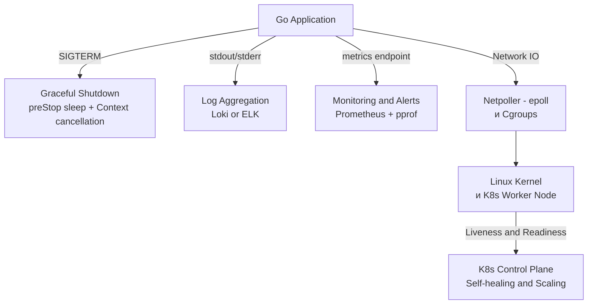

Мы прошли колоссальный путь: от системных вызовов ядра Linux и прерываний процессора до оркестрации микросервисов в Kubernetes и поиска неисправностей в продакшене. Этот раздел был посвящен среде, в которой живут ваши Go-приложения.

Для разработчика, стремящегося к уровню Senior/Lead, инфраструктура — это не "обязанность DevOps-инженера". Это продолжение вашего кода. Вы не можете писать высокопроизводительные системы, не понимая, как `epoll` работает с горутинами, или почему `cpu limits` в K8s могут убить задержку (Latency) вашего API.

Давайте подведем итоги и сформулируем фундаментальные принципы Production-окружения.

## Принципы Production-Ready систем

### 1. Иммутабельность (Immutability)
Серверы и контейнеры — это не домашние питомцы (Pets), за которыми нужно ухаживать и патчить вручную. Это стада (Cattle). 
Если в контейнере обнаружена уязвимость или баг, вы **не заходите внутрь по SSH**, чтобы что-то поправить. Вы пересобираете Docker-образ в CI/CD пайплайне и выкатываете новый Pod. Go идеально ложится в эту парадигму благодаря статической компиляции — ваш бинарник — это и есть неизменяемый артефакт.

### 2. Наблюдаемость (Observability)
Как мы убедились в статьях про [[4. Мониторинг инфраструктуры]] и [[5. Логи инфраструктуры]], в распределенных системах вы не можете дебажить проблему с помощью `println`. Production-система должна быть спроектирована так, чтобы быть "прозрачной":
*   **Метрики (Prometheus)**: Дыхание системы (CPU, RPS, Latency, `go_goroutines`).
*   **Логи (Loki/ELK)**: Контекст событий (структурированный JSON через `log/slog`).
*   **Трассировки (OpenTelemetry)**: Путь запроса сквозь микросервисы.

> [!warning] Ловушка / Gotcha
> Синдром "У меня работает на машине" в мире K8s мертв. Если ваш код работает локально, но падает в кластере, проблема почти всегда кроется в окружении: нехватка RAM (OOM Kill), душащий CFS Throttling, потеря DNS-запросов или отсутствие нужных CA-сертификатов в `distroless` образе.

### 3. Отказоустойчивость (Resilience)
В продакшене всё ломается. Сеть теряет пакеты, ноды перезагружаются, базы данных тормозят. Ваша архитектура должна исходить из презумпции неисправности.
*   **На уровне K8s**: Механизмы Probes (Readiness/Liveness) и RestartPolicy защищают от "зависших" процессов.
*   **На уровне Go**: Graceful Shutdown (корректная обработка SIGTERM с задержкой на обновление iptables), Circuit Breakers (предохранители) для исходящих запросов, и таймауты (Context) на всё.

### 4. Mechanical Sympathy: Связка Go и ОС
Главный урок этого раздела: высокоуровневый код опирается на низкоуровневые механизмы. 
*   Понимание `sync.Mutex` неполно без знания о `futex` (Fast Userspace Mutex) syscall.
*   Настройка Garbage Collector в Go (`GOMEMLIMIT`) бесполезна без понимания, как Linux Cgroups ограничивают память и отправляют OOM Kill.
*   Оптимизация сетевого стека невозможна без осознания того, как Go Netpoller абстрагирует системный вызов `epoll`.

> [!info] Под капотом
> Production-ready приложение — это не то, которое просто компилируется. Это приложение, которое "дружит" с железом и планировщиком операционной системы. Когда вы ограничиваете потребление памяти через `GOMEMLIMIT`, вы даете сигнал планировщику GC работать чаще, чтобы уберечь процесс от смерти от рук OOM Killer ядра. Это и есть Mechanical Sympathy на практике.

## Эволюция инженера

На позиции Junior/Middle разработчик думает категориями: *"Написать код, чтобы он работал"*. На позиции Senior/Lead мышение меняется: *"Спроектировать систему, которая выдержит отказы, будет наблюдаемой, легко деплоиться и потреблять минимум ресурсов"*.

Вы больше не пишете "просто HTTP-сервер на Go". Вы проектируете процесс, который:
1. Собирается в изолированный `scratch`-образ без CGO.
2. Запускается от непривилегированного пользователя в K8s.
3. Корректно реагирует на сигналы операционной системы при обновлениях.
4. Экспортирует метрики своего собственного рантайма для инфраструктурного мониторинга.
5. Умеет изящно деградировать при перегрузке.

Инфраструктура — это не фон. Это фундамент, на котором стоит ваш код. И понимание этого фундамента делает вас инженером, способным строить системы, которым можно доверять в продакшене.

На этом мы завершаем большой раздел, посвященный железу, ОС и оркестрации. Наши приложения теперь могут выдерживать нагрузку, сохранять данные и восстанавливаться после сбоев. Однако бэкенд состоит не только из запущенных процессов — он состоит из данных. В следующих разделах мы обратимся к базам данных, индексам и распределенным транзакциям, чтобы понять, как безопасно и эффективно хранить информацию.