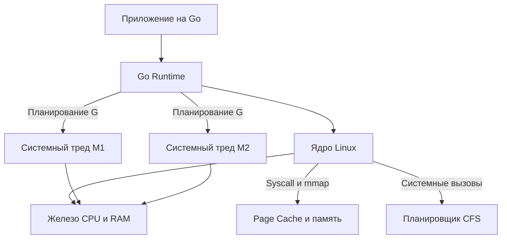

Если ты переходишь с PHP, Java, C# или Python на Go, первое, что тебя удивит, — это отсутствие «магии». В Go нет скрытых пулов тредов, нет автоматического сериализующего GC, работающего вне контекста ОС, и нет абстракций, скрывающих стоимость системных вызовов. Go — это буквально C с синтаксисом высокого уровня. Он даёт контроль, но требует понимания того, что происходит под ним.

Этот раздел посвящён операционной системе не как учебнику по администрированию, а как инженерному фундаменту для бэкенд-разработки на Go. Мы разберём, как Go-рантайм взаимодействует с ядром Linux, как управляет ресурсами, где возникают узкие места и как системное мышление отличает Middle-разработчика от Senior/Lead.

### ОС как слой абстракции и диспетчер ресурсов

Современная операционная система (на примере Linux, который является стандартом для Go-бэкенда) решает одну главную задачу: эффективное распределение ограниченных физических ресурсов между множеством изолированных процессов.

Физический мир жёстко ограничен:
- Количество физических ядер CPU фиксировано.
- Память имеет строгую иерархию (регистры -> L1/L2/L3 кэш -> RAM -> SSD/HDD).
- Сетевые интерфейсы и диски имеют пропускную способность и latency.

ОС скрывает эту сложность через абстракции:
1. **Процесс и Потоки** — изолированное пространство выполнения.
2. **Виртуальная память** — каждому процессу кажется, что он владеет всей RAM.
3. **Файловая система** — унифицированный интерфейс для дисков, сокетов, пайпов.
4. **Системные вызовы** — безопасный мост между пользовательским кодом и ядром.

> [!info] Под капотом
> Go-рантайм не обходит ОС. Он интегрируется с ней. Когда ты запускаешь бинарник, процесс инициализации через системный вызов `execve` просит ядро выделить память, создать процесс, а затем Go-рантайм инициализирует свои структуры: `GOMAXPROCS`, `P` (логические процессоры), `M` (системные треды), `G` (горутины) и `netpoller`. Все они живут в пространстве пользователя, но жестко привязаны к ядру.

### Механическое сопереживание (Mechanical Sympathy) в Go

Mechanical Sympathy — это понимание того, как твой код исполняется на уровне процессора и ОС. В Go это критически важно, потому что язык построен на компромиссах между удобством и производительностью:

| Абстракция Go | Что под капотом (OS / Hardware) | Влияние на производительность |
|---|---|---|
| `goroutine` | Лёгкий поток управления, но в конечном итоге маппится на `M` (системный тред ОС) | Переключение контекста между `M` стоит ~1000 тактов CPU. `GOMAXPROCS` должен совпадать с физическими ядрами. |
| `channel` | Блокирующий буфер + `netpoller` (epoll/kqueue) + атомарные операции | Бесплатный буфер (размер 0) работает через блокировку и переключение контекста. Размер > 1 использует `mmap` и атомарный кольцевой буфер. |
| `gc` (Garbage Collector) | Триггеры аллокации, STW фазы, работа с `brk`/`mmap` | GC в Go конкурентный, но всё ещё требует выделения физической памяти. `GOGC` и `GOMEMLIMIT` напрямую влияют на tail-latency. |
| `net/http` сервер | `epoll` (Linux) / `kqueue` (BSD) + `SO_REUSEPORT` | Неблокирующий I/O + `netpoller` позволяет одной горутине обслуживать тысячи соединений без пула тредов. |

> [!tip] Собеседование
> **Вопрос:** Почему в Go нельзя просто увеличить `GOMAXPROCS` до 1024 и ждать линейного роста производительности?
> **Ответ:** Потому что `GOMAXPROCS` управляет количеством `M` (системных тредов ОС), а не горутин. Каждый тред требует стека, контекстного переключения и кэш-линий CPU. При `GOMAXPROCS > N_CPU` начинается thrashing — процессор тратит больше времени на переключение контекста и инвалидацию кэша, чем на выполнение кода. Кроме того, ядро ОС само планирует треды, и Go-планировщик лишь просит ядро запустить `M` на доступных ядрах.

### Сравнение с другими языками и почему это важно

В отличие от Java, которая использует OS-threads с тяжелым стеком (по умолчанию 1 МБ на тред) или PHP, где каждый запрос — отдельный процесс, Go использует lightweight goroutines. Это даёт преимущества в плотности, но переносит проблему переключения контекста на уровень Go-рантайма и ядра.

Понимание ОС необходимо по четырём причинам:

1. **Отладка системных сбоев**: `SIGSEGV`, `SIGPIPE`, утечки памяти, `goroutine leak` — всё это требует понимания, как рантайм просит память у ядра, как работает `mmap`, и что такое Page Fault.
2. **Оптимизация latency**: В высоконагруженных системах микросекунды решают. Понимание `epoll`, `Zero Copy`, `CPU Affinity` и `NUMA` позволяет писать код, который не бьёт по кэшу процессора и не блокирует I/O.
3. **Cloud-native архитектура**: Go — язык контейнеров. `cgroups`, `namespaces`, `eBPF` — это то, как твой сервис изолируется, масштабируется и мониторится в Kubernetes. Без понимания этих слоёв ты не сможешь проектировать отказоустойчивые системы.
4. **Безопасность (AppSec)**: Понимание `user space` vs `kernel space`, `capabilities`, `SELinux` и ограничений `ulimit` критично для защиты от переполнений, несанкционированного доступа и DoS-атак.

### Дорожная карта раздела

Мы не будем ходить по кругу. Раздел построен как восхождение от фундамента к прикладным аспектам:

1. Фундамент и загрузка: как ОС рождается, загружается и создаёт первые процессы. `BIOS/UEFI`, `bootloader`, `fork/exec`.
2. Ресурсы и изоляция: процессы, потоки, виртуальная память, страницы, `malloc`, `mmap`, сегментация.
3. Планирование и синхронизация: `CFS`, контекстное переключение, приоритеты, `nice`, `mutex/semaphore` на уровне ядра.
4. I/O и сети: `epoll`, `kqueue`, `netpoller`, сокеты, TCP-стек, файловые системы, `Page Cache`.
5. IPC и безопасность: пайпы, разделяемая память, сигналы, `cgroups`, `namespaces`, `eBPF`.
6. Go Runtime vs OS: как `runtime`, `gc`, `scheduler` и `netpoller` взаимодействуют с ядром Linux.

> [!warning] Ловушка / Gotcha
> Не путай логическую конкурентность (горутины) с физической параллельностью (ядра CPU). Go позволяет создать миллион горутин, но только `GOMAXPROCS` из них будут выполняться одновременно. Остальные будут ждать в очереди планировщика или в `netpoller`. Понимание этой границы — ключ к проектированию масштабируемых систем.

Готовы погрузиться в устройство системы? Переходим к базовому определению и границам между пространством пользователя и ядром.
[[2. Что такое операционная система. Ядро, user space и kernel space]]