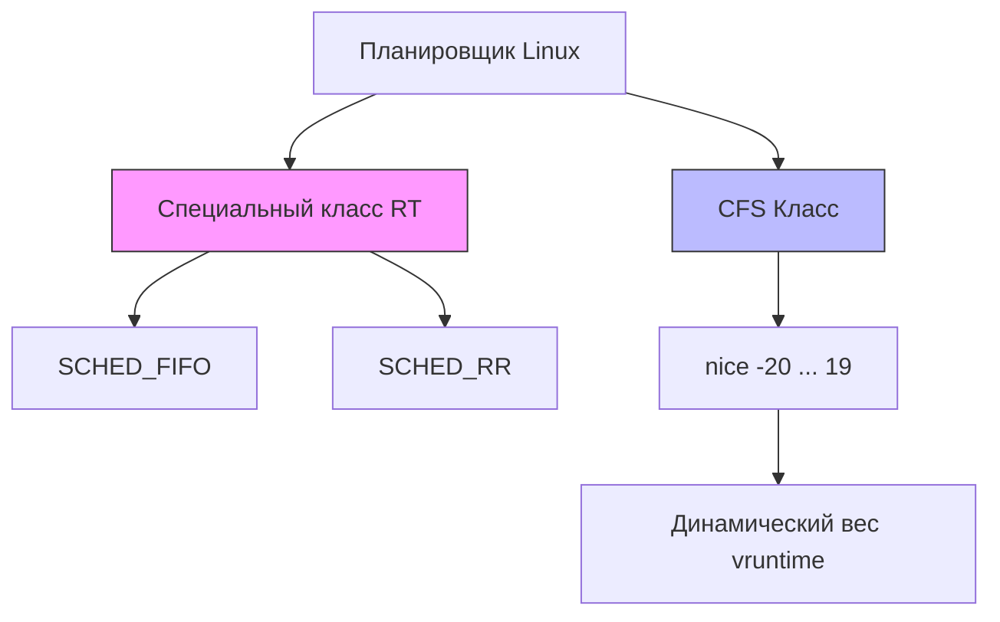

## Зачем бэкендеру понимать приоритеты процессов

В высоконагруженных системах ресурсы CPU конечны. Когда несколько сервисов, внутренних компонентов или контейнеров борются за процессорное время, ОС должна решать, кто получит цикл первым. Понимание модели приоритетов в Linux критично для:
- Гарантирования низкой задержки (latency-sensitive сервисы).
- Предотвращения starvation (голодания) критических рабочих очередей.
- Правильной настройки контейнеров и оркостраторов (Kubernetes QoS, cgroups, CPU isolation).
- Отладки проблем, когда `top` показывает 100% CPU, но приложение не отвечает на запросы.

## Модель приоритетов в Linux: nice vs Real-Time

Linux использует два непересекающихся пространства приоритетов, которые работают на разных уровнях планировщика:

1. **Обычные процессы (CFS - Completely Fair Scheduler)**
   - Диапазон `nice`: от `-20` (максимальный приоритет) до `19` (минимальный).
   - `nice = 0` — стандартное значение для новых процессов.
   - CFS не выделяет фиксированное время. Он вычисляет `vruntime` (виртуальное время выполнения) и динамически распределяет CPU на основе веса процесса. Чем выше `nice`, тем медленнее растёт `vruntime`, и тем чаще планировщик переключается на другие процессы.
   - Приоритеты здесь *относительные*. Они определяют вес в распределении, но не гарантируют точное время CPU.

2. **Реального времени (Real-Time, RT)**
   - Диапазон: `1` (низкий RT) до `99` (высокий RT).
   - RT-процессы всегда получают приоритет над обычными CFS-процессами.
   - Используются алгоритмы `SCHED_FIFO` (первым пришёл — первым обслужен, уступает CPU только при блокировке или явном `sched_yield`) и `SCHED_RR` (Round Robin, аналогичен FIFO, но с жёстким квантом времени).



> [!warning] Ловушка / Gotcha
> Нельзя смешивать эти пространства. `nice` не работает для RT-процессов. Если вы попытаетесь установить `nice = -10` для процесса с `SCHED_FIFO`, ОС просто проигнорирует команду или вернёт ошибку `EINVAL`.

## Под капотом: Как ядро хранит приоритеты

В ядре Linux каждый процесс представлен структурой `task_struct`. Внутри неё находятся два ключевых поля для планировщика:
- `prio` — текущий эффективный приоритет (активируется динамически, например, при повышении приоритета заблокированной горутины или из-за RT-преemption).
- `static_prio` — базовый приоритет, установленный пользователем через `nice` или `sched_setscheduler`.

Когда вы вызываете `renice` или `nice`, ядро не переключает процесс мгновенно. Оно обновляет `static_prio` в `task_struct`, а планировщик на следующем цикле пересчитывает `vruntime` и веса в O(1) приоритетных массивах (в современных ядрах используется структура `sched_entity` внутри `task_struct`).

Для RT-процессов используется отдельная очередь (`rt_rq`). Планировщик всегда проверяет RT-очереди перед CFS. Если в `rt_rq` есть задачи, CFS-процессы не получат CPU вообще.

```go
// Пример установки приоритета в Go
package main

import (
	"fmt"
	"os"
	"runtime/debug"
)

func main() {
	// Установка nice значения для текущего процесса
	// Требует capability CAP_SYS_NICE или прав root
	err := debug.SetPriority(-10)
	if err != nil {
		fmt.Fprintf(os.Stderr, "Не удалось установить приоритет: %v\n", err)
		os.Exit(1)
	}
	fmt.Println("Приоритет установлен успешно")
}
```

## Go-рантайм и приоритеты: Важные нюансы

Здесь кроется главная ловушка для Go-разработчиков. **Планировщик Go (`runtime.gosched`) и планировщик ОС работают на разных уровнях.**

1. **Goroutines не имеют приоритетов.** В Go-рантайме все горуны равноправны. Они рантаймом помещаются в пулы (`P`), и `M` (системные треды) выполняют work-stealing алгоритм.
2. **Приоритет применяется к `M`, а не к `G`.** Когда вы вызываете `debug.SetPriority`, вы меняете приоритет *системного треда* (или процесса), на котором выполняется рантайм. Это влияет на все горуны, выполняющиеся в данный момент на этом `M`.
3. **Конфликт с Go scheduler.** Если вы поднимете приоритет процесса до RT-уровня, вы можете *сломать* работу Go-рантайма. Рантайм relies на таймеры и preemption, которые могут быть заблокированы, если RT-поток с высоким приоритетом уйдёт в блокирующий syscall (например, `epoll_wait`) и не отдаст CPU. В Linux это вызывает `priority inversion` (инверсию приоритетов), и система может "зависнуть" на уровне планировщика.

> [!tip] Собеседование
> **Вопрос:** Можно ли задавать приоритеты отдельным горутинам в Go?
> **Ответ:** Нет, нативный Go не поддерживает приоритеты горутин. Приоритеты работают на уровне системных тредов (`M`). Если нужна приоритизация задач, нужно использовать паттерны: отдельные сервисы в разных процессах, очереди с приоритетами (например, RabbitMQ Priority Queues) или кастомный планировщик внутри рантайма (что не рекомендуется из-за риска деградации GC).
>
> **Вопрос:** Чем Go отличается от Java/C++ в этом плане?
> **Ответ:** В Java `Thread.setPriority()` напрямую мапится на приоритеты ОС, но JVM часто игнорирует их, полагаясь на собственный scheduler. В C++ `pthread_setschedparam()` требует ручной работы с RT-ядрами. Go же абстрагирует этот слой: разработчик управляет приоритетами только на уровне процесса/треда, а рантайм полностью контролирует распределение горуин, чтобы избежать priority inversion и deadlocks.

## Практика: когда и как использовать

1. **`nice` / `renice` для балансировки:**
   ```bash
   # Запуск сервиса с пониженным приоритетом, чтобы не мешать основным сервисам
   nice -n 10 ./my-backend-app
   
   # Изменение приоритета запущенного процесса
   renice -n 5 -p 12345
   ```
   Используйте `nice` для фоновых задач: резервное копирование, индексация, тяжелые вычисления. Не ставьте `nice` для latency-critical сервисов (API gateways, real-time processing).

2. **Real-Time (RT) приоритеты:**
   Требуют `CAP_SYS_ADMIN` или `SYS_NICE`. В контейнеризации (Docker/K8s) обычно запрещены по умолчанию из соображений безопасности.
   ```bash
   chrt -f 50 ./my-realtime-app
   ```
   **Когда нужен RT?** Только в специфичных кейсах: высокочастотный трейдинг, промышленная автоматизация, обработка аудио/видео в реальном времени. Для типичного бэкенда (HTTP/gRPC) RT-приоритеты **не нужны** и даже вредны.

3. **Взаимодействие с Kubernetes:**
   K8s не работает с `nice` напрямую. Вместо этого используются:
   - `QoS classes` (Guaranteed, Burstable, BestEffort) для приоритизации при нехватке ресурсов (eviction).
   - `CPU Manager` и `CPUsets` для изоляции ядер, что эффективнее приоритетов.
   - `cgroups v2` с `cpu.weight` (аналог `nice` в контейнерах).

## Механика и производительность

Изменение приоритета влияет на:
- **Кэш-локальность:** Высокоприоритетный процесс чаще получает CPU, сохраняя данные в L1/L2 кэшах. Это снижает `cache miss rate`.
- **Context Switch cost:** Переключение между процессами с разным приоритетом может вызывать дополнительные проверки в ядре.
- **TLB thrashing:** Частые переключения между низко- и высокоприоритетными процессами на одном ядре могут приводить к инвалидации TLB (Translation Lookaside Buffer), что замедляет работу с памятью.

> [!info] Под капотом
> Когда процесс теряет CPU из-за приоритета, его `thread_info` и `task_struct` не выгружаются из RAM, но его кэш-линии могут быть вытеснены (cache cold). При возврате на CPU требуется `cache warm-up`. В Go это особенно критично для GC, который часто прерывает выполнение рабочих горутин. Если GC-поток теряет CPU из-за низкоприоритетного worker-процесса, pause time может вырасти в разы.

## Резюме для собеседования

- `nice` (-20..19) влияет на CFS-планировщик, определяя вес распределения CPU. Не гарантирует время.
- RT-приоритеты (1..99) используют `SCHED_FIFO`/`RR`, всегда выше CFS. Требуют прав root.
- В Go приоритеты применяются к системным тредам (`M`), а не к горутинам (`G`).
- Установка RT-приоритетов для Go-процесса может сломать Work-Stealing scheduler и вызвать priority inversion.
- Для контейнеров используйте `cpu.weight` (cgroups v2) или CPU isolation, а не `nice`.

В следующей статье мы разберем, как CPU физически распределяет ядра и почему `CPU Affinity` и `NUMA` важнее приоритетов для достижения стабильной производительности. Переходите к [[11. CPU Affinity и NUMA]].