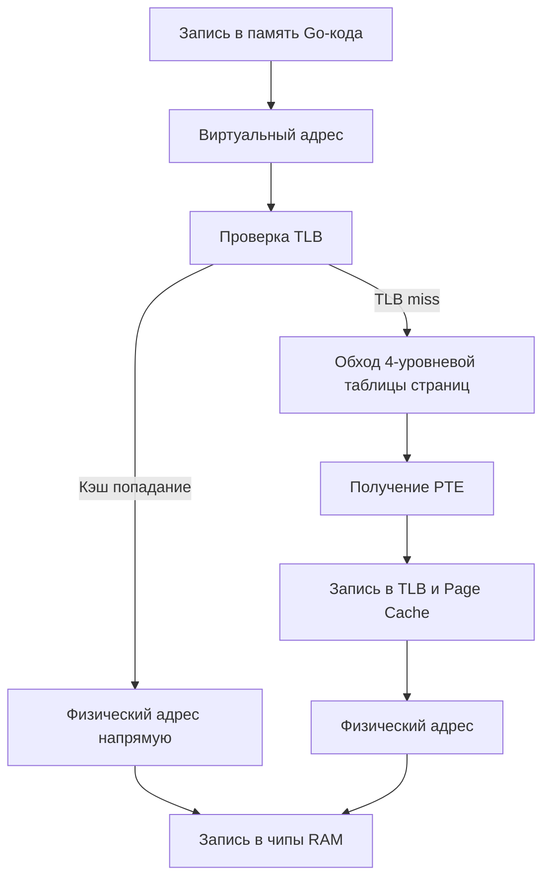

## Виртуальная память: Почему каждому процессу кажется, что у него своя RAM

Когда вы запускаете `go run main.go`, операционная система выделяет для вашего процесса изолированное адресное пространство. На 64-битных системах его размер может достигать 128 ТБ (2^47 байт), хотя физическая оперативная память вашей машины может составлять всего 16 ГБ. Как Go управляет этим гигантским пространством, не вызывая `OutOfMemory` на пустом месте и не ломая чужие процессы?

Ответ лежит на стыке архитектуры процессора и алгоритмов планирования памяти в ядре Linux.

## Аппаратный фундамент: MMU и таблица страниц

В основе виртуальной памяти лежит специальный блок в процессоре — **MMU (Memory Management Unit)**. Он работает полностью в "железе" и прозрачно для программы преобразует виртуальные адреса (которые видит ваш Go-код) в физические адреса (которые указывают на реальные чипы RAM).

Преобразование не происходит по математической формуле. Оно работает через **Таблицу страниц (Page Table)**.

> [!info] Под капотом
> На современных x86-64 системах используется 4-уровневая иерархия таблиц (PML4 -> PGD -> PUD -> PMD -> PTE). Виртуальный адрес разбивается на 9-битные поля, каждое из которых указывает на индекс в соответствующем уровне таблицы. Листовой узел (PTE) содержит:
> * Физический адрес страницы (фрейма)
> * Флаги: доступна ли страница, права чтения/записи/исполнения, привилегия (User/Kernel)
> * Биты dirty и accessed для работы с GC и свопингом

## Трансляция адреса и цена промаха

Когда ваш Go-код обращается к переменной или элементу slice, процессор не идет в RAM сразу. Он берет виртуальный адрес, подает его в MMU, а тот поднимается по дереву страниц, собирает физический адрес и только потом делает запрос к памяти.

Этот процесс кэшируется в **TLB (Translation Lookaside Buffer)**. Если страница уже в кэше, преобразование занимает 0 тактов. Если нет — **TLB miss**, и MMU начинает обходить таблицу страниц в RAM.



## Page Fault: Когда "своей" памяти нет

Виртуальное адресное пространство заполняется "заглушками". Если процесс обращается к адресу, который еще не маппирован на физическую страницу, MMU генерирует **Page Fault** (исключение #14 в x86).

> [!warning] Ловушка / Gotcha
> Page Fault — это не обязательно ошибка. В Linux есть два типа:
> 1. **Minor Page Fault**: Страница уже в Page Cache или выделена, но не привязана к физическому фрейму RAM. Ядро просто связывает их. Быстро (микросекунды).
> 2. **Major Page Fault**: Страницы нет в RAM вообще (она на диске в swap). Ядро должно считать данные с диска. Очень медленно (миллисекунды, тысячи циклов CPU).
> Go-программы редко вызывают major faults, но они критичны при работе с большими данными, агрессивном свопинге или нехватке RSS.

## Go Runtime и политика выделения памяти

В отличие от C/C++, где `malloc` часто использует `brk`/`sbrk` для расширения кучи в одном непрерывном блоке, Go использует **`mmap`**.

Почему? Потому что `mmap` работает на уровне страниц (обычно 4 КБ). Go может запрашивать у ОС гигантские виртуальные пространства (например, 10 ГБ) мгновенно, не затрачивая физическую RAM. Физическая память выделяется только при первом обращении к странице. Это называется **Demand Paging**.

```go
// Пример явного запроса виртуальной памяти через syscall
// В реальном Go runtime это происходит внутри runtime.mmap
func allocateVirtualMemory(size int) ([]byte, error) {
	// 1. Запрашиваем виртуальное адресное пространство
	// Флаг PROT_NONE гарантирует, что физическая RAM не будет выделена сразу
	ptr, err := syscall.Mmap(-1, 0, size, syscall.PROT_NONE, syscall.MAP_ANON|syscall.MAP_PRIVATE)
	if err != nil {
		return nil, fmt.Errorf("mmap failed: %w", err)
	}
	// ptr указывает на виртуальную память, но физический фрейм еще не привязан!
	
	// 2. При первом записи (или через madvise) OS выделит реальные фреймы
	// Go runtime делает это через runtime.madvise для оптимизации prefetch
	err = syscall.Madvise(ptr, size, syscall.MADV_WILLNEED)
	if err != nil {
		return nil, fmt.Errorf("madvise failed: %w", err)
	}
	
	// Теперь можно использовать память. При первой записи MMU сгенерирует minor page fault
	// и ядро свяжет страницу с физическим фреймом (часто нулевым)
	return ptr[:0:size], nil
}
```

## Mechanical Sympathy и влияние на производительность

1. **TLB Pressure**: Чем больше виртуальной памяти использует приложение, тем меньше страниц помещается в TLB. При работе с большими массивами или slice-ами Go может вызывать частые TLB misses, что снижает производительность на 10-20%. Решение: `runtime.GC()`, использование `sync.Pool`, выравнивание данных, локализация доступа.
2. **Lazy Allocation & Zero Pages**: При первом обращении к новой странице OS выделяет "нулевую страницу" (все байты = 0). Это гарантирует безопасность, но добавляет накладные расходы на инициализацию.
3. **mmap vs brk в контексте GC**: Когда heap растет, Go не просит OS больше `brk`. Он делает `mmap` на 100-200 МБ вперед. Если GC освобождает много памяти, Go может использовать `madvise(MADV_DONTNEED)` или `munmap`, чтобы сообщить ОС: "эти страницы свободны, можешь отдать их другим процессам или в swap". Это экономит RSS, но не уменьшает VSS.

> [!tip] Собеседование
> **Вопрос:** Почему Go использует `mmap` для кучи, а не `brk`? Как это влияет на работу GC?
> **Ответ:** `brk` расширяет heap непрерывно, что приводит к фрагментации и невозможности возвращать память ОС. `mmap` работает с страницами, позволяет Go отдавать неиспользуемую память обратно ОС, поддерживает `madvise` для оптимизации доступа (например, `MADV_DONTNEED` для сброса страниц при высокой нагрузке) и проще масштабируется в многопоточных средах. GC использует `mmap` для выделения новых гранул и `munmap` для возврата неиспользуемых регионов, что делает память-менеджмент предсказуемым и безопасным.

## Сравниваем подходы

| Характеристика | Go Runtime | C/C++ (glibc) | Java/JVM |
|----------------|------------|---------------|----------|
| **Базовый API** | `mmap` + `munmap` | `brk` / `sbrk` | `mmap` (обычно) |
| **Стратегия роста** | Demand Paging, аллокация страниц | Непрерывный рост кучи | Generational Heaps + Commit/Reserve |
| **Возврат памяти ОС** | `munmap` / `madvise` | Практически невозможно без `malloc_trim` | Зависит от реализации (G1/ZGC могут) |
| **Изоляция** | Полная на уровне страниц | Частичная (фрагментация) | Внутренняя (в рамках JVM) |

## Итог

1. Виртуальная память дает каждому процессу изолированное адресное пространство до 128 ТБ.
2. MMU и 4-уровневые таблицы страниц преобразуют виртуальные адреса в физические.
3. Lazy allocation позволяет Go запрашивать гигантские объемы памяти мгновенно, выделяя физическую RAM только при записи.
4. TLB misses и page faults — скрытые убийцы производительности, требующие мониторинга через `vmstat` и `perf`.
5. Go использует `mmap` + `madvise` вместо `brk` для гибкого управления heap и интеграции с GC.

В следующей статье мы разберем, как именно эти страницы устроены на уровне бит и байт: [[13. Страницы памяти и Page Table]].