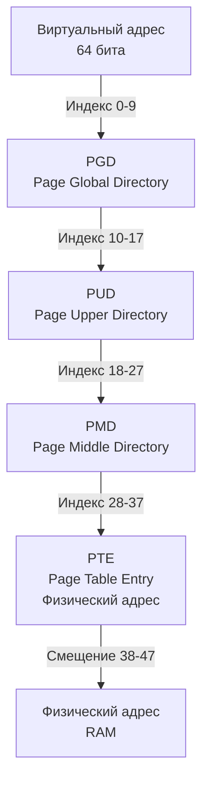

## Введение: Физика и логика разделения памяти

В предыдущей статье [[12. Виртуальная память. Почему процессу кажется, что у него своя память]] мы разобрали концепцию виртуального адресного пространства. Но как операционная система гарантирует, что два процесса не перезапишут друг друга, и как она физически размещает эти гигабайты виртуальной памяти в ограниченной оперативной памяти? Ответ лежит в механизме **Paging (Страничная организация памяти)**.

Paging решает две фундаментальные проблемы:
1. **Фрагментация физической памяти.** Свободные блоки RAM разбросаны по разным адресам. Paging позволяет хранить страницы процесса в любом физическом месте, не требуя непрерывного блока.
2. **Эффективное использование памяти.** Процессу не нужно выделять физическую память под всё виртуальное пространство сразу. Физические страницы подгружаются только при первом обращении (Demand Paging).

## Иерархия Page Table и механизм трансляции

Процессор не работает с виртуальными адресами напрямую. За трансляцию `Virtual Address -> Physical Address` отвечает **MMU (Memory Management Unit)** на кристалле CPU. 

На архитектуре x86-64 используется 4-уровневая иерархия [[Page Table]] (PGD -> PUD -> PMD -> PTE). Каждый уровень содержит таблицу указателей на следующий уровень. Виртуальный адрес разбивается на поля, каждое из которых является индексом в соответствующей таблице.



Каждый [[Page Table Entry]] содержит:
* Биты валидности (Present/Absent). Если бит равен 0, процессор генерирует `Page Fault`.
* Биты прав доступа (Read/Write/Execute).
* Бит Dirty (указывает, что страница была изменена).
* Физический базовый адрес страницы в RAM.

**Почему именно 4 уровня?** 
Один [[Page Table Entry]] занимает 8 байт. На одном уровне можно разместить `2^9 = 512` указателей. `512 * 8 = 4 КБ` (ровно одна страница). Это элегантная самооптимизация: таблица всегда умещается в одной физической странице, что упрощает аллокацию и выгрузку.

## Размер страницы и Huge Pages

Стандартный размер страницы на x86-64 и ARM64 — **4 КБ**. Это компромисс:
* **Меньше 4 КБ:** Резко растёт потребление памяти под сами [[Page Table]] (на 4 КБ данных нужно 512 байт записей в PTE).
* **Больше 4 КБ:** Растёт внутренняя фрагментация (Internal Fragmentation). Если процессу нужно 4097 байт, он займёт 8 КБ, из которых 3 КБ будут «мертвым грузом».

### Huge Pages (2 МБ и 1 ГБ)
Для высоконагруженных сервисов, баз данных и Go-приложений, работающих с большими массивами данных, используются Huge Pages. Они уменьшают количество записей в [[Page Table]] и снижают нагрузку на кэш процессора.

> [!warning] Ловушка / Gotcha
> Huge Pages требуются из непрерывного физического адресного пространства. В системах с длительной работой и интенсивной аллокацией/освобождением памяти физическое пространство фрагментируется. Запрос Huge Pages может упасть с `ENOMEM`, даже если свободной памяти в системе больше, чем размер запроса.
> В Linux настройка: `echo 1024 > /proc/sys/vm/nr_hugepages` и запуск Go-бинарника с `GODEBUG=pagealloc=1` или через `mmap` с флагом `MAP_HUGETLB`.

## Page Faults: Minor vs Major

Когда процессор обращается к виртуальному адресу, MMU проверяет бит Present в [[Page Table Entry]].
1. **Page Hit:** Бит установлен. MMU извлекает физический адрес и продолжает выполнение.
2. **Page Fault:** Бит сброшен. Процессор приостанавливает инструкцию, переключается в Ring 0 и вызывает обработчик ядра ОС (`do_page_fault`).

ОС различает два типа:
* **Minor Page Fault:** Виртуальная страница зарезервирована, но ещё не привязана к физической RAM. Данные уже есть в Page Cache (файл на диске или ранее выгруженная страница). Ядро просто обновляет [[Page Table]], устанавливает бит Present и разрешает инструкцию. Это быстро (микросекунды).
* **Major Page Fault:** Данные отсутствуют в Page Cache. Ядро должно выделить свободную страницу в RAM, прочитать данные с диска (или из swap) и обновить таблицу. Это дорого (миллисекунды).

> [!info] Под капотом
> Go Runtime активно использует Minor Page Faults. При старте процесса `runtime.mmap` резервирует большое виртуальное адресное пространство (например, 1 ГБ). Физическая память выделяется только при первом обращении к байту. Это называется **Lazy Allocation**.

## Go Runtime и управление памятью на уровне страниц

Понимание Paging критично для Go-разработчика, так как модель памяти Go строится поверх OS-страниц.

### 1. Резервирование vs Коммит
Go не использует устаревший `brk` для роста кучи. Вместо этого `runtime.mmap` вызывает `mmap` с флагами `MAP_PRIVATE | MAP_ANONYMOUS`. Это **резервирует** виртуальное адресное пространство, но не выделяет физическую RAM. Физические страницы подгружаются по требованию.

### 2. Архитектура аллокатора `mheap` -> `mcache` -> `span`
Go группирует физические страницы в **spans** (обычно по 64 КБ, т.е. 16 страниц 4 КБ). 
* `mcache` — кэш на каждый P (процессор), содержит spans для разных классов размеров.
* `mcentral` — пул spans фиксированных размеров.
* `mheap` — глобальный менеджер, аллоцирует/освобождает spans, вызывает `madvise`.

### 3. Возврат памяти ОС (GC и `madvise`)
Когда GC освобождает объекты, физическая память не сразу возвращается ОС. Go помечает страницы как `MHeapMap_SpanInUse = 0`. 
При достижении порога `GOGC` или при нехватке памяти, Go вызывает `madvise(addr, len, MADV_DONTNEED)`. Это сообщает ядру: «Данные в этих страницах больше не нужны, можешь выгрузить их в swap или освободить». При следующем обращении генерируется Minor Page Fault, и ядро выделяет чистую страницу.

```go
// Пример использования madvise для оптимизации памяти в Go
// (требует import "golang.org/x/sys/unix")

func releaseUnusedPages(addr uintptr, length int) error {
    // Уведомляем ядро, что данные в диапазоне больше не читаются
    err := unix.Madvise(syscall.UnsafePointer(unsafe.Pointer(addr)), length, unix.MADV_DONTNEED)
    if err != nil {
        return fmt.Errorf("madvise DONTNEED failed: %w", err)
    }
    return nil
}
```

## Mechanical Sympathy: Влияние на производительность

### TLB и Page Table Walk
Процессор кэширует недавние трансляции в **TLB (Translation Lookaside Buffer)**. Это SRAM внутри CPU. 
* **TLB Hit:** Трансляция за 0.5-1 такт.
* **TLB Miss:** Приходится выполнять Page Table Walk (4 обращения к RAM на x86-64). Стоимость: 50-100+ тактов. При высокой нагрузке на память TLB miss становится узким местом.

**Как Go влияет на TLB:**
* Частая аллокация небольших объектов в куче приводит к «разреженному» использованию страниц. Если объекты одного типа разбросаны по разным страницам, кэш-линии CPU (обычно 64 Б) заполняются мусором, что снижает эффективность `prefetching`.
* Решение: `sync.Pool` и выравнивание структур (`alignof`) помогают удерживать связанные данные в пределах одних или соседних страниц, улучшая locality.

### NUMA и распределение памяти
В серверах с NUMA (Non-Uniform Memory Access) процессоры подключены к разным контроллерам памяти. Доступ к «локальной» памяти быстрее, чем к «удалённой» (задержка может отличаться в 2-3 раза).
Go Runtime не управляет NUMA напрямую, но планировщик `P` и аллокатор `mcache` стараются выделять память в регионе, ближайшем к текущему `P`. На высоконагруженных кластерах рекомендуется запускать Go-процессы с `numactl --cpunodebind=0 --membind=0`.

## Производительность и оптимизация

1. **Избегайте «дырявых» страниц.** Если вы работаете с бинарными протоколами или сетевыми пакетами, старайтесь аллоцировать буферы кратные 4 КБ или использовать `bytes.Buffer` с предвыделенным размером.
2. **GC и Page Faults.** Резкие пики Minor Page Faults после GC — это нормально. Если Major Page Faults растут — вы выгружаете данные в swap. Проверьте `vmstat 1` и `cat /proc/meminfo | grep -i swap`.
3. **Escape Analysis и страницы.** Объекты, уходящие в кучу (escape to heap), получают физические страницы из `mheap`. Если вы часто аллоцируете и сразу освобождаете большие структуры, рассмотрите `sync.Pool` или ручное управление жизненным циклом буферов, чтобы снизить нагрузку на `madvise` и Page Faults.

> [!tip] Собеседование
> **Вопрос:** Почему Go Runtime использует `mmap` вместо `brk` для роста кучи?
> **Ответ:** `brk` растёт линейно и не позволяет возвращать память ОС (только через `sbrk(0)` или `malloc_trim`, которые работают неэффективно). `mmap` позволяет выделять/освобождать произвольные адреса, поддерживает `MAP_ANONYMOUS` и `MADV_DONTNEED`, что идеально подходит для модели памяти Go, где GC динамически управляет физическими страницами.
> 
> **Вопрос:** Что происходит при Major Page Fault в Go-приложении?
> **Ответ:** Поток блокируется в ядре, ожидая чтения с диска. В Go это может привести к паузам в работе `P` (планировщик перенесёт другие горутины на другие M). Если такие события часты, приложение теряет в latency. Решение: увеличение RAM, отключение swap, оптимизация паттернов доступа к памяти.

## Итог

1. **Paging** разделяет виртуальное и физическое адресное пространство на фиксированные блоки (обычно 4 КБ).
2. **Page Table** — иерархическая структура указателей, транслирующая виртуальные адреса в физические.
3. **TLB кэширует** трансляции. Miss в TLB = Page Table Walk = потеря тактов CPU.
4. **Go Runtime** резервирует виртуальное пространство через `mmap`, выделяет физические страницы лениво, группирует их в `spans`, а GC возвращает память ОС через `madvise(MADV_DONTNEED)`.
5. Для высокой производительности важно следить за **page fault rate**, использовать **Huge Pages** для больших буферов и учитывать **NUMA** при деплое на серверах.

Мы разобрали, как виртуальные адреса превращаются в физические. Но что происходит, когда процессор не может найти данные в кэше или при промахе по таблице страниц? В следующей статье мы углубимся в аппаратный кэш трансляций и разберём [[14. TLB и стоимость промаха по таблице страниц]].