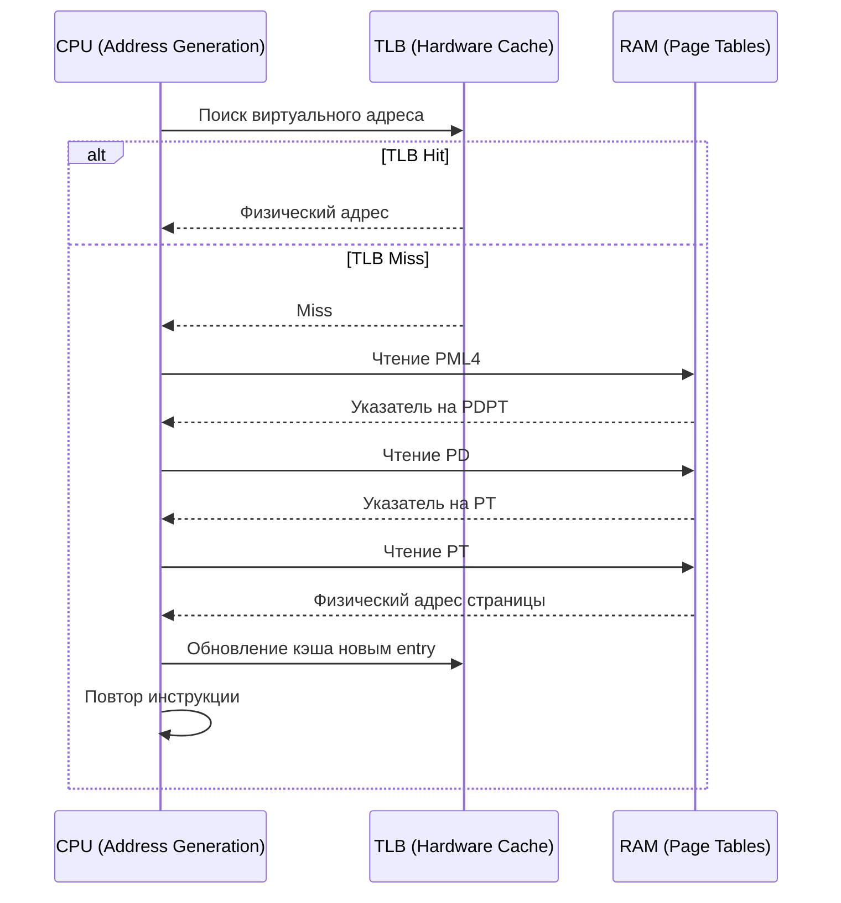

## Почему виртуальная память тормозит: проблема адресного преобразования

Мы уже разобрали, что каждый процесс в Linux видит свою изолированную [[12. Виртуальная память. Почему процессу кажется, что у него своя память|виртуальную адресную пространство]]. Когда ваша программа обращается к памяти по виртуальному адресу, процессор должен найти физический адрес в RAM. Это делается через [[13. Страницы памяти и Page Table|таблицу страниц]].

Но что если на каждое обращение к памяти CPU должен ходить в оперативную память за таблицей страниц? Это убьет производительность. Именно для решения этой проблемы был изобретен аппаратный кэш трансляций.

## Что такое TLB? Аппаратный кэш трансляций

**TLB (Translation Lookaside Buffer)** — это сверхбыстрый кэш внутри процессора (уровень L1/L2), который хранит маппинг «виртуальная страница -> физическая страница». Он физически расположен на кристалле CPU, поэтому доступ к нему измеряется в десятках тактов, в то время как доступ к RAM — сотни тактов.

Механизм работает полностью прозрачно:
1. Процессор получает виртуальный адрес.
2. Ищет его в TLB.
3. Если нашел (Hit) — мгновенно формирует физический адрес и идет по нему.
4. Если не нашел (Miss) — запускает **Page Walk** (прогулку по таблице страниц).

## Page Walk: Что происходит при промахе по TLB?

При промахе процессор не может просто остановить выполнение. Он должен вычислить физический адрес на лету. В современных x86-64 системах используется 4-уровневая (или 5-уровневая) таблица страниц. Page Walk выглядит так:

- Процессор берет базовый адрес корневой таблицы (регистр CR3 в x86).
- Извлекает указатель на следующий уровень из памяти.
- Повторяет для каждого уровня (PML4 -> PDPT -> PD -> PT).
- В конце получает указатель на физическую страницу.
- Обновляет TLB новым entry.
- Повторяет исходную инструкцию чтения или записи.



> [!info] Под капотом
> Размер TLB критически зависит от архитектуры. У современных серверных CPU есть несколько уровней:
> - Global TLB (страницы 1GB): ~8-16 entry
> - Page TLB (страницы 4KB): 64-1024 entry
> - Page Walk Cache (PWC): кэш промежуточных указателей.
> Если ваша рабочая нагрузка работает с памятью в пределах 1024 страниц, современный сервер может вообще не делать Page Walk. Но как только диапазон страниц превышает размер TLB, начинается «TLB thrashing».

## Стоимость промаха по TLB (TLB Miss Cost)

Промах по TLB — это не просто медленное обращение к RAM. Это каскад операций:

1. **Page Walk Latency:** 4-5 обращений к RAM (DDR4/DDR5 latency ~100ns each). Итого ~400-500ns.
2. **TLB Update:** Запись нового entry в кэш.
3. **Pipeline Flush:** При miss процессор часто сбрасывает часть конвейера, теряя предвыборку инструкций.
4. **Context Switch Penalty:** При переключении контекста ОС *обязана* очистить TLB (TLB Shootdown/Flush), чтобы данные одного процесса не попали в адресное пространство другого. Это стоит ~10-20 тысяч тактов CPU.

```bash
# Примерная оценка в тактах (x86-64)
# TLB Hit: ~2-4 cycles
# TLB Miss (Page Walk): ~30-100+ cycles
# Context Switch + TLB Flush: ~10,000 - 20,000 cycles
```

## Как это влияет на Go-разработчика? Mechanical Sympathy

В Go мы не работаем с виртуальной памятью напрямую, но рантайм активно взаимодействует с ней. Понимание TLB помогает объяснять многие просадки производительности, которые кажутся «магическими».

### 1. Heap Allocation и Page Allocation
Go не аллоцирует память по байтам. Рантам Go запрашивает у ОС большие блоки через `mmap` (обычно по 2MB, aligned to huge pages на некоторых системах, или 4KB pages). Если ваш Go-сервис обрабатывает миллионы мелких объектов, которые GC разбрасывает по разным страницам, вы получаете частые TLB misses. Решение: `sync.Pool` и локальные буферы. Они увеличивают локальность данных (как для CPU cache, так и для TLB).

```go
package main

import (
	"sync"
	"testing"
)

// Плохой паттерн: каждый запрос создает новый объект.
// GC быстро освобождает память, ОС возвращает страницы.
// Это создает «шум» в TLB и Page Cache.
func badPattern() {
	for i := 0; i < 1_000_000; i++ {
		data := make([]byte, 256)
		_ = data
	}
}

// Хороший паттерн: переиспользование буферов через sync.Pool.
// Сохраняет маппинги в TLB активными, снижает давление на GC и OS allocator.
var bufPool = sync.Pool{
	New: func() any {
		return make([]byte, 256)
	},
}

func goodPattern() {
	for i := 0; i < 1_000_000; i++ {
		buf := bufPool.Get().([]byte)
		// работа с buf
		bufPool.Put(buf)
	}
}
```

### 2. Context Switch и Goroutines
Горутины — это легковесные потоки, но их переключение все равно требует работы планировщика. Когда горутина блокируется на канал или mutex, планировщик Go (`runtime.scheduler`) может отдать системный тред (M) другой горутине. Если меняется системный тред, меняется и регистровый файл, а частые переключения тредов ОС приводят к частым сбросам TLB. Это одна из причин, почему `netpoller` (epoll) так важен: он позволяет одной горутине/трению долго работать с сетью, не уходя в контекстные переключения.

> [!warning] Ловушка / Gotcha
> Частые переключения между тредми ОС в Go (особенно при блокирующих syscall) приводят к частым сбросам TLB. Если вы видите в `pprof` высокий % `runtime.schedule` или `runtime.wakep`, проверьте, не блокируетесь ли вы на синхронных IO или mutex-ах, которые заставляют планировщик постоянно менять треды.

### 3. NUMA и удаленная память
На серверах с NUMA (Non-Uniform Memory Access) память физически разделена на каналы, привязанные к сокетам. Если Go-процесс аллоцирует память на одном NUMA-ноде, а выполняется на другом, доступ к странице будет медленнее. При промахе по TLB на удаленной ноде latency растет еще сильнее. Go 1.21+ добавил улучшения в планировщике, но принудительно привязывать процесс к сокету (`numactl`) все еще полезно для latency-sensitive workloads.

> [!tip] Собеседование
> **Вопрос:** Почему увеличение размера страницы (Huge Pages) может ускорить Go-приложение?
> **Ответ:** Стандартная страница 4KB покрывает мало виртуальной памяти. Если приложение работает с большим массивом данных, ему нужно много записей в TLB. Huge Pages (2MB или 1GB) уменьшают количество уникальных страниц в рабочем наборе (working set), увеличивая hit rate TLB и сокращая количество Page Walk. В Go это можно включить через настройку ОС: `echo always > /sys/kernel/mm/transparent_hugepage/enabled`.
>
> **Вопрос:** Влияет ли GC на TLB?
> **Ответ:** Да. Во время STW (Stop-The-World) GC сканирует heap. Хотя сам GC не делает Page Walk, он может вызывать активацию страниц в RAM (Page Faults), если heap был подкачан в swap или просто не загружен. Кроме того, интенсивная аллокация/деаллокация объектов создает «шум» в TLB, заставляя его вытеснять старые маппинги.

## Оптимизация: Как писать TLB-friendly код на Go

1. **Увеличивайте локальность данных:** Храните связанные данные в одной структуре (`struct`). Избегайте `map[string]*BigObject`. Используйте `[]byte` или `[]T` вместо слайсов указателей.
2. **Пулы объектов:** `sync.Pool` переиспользует выделенную память, не освобождая её в ОС. Это сохраняет маппинги в TLB активными.
3. **Контроль аллокаций:** Используйте `pprof` (`go tool pprof -alloc_objects`). Если видите всплески, объект, который быстро создается и умирает, он генерирует TLB noise.
4. **Huge Pages:** Для баз данных и аналитических систем включите Transparent Huge Pages (THP) или выделенные huge pages. В Go это работает автоматически, если ОС поддерживает.

## Итог

1. TLB — аппаратный кэш трансляций виртуальных адресов в физические. Без него виртуальная память убила бы производительность.
2. Промах по TLB (TLB Miss) запускает Page Walk — несколько обращений к RAM, что стоит сотни тактов CPU.
3. Контекстные переключения и смена тредов ОС принудительно очищают TLB, добавляя latency.
4. Для Go-разработчика это означает: локальность данных, `sync.Pool`, минимизация блокирующих syscall и осознанный контроль аллокаций напрямую влияют на аппаратную эффективность.

Мы разобрали, как процессор мапит адреса. Но как сама память выделяется и управляется на уровне ОС? В следующей статье мы спустимся еще глубже: [[15. malloc под капотом. Откуда ОС берет память]].