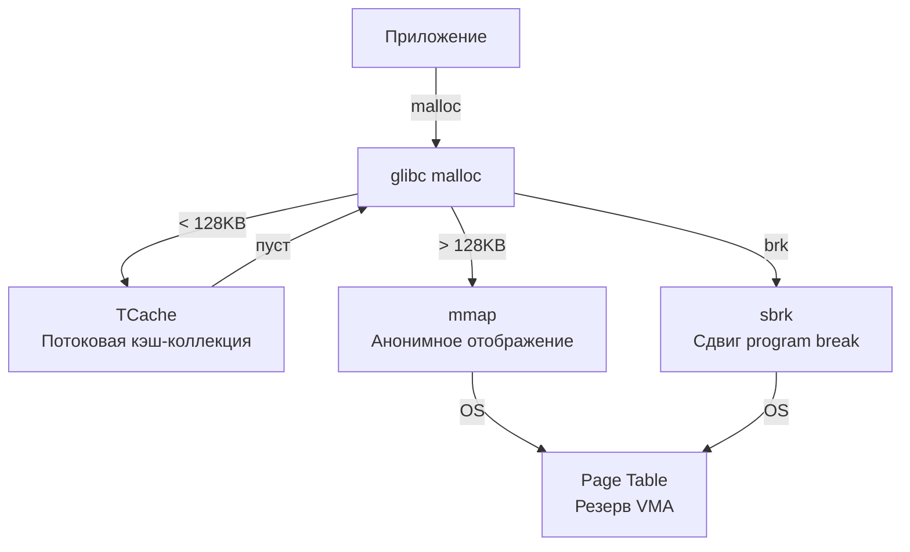

## За кулисами malloc: от вызова функции до физической RAM

Когда вы пишете `make([]byte, 1024)` или используете `new()`, Go выделяет память. Но за этим вызовом скрывается сложный многослойный конвейер. Разработчики часто считают `malloc` атомарной операцией, но на самом деле это **менеджер внутри менеджера**.

Чтобы понять, почему Go так агрессивно использует `mmap` и как работает его сборщик мусора, нужно пройти путь от пользовательского пространства до ядра Linux.

## Уровень ОС: brk и mmap — два пути к памяти

ОС не раздает память байт за байтом. Минимальная единица выделения — **страница** (обычно 4 КБ на x86-64, 64 КБ на ARM). Когда процессу нужно больше памяти, он делает один из двух системных вызовов:

### 1. `brk` / `sbrk` (Изменение предела сегмента данных)
Исторически первый способ. У каждого процесса есть указатель `brk` (program break), разделяющий свободную память и неиспользуемую область в конце сегмента данных.
*   **Как работает:** Вызов `brk(new_addr)` просто сдвигает этот указатель вверх. Память становится доступной процессу немедленно.
*   **Плюсы:** Нет накладных расходов на обновление таблиц страниц (Page Table) сразу. Очень быстрый для маленьких аллокаций.
*   **Минусы:** Память выделяется **только в конце** сегмента. Освобождение (`free`) не возвращает память ядру, а лишь помечает её как свободную внутри процесса. При длительной работе это приводит к **внутренней фрагментации** и росту RSS без реального использования.
*   **Связь с Go:** В современных ОС `brk` используется для выделения стека (`mmap` с `MAP_GROWSDOWN`) и для очень маленьких аллокаций в libc, но для больших буферов он считается устаревшим.

### 2. `mmap` (Memory Mapping)
Современный стандарт для выделения кучи. Создает **анонимное отображение** (`MAP_ANONYMOUS | MAP_PRIVATE`), которое не связано с файлом.
*   **Как работает:** Ядро резервирует виртуальные адреса, но физическая RAM выделяется лениво (при первом обращении к странице возникает `Page Fault`, ядро выделяет чистую страницу и обновляет Page Table).
*   **Плюсы:** Не вызывает фрагментации кучи. Поддерживает `madvise` для оптимизации работы с памятью. Легко освобождается целиком. Работает предсказуемо в мультипотоке.
*   **Минусы:** Требует обновления TLB и Page Table при первом обращении. Чуть дороже `brk` на старте.

> [!info] Под капотом
> В Linux память процесса отображается через структуру `vm_area_struct`. Каждый вызов `mmap` создает новую область. ОС хранит их в RB-tree для быстрого поиска по адресу. Именно поэтому `mmap` безопасен для многопоточных аллокаторов: разные потоки могут запрашивать память из разных областей без блокировок.

## Уровень libc: glibc malloc — менеджер внутри менеджера

Когда вы вызываете `malloc()` из стандартной библиотеки C, вы попадаете в `glibc malloc`. Это сложная система управления памятью, которая пытается скрыть от приложения реальность страниц и `mmap`.

### Архитектура glibc malloc
1.  **Arenas (Арены):** Для многопоточной безопасности glibc создает по одной арене на поток. Каждая арена содержит свой пул страниц, выделенных через `brk` или `mmap`.
2.  **Chunks (Куски):** Арена разбивается на `chunks`. Каждый chunk хранит размер и флаги в своих первых байтах. Свободные chunks связываются в `free lists`.
3.  **TCache (Thread-Cache):** Начиная с glibc 2.26, для ускорения мелких аллокаций введена потоко-локальная кэш-коллекция. `malloc` для объектов < 128 КБ сначала проверяет `tcache`, минуя глобальные блокировки.
4.  **Mmap Threshold:** Если запрашиваемый размер превышает `mmap_threshold` (по умолчанию 128 КБ), `malloc` обходит внутренние списки и делает прямой `mmap`, чтобы избежать фрагментации arenas.

## Уровень Go: Собственный аллокатор и обход libc

Go **намеренно не использует** libc `malloc` для своей кучи. В статье [[62. Как Go runtime взаимодействует с ОС]] мы разберем полный цикл взаимодействия, но здесь важно понять архитектуру собственного аллокатора Go (`runtime.malloc`).

### Почему Go отказался от libc?
1.  **Предсказуемость GC:** Сборщику мусора нужны четкие границы объектов. libc `malloc` может класть объекты в разные арены, разбрасывать их по памяти, что ухудшает локальность данных и кэш-линии CPU.
2.  **Избегание фрагментации:** libc `malloc` возвращает память в пул, но не всегда сразу ядру. Go хочет контролировать рост RSS и отдавать неиспользуемую память обратно через `madvise`.
3.  **Lock-free аллокация:** libc `malloc` использует глобальные блокировки для arenas. Go использует периферийную модель (`P`), где каждый P имеет свой `mcache` без блокировок.

### Внутреннее устройство аллокатора Go
Go делит память на иерархические уровни:
1.  **`mheap`:** Глобальная структура, управляющая всей кучей процесса. Хранит списки `spans` (непрерывных диапазонов страниц).
2.  **`mcentral`:** Коллекция `spans` для определенного класса размера (size class). Например, все spans для объектов 64-80 байт лежат в одном `mcentral`.
3.  **`mcache`:** Потоко-локальный кэш (привязан к `P`). Содержит pre-allocated spans для каждого size class. Аллокация `make([]byte, 16)` происходит **полностью в `mcache` без блокировок**.
4.  **`span`:** Непрерывный диапазон страниц (обычно 8 КБ). Разбивается на фиксированные объекты.
5.  **`bitmap`:** Для каждого `span` хранится bitmap (1 бит на 8 байт), указывающий, какие поля объекта содержат указатели на кучу. Это критично для работы GC.

> [!warning] Ловушка / Gotcha
> Если вы создадите миллион маленьких объектов (например, `make([]byte, 16)`), Go будет использовать spans для size class 16. Если объект станет большим (перерастет класс), Go должен выделить новый span большего размера и скопировать данные. Это скрытая аллокация и потенциальная потеря локальности. Используйте `sync.Pool` для объектов с переменной длительностью жизни.

## Mechanical Sympathy: Кэш, TLB и фрагментация

### Кэш-линии и выравнивание
Современный CPU читает память пачками по 64 байта (L1 cache line). Если два потока пишут в переменные, которые попадают на одну кэш-линию, возникает **False Sharing**. Аллокатор Go выравнивает объекты до границ кэш-линий, если это возможно, или группирует объекты одного размера в `span` для предсказуемого доступа.

### TLB и стоимость `mmap`
Каждый `mmap` добавляет запись в Page Table. При первом обращении к странице TLB (Translation Lookaside Buffer) не находит маппинг, происходит промах. CPU делает walk по Page Table (4 уровня на x86-64), что занимает сотни тактов.
Go смягчает это через **Huge Pages** (`madvise(MADV_HUGEPAGE)`). Если система поддерживает 2 МБ страницы, Go может попросить ядро мапить spans огромными страницами, сокращая количество записей в TLB в 512 раз.

### `madvise` и давление на GC
Когда `GOGC` достигает предела или система испытывает давление по памяти, Go не просто помечает объекты как мертвые. Он вызывает `madvise(ptr, size, MADV_DONTNEED)` на неиспользуемых страницах кучи.
*   **Что делает ядро:** Помечает страницы как "не нужны для текущего процесса". Если физическая память закончится, эти страницы могут быть подкачены на диск или освобождены.
*   **При следующем обращении:** Генерируется `Page Fault`, ядро выделяет новую чистую страницу. Это дешевле, чем `munmap` + новый `mmap`.

> [!tip] Собеседование
> **Вопрос:** Почему Go использует `mmap` вместо `brk` для кучи?
> **Ответ:** `brk` сдвигает program break, но не возвращает память ядру при `free`. Это приводит к росту RSS и фрагментации. `mmap` с `MAP_ANONYMOUS` позволяет: 1) точно контролировать границы страниц, 2) использовать `madvise` для управления памятью GC, 3) избегать глобальных блокировок libc, 4) работать предсказуемо в многопоточных средах и контейнерах (cgroups ограничивают память по страницам, а не по break).
>
> **Вопрос:** Как Go справляется с fragmentation?
> **Ответ:** Через size classes (фиксированные размеры) и span-based аллокацию. Объекты одного размера лежат в одном span, что минимизирует внутреннюю фрагментацию. Внешняя фрагментация устраняется за счет того, что spans могут быть объединены или расщеплены, а неиспользуемые spans отдаются обратно в OS через `madvise` или `munmap` при запуске GC.

## Итог

1.  **`malloc` — это не syscall.** Это сложный аллокатор libc, который использует `brk` для мелких/стартовых выделений и `mmap` для крупных.
2.  **Go обходит libc.** Собственный аллокатор Go (`mheap` -> `mcentral` -> `mcache` -> `span`) дает полный контроль над границами страниц, GC и lock-free выделением.
3.  **Память — это ресурс, а не абстракция.** `mmap` с `madvise` позволяет Go динамически управлять RSS, отдавая неиспользуемую память ядру без полной разгрузки кучи.
4.  **Инженерный компромисс:** `brk` быстрее на старте, но `mmap` предсказуемее в долгосрочной перспективе. Для высоконагруженного бэкенда предсказуемость и контроль критичнее нескольких тактов CPU.

Мы разобрали, как процесс получает память от ОС и как Go управляет ей на уровне страниц. Следующий логичный шаг — понять, как эти страницы отображаются в адресном пространстве процесса и почему процессу кажется, что у него есть изолированная память. Переходим к: [[16. Copy On Write. Почему fork не копирует всю память сразу]].