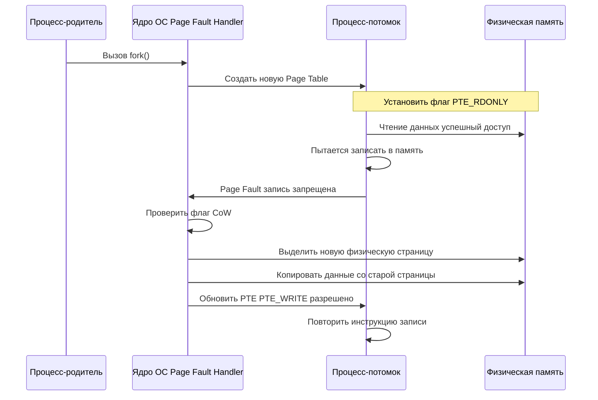

## Копирование по требованию: механизм Copy-On-Write

В предыдущей статье [[6. Как Linux создает процессы. fork, exec, wait]] мы разобрали базовый сценарий создания процесса через `fork()`. Если бы операционная система реализовывала `fork` буквально — аллоцировала бы новый блок физической памяти и копировала туда содержимое адресного пространства родителя — создание процесса стоило бы O(N) по времени и памяти. Для современных бэкенд-приложений, потребляющих сотни мегабайт или гигабайты RAM, это было бы катастрофой.

Решение, которое реализовано во всех современных Unix-подобных ОС (Linux, macOS, BSD) и Windows, называется **Copy-On-Write (CoW)**. Оно позволяет системе создать «клон» процесса практически мгновенно и с нулевым потреблением дополнительной физической памяти.

## Как работает CoW «под капотом»

Механизм опирается на аппаратную поддержку виртуальной памяти и MMU (Memory Management Unit). Когда вызывается `fork()`, ядро Linux (в функции `do_fork()` -> `copy_process()`) выполняет следующие шаги:

1. Выделяет новый `task_struct` (описатель процесса) и дублирует таблицу процессов.
2. Дублирует **таблицу отображения памяти (Page Table)** родителя, но не копирует сами физические страницы.
3. Устанавливает специальные флаги в записях таблиц страниц (PTE — Page Table Entry) для всех страниц памяти потомка:
   - Снимает флаг `PTE_WRITE` (запрет на запись).
   - Устанавливает `PTE_RDONLY` (страница доступна только для чтения).
   - Помечает страницу как разделяемую или инкрементирует счетчик ссылок на физическую страницу.



Только когда потомок (или родитель) попытается изменить данные, произойдет **Page Fault**. Ядро перехватит его, проверит, что это именно CoW-фолт, выделит *одну* новую физическую страницу, скопирует туда данные и обновит PTE. Остальные страницы продолжат разделяться.

> [!info] Под капотом
> В Linux флаг CoW для `fork` реализован через бит `PTE_SOFT_DIRTY` и внутреннюю логику `do_page_fault()`. Для `mmap()` с флагом `MAP_SHARED` используется аналогичный механизм, но с синхронизацией через `mmap_sem`. В современных ядрах активно используется `hugepages` (2M или 1G страницы), где CoW работает на уровне Huge TLB, что снижает оверхед на обновление PTE и TLB miss rate.

## Go-специфика: `os/exec`, память и многопоточность

Для Go-разработчика `fork` чаще всего неявно вызывается при работе с `os/exec` или при запуске CLI-утилит из кода.

```go
package main

import (
	"fmt"
	"os/exec"
)

func main() {
	// Под капотом здесь происходит:
	// 1. fork() -> CoW
	// 2. execve() -> замещение памяти
	// 3. wait() -> ожидание завершения
	cmd := exec.Command("sleep", "10")
	if err := cmd.Run(); err != nil {
		fmt.Println("Ошибка:", err)
	}
}
```

**Память после `fork` в Go:**
В утилите `top` или `ps` вы увидите одинаковый `RSS` (Resident Set Size) у родителя и потомка. Но `SHR` (Shared RSS) будет равен размеру `RSS` потомка. Это значит, что физически они делят 100% памяти. Как только Go-рантайм или приложение начнет писать в кучу, `RSS` начнет расти у того процесса, который пишет первым.

**Критическая особенность Go Runtime:**
Go runtime не умеет безопасно восстанавливать состояние после `fork()` в многопоточной программе. Если в родительском процессе есть активные горутины, блокировки `sync.Mutex` или открытые каналы, `fork()` приведет к **deadlock** в потомке, потому что мьютексы в ядре и рантайме не синхронизируются между процессами.

> [!warning] Ловушка / Gotcha
> **Правило:** Никогда не вызывайте `fork()` в многопоточном Go-приложении, если не собираетесь сразу вызывать `exec()`. Для безопасного создания процессов в Go используйте `os/exec` (он вызывает `fork` только в момент `cmd.Run()` или `cmd.Start()`, когда горутины уже не мешают, или использует `syscall.ForkExec` с флагами `CLONE_VM` и `CLONE_FILES` где это уместно).
> Если все же нужен `fork` с последующим долгоживущим потомком (как в PHP-FPM или systemd), используйте `runtime.LockOSThread()` перед вызовом, чтобы гарантировать отсутствие других тредов ОС, и после `fork` немедленно вызывайте `exec`.

**Оптимизация памяти через `madvise`:**
Если вы работаете с большими буферами (например, кэш или криптографические ключи) и хотите, чтобы они *не* копировались при `fork`, используйте `madvise` с флагом `MADV_DONTFORK`:
```go
package main

import (
	"fmt"
	"os"
	"syscall"
	"unsafe"
)

func main() {
	// Выделяем память для секретного ключа
	buf := make([]byte, 1024)
	
	// Убираем страницу из CoW-списка
	// В продакшене лучше использовать syscall.Madvise напрямую
	if err := syscall.Madvise(
		unsafe.Pointer(&buf[0]),
		len(buf),
		syscall.MADV_DONTFORK,
	); err != nil {
		fmt.Println("Ошибка madvise:", err)
	}
	
	_ = os.WriteFile("/dev/null", buf, 0600)
}
```
Это скажет ядру не выделять CoW-ссылки для этих страниц. При записи потомком ядро сразу аллоцирует новую страницу, изолируя данные.

## Ловушки и вопросы на собеседованиях

Здесь я собрал типичные каверзные вопросы, связанные с `fork` и CoW, которые часто звучат на собеседованиях уровня Middle+ и Senior.

1. **В чем разница между `RSS` и `SHR` после `fork`? Почему они одинаковы?**
   `RSS` показывает объем физической памяти, выделенной процессу. `SHR` — сколько из них реально разделяется с другими процессами. После `fork` оба процесса ссылаются на одни и те же физические страницы, поэтому `SHR` равен `RSS`. Это не баг, а фича CoW.

2. **Как передать данные от родителя к потомку без копирования?**
   Использовать `pipe()` или `socketpair()` (дуплексные каналы). Данные записываются в ядро (Page Cache), потомок читает их оттуда. Копирования пользовательской памяти не происходит.

3. **Что такое `vfork()` и почему он опасен?**
   Исторически `vfork()` гарантировал, что потомок будет выполняться *в том же адресном пространстве*, что и родитель, до `exec()` или `exit()`. Родитель блокируется. Опасно тем, что если потомок записывает в переменные родителя, он меняет их реально, что может вызвать UB в C/C++. В Go используется `syscall.ForkExec`, который внутри Linux использует `clone()` с флагами `CLONE_VM | CLONE_FS | CLONE_FILES`, а не чистый `vfork`.

4. **Как Go runtime обрабатывает `fork` в контексте GC?**
   При `fork` Go runtime не останавливает GC в потомке. GC продолжит работать, но только с памятью потомка. Если родитель продолжает жить, GC в нем будет работать независимо. Это нормально, так как страницы разделяются только на уровне PTE, а GC работает с виртуальной памятью. Однако, если потомок долго живет без `exec`, его метаданные GC (bitmap, span'ы) дублируются в физической памяти при первой записи, что увеличивает footprint.

5. **Сравнение с другими языками:**
   - **C/C++:** `fork()` + `exec()` — стандарт. `posix_spawn()` — оптимизация, объединяющая `fork` и `exec` в один syscall, минимизирующий CoW-оверхед.
   - **Java:** `ProcessBuilder.start()` вызывает нативный `fork`/`exec`. JVM имеет дополнительные сложности с `fork` из-за собственного пула тредов (G1 GC, C2 compiler), поэтому в Java 9+ появились `ProcessHandle` и оптимизации для `posix_spawn`.
   - **PHP-FPM:** Классический пример долгоживущих процессов. `fork` используется для обработки запросов. CoW позволяет загрузить PHP-движок и расширения один раз, а потом разделять память между рабочими процессами.

## Итог

Copy-On-Write — это гениальный компромисс между производительностью создания процесса и потреблением памяти. За счет аппаратной поддержки MMU и Page Fault'ов ядро откладывает копирование до момента реального изменения данных. Для Go-разработчика это означает:
1. `os/exec` не вызывает скачка памяти при запуске.
2. Многопоточный `fork()` без последующего `exec()` — смертельный антипаттерн в Go.
3. `madvise(MADV_DONTFORK)` — инструмент контроля за памятью секретов и кэшей.
4. `SHR` в `top` — индикатор реальной экономии памяти через CoW.

Мы разобрали, как процесс создается и разделяет память. Но что происходит с этой памятью, когда процесс живет долго? Как ядро решает, какие страницы выгрузить на диск, а какие оставить в RAM? В следующей статье мы перейдем к [[17. Paging и Swapping]], чтобы понять границы физической памяти и механизм подкачки.