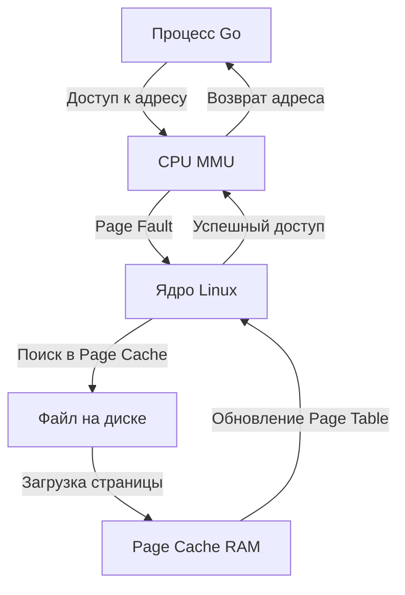

## Что такое mmap и зачем это нужно

`mmap` (memory-mapped files) — это механизм POSIX, позволяющий отображать содержимое файла или устройства напрямую в виртуальное адресное пространство процесса. Вместо последовательного чтения или записи через системные вызовы, программа работает с файлом как с обычным массивом байт в памяти.

Для бэкенд-разработчика это инструмент уровня `System Design` и оптимизации IO. Он используется в:
- Базах данных (InnoDB, RocksDB, Redis) для прямого доступа к WAL-журналам и data-файлам.
- Шеринг-памяти между процессами (IPC).
- Загрузке больших бинарных файлов, логов или графов знаний без копирования в user-space буферы.
- Реализации кэшей, где файл выступает как persistent backing store.

## Как mmap работает под капотом

Когда процесс вызывает `mmap()`, ядро ОС не копирует данные в RAM немедленно. Вместо этого создается запись в таблице страниц процесса (`Page Table`), которая связывает виртуальные адреса с файлом на диске. 

> [!info] Под капотом
> В Linux структура `vm_area_struct` описывает отображение. Флаг `VM_FILE` указывает, что backing store — это `struct file`. При первом обращении к адресу происходит **Page Fault**. Ядро ловит его, находит соответствующий блок файла в `[[42. Буферизация IO и Page Cache]]`, загружает страницу (обычно 4 КБ) в физическую память и обновляет `Page Table`. Последующие обращения к этой странице выполняются за несколько тактов CPU без участия дисковой подсистемы.



## Идиоматичное использование в Go

Начиная с Go 1.20, в стандартную библиотеку добавлен `os.File.Mmap`, что устраняет необходимость в сторонних пакетах для базовых сценариев.

```go
package main

import (
	"fmt"
	"log"
	"os"
	"unsafe"
)

func main() {
	// Создаем тестовый файл с данными
	f, err := os.CreateTemp("", "mmap-demo-*")
	if err != nil {
		log.Fatalf("create temp: %v", err)
	}
	defer os.Remove(f.Name())

	data := []byte("Hello, mmap under the hood!")
	if _, err := f.Write(data); err != nil {
		log.Fatalf("write: %v", err)
	}

	// Отображаем файл в память
	// PROT_READ|PROT_WRITE: разрешаем чтение и запись
	// MAP_SHARED: изменения сохраняются в файле (для IPC используется MAP_SHARED)
	mmap, err := f.Mmap(0, int64(len(data)), os.PROT_READ|os.PROT_WRITE, os.MAP_SHARED)
	if err != nil {
		log.Fatalf("mmap: %v", err)
	}
	defer func() {
		if err := f.Munmap(mmap); err != nil {
			log.Printf("munmap: %v", err)
		}
	}()

	// Чтение как массив байт
	fmt.Println("Original:", string(mmap))

	// Запись напрямую в отображенную память
	mmap[0] = 'H' // 'H' уже стоит, но для примера модификации
	copy(mmap[13:], "world! Overhead: 0 syscalls.")
	
	fmt.Println("Modified:", string(mmap))
	
	// Принудительная синхронизация dirty pages с диском
	// В большинстве случаев ОС делает это асинхронно через pdflush,
	// но для критичных данных (BDB, WAL) вызов обязателен.
	if err := f.Msync(os.MS_SYNC); err != nil {
		log.Fatalf("msync: %v", err)
	}
}
```

> [!tip] Собеседование
> **Вопрос:** Чем `os.File.Mmap` отличается от `golang.org/x/sys/unix.Mmap`?
> **Ответ:** `os.File.Mmap` — это высокоуровневая обертка, которая автоматически управляет lifecyle файла и вызывает `unix.Mmap` с флагом `MAP_SHARED` по умолчанию. Для production-grade систем с требованиями к точному контролю флагов (`MAP_PRIVATE`, `MAP_ANONYMOUS`, `PROT_EXEC`) или кроссплатформенности (Windows `CreateFileMapping`) стоит использовать `golang.org/x/sys/unix` или `github.com/edsrzf/mmap-go`.

## Механика и производительность (Mechanical Sympathy)

### Page Faults и стоимость доступа
`mmap` не бесплатен. Стоимость доступа к данным зависит от состояния `Page Cache`:
1. **Minor Page Fault**: Страница уже есть в RAM (Page Cache). Обновляется только `Page Table`. Стоимость: ~100-500 ns.
2. **Major Page Fault**: Страницы нет в RAM. Требуется синхронный I/O с диска. Стоимость: ~1-5 ms (HDD) или ~50-100 µs (NVMe).

Если вы работаете с файлом, который не помещается в RAM, система будет активно свопить страницы. Это вызывает **thrashing** — когда CPU тратит время на обслуживание page faults вместо полезной работы.

### Влияние на CPU Cache и TLB
- `mmap` работает с granularity в 4 КБ (или `hugepages` 2 МБ/1 ГБ, если настроены). Если логика доступа к файлу имеет плохую **локальность** (random access по большому файлу), будет происходить вытеснение кэш-линий L1/L2.
- Каждая новая страница требует обновления **TLB** (Translation Lookaside Buffer). При частой смене отображений (например, в микросервисах с динамическим маппингом разных файлов) TLB thrashing снижает производительность на 10-20%.

### Взаимодействие с Garbage Collector
`mmap` области находятся **вне Go heap**. Они не аллоцируются через Go-рантайм `malloc` и не отслеживаются GC. Это плюс (нет давления на сборщик мусора, предсказуемая память) и минус (если процесс превысит лимиты ОС, он получит OOM Kill, а не graceful GC pause).

## Ловушки и граничные кейсы

> [!warning] Ловушка / Gotcha
> **SIGBUS при усечении файла**: Если другой процесс усечет файл (`ftruncate`), а ваша программа обратится к памяти, которая теперь выходит за границы файла, ядро выдаст `SIGBUS`. Всегда проверяйте размер файла перед маппингом или обрабатывайте сигнал.
> 
> **SIGSEGV при выходе за границы**: Попытка записи в `mmap` область больше, чем размер файла, вызовет `SIGSEGV`. `mmap` не расширяет файлы автоматически.
> 
> **Неявная синхронизация**: Вызов `msync()` не обязателен для корректности данных в большинстве случаев, так как ядро пишет dirty pages асинхронно. Но при падении процесса данные могут потеряться. Для финансовых систем или WAL-журналов `MS_SYNC` обязателен.
> 
> **Лимиты памяти**: `mmap` увеличивает `Virtual Memory` процесса, но не сразу `RSS`. При превышении `ulimit -v` или лимитов cgroups процесс будет убит.

## Сравнение с read/write и альтернативы

| Характеристика | `read()` / `write()` | `mmap()` |
|----------------|----------------------|----------|
| **Системные вызовы** | Высокая частота (на каждый буфер) | Один при старте, один при завершении |
| **Копирование памяти** | User-space buffer → Page Cache → Kernel buffer | Zero-copy (прямой доступ к Page Cache) |
| **Случайный доступ** | Неэффективен (seek + read) | Идеален (O(1) по адресу) |
| **Память процесса** | Контролируемый буфер | Зависит от размера файла (риск OOM) |
| **Потребление CPU** | Выше (контекст переключение, копирование) | Ниже (при hit в Page Cache) |

Для потоковой обработки больших логов или ответов HTTP-сервера `read()` с `bufio` часто предпочтительнее из-за предсказуемого потребления памяти. `mmap` выигрывает при необходимости частого чтения/записи по случайным оффсетам или при реализации shared memory IPC.

## Вопросы с собеседований

> [!tip] Собеседование
> **Q: Как `mmap` влияет на производительность Go-приложения по сравнению с `ioutil.ReadFile`?**
> **A:** `mmap` устраняет копирование данных между user-space и Page Cache, а также снижает количество системных вызовов. Однако при работе с файлами, превышающими RAM, частые major page faults могут сделать `mmap` медленнее из-за синхронного I/O. `ReadFile` лучше для предсказуемых, небольших по размеру данных, где важны контроль буферов и отсутствие риска OOM.
> 
> **Q: Почему `mmap` не работает с обычными файлами на FAT32 или некоторых сетевых ФС?**
> **A:** `mmap` требует поддержки механизма отображения в ядре (VFS). Сетевые ФС (NFS, SMB) часто реализуют маппинг через эмуляцию, что добавляет сетевой оверхед. Также `MAP_SHARED` требует поддержки atomic write-back от ФС.
> 
> **Q: Как в Go освободить память от `mmap` без закрытия файла?**
> **A:** Вызовом `file.Munmap(buf)`. Это удаляет запись из `Page Table`, но не освобождает физическую RAM немедленно (страницы могут оставаться в Page Cache для других процессов). Ядро освободит их при нехватке памяти.
> 
> **Q: В чем разница между `MAP_SHARED` и `MAP_PRIVATE`?**
> **A:** `MAP_SHARED` — изменения видны всем процессам и сохраняются в файле. `MAP_PRIVATE` — копи-on-write (COW). При записи создается копия страницы в RAM, изменения не влияют на файл и других процессов. Используется для загрузки исполняемых файлов или изолированных кэшей.

Мы закончили с отображением файлов в память. Следующий логичный шаг — понять, как эти области вписываются в общую картину памяти процесса и где заканчивается `mmap` и начинается `[[19. Сегментация памяти процесса. Stack, Heap, Data, Text]]`. Для углубления в кэширование и синхронизацию dirty pages рекомендую параллельно изучить `[[42. Буферизация IO и Page Cache]]`.