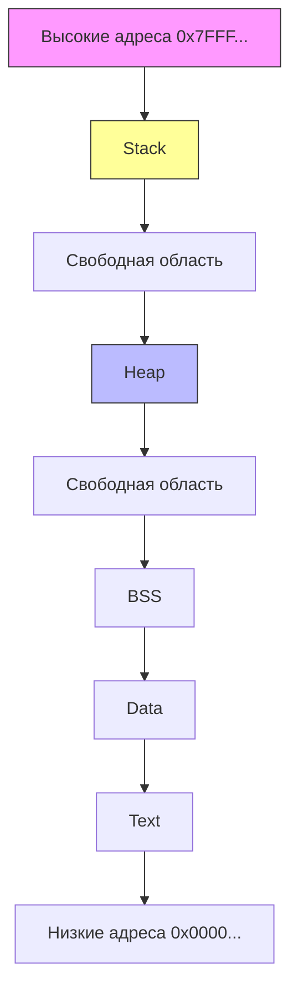

В архитектуре любого процесса Linux (и большинства других ОС) виртуальное адресное пространство делится на логические области, которые мы называем **сегментами** или **сегментами памяти**. Понимание их назначения, порядка расположения и границ критически важно для бэкенд-разработчика: это напрямую влияет на производительность, работу сборщика мусора, отладку утечек и поведение программы под нагрузкой.

## Классическая карта памяти процесса

При запуске программы ядро ОС выделяет ей виртуальное адресное пространство (обычно 64 бита в современных системах, но активно используется только нижние 47 бит в Linux x86-64). Внутри этого пространства сегменты располагаются в определенном порядке. Классическая схема выглядит так (адреса растут снизу вверх):



### 1. Text (Code Segment)
Содержит скомпилированный машинный код программы. Флаг доступа: **Read-Only** (и часто **Execute**). 
*   **Механика:** Процессор загружает инструкции из этого сегмента в Instruction Cache (L1i). Размещение кода в read-only области защищает его от случайной модификации и позволяет ядру мапить одни и те же страницы в память разных процессов, экономя RAM.
*   **Go-специфика:** Весь байткод Go-программы и скомпилированные функции лежат здесь. Go не генерирует JIT-код в рантайме по умолчанию (в отличие от Java/C#), поэтому сегмент Text статичен после запуска.

### 2. Data и BSS
*   **Data:** Инициализированные глобальные и статические переменные (например, `var counter int = 42`).
*   **BSS:** Неинициализированные или инициализированные нулями глобальные переменные. Ядро выделяет под них физическую память сразу при старте процесса, заполняя её нулями. Это экономит место в исполняемом файле.
*   **Механика:** Оба сегмента находятся рядом, но обычно разделены границей страницы для настройки флагов доступа (Data = RW, BSS = RW).

### 3. Heap
Динамически растущая область для распределения памяти в рантайме. В классических языках (C/C++) она расширяется через системный вызов `brk` или `sbrk`, меняя вершину процесса (Program Break).
*   **Механика:** Память выделяется страницами. Если процесс запрашивает блок больше страницы, ядро делает `mmap` (Private Anonymous Mapping).
*   **Gotcha:** В C/C++ `malloc` часто использует `brk` для мелких аллокаций. Это означает, что `brk` растет вверх, и освободить память в середине кучи без фрагментации или явного `mmap` невозможно.

### 4. Stack
Область для локальных переменных, аргументов функций и кадров вызовов. В Linux по умолчанию выделяется 8 МБ на тред (проверяется через `ulimit -s`).
*   **Механика:** Растет **вниз** (от высоких адресов к низким). При переполнении генерируется `SIGSEGV` (Segmentation Fault).
*   **Стек кадра:** Каждый вызов функции создает новый фрейм. Указатель кадра (`RBP` в x86-64) и указатель стека (`RSP`) отслеживаются процессором аппаратно.

## Специфика Go: Runtime, Heap и Goroutine Stacks

Go полностью переосмысливает классическую модель, что является одной из причин его высокой производительности в конкурентных сценариях.

### Heap Go: mmap вместо brk
Go-рантайм **не использует `brk`** для выделения heap-памяти. Вместо этого он делает один огромный `mmap` в виртуальном адресном пространстве процесса на старте (обычно несколько гигабайт виртуальной памяти, но физическая RAMCommit происходит только при реальном использовании).

```go
package main

import (
	"fmt"
	"runtime"
)

func main() {
	// Принудительно инициализируем runtime, чтобы увидеть статистику
	runtime.GC()
	var m runtime.MemStats
	runtime.ReadMemStats(&m)
	
	fmt.Printf("HeapAlloc: %d KB\n", m.HeapAlloc/1024)
	fmt.Printf("HeapSys:   %d KB\n", m.HeapSys/1024)
	fmt.Printf("HeapInuse: %d KB\n", m.HeapInuse/1024)
}
```
*   `HeapSys` показывает объем виртуальной памяти, захваченной через `mmap`.
*   `HeapInuse` — реально выделенные страницы (committed).
*   `HeapAlloc` — занятая рантаймом память (включая метаданные span'ов).

Такой подход позволяет Go:
1.  Выделять огромные виртуальные пространства без риска исчерпания физической RAM.
2.  Быстро освобождать память через `munmap`, не фрагментируя heap.
3.  Управлять памятью на уровне страниц и `span`'ов, минуя накладные расходы glibc malloc.

### Goroutine Stacks: Динамический рост
В отличие от OS-threads с фиксированным стеком (8 МБ), стек горутины:
1.  Создается размером **2 КБ**.
2.  Хранится в **Go Heap** (как обычный объект).
3.  Автоматически растет при `CALL` (через `morestack` в ассемблере) и сжимается при `RET`.
4.  Имеет **guard page** внизу для защиты от переполнения.

> [!info] Под капотом
> Структура стека горутины в рантайме: `g.stack`, `g.stackguard0`, `g.stackguard1`. При переполнении вызывается `runtime.morestack_noctxt`, который делает `mmap` новой страницы, копирует текущий стек в новую область и обновляет `g.stack`. Это дорого, поэтому Go-разработчики стараются минимизировать рекурсию и большие локальные массивы в горутинах.

## Mechanical Sympathy: Влияние на железо и производительность

### 1. Выравнивание и кэш-линии
Процессор работает с памятью блоками по 64 байта (cache line). Если структура данных пересекает границу кэш-линии, процессор делает два чтения/записи. В Go это критично для `sync.Mutex` и атомарных операций.
```go
type Counter struct {
    val int64
    pad [56]byte // Избегаем false sharing с соседним полем
}
```
Без `pad` два `Counter` в слайсе могут лежать в одной кэш-линии. Обновление одного инкрементирует кэш-линию для обоих, вызывая сбой кэша на другом ядре (cache invalidation).

### 2. Escape Analysis и Stack vs Heap
Компилятор Go решает, куда положить переменную: в стек вызывающей функции или в heap.
*   **Stack:** Выделение = инкремент `RSP` (1 инструкция). Освобождение = декремент `RSP`. Очень быстро.
*   **Heap:** Выделение = поиск в `mspan`, атомарные операции, потенциальная блокировка. Освобождение = отложенная сборка GC.
*   **Escape:** Если переменная должна жить дольше выхода из функции (возврат указателя, замыкание, канал), она "убегает" в heap.

> [!warning] Ловушка / Gotcha
> Не доверяйте `make([]int, 1000000)` в цикле. Если слайс "убегает" в замыкание или возвращается, компилятор выделит его в heap. В горячем пути это создаст миллион аллокаций, нагружая GC. Используйте `sync.Pool` или заранее выделенные буферы.

### 3. TLB и fragmentation
Чем больше виртуальных страниц использует heap, тем чаще происходит **TLB miss** (Translation Lookaside Buffer miss). Процессор должен читать Page Table из RAM для маппинга виртуального адреса в физический. Go-аллокатор (mcentral/mheap) группирует объекты в `span`'ы по 64-512 КБ, чтобы минимизировать количество записей в Page Table и улучшить локальность.

## Под капотом: brk, mmap и аллокатор Go

| Характеристика | Классический C/C++ (glibc malloc) | Go Runtime Allocator |
| :--- | :--- | :--- |
| **Источник памяти** | `brk/sbrk` (для мелких), `mmap` (для крупных) | Только `mmap` (Private Anonymous) |
| **Управление** | dlmalloc (first-fit, binning) | mspan (power-of-two sizing, free lists) |
| **Выделение** | Атомарные CAS, spinlocks, иногда syscall | `madvise`, `munmap`, атомарные операции в рантайме |
| **Освобождение** | `free()` (часто не возвращает OS, копит в bin'ах) | `madvise(MADV_DONTNEED)` / `munmap` при `sysmon` |

Go-рантайм использует фоновый горутину `sysmon`, которая каждые 10 мс-1с проверяет, есть ли свободная память в heap. Если да, он вызывает `madvise` с флагом `MADV_DONTNEED`, сообщая ядру, что страница больше не нужна физически. Ядро отменяет маппинг, но виртуальное адресное пространство остается занятым. При следующем запросе `mmap` возвращает тот же адрес, и ядро заново выделяет физическую страницу (zero page). Это экономит RAM в долгоживущих сервисах.

> [!tip] Собеседование
> **Вопрос:** Почему Go использует `mmap` для heap, а не `brk`, как glibc?
> **Ответ:** 
> 1. `brk` возвращает память ядру только при `sbrk(0) - old_brk`. Освободить середину heap невозможно без фрагментации. `mmap` позволяет точечно возвращать память через `munmap`.
> 2. `mmap` работает с виртуальной памятью, позволяя Go резервировать терабайты виртуального адресного пространства без риска OOM.
> 3. Упрощает конкурентный GC: рантайм может быстро аннотировать страницы, собирать их, и ядро не мешает конкурентным аллокаторам.
> 4. Избежает race condition'ов между `brk` и `mmap` в многопоточных программах (glibc malloc имеет внутренние мьютексы, Go их не нужен для heap).

## Ловушки и вопросы на собеседованиях

1. **Stack Overflow в Go vs C:** В C переполнение стека = `SIGSEGV` и падение процесса. В Go горутина получает новый стек через `mmap`, продолжает работу, но если общая память горутины превысит лимит (обычно ~1 ГБ виртуальной памяти на горуину), рантайм выбросит `fatal error: goroutine stack exceeds 1GB`.
2. **Как отладить утечку памяти?** Используйте `go tool pprof heap` или `memstats`. Если `HeapAlloc` растет, а `HeapInuse` стабилен, скорее всего, это `mmap`-подпись. Проверьте, не создает ли код бесконечные горутины или не держит ли ссылки в `sync.Pool`.
3. **Влияние `unsafe.Pointer` на память:** Использование `unsafe` для обхода аллокатора может привести к записям в guard page стека или пересечению границ `span`'ов, что вызовет panic или corruption памяти. Всегда проверяйте выравнивание через `unsafe.Alignof`.
4. **Сравнение с PHP/Java:** В PHP память скрипта полностью очищается после каждого запроса. В Java heap управляется JVM и часто использует `brk`/`mmap` гибридно. Go делает heap частью процесса на весь его жизненный цикл, что требует careful tuning GC (`GOGC`, `GOMEMLIMIT`), но дает zero-GC overhead для короткоживущих данных (stack).

## Итог

Сегментация памяти процесса — это контракт между компилятором, рантаймом и ОС. 
1. **Text/Data/BSS** статичны и определены на этапе компиляции.
2. **Heap** в Go — это огромная `mmap`-область, управляемая собственным аллокатором через `span`'ы, что дает контроль над фрагментацией и конкурентным GC.
3. **Stack** горутины динамичен (2KB -> grows), хранится в heap и защищен guard page.
4. **Mechanical Sympathy** требует внимания к выравнианию, локальности данных и стоимости аллокаций (stack vs heap).

Понимание этой карты позволяет писать код, который уважает кэш-линии процессора, минимизирует GC-паузы и корректно взаимодействует с системными вызовами. В следующей статье мы углубимся в механику вызовов функций и разберем, как именно данные, указатели и адреса возврата передаются между кадрами: `[[20. Стек вызовов и стек кадра функции]]`.