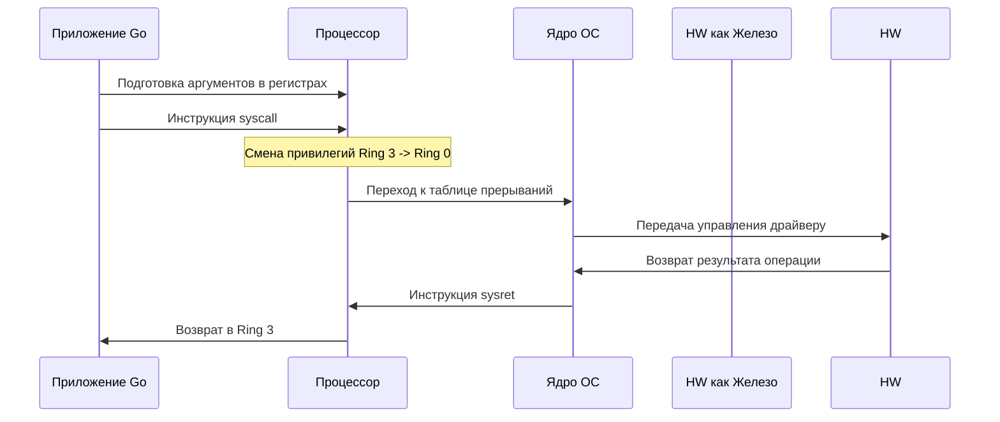

## Граница доверия: User Space и Kernel Space

Операционная система для бэкенд-разработчика — это не графическая оболочка и не набор утилит. Это **менеджер ресурсов** и **абстракционный слой**, который управляет доступом к железу, изолирует процессы и предоставляет контролируемые API.

Ключевая архитектурная идея любой современной ОС — строгое разделение памяти и привилегий на две зоны:

1. **User Space (Пространство пользователя)** — зона, где исполняются ваши приложения, включая Go-рантайм, библиотеки и пользовательские процессы. Код здесь работает в режиме с ограниченными правами. Ошибка в коде (например, `panic` или segfault) убивает только текущий процесс, но не затрагивает систему.
2. **Kernel Space (Пространство ядра)** — привилегированная зона, где исполняется код ОС, драйверы и планировщик. Здесь доступен прямой доступ к любому адресу физической памяти, регистрам CPU и периферии. Ошибка здесь = kernel panic / blue screen.

Это разделение реализовано на уровне архитектуры процессора через **модель защиты памяти**.

## Привилегии процессора: От Ring 0 до Ring 3

На архитектуре x86/x64 разделение обеспечивается уровнями привилегий (Protection Rings):
* **Ring 0**: Полные права. Только ядро ОС может исполнять инструкции, управляющие MMU, прерываниями и регистрами.
* **Ring 3**: Ограниченные права. Все пользовательские приложения (включая `main.go`, `nginx`, `postgres`) работают здесь.

На ARM (который доминирует в современных облачных инстансах) аналогичная модель называется **Exception Levels (EL)**:
* `EL1` — ядро (Kernel)
* `EL0` — пользовательские приложения (User Space)

> [!info] Под капотом
> В Go нет понятия "класс" или "наследование" в стиле C++/Java, но модель памяти процесса в Go полностью наследует сегментную модель ОС. Когда вы запускаете `go run main.go`, ОС выделяет виртуальный адресный процессу, загружает код в сегмент `Text`, инициализирует `Heap` через `mmap`, а стек выделяется в `Stack`. Рантайм Go не создает новую модель памяти — он управляет ресурсами внутри предоставленного ему пространства.

## Как происходит переход: Механизмы взаимодействия

Пользовательское пространство не имеет прямого доступа к железу. Для выполнения операций ввода-вывода, управления памятью или сетью, процесс должен обратиться к ядру. Этот переход называется **User/Kernell Space Transition**.

Существует три основных механизма перехода:

1. **Системные вызовы (Syscalls)** — синхронный запрос услуг ядра. Самый частый путь для бэкенда.
2. **Прерывания (Interrupts)** — асинхронный сигнал от устройства (диск, сеть) к CPU. Ядро перехватывает его, приостанавливает текущую задачу и вызывает обработчик (ISR).
3. **Сигналы (Signals)** — программные уведомления ядра к процессу (например, `SIGKILL`, `SIGUSR1`, `SIGPIPE`).



## Go-рантайм на границе ядра и пользователя

В отличие от C/C++ приложений, которые обычно связываются с `glibc` (GNU C Library), Go **не использует glibc для системных вызовов**. Это фундаментальная архитектурная особенность языка.

### Почему Go избегает glibc?
1. **Динамическая линковка**: `glibc` велик (~2MB), требует специфичных версий на разных дистрибутивах Linux, что ломает статическую сборку.
2. **Производительность**: `glibc` содержит множество слоев абстракции, проверки locale, потоковой безопасности (thread-safety) и отладочных хуков, которые не нужны высокопроизводительному рантайму.
3. **Портируемость**: Go поддерживает musl, uclibc, FreeBSD, NetBSD. Отказ от glibc упрощает кросс-платформенность.

### Как Go делает syscalls?
Go использует пакет `golang.org/x/sys/unix` (и внутреннюю реализацию в `runtime`). Он вызывает ассемблерные трэмпелины, которые напрямую загружают номер системного вызова в регистр `RAX` (x64) и инициируют прерывание.

```go
package main

import (
	"golang.org/x/sys/unix"
)

func main() {
	// syscall.Syscall: вызывает libc-обертку, если она доступна,
	// или напрямую syscall. Безопасен для использования в мьютексах.
	fd, _, err := unix.Syscall(unix.SYS_OPEN, uintptr(unsafe.Pointer(path)), unix.O_RDONLY, 0)
	if err != 0 {
		panic(err)
	}

	// syscall.RawSyscall: вызывает syscall напрямую, без проверки ошибок.
	// Используется внутри runtime для критических путей, где проверка не нужна.
	// В user-коде использовать не рекомендуется.
	// _, _, _ = unix.RawSyscall(unix.SYS_WRITE, fd, uintptr(unsafe.Pointer(buf)), uintptr(len(buf)))
}
```

> [!warning] Ловушка / Gotcha
> **Syscall vs RawSyscall**: 
> `unix.Syscall` проверяет возвращаемое значение и преобразует `-1` в ошибку Go. `unix.RawSyscall` возвращает три значения `(r1, r2, err uintptr)`. Если операция вернула `-1`, это может быть как успешный результат (например, чтение конца файла вернет `-1` через `read`), так и ошибка. В Go ошибка кодируется в третьем аргументе как `uintptr(-1)`. Использование `RawSyscall` в бизнес-логике приведет к неперехваченным ошибкам.

## Mechanical Sympathy: Цена перехода

Переход между Ring 3 и Ring 0 — одна из самых дорогих операций в пользовательском коде.

1. **Смена контекста (Context Switch)**: CPU должен сохранить состояние текущей горутины/треда (регистры, счетчик команд, флаги) в структуру `task_struct` (Linux) или `thread` (Go runtime).
2. **Flush Pipeline**: Процессорный конвейер (instruction pipeline) сбрасывается при смене привилегий. Все предвычисленные инструкции отбрасываются.
3. **TLB Shootdown**: Таблица трансляции адресов (Page Table) часто привязана к конкретному ядру CPU. При переключении на другой тред или при смене режима TLB может быть очищен, что вызывает `TLB miss` и последующий дорогой `Page Walk` (проход по Page Table в RAM).
4. **Cache Invalidation**: Данные из кэшей L1/L2, связанные с user-space, помечаются как недействительные для kernel-space из соображений безопасности (Spectre/Meltdown mitigation).

**Итог**: Один системный вызов обходится в **тысячи тактов CPU**. При высокой нагрузке (10k+ RPS) накладные на переходы становятся узким местом, даже если логика внутри вызова выполняется за микросекунды.

## Ловушки и вопросы с собеседований

> [!tip] Собеседование
> **Вопрос:** Почему Go-приложение может потреблять больше памяти, чем показывает `top`?
> **Ответ:** Go runtime использует `mmap` для выделения кучи и стеков. `top` показывает RSS (Resident Set Size), но не всегда корректно отражает `virtual memory` или `madvise` вызовы. Более того, при работе с `syscall` память может оставаться в Page Cache ОС, не попадая в RSS процесса, но потребляя RAM.

> [!warning] Ловушка / Gotcha
> **Блокировка тредов в syscall**: Когда горутина делает блокирующий syscall (например, чтение из файла), она блокирует системный тред ОС (M), на котором работает. Если тредов мало, остальные горутины встанут в очередь. Именно поэтому Go использует асинхронный `netpoller` (epoll/kqueue) для сети, но для диска/сетевого стека иногда все еще зависит от синхронных вызовов.

**Типичные вопросы на эту тему:**
1. Чем `syscall.Syscall` отличается от `syscall.RawSyscall`?
2. Что происходит с кэшем CPU при переходе в Ring 0?
3. Почему Go не линкует `glibc` по умолчанию?
4. Как ОС изолирует процесс от ядра? (Ответ: MMU, Page Tables, Protection Rings).
5. Что такое `golang.org/x/sys/unix` и зачем он нужен?

## Итог

1. **User/Kernel Space** — фундаментальная граница, обеспечивающая стабильность системы. Пересечение этой границы стоит дорого.
2. **Привилегии процессора** (Ring 0/3 или EL0/EL1) физически запрещают пользователю напрямую обращаться к железу.
3. **Go-рантайм** сознательно обходит `glibc`, напрямую вызывая системные вызовы через `golang.org/x/sys/unix` для скорости, предсказуемости и кросс-платформенности.
4. **Оптимизация**: Минимизация syscalls, буферизация, использование `mmap` и асинхронных моделей (`netpoller`) — базовые техники для снижения накладных расходов на переходы между пространствами.

Мы разобрали фундаментальную границу между вашим кодом и железом. В следующей статье мы углубимся в архитектуру самого ядра: как оно организовано, какие бывают модели (Monolithic, Microkernel, Hybrid) и почему Linux выбрал именно монументальный подход. 

Переходите к следующей статье: [[3. Архитектура ядра. Monolithic, Microkernel, Hybrid]]